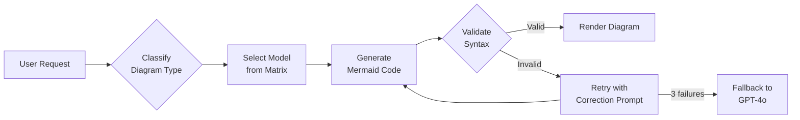

# Memory: Mermaid Diagram Generation System

**Version:** 1.0.0  
**Updated:** 2026-01-30  
**Status:** Active  

---

## Overview

The AI system generates architectural diagrams using Mermaid syntax. Model selection is based on diagram complexity and type to ensure valid, high-quality output.

---

## Model Selection Matrix

| Diagram Type | Recommended Model | Rationale |
|--------------|-------------------|-----------|
| **Structural** (graph, flowchart) | LLaMA-3-70B | Strong logical flow understanding |
| **Relational** (ER, class) | Mistral-Large | Precise relationship mapping |
| **Sequence** (API flows) | Claude-3-Opus | Complex temporal reasoning |
| **State** (FSM, statechart) | GPT-4o | Edge case handling |
| **Simple** (pie, gantt) | LLaMA-3-8B / Mistral-7B | Low complexity, fast |

---

## Diagram Types Supported

```typescript
enum MermaidDiagramType {
  FLOWCHART = "flowchart",      // graph TB/LR
  SEQUENCE = "sequence",         // sequenceDiagram
  CLASS = "class",               // classDiagram
  STATE = "state",               // stateDiagram-v2
  ER = "er",                     // erDiagram
  GANTT = "gantt",               // gantt
  PIE = "pie",                   // pie
  JOURNEY = "journey",           // journey
  MINDMAP = "mindmap",           // mindmap
  TIMELINE = "timeline",         // timeline
  QUADRANT = "quadrant",         // quadrantChart
  GIT = "git"                    // gitGraph
}
```

---

## Generation Pipeline



---

## Validation & Retry Logic

1. **Syntax Validation:** Parse generated Mermaid before rendering
2. **Auto-Correction:** If invalid, send error message back to model with correction prompt
3. **Retry Limit:** Max 3 attempts before escalating to fallback model (GPT-4o)
4. **Fallback:** GPT-4o has highest success rate for complex diagrams

```typescript
interface DiagramGenerationRequest {
  readonly type: MermaidDiagramType;
  readonly description: string;
  readonly context?: string;          // Additional context for complex diagrams
  readonly preferredModel?: string;   // Override auto-selection
  readonly maxRetries?: number;       // Default: 3
}

interface DiagramGenerationResult {
  readonly success: boolean;
  readonly mermaidCode: string;
  readonly modelUsed: string;
  readonly attempts: number;
  readonly validationErrors?: readonly string[];
}
```

---

## Seedable Configuration

Model preferences are stored in `settings.db` via seedable config:

```json
// /seeds/config/mermaid-models.json
{
  "key": "mermaid.modelPreferences",
  "seedVersion": "1.0.0",
  "value": {
    "flowchart": "llama-3-70b",
    "sequence": "claude-3-opus",
    "class": "mistral-large",
    "state": "gpt-4o",
    "er": "mistral-large",
    "default": "llama-3-70b",
    "fallback": "gpt-4o"
  }
}
```

**User Override:** Users can change model preferences via Settings UI → `IsUserModified = TRUE`.

---

## Integration Points

- **AI Code Generation:** Generates architecture diagrams for generated code
- **Spec Documentation:** Auto-generates visual representations of specs
- **Agentic Search:** Visualizes search pipelines and model routing

---

## Quality Thresholds

| Metric | Target |
|--------|--------|
| First-attempt success rate | ≥ 85% |
| After retry success rate | ≥ 98% |
| Avg generation time | < 3s |
| Fallback usage rate | < 5% |

---

## Related Specs

- [Model Router](./agentic-search-system.md)
- [Seedable Configuration](../patterns/seedable-configuration.md)
- [AI Integration Overview](../../spec/spec-management-software/05-features/06-ai-integration/00-overview.md)
