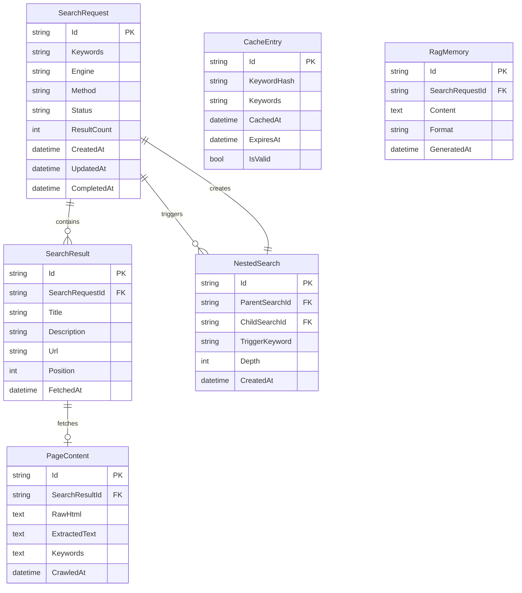
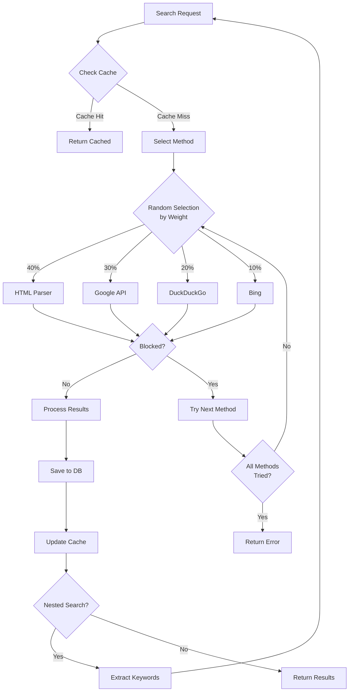

# Feature: GSearch CLI

**Version:** 2.0.0  
**Status:** Complete  
**Updated:** 2026-01-31  

---

## Summary

Standalone Golang CLI tool for multi-engine web searching with concurrent execution, intelligent method switching, anti-blocking strategies, nested search capabilities, caching, and RAG memory generation.

---

## User Stories

- As a user, I want to search multiple keywords concurrently
- As a user, I want to use different search engines (Google, DuckDuckGo, Bing)
- As a user, I want search results saved to a database for later retrieval
- As a user, I want the system to automatically switch methods when blocked
- As a user, I want cached results to avoid redundant searches
- As a user, I want to generate RAG memory from search results
- As a user, I want nested searches based on page content

---

## Components

### Core

| # | Component | Type | Description |
|---|-----------|------|-------------|
| 01 | [CLI Framework](./01-cli-framework.md) | Core | Command structure and argument parsing |
| 02 | [Configuration](./02-configuration.md) | Core | Config file management |
| 03 | [Database Schema](./03-database-schema.md) | Core | SQLite tables and ORM |

### Search Methods

| # | Component | Type | Description |
|---|-----------|------|-------------|
| 04 | [HTML Parser](./04-html-parser.md) | Search | Direct HTML scraping |
| 05 | [Google API](./05-google-api.md) | Search | Search Console API |
| 06 | [DuckDuckGo](./06-duckduckgo.md) | Search | DDG search integration |
| 07 | [Bing Search](./07-bing-search.md) | Search | Bing API integration |

### Features

| # | Component | Type | Description |
|---|-----------|------|-------------|
| 08 | [Method Switching](./08-method-switching.md) | Feature | Intelligent fallback logic |
| 09 | [Nested Search](./09-nested-search.md) | Feature | Recursive keyword extraction |
| 10 | [Caching System](./10-caching-system.md) | Feature | Cache management |
| 11 | [RAG Export](./11-rag-export.md) | Feature | Memory format generation |

### Crawling & Indexing

| # | Component | Type | Description |
|---|-----------|------|-------------|
| 18 | [Full-Site Crawler](./18-full-site-crawler.md) | Feature | Sitemap parsing, URL normalization, deduplication, vector DB |

### Scoring & Credibility

| # | Component | Type | Description |
|---|-----------|------|-------------|
| 19 | [Authority & Credibility](./19-authority-credibility-scoring.md) | Feature | Domain authority, source weights, credibility classification |
| 20 | [Trend Analysis Engine](./20-trend-analysis-engine.md) | Feature | Composite scoring, growth rates, market signal aggregation |
| 21 | [TrendAnalyzer Implementation](./21-trend-analyzer-implementation.md) | Specification | Golang implementation, collectors, settings integration |
| 22 | [SettingsService Implementation](./22-settings-service-implementation.md) | Specification | Golang settings service with Get, Update, SeedFromFile |
| 23 | [Settings UI Page](./23-settings-ui-page.md) | Specification | React UI for editing seedable configuration categories |

### Testing & Operations

| # | Component | Type | Description |
|---|-----------|------|-------------|
| 12 | [Testing Strategy](./12-testing-strategy.md) | Testing | Integration tests, fixtures |
| 13 | [Implementation Guide](./13-implementation-guide.md) | Guide | Build setup, dependencies |
| 14 | [Remediation Plan](./14-remediation-plan.md) | Tracking | Quality improvement tracking |
| 15 | [Error Codes](./15-error-codes.md) | Reference | 92 structured error codes |
| 16 | [Observability](./16-observability.md) | Operations | Metrics, health, tracing |
| 17 | [Deployment Guide](./17-deployment-guide.md) | Operations | Production deployment |
---

## Architecture

```
┌─────────────────────────────────────────────────────────────────┐
│                         gsearch CLI                              │
├─────────────────────────────────────────────────────────────────┤
│  ┌──────────┐  ┌──────────┐  ┌──────────┐  ┌──────────┐        │
│  │  Google  │  │  DDG     │  │  Bing    │  │  HTML    │        │
│  │  API     │  │  Search  │  │  API     │  │  Parser  │        │
│  └────┬─────┘  └────┬─────┘  └────┬─────┘  └────┬─────┘        │
│       │             │             │             │               │
│       └─────────────┴──────┬──────┴─────────────┘               │
│                            │                                     │
│                   ┌────────▼────────┐                           │
│                   │ Method Switcher │                           │
│                   │ (Anti-blocking) │                           │
│                   └────────┬────────┘                           │
│                            │                                     │
│       ┌────────────────────┼────────────────────┐               │
│       │                    │                    │               │
│  ┌────▼────┐         ┌─────▼─────┐        ┌────▼────┐          │
│  │ Caching │         │ Nested    │        │ RAG     │          │
│  │ System  │         │ Search    │        │ Export  │          │
│  └────┬────┘         └─────┬─────┘        └────┬────┘          │
│       │                    │                    │               │
│       └────────────────────┴────────────────────┘               │
│                            │                                     │
│                   ┌────────▼────────┐                           │
│                   │  search.db.sqlite│                          │
│                   └─────────────────┘                           │
└─────────────────────────────────────────────────────────────────┘
```

---

## CLI Commands

### Search Command

```bash
# Basic search
gsearch search "keyword1,keyword2,keyword3"

# With options
gsearch search "AI tools" \
  --engine google,duckduckgo \
  --output json \
  --save-db \
  --depth 2 \
  --delay 2000

# Nested search
gsearch search "machine learning" --nested --max-depth 3

# RAG export
gsearch rag --format json --output ./rag-memory.json
gsearch rag --format yaml --keywords "AI,ML"
```

### Status Command

```bash
# Check search status
gsearch status --id <search-id>
gsearch status --all
```

### Cache Command

```bash
# Manage cache
gsearch cache clear
gsearch cache clear --older-than 7d
gsearch cache stats
```

---

## Database Schema

### File: `search.db.sqlite`



### GORM Models

```go
type SearchRequest struct {
    Id          string    `gorm:"primaryKey"`
    Keywords    string    `gorm:"not null"`
    Engine      string    `gorm:"default:google"`
    Method      string    `gorm:"default:html"`
    Status      string    `gorm:"default:pending"` // pending, in_progress, completed, failed
    ResultCount int       `gorm:"default:0"`
    CreatedAt   time.Time
    UpdatedAt   time.Time
    CompletedAt *time.Time
    
    Results       []SearchResult `gorm:"foreignKey:SearchRequestId;constraint:OnDelete:CASCADE"`
    NestedSearches []NestedSearch `gorm:"foreignKey:ParentSearchId"`
}

type SearchResult struct {
    Id              string    `gorm:"primaryKey"`
    SearchRequestId string    `gorm:"not null"`
    Title           string
    Description     string
    Url             string
    Position        int
    FetchedAt       time.Time
    
    SearchRequest SearchRequest `gorm:"foreignKey:SearchRequestId"`
    PageContent   *PageContent  `gorm:"foreignKey:SearchResultId"`
}

type PageContent struct {
    Id             string `gorm:"primaryKey"`
    SearchResultId string `gorm:"unique"`
    RawHtml        string
    ExtractedText  string
    Keywords       string
    CrawledAt      time.Time
    
    SearchResult SearchResult `gorm:"foreignKey:SearchResultId"`
}

type NestedSearch struct {
    Id             string `gorm:"primaryKey"`
    ParentSearchId string `gorm:"not null"`
    ChildSearchId  string `gorm:"not null"`
    TriggerKeyword string
    Depth          int
    CreatedAt      time.Time
    
    ParentSearch SearchRequest `gorm:"foreignKey:ParentSearchId"`
    ChildSearch  SearchRequest `gorm:"foreignKey:ChildSearchId"`
}

type CacheEntry struct {
    Id          string    `gorm:"primaryKey"`
    KeywordHash string    `gorm:"unique;not null"`
    Keywords    string
    CachedAt    time.Time
    ExpiresAt   time.Time
    IsValid     bool      `gorm:"default:true"`
}

type RagMemory struct {
    Id              string `gorm:"primaryKey"`
    SearchRequestId string
    Content         string
    Format          string // json, yaml, toml
    GeneratedAt     time.Time
}
```

---

## Configuration

### File: `config.json`

```json
{
  "database": {
    "path": "./search.db.sqlite",
    "maxConnections": 10
  },
  "search": {
    "defaultEngine": "google",
    "defaultDelay": 2000,
    "maxConcurrent": 5,
    "timeout": 30000,
    "userAgents": [
      "Mozilla/5.0 (Windows NT 10.0; Win64; x64) AppleWebKit/537.36",
      "Mozilla/5.0 (Macintosh; Intel Mac OS X 10_15_7) AppleWebKit/537.36"
    ],
    "methodWeights": {
      "htmlParsing": 40,
      "googleApi": 30,
      "duckduckgo": 20,
      "bing": 10
    }
  },
  "cache": {
    "enabled": true,
    "expireDays": 5,
    "maxEntries": 10000
  },
  "nested": {
    "enabled": true,
    "maxDepth": 3,
    "keywordThreshold": 5
  },
  "output": {
    "defaultFormat": "json",
    "saveToDb": true,
    "prettyPrint": true
  },
  "apis": {
    "googleSearchConsole": {
      "enabled": false,
      "credentialsPath": "./credentials.json"
    },
    "bing": {
      "enabled": false,
      "apiKeyEnv": "BING_API_KEY"
    }
  }
}
```

---

## Method Switching Logic



---

## Output Formats

### JSON Output

```json
{
  "searchId": "abc123",
  "keywords": "machine learning",
  "status": "completed",
  "resultCount": 10,
  "results": [
    {
      "title": "Introduction to Machine Learning",
      "description": "A comprehensive guide to ML concepts...",
      "url": "https://example.com/ml-intro",
      "position": 1
    }
  ],
  "metadata": {
    "engine": "google",
    "method": "htmlParsing",
    "duration": 2340,
    "cached": false
  }
}
```

### YAML Output

```yaml
searchId: abc123
keywords: machine learning
status: completed
resultCount: 10
results:
  - title: Introduction to Machine Learning
    description: A comprehensive guide to ML concepts...
    url: https://example.com/ml-intro
    position: 1
```

### TOML Output

```toml
searchId = "abc123"
keywords = "machine learning"
status = "completed"
resultCount = 10

[[results]]
title = "Introduction to Machine Learning"
description = "A comprehensive guide to ML concepts..."
url = "https://example.com/ml-intro"
position = 1
```

---

## RAG Memory Format

```json
{
  "version": "1.0",
  "generatedAt": "2026-01-28T12:00:00Z",
  "sources": [
    {
      "keyword": "machine learning",
      "searchedAt": "2026-01-28T11:55:00Z",
      "chunks": [
        {
          "content": "Machine learning is a subset of AI...",
          "source": "https://example.com/ml-intro",
          "relevance": 0.95
        }
      ]
    }
  ],
  "metadata": {
    "totalChunks": 150,
    "totalSources": 25,
    "keywords": ["machine learning", "AI", "neural networks"]
  }
}
```

---

## Directory Structure

```
gsearch/
├── main.go
├── go.mod
├── go.sum
├── cmd/
│   ├── root.go
│   ├── search.go
│   ├── status.go
│   ├── cache.go
│   ├── rag.go
│   ├── selectors.go
│   └── fixtures.go
├── internal/
│   ├── config/
│   │   ├── config.go
│   │   ├── loader.go
│   │   └── validator.go
│   ├── database/
│   │   ├── db.go
│   │   ├── models.go
│   │   └── migrations.go
│   ├── engines/
│   │   ├── google/
│   │   ├── duckduckgo/
│   │   └── bing/
│   ├── cache/
│   │   └── cache.go
│   ├── nested/
│   │   └── extractor.go
│   └── rag/
│       ├── generator.go
│       └── formatter.go
├── pkg/
│   ├── models/
│   ├── selectors/
│   ├── errors/
│   ├── app/
│   └── retry/
├── configs/
│   ├── config.json
│   └── selectors.json
├── testdata/
│   ├── fixtures/
│   └── mocks/
├── tests/
│   └── integration/
└── data/
    └── search.db.sqlite
```

---

## Integration with Main App

The main application can read `search.db.sqlite` directly:

```go
// In main application
import (
    "gorm.io/driver/sqlite"
    "gorm.io/gorm"
)

func ReadSearchResults(dbPath string) ([]SearchResult, error) {
    db, err := gorm.Open(sqlite.Open(dbPath), &gorm.Config{})
    if err != nil {
        return nil, err
    }
    
    var results []SearchResult
    db.Where("status = ?", "completed").Find(&results)
    return results, nil
}
```

---

## Dependencies

- [AI Integration](../06-ai-integration/00-overview.md) — RAG context consumption
- [Knowledge Memory](../09-knowledge-memory/00-overview.md) — Knowledge storage

---

## Implementation Phases

| Phase | Components | Deliverables |
|-------|------------|--------------|
| 1 | CLI Framework, Config, Database | Basic structure, GORM models |
| 2 | HTML Parser | Direct web scraping |
| 3 | Google API | Search Console integration |
| 4 | DDG & Bing | Multi-engine support |
| 5 | Method Switching | Anti-blocking logic |
| 6 | Nested Search | Recursive keyword extraction |
| 7 | Caching | Cache management |
| 8 | RAG Export | Memory format generation |

---

## Testing Strategy

| Test Type | Coverage |
|-----------|----------|
| Unit | Config parsing, URL building, HTML parsing |
| Integration | Database operations, API calls (mocked) |
| E2E | Full search workflow, caching, nested search |
