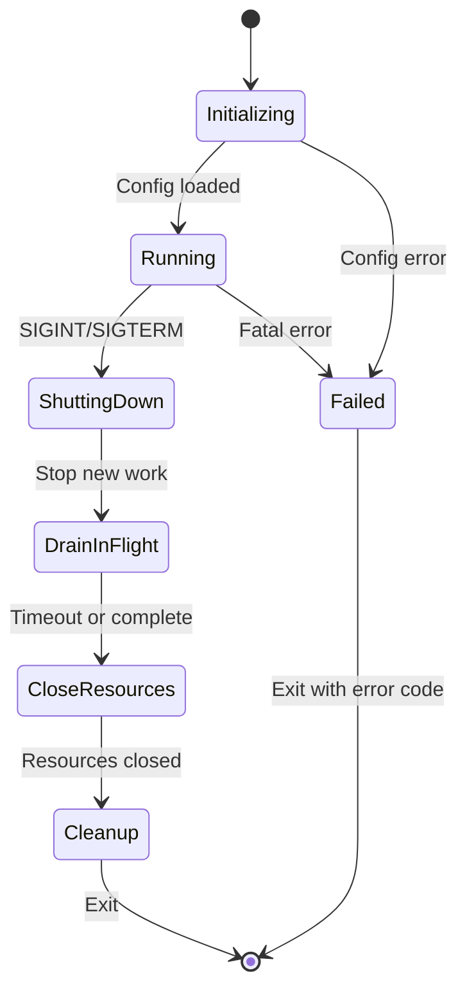

# Component: CLI Framework

**Parent:** [Golang Search CLI](./00-overview.md)  
**Version:** 1.2.0  
**Updated:** 2026-01-28  

---

## Summary

Command-line interface structure using Cobra for command parsing and Viper for configuration management. Includes graceful shutdown handling with signal interception, resource management with configurable limits, and proper cleanup of in-flight operations.

---

## Dependencies

- `github.com/spf13/cobra` — CLI framework
- `github.com/spf13/viper` — Configuration management

---

## Command Structure

```
gsearch
├── search      # Execute search queries
├── status      # Check search status
├── cache       # Manage cache
├── rag         # Generate RAG memory
├── config      # View/edit configuration
│   └── generate-key  # Generate encryption key
├── selectors   # Manage HTML selectors
│   └── validate      # Validate selector file
└── fixtures    # Manage test fixtures
    └── validate      # Validate fixtures against selectors
```

---

## Application Lifecycle

### Lifecycle Diagram



### Application State

```go
// pkg/app/state.go

package app

type AppState int

const (
    StateInitializing AppState = iota
    StateRunning
    StateShuttingDown
    StateDraining
    StateClosing
    StateClosed
)

func (s AppState) String() string {
    return [...]string{
        "initializing",
        "running",
        "shutting_down",
        "draining",
        "closing",
        "closed",
    }[s]
}
```

---

## Graceful Shutdown

### ShutdownManager

```go
// pkg/app/shutdown.go

package app

import (
    "context"
    "os"
    "os/signal"
    "sync"
    "sync/atomic"
    "syscall"
    "time"
    
    "github.com/rs/zerolog/log"
    "gsearch/pkg/errors"
)

// ShutdownConfig configures shutdown behavior
type ShutdownConfig struct {
    // Maximum time to wait for in-flight operations
    Timeout time.Duration `mapstructure:"timeout" json:"timeout"`
    
    // Interval to log shutdown progress
    ProgressInterval time.Duration `mapstructure:"progressInterval" json:"progressInterval"`
    
    // Force exit if cleanup hangs
    ForceExitTimeout time.Duration `mapstructure:"forceExitTimeout" json:"forceExitTimeout"`
}

// DefaultShutdownConfig returns sensible defaults
func DefaultShutdownConfig() ShutdownConfig {
    return ShutdownConfig{
        Timeout:          30 * time.Second,
        ProgressInterval: 5 * time.Second,
        ForceExitTimeout: 45 * time.Second,
    }
}

// ShutdownManager orchestrates graceful shutdown
type ShutdownManager struct {
    config     ShutdownConfig
    ctx        context.Context
    cancel     context.CancelFunc
    wg         sync.WaitGroup
    state      atomic.Int32
    shutdownCh chan struct{}
    doneCh     chan struct{}
    
    // Cleanup functions to run on shutdown
    cleanupFuncs []CleanupFunc
    cleanupMu    sync.Mutex
    
    // Metrics
    inFlightOps atomic.Int64
}

// CleanupFunc is called during shutdown with remaining timeout
type CleanupFunc func(ctx context.Context) error

// NewShutdownManager creates a new shutdown manager
func NewShutdownManager(config ShutdownConfig) *ShutdownManager {
    ctx, cancel := context.WithCancel(context.Background())
    
    sm := &ShutdownManager{
        config:     config,
        ctx:        ctx,
        cancel:     cancel,
        shutdownCh: make(chan struct{}),
        doneCh:     make(chan struct{}),
    }
    
    sm.state.Store(int32(StateInitializing))
    return sm
}

// Start begins listening for shutdown signals
func (sm *ShutdownManager) Start() {
    sm.state.Store(int32(StateRunning))
    
    sigCh := make(chan os.Signal, 1)
    signal.Notify(sigCh, syscall.SIGINT, syscall.SIGTERM)
    
    go func() {
        select {
        case sig := <-sigCh:
            log.Info().
                Str("signal", sig.String()).
                Msg("Received shutdown signal")
            sm.initiateShutdown()
            
            // Handle double-signal for force exit
            select {
            case <-sigCh:
                log.Warn().Msg("Received second signal, forcing exit")
                os.Exit(errors.ExitShutdown)
            case <-sm.doneCh:
                // Normal shutdown completed
            }
            
        case <-sm.shutdownCh:
            // Programmatic shutdown
        }
    }()
    
    // Force exit watchdog
    go func() {
        <-sm.shutdownCh
        time.Sleep(sm.config.ForceExitTimeout)
        log.Error().Msg("Force exit timeout reached, terminating")
        os.Exit(errors.ExitShutdown)
    }()
}

// initiateShutdown begins the shutdown sequence
func (sm *ShutdownManager) initiateShutdown() {
    if !sm.state.CompareAndSwap(int32(StateRunning), int32(StateShuttingDown)) {
        return // Already shutting down
    }
    
    close(sm.shutdownCh)
    
    log.Info().
        Int64("inFlightOps", sm.inFlightOps.Load()).
        Dur("timeout", sm.config.Timeout).
        Msg("Initiating graceful shutdown")
    
    // Phase 1: Cancel context to stop new operations
    sm.cancel()
    sm.state.Store(int32(StateDraining))
    
    // Phase 2: Wait for in-flight operations with timeout
    done := make(chan struct{})
    go func() {
        sm.wg.Wait()
        close(done)
    }()
    
    // Progress reporting
    progressTicker := time.NewTicker(sm.config.ProgressInterval)
    defer progressTicker.Stop()
    
    timeoutTimer := time.NewTimer(sm.config.Timeout)
    defer timeoutTimer.Stop()
    
    for {
        select {
        case <-done:
            log.Info().Msg("All in-flight operations completed")
            goto cleanup
            
        case <-progressTicker.C:
            log.Info().
                Int64("remaining", sm.inFlightOps.Load()).
                Msg("Shutdown in progress, waiting for operations")
            
        case <-timeoutTimer.C:
            log.Warn().
                Int64("abandoned", sm.inFlightOps.Load()).
                Msg("Shutdown timeout reached, proceeding with cleanup")
            goto cleanup
        }
    }
    
cleanup:
    // Phase 3: Run cleanup functions
    sm.state.Store(int32(StateClosing))
    sm.runCleanupFuncs()
    
    // Phase 4: Mark as closed
    sm.state.Store(int32(StateClosed))
    close(sm.doneCh)
    
    log.Info().Msg("Graceful shutdown complete")
}

// runCleanupFuncs executes registered cleanup functions
func (sm *ShutdownManager) runCleanupFuncs() {
    sm.cleanupMu.Lock()
    funcs := sm.cleanupFuncs
    sm.cleanupMu.Unlock()
    
    // Create timeout context for cleanup
    ctx, cancel := context.WithTimeout(context.Background(), 10*time.Second)
    defer cancel()
    
    for i := len(funcs) - 1; i >= 0; i-- {
        if err := funcs[i](ctx); err != nil {
            log.Error().Err(err).Int("index", i).Msg("Cleanup function failed")
        }
    }
}

// RegisterCleanup adds a cleanup function (LIFO order)
func (sm *ShutdownManager) RegisterCleanup(fn CleanupFunc) {
    sm.cleanupMu.Lock()
    defer sm.cleanupMu.Unlock()
    sm.cleanupFuncs = append(sm.cleanupFuncs, fn)
}

// Context returns a context that's cancelled on shutdown
func (sm *ShutdownManager) Context() context.Context {
    return sm.ctx
}

// IsShuttingDown checks if shutdown has been initiated
func (sm *ShutdownManager) IsShuttingDown() bool {
    state := AppState(sm.state.Load())
    return state >= StateShuttingDown
}

// WaitForShutdown blocks until shutdown completes
func (sm *ShutdownManager) WaitForShutdown() {
    <-sm.doneCh
}

// Shutdown initiates programmatic shutdown
func (sm *ShutdownManager) Shutdown() {
    select {
    case <-sm.shutdownCh:
        // Already shutting down
    default:
        sm.initiateShutdown()
    }
}

// TrackOperation registers an in-flight operation
func (sm *ShutdownManager) TrackOperation() (done func()) {
    sm.wg.Add(1)
    sm.inFlightOps.Add(1)
    
    return func() {
        sm.inFlightOps.Add(-1)
        sm.wg.Done()
    }
}

// RunWithTracking executes a function with operation tracking
func (sm *ShutdownManager) RunWithTracking(fn func(ctx context.Context) error) error {
    if sm.IsShuttingDown() {
        return errors.NewError(errors.ErrShutdownTimeout, "shutdown in progress")
    }
    
    done := sm.TrackOperation()
    defer done()
    
    return fn(sm.ctx)
}
```

---

## Resource Management

### ResourceLimiter

```go
// pkg/app/resources.go

package app

import (
    "context"
    "runtime"
    "sync"
    "time"
    
    "github.com/rs/zerolog/log"
    "gsearch/pkg/errors"
)

// ResourceConfig configures resource limits
type ResourceConfig struct {
    // Maximum concurrent goroutines
    MaxGoroutines int `mapstructure:"maxGoroutines" json:"maxGoroutines"`
    
    // Maximum memory in MB before triggering GC
    MaxMemoryMB int `mapstructure:"maxMemoryMB" json:"maxMemoryMB"`
    
    // Timeout for acquiring resources
    AcquisitionTimeout time.Duration `mapstructure:"acquisitionTimeout" json:"acquisitionTimeout"`
    
    // Interval for memory checks
    MemoryCheckInterval time.Duration `mapstructure:"memoryCheckInterval" json:"memoryCheckInterval"`
}

// DefaultResourceConfig returns sensible defaults
func DefaultResourceConfig() ResourceConfig {
    return ResourceConfig{
        MaxGoroutines:       100,
        MaxMemoryMB:         512,
        AcquisitionTimeout:  10 * time.Second,
        MemoryCheckInterval: 30 * time.Second,
    }
}

// ResourceLimiter controls concurrent resource usage
type ResourceLimiter struct {
    config    ResourceConfig
    semaphore chan struct{}
    
    // Metrics
    activeCount   int64
    acquireCount  int64
    timeoutCount  int64
    memoryAlerts  int64
    mu            sync.RWMutex
}

// NewResourceLimiter creates a new resource limiter
func NewResourceLimiter(config ResourceConfig) *ResourceLimiter {
    rl := &ResourceLimiter{
        config:    config,
        semaphore: make(chan struct{}, config.MaxGoroutines),
    }
    
    // Start memory monitor
    go rl.memoryMonitor()
    
    return rl
}

// Acquire acquires a resource slot (blocks until available or timeout)
func (r *ResourceLimiter) Acquire(ctx context.Context) error {
    // Check memory before acquiring
    if err := r.checkMemory(); err != nil {
        return err
    }
    
    select {
    case r.semaphore <- struct{}{}:
        r.mu.Lock()
        r.activeCount++
        r.acquireCount++
        r.mu.Unlock()
        return nil
        
    case <-ctx.Done():
        return ctx.Err()
        
    case <-time.After(r.config.AcquisitionTimeout):
        r.mu.Lock()
        r.timeoutCount++
        r.mu.Unlock()
        return errors.NewError(errors.ErrResourceTimeout, 
            "timed out waiting for resource slot")
    }
}

// Release releases a resource slot
func (r *ResourceLimiter) Release() {
    select {
    case <-r.semaphore:
        r.mu.Lock()
        r.activeCount--
        r.mu.Unlock()
    default:
        log.Warn().Msg("Release called without matching Acquire")
    }
}

// TryAcquire attempts to acquire without blocking
func (r *ResourceLimiter) TryAcquire() bool {
    select {
    case r.semaphore <- struct{}{}:
        r.mu.Lock()
        r.activeCount++
        r.acquireCount++
        r.mu.Unlock()
        return true
    default:
        return false
    }
}

// WithResource executes a function with a resource slot
func (r *ResourceLimiter) WithResource(ctx context.Context, fn func() error) error {
    if err := r.Acquire(ctx); err != nil {
        return err
    }
    defer r.Release()
    
    return fn()
}

// checkMemory verifies memory is within limits
func (r *ResourceLimiter) checkMemory() error {
    var m runtime.MemStats
    runtime.ReadMemStats(&m)
    
    usedMB := int(m.Alloc / 1024 / 1024)
    
    if usedMB > r.config.MaxMemoryMB {
        // Try garbage collection
        log.Warn().
            Int("usedMB", usedMB).
            Int("limitMB", r.config.MaxMemoryMB).
            Msg("Memory limit approaching, triggering GC")
        
        runtime.GC()
        
        // Re-check after GC
        runtime.ReadMemStats(&m)
        usedMB = int(m.Alloc / 1024 / 1024)
        
        if usedMB > r.config.MaxMemoryMB {
            r.mu.Lock()
            r.memoryAlerts++
            r.mu.Unlock()
            
            return errors.NewError(errors.ErrResourceMemory,
                "memory limit exceeded after GC")
        }
    }
    
    return nil
}

// memoryMonitor periodically checks memory usage
func (r *ResourceLimiter) memoryMonitor() {
    ticker := time.NewTicker(r.config.MemoryCheckInterval)
    defer ticker.Stop()
    
    for range ticker.C {
        var m runtime.MemStats
        runtime.ReadMemStats(&m)
        
        usedMB := m.Alloc / 1024 / 1024
        threshold := uint64(r.config.MaxMemoryMB) * 80 / 100 // 80% threshold
        
        if usedMB > threshold {
            log.Info().
                Uint64("usedMB", usedMB).
                Int("limitMB", r.config.MaxMemoryMB).
                Msg("Memory usage high, triggering GC")
            runtime.GC()
        }
    }
}

// Stats returns current resource statistics
func (r *ResourceLimiter) Stats() ResourceStats {
    r.mu.RLock()
    defer r.mu.RUnlock()
    
    var m runtime.MemStats
    runtime.ReadMemStats(&m)
    
    return ResourceStats{
        ActiveGoroutines: r.activeCount,
        TotalAcquires:    r.acquireCount,
        TimeoutCount:     r.timeoutCount,
        MemoryAlerts:     r.memoryAlerts,
        MemoryUsedMB:     int64(m.Alloc / 1024 / 1024),
        MemoryLimitMB:    int64(r.config.MaxMemoryMB),
        GoroutineLimit:   int64(r.config.MaxGoroutines),
    }
}

// ResourceStats contains resource usage metrics
type ResourceStats struct {
    ActiveGoroutines int64 `json:"activeGoroutines"`
    TotalAcquires    int64 `json:"totalAcquires"`
    TimeoutCount     int64 `json:"timeoutCount"`
    MemoryAlerts     int64 `json:"memoryAlerts"`
    MemoryUsedMB     int64 `json:"memoryUsedMB"`
    MemoryLimitMB    int64 `json:"memoryLimitMB"`
    GoroutineLimit   int64 `json:"goroutineLimit"`
}
```

---

## Application Container

### Application Struct

```go
// pkg/app/application.go

package app

import (
    "context"
    
    "github.com/rs/zerolog/log"
    "gsearch/pkg/auth"
    "gsearch/pkg/config"
    "gsearch/pkg/database"
)

// Application is the main application container
type Application struct {
    Config          *config.Config
    DB              *database.DB
    ShutdownManager *ShutdownManager
    ResourceLimiter *ResourceLimiter
    TokenManager    *auth.TokenManager
}

// NewApplication creates and initializes the application
func NewApplication(cfg *config.Config) (*Application, error) {
    app := &Application{
        Config:          cfg,
        ShutdownManager: NewShutdownManager(cfg.Shutdown),
        ResourceLimiter: NewResourceLimiter(cfg.Resources),
    }
    
    // Initialize database
    db, err := database.NewDatabase(cfg.Database.Path)
    if err != nil {
        return nil, err
    }
    app.DB = db
    
    // Register database cleanup
    app.ShutdownManager.RegisterCleanup(func(ctx context.Context) error {
        log.Info().Msg("Closing database connection")
        sqlDB, _ := db.DB.DB()
        return sqlDB.Close()
    })
    
    // Initialize token manager (optional, may fail if key not set)
    tokenMgr, err := auth.NewTokenManager(db.DB)
    if err != nil {
        log.Warn().Err(err).Msg("Token manager not initialized (encryption key may not be set)")
    } else {
        app.TokenManager = tokenMgr
    }
    
    return app, nil
}

// Start starts the application and signal handling
func (a *Application) Start() {
    a.ShutdownManager.Start()
}

// Context returns the application context (cancelled on shutdown)
func (a *Application) Context() context.Context {
    return a.ShutdownManager.Context()
}

// Shutdown initiates graceful shutdown
func (a *Application) Shutdown() {
    a.ShutdownManager.Shutdown()
}

// Wait blocks until shutdown completes
func (a *Application) Wait() {
    a.ShutdownManager.WaitForShutdown()
}

// RunTask executes a task with resource tracking
func (a *Application) RunTask(fn func(ctx context.Context) error) error {
    return a.ResourceLimiter.WithResource(a.Context(), func() error {
        return a.ShutdownManager.RunWithTracking(fn)
    })
}
```

---

## Root Command

```go
package cmd

import (
    "os"
    "github.com/spf13/cobra"
    "github.com/spf13/viper"
    "gsearch/pkg/app"
    "gsearch/pkg/errors"
)

var (
    cfgFile     string
    application *app.Application
)

var rootCmd = &cobra.Command{
    Use:   "gsearch",
    Short: "Multi-engine web search CLI with caching and RAG support",
    Long: `gsearch is a powerful tool for concurrent web searching
across multiple engines with intelligent caching, nested search capabilities,
and RAG memory generation.`,
    PersistentPreRunE: initApplication,
    PersistentPostRun: shutdownApplication,
}

func Execute() {
    if err := rootCmd.Execute(); err != nil {
        exitCode := errors.ExitGeneral
        if appErr, ok := err.(*errors.AppError); ok {
            exitCode = appErr.ExitCode
        }
        os.Exit(exitCode)
    }
}

func init() {
    cobra.OnInitialize(initConfig)
    
    rootCmd.PersistentFlags().StringVar(&cfgFile, "config", "", 
        "config file (default is ./config.json)")
    rootCmd.PersistentFlags().String("db", "./data/search.db.sqlite", 
        "database file path")
    rootCmd.PersistentFlags().Bool("verbose", false, 
        "enable verbose output")
    
    viper.BindPFlag("database.path", rootCmd.PersistentFlags().Lookup("db"))
    viper.BindPFlag("verbose", rootCmd.PersistentFlags().Lookup("verbose"))
}

func initConfig() {
    if cfgFile != "" {
        viper.SetConfigFile(cfgFile)
    } else {
        viper.SetConfigName("config")
        viper.SetConfigType("json")
        viper.AddConfigPath(".")
        viper.AddConfigPath("./config")
    }
    
    viper.AutomaticEnv()
    viper.ReadInConfig()
}

func initApplication(cmd *cobra.Command, args []string) error {
    cfg, err := config.LoadConfig()
    if err != nil {
        return errors.WrapError(errors.ErrInvalidConfigFormat, 
            "failed to load configuration", err)
    }
    
    application, err = app.NewApplication(cfg)
    if err != nil {
        return err
    }
    
    application.Start()
    return nil
}

func shutdownApplication(cmd *cobra.Command, args []string) {
    if application != nil {
        application.Shutdown()
        application.Wait()
    }
}
```

---

## Search Command

```go
package cmd

import (
    "github.com/spf13/cobra"
)

var searchCmd = &cobra.Command{
    Use:   "search [keywords]",
    Short: "Execute a search query",
    Long: `Execute a search query with multiple comma-separated keywords.
Each keyword is searched concurrently with configurable delays.`,
    Args: cobra.MinimumNArgs(1),
    RunE: runSearch,
}

func init() {
    rootCmd.AddCommand(searchCmd)
    
    searchCmd.Flags().StringSlice("engine", []string{"google"}, 
        "search engines: google,duckduckgo,bing")
    searchCmd.Flags().String("output", "json", 
        "output format: json,yaml,toml")
    searchCmd.Flags().Bool("save-db", true, 
        "save results to database")
    searchCmd.Flags().Int("depth", 1, 
        "nested search depth (1 = no nesting)")
    searchCmd.Flags().Int("delay", 2000, 
        "delay between requests in ms")
    searchCmd.Flags().Int("max-results", 10, 
        "maximum results per search")
    searchCmd.Flags().Bool("fetch-pages", false, 
        "fetch and store page content")
    searchCmd.Flags().Bool("no-cache", false, 
        "bypass cache for this search")
}

func runSearch(cmd *cobra.Command, args []string) error {
    keywords := args[0]
    engines, _ := cmd.Flags().GetStringSlice("engine")
    output, _ := cmd.Flags().GetString("output")
    saveDb, _ := cmd.Flags().GetBool("save-db")
    depth, _ := cmd.Flags().GetInt("depth")
    delay, _ := cmd.Flags().GetInt("delay")
    maxResults, _ := cmd.Flags().GetInt("max-results")
    fetchPages, _ := cmd.Flags().GetBool("fetch-pages")
    noCache, _ := cmd.Flags().GetBool("no-cache")
    
    // Execute search with resource tracking
    return application.RunTask(func(ctx context.Context) error {
        // Initialize search service
        // Execute search with options
        // Output results in specified format
        
        _ = keywords
        _ = engines
        _ = output
        _ = saveDb
        _ = depth
        _ = delay
        _ = maxResults
        _ = fetchPages
        _ = noCache
        
        return nil
    })
}
```

---

## Status Command

```go
package cmd

var statusCmd = &cobra.Command{
    Use:   "status",
    Short: "Check search status",
    RunE:  runStatus,
}

func init() {
    rootCmd.AddCommand(statusCmd)
    
    statusCmd.Flags().String("id", "", "search request ID")
    statusCmd.Flags().Bool("all", false, "show all searches")
    statusCmd.Flags().String("status", "", "filter by status")
    statusCmd.Flags().Int("limit", 20, "max results to show")
}

func runStatus(cmd *cobra.Command, args []string) error {
    id, _ := cmd.Flags().GetString("id")
    all, _ := cmd.Flags().GetBool("all")
    statusFilter, _ := cmd.Flags().GetString("status")
    limit, _ := cmd.Flags().GetInt("limit")
    
    return application.RunTask(func(ctx context.Context) error {
        // Query database for search status
        // Display formatted output
        
        _ = id
        _ = all
        _ = statusFilter
        _ = limit
        
        return nil
    })
}
```

---

## Cache Command

```go
package cmd

var cacheCmd = &cobra.Command{
    Use:   "cache",
    Short: "Manage search cache",
}

var cacheClearCmd = &cobra.Command{
    Use:   "clear",
    Short: "Clear cache entries",
    RunE:  runCacheClear,
}

var cacheStatsCmd = &cobra.Command{
    Use:   "stats",
    Short: "Show cache statistics",
    RunE:  runCacheStats,
}

func init() {
    rootCmd.AddCommand(cacheCmd)
    cacheCmd.AddCommand(cacheClearCmd)
    cacheCmd.AddCommand(cacheStatsCmd)
    
    cacheClearCmd.Flags().String("older-than", "", 
        "clear entries older than duration (e.g., 7d, 24h)")
    cacheClearCmd.Flags().Bool("all", false, 
        "clear all cache entries")
    cacheClearCmd.Flags().String("keyword", "", 
        "clear cache for specific keyword")
}
```

---

## RAG Command

```go
package cmd

var ragCmd = &cobra.Command{
    Use:   "rag",
    Short: "Generate RAG memory from search results",
    RunE:  runRag,
}

func init() {
    rootCmd.AddCommand(ragCmd)
    
    ragCmd.Flags().String("format", "json", 
        "output format: json,yaml,toml")
    ragCmd.Flags().String("output", "", 
        "output file path (stdout if empty)")
    ragCmd.Flags().StringSlice("keywords", nil, 
        "filter by keywords")
    ragCmd.Flags().String("since", "", 
        "include searches since date (YYYY-MM-DD)")
    ragCmd.Flags().Int("limit", 100, 
        "max search results to include")
}

func runRag(cmd *cobra.Command, args []string) error {
    format, _ := cmd.Flags().GetString("format")
    outputPath, _ := cmd.Flags().GetString("output")
    keywords, _ := cmd.Flags().GetStringSlice("keywords")
    since, _ := cmd.Flags().GetString("since")
    limit, _ := cmd.Flags().GetInt("limit")
    
    return application.RunTask(func(ctx context.Context) error {
        // Generate RAG memory
        // Output to file or stdout
        
        _ = format
        _ = outputPath
        _ = keywords
        _ = since
        _ = limit
        
        return nil
    })
}
```

---

## Config Command

```go
package cmd

import (
    "fmt"
    "gsearch/pkg/crypto"
)

var configCmd = &cobra.Command{
    Use:   "config",
    Short: "View and manage configuration",
}

var configGenerateKeyCmd = &cobra.Command{
    Use:   "generate-key",
    Short: "Generate a new encryption key for OAuth tokens",
    RunE:  runGenerateKey,
}

func init() {
    rootCmd.AddCommand(configCmd)
    configCmd.AddCommand(configGenerateKeyCmd)
}

func runGenerateKey(cmd *cobra.Command, args []string) error {
    key, err := crypto.GenerateKey()
    if err != nil {
        return err
    }
    
    fmt.Printf("Generated encryption key:\n\n")
    fmt.Printf("  export %s=%s\n\n", crypto.EnvTokenKey, key)
    fmt.Printf("Add this to your environment or .env file.\n")
    fmt.Printf("Keep this key secure - losing it will make stored tokens unrecoverable.\n")
    
    return nil
}
```

---

## Configuration Schema

```json
{
    "shutdown": {
        "timeout": "30s",
        "progressInterval": "5s",
        "forceExitTimeout": "45s"
    },
    "resources": {
        "maxGoroutines": 100,
        "maxMemoryMB": 512,
        "acquisitionTimeout": "10s",
        "memoryCheckInterval": "30s"
    }
}
```

---

## Usage Examples

```bash
# Basic search
gsearch search "machine learning,AI,deep learning"

# Search with specific engine
gsearch search "golang tutorials" --engine duckduckgo

# Search with nested depth
gsearch search "web scraping" --depth 2 --fetch-pages

# Check status
gsearch status --all --limit 10
gsearch status --id abc123

# Cache management
gsearch cache stats
gsearch cache clear --older-than 7d

# Generate RAG memory
gsearch rag --format yaml --output ./rag-data.yaml
gsearch rag --keywords "AI,ML" --since 2026-01-01

# Generate encryption key
gsearch config generate-key
```

---

## Exit Codes

| Code | Constant | Meaning |
|------|----------|---------|
| 0 | `EXIT_SUCCESS` | Success |
| 1 | `EXIT_GENERAL` | General error |
| 2 | `EXIT_CONFIG` | Configuration error |
| 3 | `EXIT_DATABASE` | Database error |
| 4 | `EXIT_NETWORK` | Network/API error |
| 5 | `EXIT_ALL_BLOCKED` | All search methods blocked |
| 6 | `EXIT_QUOTA` | API quota exhausted |
| 7 | `EXIT_AUTH` | Authentication error |
| 8 | `EXIT_TIMEOUT` | Operation timeout |
| 9 | `EXIT_INVALID_INPUT` | Invalid command arguments |
| 10 | `EXIT_SHUTDOWN` | Graceful shutdown completed |

---

## Shutdown Behavior Summary

| Phase | Duration | Actions |
|-------|----------|---------|
| **1. Signal Received** | Immediate | Log signal, cancel context |
| **2. Drain In-Flight** | 0-30s | Wait for WaitGroup, log progress every 5s |
| **3. Close Resources** | 0-10s | Run cleanup functions (LIFO) |
| **4. Exit** | Immediate | Exit with code 0 or 10 |

### Double-Signal Handling

- First signal: Initiate graceful shutdown
- Second signal: Force immediate exit
- Force timeout (45s): Emergency termination

---

## Related Specs

- [Configuration](./02-configuration.md) — Config file structure and shutdown settings
- [Database Schema](./03-database-schema.md) — Data models
- [Error Codes](./15-error-codes.md) — Exit codes and error constants
- [Remediation Plan](./14-remediation-plan.md) — Phase 4 implementation

---

## Changelog

| Version | Date | Changes |
|---------|------|---------|
| 1.0.0 | 2026-01-28 | Initial CLI framework with Cobra/Viper |
| 1.1.0 | 2026-01-28 | Added graceful shutdown and resource management (Phase 4) |
