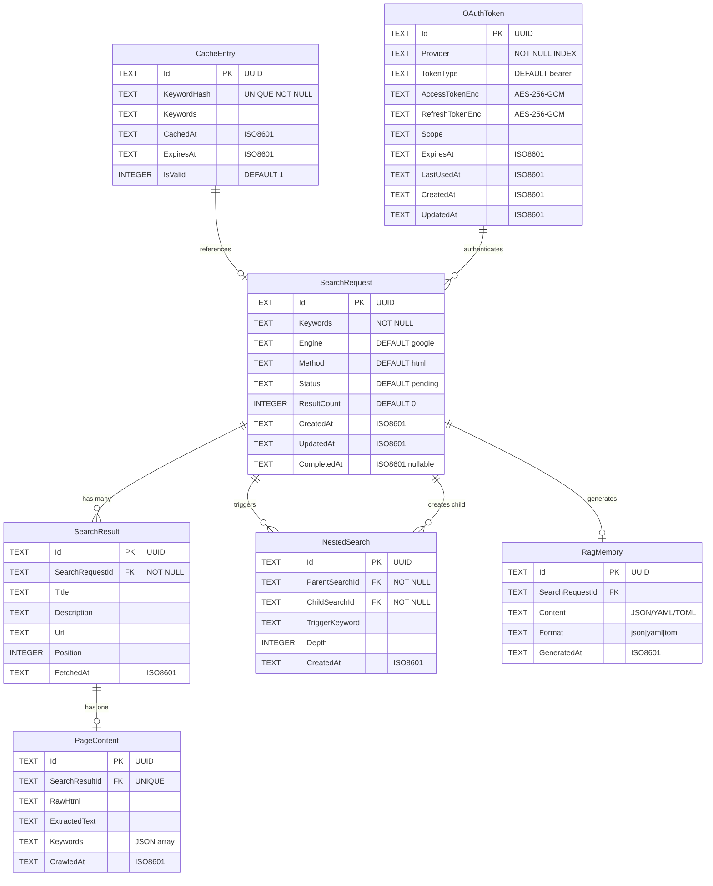

# Component: Database Schema

**Parent:** [Golang Search CLI](./00-overview.md)  
**Version:** 1.2.0  
**Updated:** 2026-01-28  

---

## Summary

SQLite database schema for the Golang Search CLI, managed via GORM ORM with automatic migrations. Includes OAuth token storage with AES-256-GCM encryption for secure credential management.

---

## Database File

**Path:** `./data/search.db.sqlite`  
**Managed by:** GORM AutoMigrate

---

## Entity Relationship Diagram



---

## GORM Models

### SearchRequest

```go
package models

import (
    "time"
    "github.com/google/uuid"
    "gorm.io/gorm"
)

type SearchStatus string

const (
    StatusPending    SearchStatus = "pending"
    StatusInProgress SearchStatus = "in_progress"
    StatusCompleted  SearchStatus = "completed"
    StatusFailed     SearchStatus = "failed"
    StatusCached     SearchStatus = "cached"
)

type SearchRequest struct {
    Id          string       `gorm:"primaryKey;type:TEXT"`
    Keywords    string       `gorm:"type:TEXT;not null"`
    Engine      string       `gorm:"type:TEXT;default:google"`
    Method      string       `gorm:"type:TEXT;default:html"`
    Status      SearchStatus `gorm:"type:TEXT;default:pending"`
    ResultCount int          `gorm:"type:INTEGER;default:0"`
    ErrorMsg    string       `gorm:"type:TEXT"`
    CreatedAt   time.Time    `gorm:"type:TEXT"`
    UpdatedAt   time.Time    `gorm:"type:TEXT"`
    CompletedAt *time.Time   `gorm:"type:TEXT"`
    
    // Relationships
    Results        []SearchResult `gorm:"foreignKey:SearchRequestId;constraint:OnDelete:CASCADE"`
    NestedSearches []NestedSearch `gorm:"foreignKey:ParentSearchId;constraint:OnDelete:CASCADE"`
    RagMemory      *RagMemory     `gorm:"foreignKey:SearchRequestId;constraint:OnDelete:SET NULL"`
}

func (r *SearchRequest) BeforeCreate(tx *gorm.DB) error {
    if r.Id == "" {
        r.Id = uuid.New().String()
    }
    return nil
}
```

### SearchResult

```go
type SearchResult struct {
    Id              string    `gorm:"primaryKey;type:TEXT"`
    SearchRequestId string    `gorm:"type:TEXT;not null;index"`
    Title           string    `gorm:"type:TEXT"`
    Description     string    `gorm:"type:TEXT"`
    Url             string    `gorm:"type:TEXT"`
    Position        int       `gorm:"type:INTEGER"`
    FetchedAt       time.Time `gorm:"type:TEXT"`
    
    // Relationships
    SearchRequest SearchRequest `gorm:"foreignKey:SearchRequestId"`
    PageContent   *PageContent  `gorm:"foreignKey:SearchResultId;constraint:OnDelete:CASCADE"`
}

func (r *SearchResult) BeforeCreate(tx *gorm.DB) error {
    if r.Id == "" {
        r.Id = uuid.New().String()
    }
    return nil
}
```

### PageContent

```go
type PageContent struct {
    Id             string    `gorm:"primaryKey;type:TEXT"`
    SearchResultId string    `gorm:"type:TEXT;uniqueIndex"`
    RawHtml        string    `gorm:"type:TEXT"`
    ExtractedText  string    `gorm:"type:TEXT"`
    Keywords       string    `gorm:"type:TEXT"` // JSON array
    CrawledAt      time.Time `gorm:"type:TEXT"`
    
    // Relationships
    SearchResult SearchResult `gorm:"foreignKey:SearchResultId"`
}

func (p *PageContent) BeforeCreate(tx *gorm.DB) error {
    if p.Id == "" {
        p.Id = uuid.New().String()
    }
    return nil
}

// Helper to get keywords as slice
func (p *PageContent) GetKeywords() ([]string, error) {
    var keywords []string
    if p.Keywords == "" {
        return keywords, nil
    }
    err := json.Unmarshal([]byte(p.Keywords), &keywords)
    return keywords, err
}

// Helper to set keywords from slice
func (p *PageContent) SetKeywords(keywords []string) error {
    data, err := json.Marshal(keywords)
    if err != nil {
        return err
    }
    p.Keywords = string(data)
    return nil
}
```

### NestedSearch

```go
type NestedSearch struct {
    Id             string    `gorm:"primaryKey;type:TEXT"`
    ParentSearchId string    `gorm:"type:TEXT;not null;index"`
    ChildSearchId  string    `gorm:"type:TEXT;not null;index"`
    TriggerKeyword string    `gorm:"type:TEXT"`
    Depth          int       `gorm:"type:INTEGER;default:1"`
    CreatedAt      time.Time `gorm:"type:TEXT"`
    
    // Relationships
    ParentSearch SearchRequest `gorm:"foreignKey:ParentSearchId"`
    ChildSearch  SearchRequest `gorm:"foreignKey:ChildSearchId"`
}

func (n *NestedSearch) BeforeCreate(tx *gorm.DB) error {
    if n.Id == "" {
        n.Id = uuid.New().String()
    }
    return nil
}
```

### CacheEntry

```go
type CacheEntry struct {
    Id          string    `gorm:"primaryKey;type:TEXT"`
    KeywordHash string    `gorm:"type:TEXT;uniqueIndex;not null"`
    Keywords    string    `gorm:"type:TEXT"`
    Engine      string    `gorm:"type:TEXT"`
    CachedAt    time.Time `gorm:"type:TEXT"`
    ExpiresAt   time.Time `gorm:"type:TEXT"`
    IsValid     bool      `gorm:"type:INTEGER;default:1"`
    
    // Reference to cached search
    SearchRequestId string        `gorm:"type:TEXT;index"`
    SearchRequest   SearchRequest `gorm:"foreignKey:SearchRequestId"`
}

func (c *CacheEntry) BeforeCreate(tx *gorm.DB) error {
    if c.Id == "" {
        c.Id = uuid.New().String()
    }
    return nil
}

func (c *CacheEntry) IsExpired() bool {
    return time.Now().After(c.ExpiresAt)
}
```

### RagMemory

```go
type RagFormat string

const (
    FormatJSON RagFormat = "json"
    FormatYAML RagFormat = "yaml"
    FormatTOML RagFormat = "toml"
)

type RagMemory struct {
    Id              string    `gorm:"primaryKey;type:TEXT"`
    SearchRequestId string    `gorm:"type:TEXT;index"`
    Content         string    `gorm:"type:TEXT"` // Formatted content
    Format          RagFormat `gorm:"type:TEXT;default:json"`
    GeneratedAt     time.Time `gorm:"type:TEXT"`
    
    // Relationships
    SearchRequest SearchRequest `gorm:"foreignKey:SearchRequestId"`
}

func (r *RagMemory) BeforeCreate(tx *gorm.DB) error {
    if r.Id == "" {
        r.Id = uuid.New().String()
    }
    return nil
}
```

### OAuthToken

```go
// OAuthProvider represents supported OAuth providers
type OAuthProvider string

const (
    ProviderGoogle OAuthProvider = "google"
    ProviderBing   OAuthProvider = "bing"
)

// OAuthToken stores encrypted OAuth credentials for API access
type OAuthToken struct {
    Id              string        `gorm:"primaryKey;type:TEXT"`
    Provider        OAuthProvider `gorm:"type:TEXT;not null;index"`
    TokenType       string        `gorm:"type:TEXT;default:bearer"`
    AccessTokenEnc  string        `gorm:"type:TEXT"`  // AES-256-GCM encrypted
    RefreshTokenEnc string        `gorm:"type:TEXT"`  // AES-256-GCM encrypted
    Scope           string        `gorm:"type:TEXT"`
    ExpiresAt       time.Time     `gorm:"type:TEXT"`
    LastUsedAt      *time.Time    `gorm:"type:TEXT"`
    CreatedAt       time.Time     `gorm:"type:TEXT"`
    UpdatedAt       time.Time     `gorm:"type:TEXT"`
}

func (t *OAuthToken) BeforeCreate(tx *gorm.DB) error {
    if t.Id == "" {
        t.Id = uuid.New().String()
    }
    return nil
}

// IsExpired checks if the access token has expired
func (t *OAuthToken) IsExpired() bool {
    return time.Now().After(t.ExpiresAt)
}

// NeedsRefresh checks if token should be refreshed (5 min before expiry)
func (t *OAuthToken) NeedsRefresh() bool {
    return time.Now().Add(5 * time.Minute).After(t.ExpiresAt)
}
```

---

## Token Encryption

### Encryption Configuration

```go
// pkg/crypto/config.go

package crypto

import (
    "os"
    "encoding/hex"
    "errors"
)

const (
    // Environment variable for encryption key
    EnvTokenKey = "GSEARCH_TOKEN_KEY"
    
    // Key size for AES-256
    KeySizeBytes = 32
    
    // Nonce size for GCM
    NonceSizeBytes = 12
)

var (
    ErrKeyMissing     = errors.New("encryption key not configured")
    ErrKeyInvalidSize = errors.New("encryption key must be 32 bytes (64 hex chars)")
    ErrKeyInvalidHex  = errors.New("encryption key must be valid hex string")
)

// GetEncryptionKey retrieves and validates the encryption key from environment
func GetEncryptionKey() ([]byte, error) {
    keyHex := os.Getenv(EnvTokenKey)
    if keyHex == "" {
        return nil, ErrKeyMissing
    }
    
    key, err := hex.DecodeString(keyHex)
    if err != nil {
        return nil, ErrKeyInvalidHex
    }
    
    if len(key) != KeySizeBytes {
        return nil, ErrKeyInvalidSize
    }
    
    return key, nil
}

// GenerateKey creates a new random encryption key (for initial setup)
func GenerateKey() (string, error) {
    key := make([]byte, KeySizeBytes)
    if _, err := rand.Read(key); err != nil {
        return "", err
    }
    return hex.EncodeToString(key), nil
}
```

### TokenEncryptor

```go
// pkg/crypto/encryptor.go

package crypto

import (
    "crypto/aes"
    "crypto/cipher"
    "crypto/rand"
    "encoding/base64"
    "errors"
    "io"
)

var (
    ErrEncryptionFailed = errors.New("encryption failed")
    ErrDecryptionFailed = errors.New("decryption failed")
    ErrCiphertextShort  = errors.New("ciphertext too short")
    ErrCiphertextCorrupt = errors.New("ciphertext appears corrupted")
)

// TokenEncryptor handles AES-256-GCM encryption for OAuth tokens
type TokenEncryptor struct {
    key    []byte
    gcm    cipher.AEAD
}

// NewTokenEncryptor creates a new encryptor with the provided key
func NewTokenEncryptor(key []byte) (*TokenEncryptor, error) {
    block, err := aes.NewCipher(key)
    if err != nil {
        return nil, err
    }
    
    gcm, err := cipher.NewGCM(block)
    if err != nil {
        return nil, err
    }
    
    return &TokenEncryptor{
        key: key,
        gcm: gcm,
    }, nil
}

// NewTokenEncryptorFromEnv creates encryptor using environment variable
func NewTokenEncryptorFromEnv() (*TokenEncryptor, error) {
    key, err := GetEncryptionKey()
    if err != nil {
        return nil, err
    }
    return NewTokenEncryptor(key)
}

// Encrypt encrypts plaintext and returns base64-encoded ciphertext
func (e *TokenEncryptor) Encrypt(plaintext string) (string, error) {
    if plaintext == "" {
        return "", nil
    }
    
    // Generate random nonce
    nonce := make([]byte, e.gcm.NonceSize())
    if _, err := io.ReadFull(rand.Reader, nonce); err != nil {
        return "", ErrEncryptionFailed
    }
    
    // Encrypt with GCM (includes authentication tag)
    ciphertext := e.gcm.Seal(nonce, nonce, []byte(plaintext), nil)
    
    // Return base64-encoded result
    return base64.StdEncoding.EncodeToString(ciphertext), nil
}

// Decrypt decrypts base64-encoded ciphertext and returns plaintext
func (e *TokenEncryptor) Decrypt(ciphertextB64 string) (string, error) {
    if ciphertextB64 == "" {
        return "", nil
    }
    
    // Decode from base64
    ciphertext, err := base64.StdEncoding.DecodeString(ciphertextB64)
    if err != nil {
        return "", ErrCiphertextCorrupt
    }
    
    // Validate minimum length (nonce + at least 1 byte + auth tag)
    if len(ciphertext) < e.gcm.NonceSize() + 1 {
        return "", ErrCiphertextShort
    }
    
    // Extract nonce
    nonce := ciphertext[:e.gcm.NonceSize()]
    ciphertext = ciphertext[e.gcm.NonceSize():]
    
    // Decrypt and verify authentication tag
    plaintext, err := e.gcm.Open(nil, nonce, ciphertext, nil)
    if err != nil {
        return "", ErrCiphertextCorrupt
    }
    
    return string(plaintext), nil
}

// RotateKey re-encrypts all tokens with a new key
func RotateKey(db *gorm.DB, oldKey, newKey []byte) error {
    oldEnc, err := NewTokenEncryptor(oldKey)
    if err != nil {
        return err
    }
    
    newEnc, err := NewTokenEncryptor(newKey)
    if err != nil {
        return err
    }
    
    var tokens []OAuthToken
    if err := db.Find(&tokens).Error; err != nil {
        return err
    }
    
    return db.Transaction(func(tx *gorm.DB) error {
        for _, token := range tokens {
            // Decrypt with old key
            accessToken, err := oldEnc.Decrypt(token.AccessTokenEnc)
            if err != nil {
                return err
            }
            refreshToken, err := oldEnc.Decrypt(token.RefreshTokenEnc)
            if err != nil {
                return err
            }
            
            // Re-encrypt with new key
            token.AccessTokenEnc, err = newEnc.Encrypt(accessToken)
            if err != nil {
                return err
            }
            token.RefreshTokenEnc, err = newEnc.Encrypt(refreshToken)
            if err != nil {
                return err
            }
            
            // Update in database
            if err := tx.Save(&token).Error; err != nil {
                return err
            }
        }
        return nil
    })
}
```

---

## Token Manager

```go
// pkg/auth/token_manager.go

package auth

import (
    "context"
    "time"
    "golang.org/x/oauth2"
    "gsearch/pkg/crypto"
    "gsearch/pkg/errors"
    "gsearch/pkg/models"
    "gorm.io/gorm"
)

// TokenManager handles OAuth token storage and retrieval
type TokenManager struct {
    db        *gorm.DB
    encryptor *crypto.TokenEncryptor
}

// NewTokenManager creates a new token manager
func NewTokenManager(db *gorm.DB) (*TokenManager, error) {
    encryptor, err := crypto.NewTokenEncryptorFromEnv()
    if err != nil {
        return nil, errors.WrapError(errors.ErrEncryptKeyMissing, 
            "failed to initialize token encryptor", err)
    }
    
    return &TokenManager{
        db:        db,
        encryptor: encryptor,
    }, nil
}

// StoreToken encrypts and stores an OAuth token
func (m *TokenManager) StoreToken(provider models.OAuthProvider, token *oauth2.Token, scope string) error {
    accessEnc, err := m.encryptor.Encrypt(token.AccessToken)
    if err != nil {
        return errors.WrapError(errors.ErrEncryptFailed, "failed to encrypt access token", err)
    }
    
    refreshEnc, err := m.encryptor.Encrypt(token.RefreshToken)
    if err != nil {
        return errors.WrapError(errors.ErrEncryptFailed, "failed to encrypt refresh token", err)
    }
    
    oauthToken := &models.OAuthToken{
        Provider:        provider,
        TokenType:       token.TokenType,
        AccessTokenEnc:  accessEnc,
        RefreshTokenEnc: refreshEnc,
        Scope:           scope,
        ExpiresAt:       token.Expiry,
        CreatedAt:       time.Now(),
        UpdatedAt:       time.Now(),
    }
    
    // Upsert - update if exists, create if not
    return m.db.Where("provider = ?", provider).
        Assign(*oauthToken).
        FirstOrCreate(oauthToken).Error
}

// GetToken retrieves and decrypts an OAuth token
func (m *TokenManager) GetToken(provider models.OAuthProvider) (*oauth2.Token, error) {
    var stored models.OAuthToken
    err := m.db.Where("provider = ?", provider).First(&stored).Error
    if err != nil {
        if err == gorm.ErrRecordNotFound {
            return nil, errors.NewError(errors.ErrAuthTokenMissing, 
                "no token found for provider: "+string(provider))
        }
        return nil, errors.WrapError(errors.ErrDBQueryFailed, "failed to retrieve token", err)
    }
    
    accessToken, err := m.encryptor.Decrypt(stored.AccessTokenEnc)
    if err != nil {
        return nil, errors.WrapError(errors.ErrDecryptFailed, "failed to decrypt access token", err)
    }
    
    refreshToken, err := m.encryptor.Decrypt(stored.RefreshTokenEnc)
    if err != nil {
        return nil, errors.WrapError(errors.ErrDecryptFailed, "failed to decrypt refresh token", err)
    }
    
    return &oauth2.Token{
        AccessToken:  accessToken,
        RefreshToken: refreshToken,
        TokenType:    stored.TokenType,
        Expiry:       stored.ExpiresAt,
    }, nil
}

// GetValidToken retrieves a token, refreshing if necessary
func (m *TokenManager) GetValidToken(ctx context.Context, provider models.OAuthProvider, config *oauth2.Config) (*oauth2.Token, error) {
    token, err := m.GetToken(provider)
    if err != nil {
        return nil, err
    }
    
    // Check if token needs refresh
    if !token.Valid() || token.Expiry.Before(time.Now().Add(5*time.Minute)) {
        return m.refreshToken(ctx, provider, token, config)
    }
    
    // Update last used timestamp
    m.db.Model(&models.OAuthToken{}).
        Where("provider = ?", provider).
        Update("last_used_at", time.Now())
    
    return token, nil
}

// refreshToken refreshes an expired token and stores the new one
func (m *TokenManager) refreshToken(ctx context.Context, provider models.OAuthProvider, token *oauth2.Token, config *oauth2.Config) (*oauth2.Token, error) {
    if token.RefreshToken == "" {
        return nil, errors.NewError(errors.ErrAuthTokenExpired, 
            "token expired and no refresh token available")
    }
    
    // Use OAuth2 TokenSource to refresh
    ts := config.TokenSource(ctx, token)
    newToken, err := ts.Token()
    if err != nil {
        return nil, errors.WrapError(errors.ErrAuthRefreshFailed, 
            "failed to refresh token", err)
    }
    
    // Store the refreshed token
    scope := "" // Preserve original scope if needed
    if stored, _ := m.getStoredToken(provider); stored != nil {
        scope = stored.Scope
    }
    
    if err := m.StoreToken(provider, newToken, scope); err != nil {
        return nil, err
    }
    
    return newToken, nil
}

// getStoredToken retrieves raw stored token without decryption
func (m *TokenManager) getStoredToken(provider models.OAuthProvider) (*models.OAuthToken, error) {
    var stored models.OAuthToken
    err := m.db.Where("provider = ?", provider).First(&stored).Error
    return &stored, err
}

// RevokeToken removes a stored token
func (m *TokenManager) RevokeToken(provider models.OAuthProvider) error {
    result := m.db.Where("provider = ?", provider).Delete(&models.OAuthToken{})
    if result.Error != nil {
        return errors.WrapError(errors.ErrDBQueryFailed, "failed to revoke token", result.Error)
    }
    return nil
}

// HasValidToken checks if a valid token exists for provider
func (m *TokenManager) HasValidToken(provider models.OAuthProvider) bool {
    var stored models.OAuthToken
    err := m.db.Where("provider = ?", provider).First(&stored).Error
    if err != nil {
        return false
    }
    return !stored.IsExpired() || stored.RefreshTokenEnc != ""
}
```

---

## Token Queries

### Get OAuth Token

```go
func (db *DB) GetOAuthToken(provider OAuthProvider) (*OAuthToken, error) {
    var token OAuthToken
    err := db.Where("provider = ?", provider).First(&token).Error
    if err != nil {
        return nil, err
    }
    return &token, nil
}
```

### List All Tokens

```go
func (db *DB) ListOAuthTokens() ([]OAuthToken, error) {
    var tokens []OAuthToken
    err := db.Find(&tokens).Error
    return tokens, err
}
```

### Delete Expired Tokens

```go
func (db *DB) DeleteExpiredTokens() (int64, error) {
    // Delete tokens that are expired AND have no refresh token
    result := db.Where("expires_at < ? AND refresh_token_enc = ''", time.Now()).
        Delete(&OAuthToken{})
    return result.RowsAffected, result.Error
}
```

---

## Database Initialization

```go
package database

import (
    "gorm.io/driver/sqlite"
    "gorm.io/gorm"
    "gorm.io/gorm/logger"
)

type DB struct {
    *gorm.DB
}

func NewDatabase(dbPath string) (*DB, error) {
    db, err := gorm.Open(sqlite.Open(dbPath), &gorm.Config{
        Logger: logger.Default.LogMode(logger.Info),
    })
    if err != nil {
        return nil, err
    }
    
    // Enable foreign keys
    db.Exec("PRAGMA foreign_keys = ON")
    
    // Run migrations
    err = db.AutoMigrate(
        &SearchRequest{},
        &SearchResult{},
        &PageContent{},
        &NestedSearch{},
        &CacheEntry{},
        &RagMemory{},
        &OAuthToken{},  // Added for Phase 3
    )
    if err != nil {
        return nil, err
    }
    
    return &DB{db}, nil
}
```

---

## Common Queries

### Create Search Request

```go
func (db *DB) CreateSearchRequest(keywords, engine, method string) (*SearchRequest, error) {
    request := &SearchRequest{
        Keywords:  keywords,
        Engine:    engine,
        Method:    method,
        Status:    StatusPending,
        CreatedAt: time.Now(),
        UpdatedAt: time.Now(),
    }
    
    result := db.Create(request)
    return request, result.Error
}
```

### Update Status

```go
func (db *DB) UpdateSearchStatus(id string, status SearchStatus, resultCount int) error {
    updates := map[string]interface{}{
        "Status":      status,
        "ResultCount": resultCount,
        "UpdatedAt":   time.Now(),
    }
    
    if status == StatusCompleted || status == StatusFailed {
        now := time.Now()
        updates["CompletedAt"] = &now
    }
    
    return db.Model(&SearchRequest{}).Where("id = ?", id).Updates(updates).Error
}
```

### Get Results with Page Content

```go
func (db *DB) GetResultsWithContent(searchId string) ([]SearchResult, error) {
    var results []SearchResult
    err := db.Preload("PageContent").
        Where("search_request_id = ?", searchId).
        Order("position ASC").
        Find(&results).Error
    return results, err
}
```

### Check Cache

```go
func (db *DB) CheckCache(keywords, engine string) (*CacheEntry, error) {
    hash := generateKeywordHash(keywords, engine)
    
    var entry CacheEntry
    err := db.Where("keyword_hash = ? AND is_valid = ?", hash, true).
        First(&entry).Error
    
    if err != nil {
        return nil, err
    }
    
    if entry.IsExpired() {
        // Invalidate expired cache
        db.Model(&entry).Update("is_valid", false)
        return nil, gorm.ErrRecordNotFound
    }
    
    return &entry, nil
}
```

### Get Nested Search Tree

```go
func (db *DB) GetNestedSearchTree(rootId string, maxDepth int) ([]NestedSearch, error) {
    var nested []NestedSearch
    err := db.Where("parent_search_id = ? AND depth <= ?", rootId, maxDepth).
        Preload("ChildSearch").
        Find(&nested).Error
    return nested, err
}
```

---

## Indexes

```go
// Additional indexes for performance
func (db *DB) CreateIndexes() error {
    // Composite index for cache lookups
    db.Exec("CREATE INDEX IF NOT EXISTS idx_cache_lookup ON cache_entries(keyword_hash, is_valid)")
    
    // Index for status queries
    db.Exec("CREATE INDEX IF NOT EXISTS idx_search_status ON search_requests(status)")
    
    // Index for nested search depth queries
    db.Exec("CREATE INDEX IF NOT EXISTS idx_nested_depth ON nested_searches(parent_search_id, depth)")
    
    // Index for OAuth token provider lookups
    db.Exec("CREATE INDEX IF NOT EXISTS idx_oauth_provider ON oauth_tokens(provider)")
    
    // Index for expired token cleanup
    db.Exec("CREATE INDEX IF NOT EXISTS idx_oauth_expiry ON oauth_tokens(expires_at)")
    
    return nil
}
```

---

## Data Integrity

### Cascade Behaviors

| Parent | Child | OnDelete |
|--------|-------|----------|
| SearchRequest | SearchResult | CASCADE |
| SearchRequest | NestedSearch | CASCADE |
| SearchRequest | RagMemory | SET NULL |
| SearchResult | PageContent | CASCADE |

### Constraints

- `SearchResult.SearchRequestId` — NOT NULL, FK to SearchRequest
- `CacheEntry.KeywordHash` — UNIQUE, NOT NULL
- `PageContent.SearchResultId` — UNIQUE (one-to-one)
- `OAuthToken.Provider` — NOT NULL, indexed

---

## Security Considerations

### Token Storage Security

| Aspect | Implementation |
|--------|----------------|
| **Algorithm** | AES-256-GCM (authenticated encryption) |
| **Key Storage** | Environment variable `GSEARCH_TOKEN_KEY` |
| **Key Format** | 64 hex characters (32 bytes) |
| **Nonce** | Random 12-byte nonce per encryption |
| **Output** | Base64-encoded (nonce + ciphertext + auth tag) |

### Key Management Best Practices

1. **Key Generation**: Use `crypto.GenerateKey()` to create secure keys
2. **Key Storage**: Store in environment, not in config files
3. **Key Rotation**: Use `crypto.RotateKey()` to re-encrypt all tokens
4. **Access Control**: Restrict access to the encryption key

### Environment Setup

```bash
# Generate a new encryption key
GSEARCH_TOKEN_KEY=$(openssl rand -hex 32)
export GSEARCH_TOKEN_KEY

# Or use the built-in generator
gsearch config generate-key
```

---

## Related Specs

- [Configuration](./02-configuration.md) — Database path settings
- [RAG Export](./11-rag-export.md) — RagMemory generation
- [Google API](./05-google-api.md) — OAuth token usage
- [Error Codes](./15-error-codes.md) — Encryption error codes (12xxx)
- [Remediation Plan](./14-remediation-plan.md) — Phase 3 implementation

---

## Changelog

| Version | Date | Changes |
|---------|------|---------|
| 1.0.0 | 2026-01-28 | Initial schema with core entities |
| 1.1.0 | 2026-01-28 | Added OAuthToken model with AES-256-GCM encryption |
