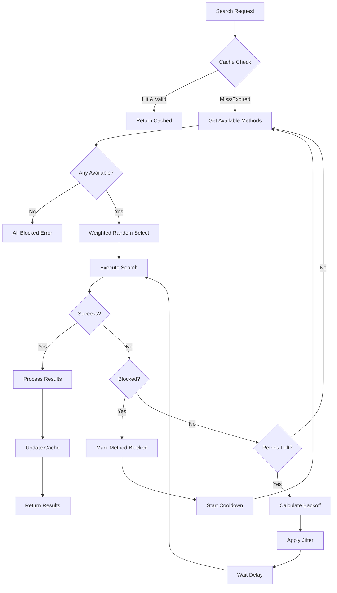

# Component: Method Switching

**Parent:** [Golang Search CLI](./00-overview.md)  
**Version:** 1.2.0  
**Updated:** 2026-01-28  

---

## Summary

Intelligent search method selection with weighted random choice (float64 0.0-1.0), automatic fallback on blocking, cooldown management, and comprehensive exponential backoff with configurable jitter strategies.

---

## Method Selection Logic



---

## Search Methods

| Method | ID | Weight (Default) | Description |
|--------|-----|------------------|-------------|
| HTML Parser | `html` | 0.40 | Direct HTTP + HTML parsing |
| Google API | `google_api` | 0.30 | Custom Search / Console API |
| DuckDuckGo | `duckduckgo` | 0.20 | DDG HTML parsing |
| Bing | `bing` | 0.10 | Bing Search API |

**Note:** Weights are `float64` values in range `0.0-1.0` and MUST sum to `1.0`.

---

## Exponential Backoff System

### Overview

The backoff system prevents overwhelming services during failures and reduces the chance of cascading failures. It implements:

1. **Exponential Growth**: Each retry waits longer than the previous
2. **Maximum Cap**: Prevents unreasonably long waits
3. **Jitter**: Randomizes delays to prevent thundering herd
4. **Context Awareness**: Respects cancellation and deadlines

### Backoff Calculation Formula

```
delay = min(initialDelay × multiplier^attempt, maxDelay)
finalDelay = delay + jitter(delay, jitterFactor, jitterType)
```

### Jitter Strategies

| Strategy | Description | Formula | Best For |
|----------|-------------|---------|----------|
| `full` | Random between 0 and delay | `rand(0, delay)` | Maximum spread |
| `equal` | Random between delay/2 and delay | `delay/2 + rand(0, delay/2)` | Balanced |
| `decorrelated` | Based on previous delay | `rand(base, prev × 3)` | Correlated retries |
| `bounded` | ±percentage of delay | `delay × (1 ± jitter%)` | Predictable bounds |

### Backoff Configuration

```json
{
  "backoff": {
    "initialDelay": "1s",
    "maxDelay": "60s",
    "multiplier": 2.0,
    "jitter": 0.2,
    "jitterType": "bounded",
    "maxAttempts": 5,
    "resetAfterSuccess": true
  }
}
```

---

## Implementation

### Backoff Strategy

```go
// pkg/retry/backoff.go

package retry

import (
    "context"
    "math"
    "math/rand"
    "sync"
    "time"
    
    "github.com/rs/zerolog/log"
    "gsearch/pkg/config"
    "gsearch/pkg/errors"
)

// JitterType defines the jitter algorithm
type JitterType string

const (
    JitterFull        JitterType = "full"        // [0, delay]
    JitterEqual       JitterType = "equal"       // [delay/2, delay]
    JitterDecorrelated JitterType = "decorrelated" // [base, prev*3]
    JitterBounded     JitterType = "bounded"     // [delay*(1-j), delay*(1+j)]
)

// BackoffConfig configures the backoff behavior
type BackoffConfig struct {
    InitialDelay      time.Duration `mapstructure:"initialDelay"`
    MaxDelay          time.Duration `mapstructure:"maxDelay"`
    Multiplier        float64       `mapstructure:"multiplier"`
    Jitter            float64       `mapstructure:"jitter"`            // 0.0-1.0
    JitterType        JitterType    `mapstructure:"jitterType"`
    MaxAttempts       int           `mapstructure:"maxAttempts"`
    ResetAfterSuccess bool          `mapstructure:"resetAfterSuccess"`
}

// DefaultBackoffConfig returns sensible defaults
func DefaultBackoffConfig() BackoffConfig {
    return BackoffConfig{
        InitialDelay:      1 * time.Second,
        MaxDelay:          60 * time.Second,
        Multiplier:        2.0,
        Jitter:            0.2,
        JitterType:        JitterBounded,
        MaxAttempts:       5,
        ResetAfterSuccess: true,
    }
}

// Backoff implements exponential backoff with jitter
type Backoff struct {
    config      BackoffConfig
    attempt     int
    prevDelay   time.Duration
    mu          sync.Mutex
    rng         *rand.Rand
}

// NewBackoff creates a new backoff instance
func NewBackoff(cfg BackoffConfig) *Backoff {
    return &Backoff{
        config:    cfg,
        prevDelay: cfg.InitialDelay,
        rng:       rand.New(rand.NewSource(time.Now().UnixNano())),
    }
}

// NewBackoffFromConfig creates backoff from application config
func NewBackoffFromConfig(cfg *config.BackoffConfig) *Backoff {
    return NewBackoff(BackoffConfig{
        InitialDelay:      cfg.InitialDelay.Duration,
        MaxDelay:          cfg.MaxDelay.Duration,
        Multiplier:        cfg.Multiplier,
        Jitter:            cfg.Jitter,
        JitterType:        JitterType(cfg.JitterType),
        MaxAttempts:       cfg.MaxAttempts,
        ResetAfterSuccess: cfg.ResetAfterSuccess,
    })
}

// NextDelay calculates the next backoff delay
func (b *Backoff) NextDelay() time.Duration {
    b.mu.Lock()
    defer b.mu.Unlock()
    
    // Calculate base exponential delay
    baseDelay := b.calculateBaseDelay()
    
    // Apply jitter
    delay := b.applyJitter(baseDelay)
    
    // Ensure non-negative and within bounds
    if delay < 0 {
        delay = 0
    }
    if delay > b.config.MaxDelay {
        delay = b.config.MaxDelay
    }
    
    // Update state
    b.prevDelay = delay
    b.attempt++
    
    log.Debug().
        Int("attempt", b.attempt).
        Dur("baseDelay", baseDelay).
        Dur("finalDelay", delay).
        Str("jitterType", string(b.config.JitterType)).
        Msg("Calculated backoff delay")
    
    return delay
}

// calculateBaseDelay computes delay without jitter
func (b *Backoff) calculateBaseDelay() time.Duration {
    delay := float64(b.config.InitialDelay) * math.Pow(b.config.Multiplier, float64(b.attempt))
    
    if delay > float64(b.config.MaxDelay) {
        delay = float64(b.config.MaxDelay)
    }
    
    return time.Duration(delay)
}

// applyJitter adds randomness to the delay
func (b *Backoff) applyJitter(delay time.Duration) time.Duration {
    if b.config.Jitter <= 0 {
        return delay
    }
    
    d := float64(delay)
    
    switch b.config.JitterType {
    case JitterFull:
        // Random between 0 and delay
        return time.Duration(b.rng.Float64() * d)
        
    case JitterEqual:
        // Random between delay/2 and delay
        return time.Duration(d/2 + b.rng.Float64()*d/2)
        
    case JitterDecorrelated:
        // Decorrelated jitter: between base and 3×previous
        base := float64(b.config.InitialDelay)
        prev := float64(b.prevDelay) * 3
        if prev > float64(b.config.MaxDelay) {
            prev = float64(b.config.MaxDelay)
        }
        return time.Duration(base + b.rng.Float64()*(prev-base))
        
    case JitterBounded:
        // ±jitter percentage of delay
        jitterRange := d * b.config.Jitter
        jitter := jitterRange * (b.rng.Float64()*2 - 1) // -jitter to +jitter
        return time.Duration(d + jitter)
        
    default:
        return delay
    }
}

// Wait waits for the next backoff delay
func (b *Backoff) Wait(ctx context.Context) error {
    delay := b.NextDelay()
    
    timer := time.NewTimer(delay)
    defer timer.Stop()
    
    select {
    case <-ctx.Done():
        return ctx.Err()
    case <-timer.C:
        return nil
    }
}

// Reset resets the backoff to initial state
func (b *Backoff) Reset() {
    b.mu.Lock()
    defer b.mu.Unlock()
    
    b.attempt = 0
    b.prevDelay = b.config.InitialDelay
}

// Attempt returns the current attempt number
func (b *Backoff) Attempt() int {
    b.mu.Lock()
    defer b.mu.Unlock()
    return b.attempt
}

// ShouldRetry checks if more retries are allowed
func (b *Backoff) ShouldRetry() bool {
    b.mu.Lock()
    defer b.mu.Unlock()
    return b.attempt < b.config.MaxAttempts
}

// Clone creates a new backoff with same config but reset state
func (b *Backoff) Clone() *Backoff {
    return NewBackoff(b.config)
}
```

### Retry Executor

```go
// pkg/retry/executor.go

package retry

import (
    "context"
    "time"
    
    "github.com/rs/zerolog/log"
    "gsearch/pkg/errors"
)

// RetryableFunc is a function that can be retried
type RetryableFunc func(ctx context.Context) error

// RetryableFuncWithResult is a function that returns a result
type RetryableFuncWithResult[T any] func(ctx context.Context) (T, error)

// RetryPolicy defines when to retry
type RetryPolicy interface {
    ShouldRetry(err error) bool
}

// DefaultRetryPolicy retries on retryable errors
type DefaultRetryPolicy struct{}

func (p *DefaultRetryPolicy) ShouldRetry(err error) bool {
    return errors.IsRetryable(err)
}

// AlwaysRetryPolicy retries on any error
type AlwaysRetryPolicy struct{}

func (p *AlwaysRetryPolicy) ShouldRetry(err error) bool {
    return err != nil
}

// RetryExecutor executes functions with retry logic
type RetryExecutor struct {
    backoff *Backoff
    policy  RetryPolicy
}

// NewRetryExecutor creates a new retry executor
func NewRetryExecutor(backoff *Backoff, policy RetryPolicy) *RetryExecutor {
    if policy == nil {
        policy = &DefaultRetryPolicy{}
    }
    return &RetryExecutor{
        backoff: backoff,
        policy:  policy,
    }
}

// Execute runs a function with retries
func (e *RetryExecutor) Execute(ctx context.Context, fn RetryableFunc) error {
    e.backoff.Reset()
    
    var lastErr error
    
    for {
        err := fn(ctx)
        if err == nil {
            return nil
        }
        
        lastErr = err
        
        // Check if we should retry
        if !e.policy.ShouldRetry(err) {
            log.Debug().
                Err(err).
                Msg("Error is not retryable")
            return err
        }
        
        // Check if more retries allowed
        if !e.backoff.ShouldRetry() {
            log.Warn().
                Int("attempts", e.backoff.Attempt()).
                Err(err).
                Msg("Max retries exceeded")
            return errors.WrapError(errors.ErrHTTPTimeout,
                "max retries exceeded", lastErr)
        }
        
        // Wait with backoff
        log.Debug().
            Int("attempt", e.backoff.Attempt()+1).
            Err(err).
            Msg("Retrying after backoff")
            
        if err := e.backoff.Wait(ctx); err != nil {
            return err // Context cancelled
        }
    }
}

// ExecuteWithResult runs a function that returns a result
func ExecuteWithResult[T any](
    ctx context.Context,
    backoff *Backoff,
    policy RetryPolicy,
    fn RetryableFuncWithResult[T],
) (T, error) {
    var zero T
    backoff.Reset()
    
    if policy == nil {
        policy = &DefaultRetryPolicy{}
    }
    
    var lastErr error
    
    for {
        result, err := fn(ctx)
        if err == nil {
            return result, nil
        }
        
        lastErr = err
        
        if !policy.ShouldRetry(err) {
            return zero, err
        }
        
        if !backoff.ShouldRetry() {
            return zero, errors.WrapError(errors.ErrHTTPTimeout,
                "max retries exceeded", lastErr)
        }
        
        if err := backoff.Wait(ctx); err != nil {
            return zero, err
        }
    }
}
```

### Backoff Calculator (Utility)

```go
// pkg/retry/calculator.go

package retry

import (
    "time"
)

// BackoffTable generates a table of expected delays
type BackoffTable struct {
    Attempt     int           `json:"attempt"`
    BaseDelay   time.Duration `json:"baseDelay"`
    MinDelay    time.Duration `json:"minDelay"`
    MaxDelay    time.Duration `json:"maxDelay"`
    ExpectedAvg time.Duration `json:"expectedAvg"`
}

// GenerateBackoffTable creates a preview of backoff delays
func GenerateBackoffTable(cfg BackoffConfig, attempts int) []BackoffTable {
    var table []BackoffTable
    
    for i := 0; i < attempts; i++ {
        baseDelay := float64(cfg.InitialDelay) * 
            math.Pow(cfg.Multiplier, float64(i))
        
        if baseDelay > float64(cfg.MaxDelay) {
            baseDelay = float64(cfg.MaxDelay)
        }
        
        var minDelay, maxDelay, avgDelay float64
        
        switch cfg.JitterType {
        case JitterFull:
            minDelay = 0
            maxDelay = baseDelay
            avgDelay = baseDelay / 2
            
        case JitterEqual:
            minDelay = baseDelay / 2
            maxDelay = baseDelay
            avgDelay = baseDelay * 0.75
            
        case JitterBounded:
            jitterAmt := baseDelay * cfg.Jitter
            minDelay = baseDelay - jitterAmt
            maxDelay = baseDelay + jitterAmt
            avgDelay = baseDelay
            
        default:
            minDelay = baseDelay
            maxDelay = baseDelay
            avgDelay = baseDelay
        }
        
        table = append(table, BackoffTable{
            Attempt:     i + 1,
            BaseDelay:   time.Duration(baseDelay),
            MinDelay:    time.Duration(minDelay),
            MaxDelay:    time.Duration(maxDelay),
            ExpectedAvg: time.Duration(avgDelay),
        })
    }
    
    return table
}

// TotalMaxDelay calculates worst-case total delay
func TotalMaxDelay(cfg BackoffConfig, attempts int) time.Duration {
    var total time.Duration
    
    for i := 0; i < attempts; i++ {
        baseDelay := float64(cfg.InitialDelay) * 
            math.Pow(cfg.Multiplier, float64(i))
        
        if baseDelay > float64(cfg.MaxDelay) {
            baseDelay = float64(cfg.MaxDelay)
        }
        
        // Add maximum jitter
        maxDelay := baseDelay
        if cfg.JitterType == JitterBounded {
            maxDelay = baseDelay * (1 + cfg.Jitter)
        }
        
        total += time.Duration(maxDelay)
    }
    
    return total
}
```

---

## Method Interface

```go
package search

import (
    "context"
    "time"
)

type SearchMethod interface {
    ID() string
    Name() string
    Search(ctx context.Context, query string, opts SearchOptions) ([]Result, error)
    IsAvailable() bool
    RequiresAPI() bool
}

type SearchOptions struct {
    MaxResults int
    Delay      time.Duration
    UserAgent  string
}

type Result struct {
    Title       string
    Description string
    URL         string
    Position    int
}
```

### Method Switcher

```go
package search

import (
    "context"
    "math/rand"
    "sync"
    "time"
    
    "gsearch/pkg/retry"
)

type MethodSwitcher struct {
    methods      map[string]SearchMethod
    weights      map[string]float64    // Normalized weights (0.0-1.0)
    blocked      map[string]time.Time
    cooldown     time.Duration
    backoffCfg   retry.BackoffConfig
    mu           sync.RWMutex
}

func NewMethodSwitcher(cfg *config.Config) *MethodSwitcher {
    return &MethodSwitcher{
        methods:  make(map[string]SearchMethod),
        weights:  cfg.Search.MethodWeights,  // float64 map
        blocked:  make(map[string]time.Time),
        cooldown: cfg.Blocking.Cooldown.Duration,
        backoffCfg: retry.BackoffConfig{
            InitialDelay:      cfg.Backoff.InitialDelay.Duration,
            MaxDelay:          cfg.Backoff.MaxDelay.Duration,
            Multiplier:        cfg.Backoff.Multiplier,
            Jitter:            cfg.Backoff.Jitter,
            JitterType:        retry.JitterType(cfg.Backoff.JitterType),
            MaxAttempts:       cfg.Backoff.MaxAttempts,
            ResetAfterSuccess: cfg.Backoff.ResetAfterSuccess,
        },
    }
}

func (s *MethodSwitcher) RegisterMethod(m SearchMethod) {
    s.mu.Lock()
    defer s.mu.Unlock()
    s.methods[m.ID()] = m
}

func (s *MethodSwitcher) SelectMethod() (SearchMethod, error) {
    s.mu.RLock()
    defer s.mu.RUnlock()
    
    available := s.getAvailableMethods()
    if len(available) == 0 {
        return nil, ErrAllMethodsBlocked
    }
    
    return s.weightedSelect(available), nil
}

func (s *MethodSwitcher) getAvailableMethods() []SearchMethod {
    now := time.Now()
    var available []SearchMethod
    
    for id, method := range s.methods {
        if !method.IsAvailable() {
            continue
        }
        
        if blockedUntil, ok := s.blocked[id]; ok {
            if now.Before(blockedUntil) {
                continue // Still in cooldown
            }
            delete(s.blocked, id) // Cooldown expired
        }
        
        available = append(available, method)
    }
    
    return available
}

// weightedSelect uses normalized float64 weights (0.0-1.0)
func (s *MethodSwitcher) weightedSelect(methods []SearchMethod) SearchMethod {
    // Calculate total weight for available methods
    var totalWeight float64
    for _, m := range methods {
        if w, ok := s.weights[m.ID()]; ok {
            totalWeight += w
        }
    }
    
    if totalWeight == 0 {
        // Equal probability if no weights configured
        return methods[rand.Intn(len(methods))]
    }
    
    // Random selection based on normalized weights
    r := rand.Float64() * totalWeight
    var cumulative float64
    
    for _, m := range methods {
        w := s.weights[m.ID()]
        cumulative += w
        if r < cumulative {
            return m
        }
    }
    
    return methods[0] // Fallback
}

func (s *MethodSwitcher) MarkBlocked(methodID string) {
    s.mu.Lock()
    defer s.mu.Unlock()
    s.blocked[methodID] = time.Now().Add(s.cooldown)
}

func (s *MethodSwitcher) GetBlockedMethods() []string {
    s.mu.RLock()
    defer s.mu.RUnlock()
    
    var blocked []string
    now := time.Now()
    
    for id, until := range s.blocked {
        if now.Before(until) {
            blocked = append(blocked, id)
        }
    }
    
    return blocked
}

// CreateBackoff creates a new backoff instance for this switcher
func (s *MethodSwitcher) CreateBackoff() *retry.Backoff {
    return retry.NewBackoff(s.backoffCfg)
}
```

### Blocking Detection

```go
package search

import (
    "strings"
)

type BlockDetector struct {
    patterns []string
}

func NewBlockDetector(patterns []string) *BlockDetector {
    return &BlockDetector{patterns: patterns}
}

func (d *BlockDetector) IsBlocked(response string, statusCode int) bool {
    // HTTP status checks
    if statusCode == 429 || statusCode == 403 || statusCode == 503 {
        return true
    }
    
    // Pattern matching in response
    lowered := strings.ToLower(response)
    for _, pattern := range d.patterns {
        if strings.Contains(lowered, strings.ToLower(pattern)) {
            return true
        }
    }
    
    return false
}

// Default patterns
var DefaultBlockPatterns = []string{
    "unusual traffic",
    "captcha",
    "blocked",
    "rate limit",
    "too many requests",
    "access denied",
    "please verify",
    "automated queries",
    "suspicious activity",
    "temporarily unavailable",
}
```

### Search Executor with Enhanced Backoff

```go
package search

import (
    "context"
    "errors"
    "fmt"
    "time"
    
    "github.com/rs/zerolog/log"
    "gsearch/pkg/retry"
    pkgerrors "gsearch/pkg/errors"
)

type Executor struct {
    switcher    *MethodSwitcher
    detector    *BlockDetector
    maxRetries  int
    backoffCfg  retry.BackoffConfig
}

func NewExecutor(switcher *MethodSwitcher, cfg *config.Config) *Executor {
    return &Executor{
        switcher:   switcher,
        detector:   NewBlockDetector(cfg.Blocking.DetectPatterns),
        maxRetries: cfg.Search.MaxRetries,
        backoffCfg: retry.BackoffConfig{
            InitialDelay:      cfg.Backoff.InitialDelay.Duration,
            MaxDelay:          cfg.Backoff.MaxDelay.Duration,
            Multiplier:        cfg.Backoff.Multiplier,
            Jitter:            cfg.Backoff.Jitter,
            JitterType:        retry.JitterType(cfg.Backoff.JitterType),
            MaxAttempts:       cfg.Backoff.MaxAttempts,
            ResetAfterSuccess: cfg.Backoff.ResetAfterSuccess,
        },
    }
}

func (e *Executor) Search(ctx context.Context, query string, opts SearchOptions) ([]Result, error) {
    var lastErr error
    triedMethods := make(map[string]bool)
    backoff := retry.NewBackoff(e.backoffCfg)
    
    startTime := time.Now()
    
    for backoff.ShouldRetry() {
        method, err := e.switcher.SelectMethod()
        if err != nil {
            // All methods blocked - check if we should wait and retry
            if pkgerrors.IsRetryable(err) && backoff.Attempt() < e.maxRetries {
                log.Warn().
                    Int("attempt", backoff.Attempt()+1).
                    Msg("All methods blocked, waiting before retry")
                    
                if err := backoff.Wait(ctx); err != nil {
                    return nil, err
                }
                continue
            }
            return nil, fmt.Errorf("no methods available: %w", err)
        }
        
        methodID := method.ID()
        
        // Track method attempts for this request
        if triedMethods[methodID] {
            // Already tried this method - wait and try different approach
            if err := backoff.Wait(ctx); err != nil {
                return nil, err
            }
            continue
        }
        triedMethods[methodID] = true
        
        log.Debug().
            Str("method", methodID).
            Int("attempt", backoff.Attempt()+1).
            Str("query", query).
            Msg("Executing search")
        
        results, err := method.Search(ctx, query, opts)
        if err == nil {
            // Success - reset backoff
            backoff.Reset()
            
            log.Info().
                Str("method", methodID).
                Int("resultCount", len(results)).
                Dur("duration", time.Since(startTime)).
                Msg("Search completed successfully")
                
            return results, nil
        }
        
        lastErr = err
        
        // Check if blocked
        if e.isBlockingError(err) {
            log.Warn().
                Str("method", methodID).
                Err(err).
                Msg("Method blocked, marking for cooldown")
                
            e.switcher.MarkBlocked(methodID)
            // Don't apply backoff for blocking - try next method immediately
            continue
        }
        
        // Transient error: apply exponential backoff
        log.Debug().
            Str("method", methodID).
            Err(err).
            Int("attempt", backoff.Attempt()).
            Msg("Transient error, applying backoff")
            
        if err := backoff.Wait(ctx); err != nil {
            return nil, err
        }
    }
    
    return nil, pkgerrors.WrapError(
        pkgerrors.ErrAllMethodsBlocked,
        fmt.Sprintf("search failed after %d attempts", backoff.Attempt()),
        lastErr,
    )
}

func (e *Executor) isBlockingError(err error) bool {
    var blockErr *BlockedError
    return errors.As(err, &blockErr)
}

// SearchWithRetryPolicy allows custom retry policies
func (e *Executor) SearchWithRetryPolicy(
    ctx context.Context,
    query string,
    opts SearchOptions,
    policy retry.RetryPolicy,
) ([]Result, error) {
    backoff := retry.NewBackoff(e.backoffCfg)
    
    return retry.ExecuteWithResult(ctx, backoff, policy, func(ctx context.Context) ([]Result, error) {
        method, err := e.switcher.SelectMethod()
        if err != nil {
            return nil, err
        }
        
        results, err := method.Search(ctx, query, opts)
        if err != nil {
            if e.isBlockingError(err) {
                e.switcher.MarkBlocked(method.ID())
            }
            return nil, err
        }
        
        return results, nil
    })
}
```

---

## Weight Configuration

Weights use **normalized float64 values** that must sum to `1.0`:

```json
{
  "methodWeights": {
    "html": 0.40,
    "google_api": 0.30,
    "duckduckgo": 0.20,
    "bing": 0.10
  }
}
```

**Interpretation:**
- `0.40` = 40% chance to use HTML parsing
- `0.30` = 30% chance to use Google API (if enabled)
- `0.20` = 20% chance to use DuckDuckGo
- `0.10` = 10% chance to use Bing (if API key available)

**Validation:** Weights are validated on config load to ensure they sum to 1.0 (±0.001 tolerance).

---

## Backoff Configuration

### Full Schema

```json
{
  "backoff": {
    "initialDelay": "1s",
    "maxDelay": "60s",
    "multiplier": 2.0,
    "jitter": 0.2,
    "jitterType": "bounded",
    "maxAttempts": 5,
    "resetAfterSuccess": true
  }
}
```

### Configuration Reference

| Field | Type | Default | Description |
|-------|------|---------|-------------|
| `initialDelay` | Duration | `1s` | First retry delay |
| `maxDelay` | Duration | `60s` | Maximum delay cap |
| `multiplier` | float64 | `2.0` | Exponential growth factor |
| `jitter` | float64 | `0.2` | Jitter factor (0.0-1.0) |
| `jitterType` | string | `bounded` | Jitter algorithm |
| `maxAttempts` | int | `5` | Maximum retry attempts |
| `resetAfterSuccess` | bool | `true` | Reset attempt counter on success |

### Delay Progression Table (Bounded Jitter ±20%)

| Attempt | Base Delay | Min Delay | Max Delay | Cumulative Max |
|---------|-----------|-----------|-----------|----------------|
| 1 | 1s | 0.8s | 1.2s | 1.2s |
| 2 | 2s | 1.6s | 2.4s | 3.6s |
| 3 | 4s | 3.2s | 4.8s | 8.4s |
| 4 | 8s | 6.4s | 9.6s | 18.0s |
| 5 | 16s | 12.8s | 19.2s | 37.2s |
| 6+ | 60s (cap) | 48s | 72s | 109.2s |

### Jitter Comparison (for 4s base delay)

| Strategy | Min | Max | Distribution |
|----------|-----|-----|--------------|
| `full` | 0s | 4s | Uniform [0, delay] |
| `equal` | 2s | 4s | Uniform [delay/2, delay] |
| `bounded` | 3.2s | 4.8s | Uniform [delay±20%] |
| `decorrelated` | 1s | 9s* | Based on previous |

*Decorrelated uses previous delay × 3 as upper bound

---

## Cooldown Management

| Event | Action |
|-------|--------|
| Block detected | Start cooldown (default 30m) |
| Cooldown expired | Method available again |
| All methods blocked | Apply backoff, retry |
| Max retries exceeded | Return error |

---

## Acceptance Criteria

| ID | Criterion | Priority | Validation |
|----|-----------|----------|------------|
| AC-01 | Weights sum to 1.0 (±0.001) | MUST | Unit test |
| AC-02 | Blocked methods enter cooldown | MUST | Integration test |
| AC-03 | Exponential backoff applied on retry | MUST | Unit test |
| AC-04 | Jitter randomizes delay within bounds | MUST | Statistical test |
| AC-05 | Method selection respects weights | MUST | Statistical test |
| AC-06 | Max delay caps exponential growth | MUST | Unit test |
| AC-07 | Context cancellation stops backoff | MUST | Unit test |
| AC-08 | Reset clears attempt counter | MUST | Unit test |
| AC-09 | Full jitter produces [0, delay] range | SHOULD | Statistical test |
| AC-10 | Decorrelated jitter uses previous delay | SHOULD | Unit test |

---

## Usage Examples

### Basic Search with Backoff

```go
executor := NewExecutor(switcher, cfg)
results, err := executor.Search(ctx, "golang tutorials", SearchOptions{
    MaxResults: 10,
})
```

### Custom Retry Policy

```go
// Only retry on network errors
policy := &NetworkOnlyRetryPolicy{}
results, err := executor.SearchWithRetryPolicy(ctx, query, opts, policy)
```

### Manual Backoff Control

```go
backoff := retry.NewBackoff(retry.DefaultBackoffConfig())

for backoff.ShouldRetry() {
    err := doSomething()
    if err == nil {
        break
    }
    
    if !shouldRetry(err) {
        return err
    }
    
    backoff.Wait(ctx)
}
```

---

## Related Specs

- [Configuration](./02-configuration.md) — Weight and backoff settings
- [HTML Parser](./04-html-parser.md) — Primary method
- [Google API](./05-google-api.md) — API method
- [Error Codes](./15-error-codes.md) — Retry-related error codes
- [Remediation Plan](./14-remediation-plan.md) — Phase 7 implementation

---

## Changelog

| Version | Date | Changes |
|---------|------|---------|
| 1.0.0 | 2026-01-28 | Initial method switching with basic backoff |
| 1.1.0 | 2026-01-28 | Normalized weights to float64 (Phase 1) |
| 1.2.0 | 2026-01-28 | Enhanced exponential backoff with jitter strategies (Phase 7) |
