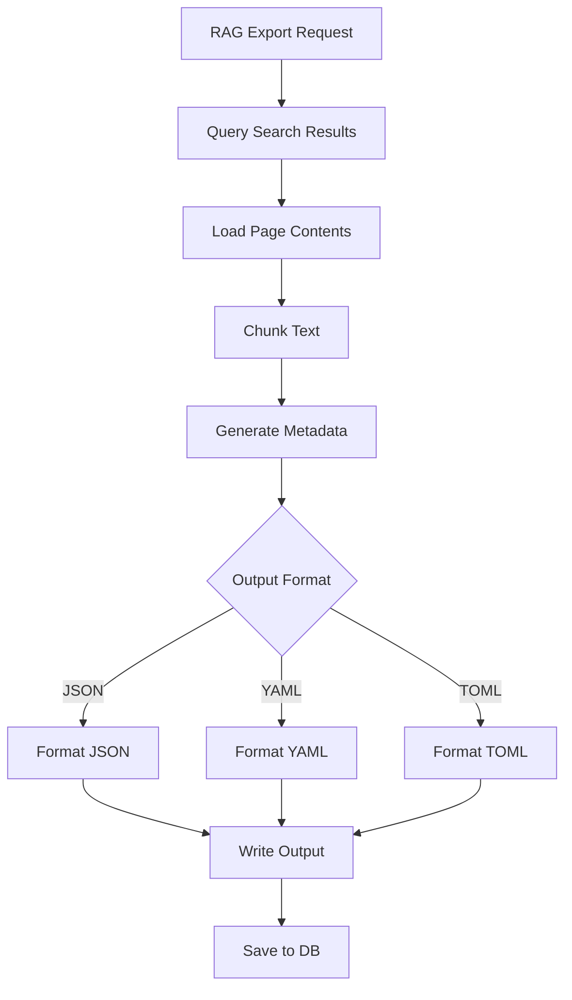

# Component: RAG Export

**Parent:** [Golang Search CLI](./00-overview.md)  
**Version:** 1.2.0  
**Updated:** 2026-01-28  

---

## Acceptance Criteria

| ID | Criterion | Priority | Validation Method |
|----|-----------|----------|-------------------|
| AC-01 | JSON export produces valid JSON per RFC 8259 | MUST | Schema validation test |
| AC-02 | YAML export produces valid YAML 1.2 | MUST | Schema validation test |
| AC-03 | TOML export produces valid TOML v1.0.0 | MUST | Schema validation test |
| AC-04 | All three formats are round-trip compatible | MUST | Unit test (export → import → compare) |
| AC-05 | RAGMemory schema version included in output | MUST | Unit test |
| AC-06 | Text chunking respects configured chunk size (default: 500 tokens) | MUST | Unit test |
| AC-07 | Text chunking applies configured overlap (default: 50 tokens) | SHOULD | Unit test |
| AC-08 | Token estimation within ±20% of actual tokens | SHOULD | Unit test with known text |
| AC-09 | Sentence boundaries preserved during chunking | SHOULD | Unit test |
| AC-10 | Sources include depth from nested search tracking | MUST | Integration test |
| AC-11 | Metadata includes accurate totalSources count | MUST | Unit test |
| AC-12 | Metadata includes accurate totalChunks count | MUST | Unit test |
| AC-13 | Metadata includes accurate totalTokens count | MUST | Unit test |
| AC-14 | Unique keywords deduplicated in metadata | MUST | Unit test |
| AC-15 | CLI `rag --format` accepts json, yaml, toml | MUST | CLI test |
| AC-16 | CLI `rag --output` writes to specified file path | MUST | CLI test |
| AC-17 | CLI without --output writes to stdout | MUST | CLI test |
| AC-18 | Export saved to RagMemory table in database | MUST | Integration test |
| AC-19 | Date range filters (--since, --until) work correctly | MUST | Integration test |
| AC-20 | Engine filter (--engines) limits sources | MUST | Integration test |
| AC-21 | Export generation completes within 5s for 1000 sources | SHOULD | Performance test |

---

## Summary

Generate RAG-compatible memory exports from search results in JSON, YAML, and TOML formats for consumption by the main application's AI pipeline.

---

## Architecture



---

## RAG Memory Schema

```go
package rag

type RAGMemory struct {
    Version     string            `json:"version" yaml:"version" toml:"version"`
    GeneratedAt time.Time         `json:"generatedAt" yaml:"generatedAt" toml:"generatedAt"`
    Query       RAGQuery          `json:"query" yaml:"query" toml:"query"`
    Sources     []RAGSource       `json:"sources" yaml:"sources" toml:"sources"`
    Chunks      []RAGChunk        `json:"chunks" yaml:"chunks" toml:"chunks"`
    Metadata    RAGMetadata       `json:"metadata" yaml:"metadata" toml:"metadata"`
}

type RAGQuery struct {
    Keywords  []string  `json:"keywords" yaml:"keywords" toml:"keywords"`
    DateRange DateRange `json:"dateRange" yaml:"dateRange" toml:"dateRange"`
    Filters   Filters   `json:"filters" yaml:"filters" toml:"filters"`
}

type DateRange struct {
    Start time.Time `json:"start" yaml:"start" toml:"start"`
    End   time.Time `json:"end" yaml:"end" toml:"end"`
}

type Filters struct {
    Engines   []string `json:"engines" yaml:"engines" toml:"engines"`
    MinDepth  int      `json:"minDepth" yaml:"minDepth" toml:"minDepth"`
    MaxDepth  int      `json:"maxDepth" yaml:"maxDepth" toml:"maxDepth"`
}

type RAGSource struct {
    ID          string    `json:"id" yaml:"id" toml:"id"`
    URL         string    `json:"url" yaml:"url" toml:"url"`
    Title       string    `json:"title" yaml:"title" toml:"title"`
    Description string    `json:"description" yaml:"description" toml:"description"`
    SearchedAt  time.Time `json:"searchedAt" yaml:"searchedAt" toml:"searchedAt"`
    Keywords    []string  `json:"keywords" yaml:"keywords" toml:"keywords"`
    Depth       int       `json:"depth" yaml:"depth" toml:"depth"`
}

type RAGChunk struct {
    ID        string   `json:"id" yaml:"id" toml:"id"`
    SourceID  string   `json:"sourceId" yaml:"sourceId" toml:"sourceId"`
    Content   string   `json:"content" yaml:"content" toml:"content"`
    Position  int      `json:"position" yaml:"position" toml:"position"`
    TokenCount int     `json:"tokenCount" yaml:"tokenCount" toml:"tokenCount"`
    Relevance float64  `json:"relevance" yaml:"relevance" toml:"relevance"`
}

type RAGMetadata struct {
    TotalSources    int      `json:"totalSources" yaml:"totalSources" toml:"totalSources"`
    TotalChunks     int      `json:"totalChunks" yaml:"totalChunks" toml:"totalChunks"`
    TotalTokens     int      `json:"totalTokens" yaml:"totalTokens" toml:"totalTokens"`
    UniqueKeywords  []string `json:"uniqueKeywords" yaml:"uniqueKeywords" toml:"uniqueKeywords"`
    EnginesUsed     []string `json:"enginesUsed" yaml:"enginesUsed" toml:"enginesUsed"`
    CoverageDepth   int      `json:"coverageDepth" yaml:"coverageDepth" toml:"coverageDepth"`
}
```

---

## Implementation

### RAG Export Service

```go
package rag

import (
    "context"
    "encoding/json"
    "fmt"
    "os"
    "time"
    
    "github.com/pelletier/go-toml/v2"
    "gopkg.in/yaml.v3"
)

type ExportService struct {
    db       *database.DB
    chunker  *TextChunker
}

func NewExportService(db *database.DB) *ExportService {
    return &ExportService{
        db:      db,
        chunker: NewTextChunker(500, 50), // 500 tokens, 50 overlap
    }
}

type ExportOptions struct {
    Keywords   []string
    Since      time.Time
    Until      time.Time
    Limit      int
    Format     string // json, yaml, toml
    OutputPath string // empty for stdout
    Engines    []string
    MaxDepth   int
}
```

### Export Generation

```go
func (s *ExportService) Generate(ctx context.Context, opts ExportOptions) (*RAGMemory, error) {
    // Query search results
    searches, err := s.db.QuerySearches(opts)
    if err != nil {
        return nil, fmt.Errorf("query searches: %w", err)
    }
    
    // Build sources and collect content
    var sources []RAGSource
    var allContent []ContentItem
    uniqueKeywords := make(map[string]bool)
    enginesUsed := make(map[string]bool)
    
    for _, search := range searches {
        results, _ := s.db.GetResultsWithContent(search.Id)
        enginesUsed[search.Engine] = true
        
        for _, kw := range strings.Fields(search.Keywords) {
            uniqueKeywords[kw] = true
        }
        
        for _, result := range results {
            source := RAGSource{
                ID:          result.Id,
                URL:         result.Url,
                Title:       result.Title,
                Description: result.Description,
                SearchedAt:  result.FetchedAt,
                Keywords:    strings.Fields(search.Keywords),
                Depth:       s.getSearchDepth(search.Id),
            }
            sources = append(sources, source)
            
            if result.PageContent != nil {
                allContent = append(allContent, ContentItem{
                    SourceID: result.Id,
                    Text:     result.PageContent.ExtractedText,
                })
            }
        }
    }
    
    // Chunk content
    chunks := s.chunkContent(allContent)
    
    // Build metadata
    metadata := RAGMetadata{
        TotalSources:   len(sources),
        TotalChunks:    len(chunks),
        TotalTokens:    s.countTotalTokens(chunks),
        UniqueKeywords: mapKeys(uniqueKeywords),
        EnginesUsed:    mapKeys(enginesUsed),
        CoverageDepth:  s.maxDepth(sources),
    }
    
    return &RAGMemory{
        Version:     "1.0",
        GeneratedAt: time.Now(),
        Query: RAGQuery{
            Keywords:  opts.Keywords,
            DateRange: DateRange{Start: opts.Since, End: opts.Until},
            Filters:   Filters{Engines: opts.Engines, MaxDepth: opts.MaxDepth},
        },
        Sources:  sources,
        Chunks:   chunks,
        Metadata: metadata,
    }, nil
}

func (s *ExportService) getSearchDepth(searchId string) int {
    nested, _ := s.db.GetNestedSearchByChild(searchId)
    if nested == nil {
        return 0
    }
    return nested.Depth
}
```

### Text Chunking

```go
type TextChunker struct {
    chunkSize int
    overlap   int
}

func NewTextChunker(chunkSize, overlap int) *TextChunker {
    return &TextChunker{
        chunkSize: chunkSize,
        overlap:   overlap,
    }
}

type ContentItem struct {
    SourceID string
    Text     string
}

func (c *TextChunker) chunkContent(items []ContentItem) []RAGChunk {
    var chunks []RAGChunk
    chunkID := 0
    
    for _, item := range items {
        sentences := c.splitSentences(item.Text)
        
        var currentChunk strings.Builder
        currentTokens := 0
        position := 0
        
        for _, sentence := range sentences {
            sentenceTokens := c.estimateTokens(sentence)
            
            if currentTokens+sentenceTokens > c.chunkSize && currentTokens > 0 {
                // Save current chunk
                chunks = append(chunks, RAGChunk{
                    ID:         fmt.Sprintf("chunk_%d", chunkID),
                    SourceID:   item.SourceID,
                    Content:    strings.TrimSpace(currentChunk.String()),
                    Position:   position,
                    TokenCount: currentTokens,
                    Relevance:  1.0, // Can be adjusted with scoring
                })
                chunkID++
                position++
                
                // Start new chunk with overlap
                currentChunk.Reset()
                currentTokens = 0
                
                // Add overlap from previous sentences
                // (simplified - just continue)
            }
            
            currentChunk.WriteString(sentence)
            currentChunk.WriteString(" ")
            currentTokens += sentenceTokens
        }
        
        // Save remaining content
        if currentTokens > 0 {
            chunks = append(chunks, RAGChunk{
                ID:         fmt.Sprintf("chunk_%d", chunkID),
                SourceID:   item.SourceID,
                Content:    strings.TrimSpace(currentChunk.String()),
                Position:   position,
                TokenCount: currentTokens,
                Relevance:  1.0,
            })
            chunkID++
        }
    }
    
    return chunks
}

func (c *TextChunker) splitSentences(text string) []string {
    // Simple sentence splitting
    re := regexp.MustCompile(`[.!?]+\s+`)
    return re.Split(text, -1)
}

func (c *TextChunker) estimateTokens(text string) int {
    // Rough estimate: ~4 characters per token
    return len(text) / 4
}
```

### Output Formatting

```go
func (s *ExportService) Export(ctx context.Context, opts ExportOptions) error {
    memory, err := s.Generate(ctx, opts)
    if err != nil {
        return err
    }
    
    var output []byte
    
    switch opts.Format {
    case "json":
        output, err = json.MarshalIndent(memory, "", "  ")
    case "yaml":
        output, err = yaml.Marshal(memory)
    case "toml":
        output, err = toml.Marshal(memory)
    default:
        return fmt.Errorf("unsupported format: %s", opts.Format)
    }
    
    if err != nil {
        return fmt.Errorf("marshal: %w", err)
    }
    
    // Write output
    if opts.OutputPath == "" {
        fmt.Println(string(output))
    } else {
        err = os.WriteFile(opts.OutputPath, output, 0644)
        if err != nil {
            return fmt.Errorf("write file: %w", err)
        }
    }
    
    // Save to database
    return s.saveToDb(memory, opts.Format)
}

func (s *ExportService) saveToDb(memory *RAGMemory, format string) error {
    content, _ := json.Marshal(memory)
    
    ragMemory := &models.RagMemory{
        Content:     string(content),
        Format:      format,
        GeneratedAt: time.Now(),
    }
    
    return s.db.Create(ragMemory).Error
}
```

---

## Output Examples

### JSON Format

```json
{
  "version": "1.0",
  "generatedAt": "2026-01-28T12:00:00Z",
  "query": {
    "keywords": ["machine learning", "AI"],
    "dateRange": {
      "start": "2026-01-01T00:00:00Z",
      "end": "2026-01-28T00:00:00Z"
    }
  },
  "sources": [
    {
      "id": "src_001",
      "url": "https://example.com/ml-guide",
      "title": "Complete Machine Learning Guide",
      "description": "A comprehensive introduction to ML...",
      "searchedAt": "2026-01-28T10:00:00Z",
      "keywords": ["machine learning"],
      "depth": 0
    }
  ],
  "chunks": [
    {
      "id": "chunk_0",
      "sourceId": "src_001",
      "content": "Machine learning is a subset of artificial intelligence...",
      "position": 0,
      "tokenCount": 150,
      "relevance": 1.0
    }
  ],
  "metadata": {
    "totalSources": 25,
    "totalChunks": 150,
    "totalTokens": 22500,
    "uniqueKeywords": ["machine learning", "AI", "neural network"],
    "enginesUsed": ["google", "duckduckgo"],
    "coverageDepth": 2
  }
}
```

### YAML Format

```yaml
version: "1.0"
generatedAt: 2026-01-28T12:00:00Z
query:
  keywords:
    - machine learning
    - AI
sources:
  - id: src_001
    url: https://example.com/ml-guide
    title: Complete Machine Learning Guide
    depth: 0
chunks:
  - id: chunk_0
    sourceId: src_001
    content: "Machine learning is a subset of artificial intelligence..."
    tokenCount: 150
metadata:
  totalSources: 25
  totalChunks: 150
```

### TOML Format

```toml
version = "1.0"
generatedAt = 2026-01-28T12:00:00Z

[query]
keywords = ["machine learning", "AI"]

[[sources]]
id = "src_001"
url = "https://example.com/ml-guide"
title = "Complete Machine Learning Guide"
depth = 0

[[chunks]]
id = "chunk_0"
sourceId = "src_001"
content = "Machine learning is a subset of artificial intelligence..."
tokenCount = 150

[metadata]
totalSources = 25
totalChunks = 150
```

---

## CLI Commands

```bash
# Export all recent searches as JSON
gsearch rag --format json --output ./rag-memory.json

# Export specific keywords as YAML
gsearch rag --format yaml --keywords "AI,ML" --output ./ai-memory.yaml

# Export to stdout
gsearch rag --format json --since 2026-01-01

# Export with filters
gsearch rag --format toml --engines google,bing --max-depth 2
```

---

## Integration with Main App

The main application reads RAG exports via:

```go
// In main application
func LoadRAGMemory(path string) (*RAGMemory, error) {
    data, err := os.ReadFile(path)
    if err != nil {
        return nil, err
    }
    
    var memory RAGMemory
    
    ext := filepath.Ext(path)
    switch ext {
    case ".json":
        err = json.Unmarshal(data, &memory)
    case ".yaml", ".yml":
        err = yaml.Unmarshal(data, &memory)
    case ".toml":
        err = toml.Unmarshal(data, &memory)
    }
    
    return &memory, err
}

// Inject into AI context
func InjectRAGContext(memory *RAGMemory, prompt string) string {
    var context strings.Builder
    
    for _, chunk := range memory.Chunks {
        if chunk.Relevance > 0.5 {
            context.WriteString(chunk.Content)
            context.WriteString("\n\n")
        }
    }
    
    return fmt.Sprintf("Context:\n%s\n\nQuestion: %s", context.String(), prompt)
}
```

---

## Related Specs

- [Database Schema](./03-database-schema.md) — RagMemory model
- [Knowledge Memory](../09-knowledge-memory/00-overview.md) — Main app RAG system
- [CLI Framework](./01-cli-framework.md) — RAG commands
