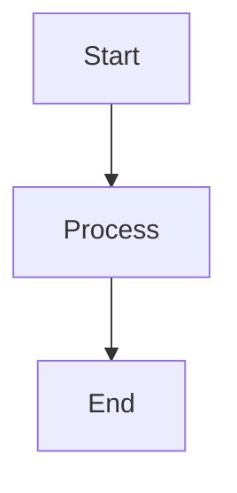

# Preview Renderer Component

**Version:** 1.0.0  
**Status:** Planned  
**Updated:** 2026-01-28  

---

## Overview

Markdown-to-HTML rendering engine with live preview, syntax highlighting for code blocks, and spec-aware enhancements.

**Cross-References:**
- [Spec Editor Overview](./00-overview.md)
- [Markdown Editor](./01-markdown-editor.md)
- [Coding Guidelines](../../04-coding-guidelines/00-overview.md)

---

## Features

| Feature | Description | Priority |
|---------|-------------|----------|
| Live Preview | Real-time markdown rendering | High |
| Split View | Side-by-side editor and preview | High |
| Code Highlighting | Syntax highlighting via Shiki/Prism | High |
| Mermaid Diagrams | Render mermaid code blocks as diagrams | Medium |
| Table of Contents | Auto-generated from headings | Medium |
| Link Validation | Visual indicators for broken links | Low |
| Scroll Sync | Synchronized scrolling with editor | Medium |

---

## Component Structure

```
PreviewRenderer/
├── PreviewRenderer.tsx       # Main preview component
├── PreviewToolbar.tsx        # View mode toggle, TOC button
├── TableOfContents.tsx       # Auto-generated navigation
├── CodeBlock.tsx             # Syntax-highlighted code
├── MermaidDiagram.tsx        # Mermaid rendering
├── useMarkdownParser.ts      # Markdown parsing hook
└── previewStyles.css         # Preview-specific styles
```

---

## Props Interface

```typescript
interface PreviewRendererProps {
  /** Markdown content to render */
  content: string;
  /** View mode */
  mode: 'preview' | 'split' | 'editor';
  /** Show table of contents */
  showToc?: boolean;
  /** Scroll position sync callback */
  onScroll?: (position: number) => void;
  /** Current scroll position from editor */
  scrollPosition?: number;
  /** Base path for relative links */
  basePath?: string;
  /** Link click handler */
  onLinkClick?: (href: string) => void;
}
```

---

## View Modes

| Mode | Layout | Use Case |
|------|--------|----------|
| `editor` | Editor only (100%) | Focused writing |
| `split` | Editor (50%) + Preview (50%) | Default editing |
| `preview` | Preview only (100%) | Review/reading |

Toggle via toolbar or keyboard shortcut (Ctrl+Shift+P).

---

## Markdown Parsing Pipeline

```typescript
// useMarkdownParser.ts
import { unified } from 'unified';
import remarkParse from 'remark-parse';
import remarkGfm from 'remark-gfm';
import remarkRehype from 'remark-rehype';
import rehypeHighlight from 'rehype-highlight';
import rehypeSanitize from 'rehype-sanitize';
import rehypeStringify from 'rehype-stringify';

const processor = unified()
  .use(remarkParse)
  .use(remarkGfm)              // Tables, strikethrough, etc.
  .use(remarkRehype)
  .use(rehypeSanitize)         // Security: sanitize HTML
  .use(rehypeHighlight)        // Code syntax highlighting
  .use(rehypeStringify);
```

---

## Code Block Rendering

```typescript
interface CodeBlockProps {
  language: string;
  code: string;
  showLineNumbers?: boolean;
  highlightLines?: number[];
}

// Supported languages (via Shiki/Prism)
const supportedLanguages = [
  'javascript', 'typescript', 'python', 'go',
  'json', 'yaml', 'markdown', 'sql', 'bash',
  'html', 'css', 'rust', 'java', 'c', 'cpp'
];
```

---

## Mermaid Diagram Support

Render mermaid code blocks as interactive diagrams:

````markdown

````

```typescript
// MermaidDiagram.tsx
interface MermaidDiagramProps {
  code: string;
  theme?: 'default' | 'dark' | 'forest';
}

// Lazy-load mermaid library
// Render to SVG
// Handle parse errors gracefully
```

---

## Table of Contents

Auto-generated from document headings:

```typescript
interface TocItem {
  id: string;
  text: string;
  level: 1 | 2 | 3 | 4 | 5 | 6;
  children: TocItem[];
}

// Extract headings during parse
// Generate anchor IDs
// Render collapsible tree
// Highlight current section on scroll
```

---

## Scroll Synchronization

```typescript
// Bidirectional scroll sync between editor and preview
interface ScrollSync {
  // Map editor line numbers to preview positions
  lineToPosition: Map<number, number>;
  
  // Throttle scroll events (16ms = 60fps)
  throttleMs: 16;
  
  // Sync modes
  mode: 'editor-to-preview' | 'preview-to-editor' | 'both';
}
```

---

## Link Handling

| Link Type | Behavior |
|-----------|----------|
| Internal (`./file.md`) | Navigate within app |
| External (`https://...`) | Open in new tab |
| Anchor (`#section`) | Smooth scroll |
| Broken link | Show warning indicator |

```typescript
// Link validation during render
interface LinkStatus {
  href: string;
  valid: boolean;
  type: 'internal' | 'external' | 'anchor';
}
```

---

## Performance Optimization

- **Debounced rendering** — Wait 100ms after typing stops
- **Virtual scrolling** — For very long documents
- **Memoized parsing** — Cache AST between renders
- **Lazy code highlighting** — Highlight visible blocks first

---

## Accessibility

- Semantic HTML output (`<article>`, `<section>`, `<nav>`)
- Skip-to-content link
- Keyboard navigation for TOC
- Reduced motion support for scroll sync
- Alt text validation for images

---

## Styling

Preview uses design system tokens:

```css
.preview-content {
  font-family: var(--font-prose);
  color: hsl(var(--foreground));
  background: hsl(var(--background));
}

.preview-content h1 {
  color: hsl(var(--primary));
  border-bottom: 1px solid hsl(var(--border));
}

.preview-content code {
  background: hsl(var(--muted));
  padding: 0.2em 0.4em;
  border-radius: var(--radius);
}
```

---

## Related Specs

- [Markdown Editor](./01-markdown-editor.md)
- [Diagrams](../../09-diagrams/00-overview.md)
- [Coding Guidelines](../../04-coding-guidelines/00-overview.md)
