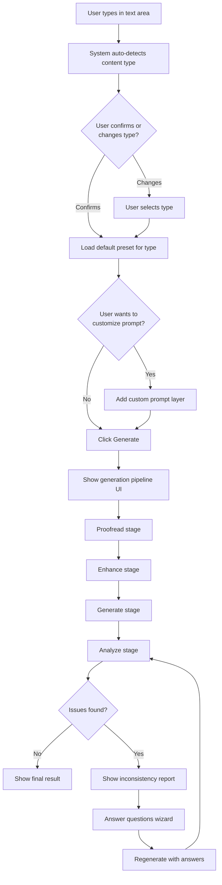
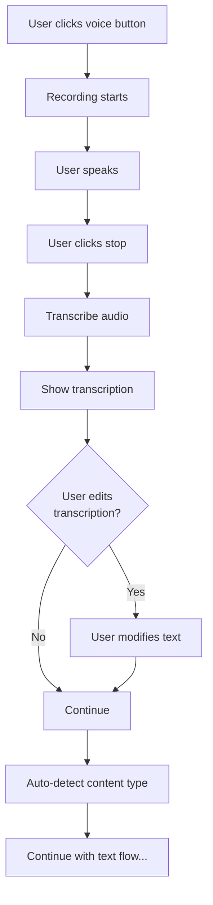
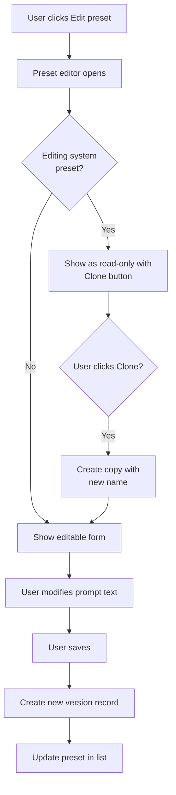
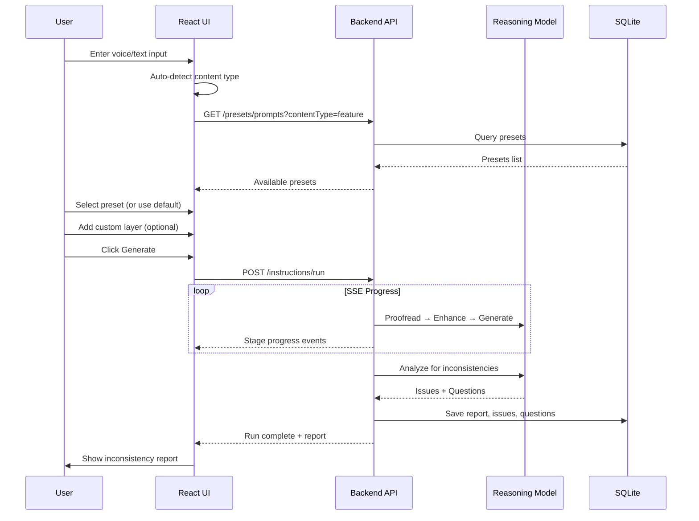
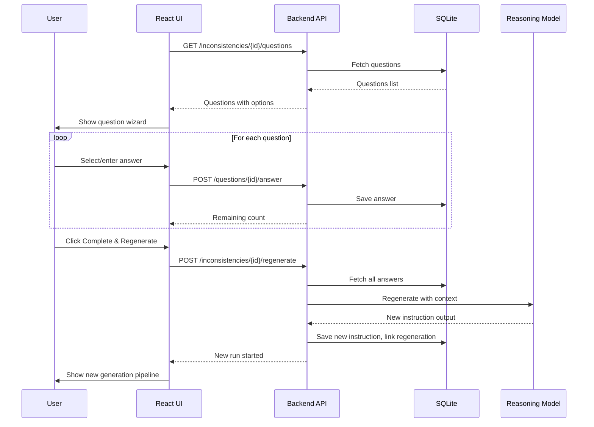

# Instruction Builder UI Specification

**Version**: 1.0.0  
**Status**: Draft  
**Last Updated**: 2026-01-27  

---

## Overview

This document specifies the React frontend UI for the Instruction Builder system. The UI enables users to:

1. Provide voice or text input at project or file level
2. Select or auto-detect content type
3. Choose prompt presets and add customizations
4. View generation progress and results
5. Answer clarification questions
6. Trigger regeneration with answers

---

## Table of Contents

1. [Component Architecture](#component-architecture)
2. [Input Entry UI](#input-entry-ui)
3. [Content Type Selector](#content-type-selector)
4. [Preset Selector & Editor](#preset-selector--editor)
5. [Generation Pipeline UI](#generation-pipeline-ui)
6. [Inconsistency Report View](#inconsistency-report-view)
7. [Question Wizard UI](#question-wizard-ui)
8. [History View](#history-view)
9. [UI Flows](#ui-flows)
10. [Diagrams](#diagrams)
11. [Acceptance Criteria](#acceptance-criteria)

---

## Component Architecture

### Component Tree

```
InstructionBuilder/
├── InstructionInputPanel/
│   ├── VoiceInputButton
│   ├── TextInputArea
│   └── ContentTypeSelector
├── PresetPanel/
│   ├── PresetSelector
│   ├── PresetEditor
│   └── CustomPromptInput
├── GenerationPipeline/
│   ├── StageProgress
│   ├── StageOutput
│   └── ResultPreview
├── InconsistencyReport/
│   ├── IssueList
│   ├── IssueCard
│   └── PhaseTabs
├── QuestionWizard/
│   ├── QuestionCard
│   ├── AnswerControls/
│   │   ├── RadioAnswer
│   │   ├── CheckboxAnswer
│   │   ├── TextAnswer
│   │   ├── DropdownAnswer
│   │   └── MultiSelectAnswer
│   └── WizardNavigation
└── InstructionHistory/
    ├── HistoryTimeline
    ├── RegenerationChain
    └── PresetVersionHistory
```

### State Management

```typescript
interface InstructionBuilderState {
  // Input state
  inputMode: 'voice' | 'text';
  rawInput: string;
  isRecording: boolean;
  transcription: string | null;
  
  // Content type
  contentType: ContentType | null;
  isAutoDetected: boolean;
  autoDetectConfidence: number;
  
  // Preset state
  selectedPresetId: string | null;
  customPromptLayer: string;
  overrideMode: 'append' | 'replace' | null;
  
  // Generation state
  runId: string | null;
  runStatus: RunStatus;
  stages: StageProgress[];
  finalOutput: string | null;
  
  // Inconsistency state
  report: InconsistencyReport | null;
  questions: ClarificationQuestion[];
  answers: Map<string, AnswerValue>;
  
  // UI state
  activePanel: 'input' | 'generation' | 'questions' | 'result';
  expandedIssueId: string | null;
}

type ContentType = 'idea' | 'feature' | 'task' | 'codingGuideline' | 'instruction';

type RunStatus = 
  | 'idle'
  | 'transcribing'
  | 'proofreading'
  | 'enhancing'
  | 'generating'
  | 'analyzing'
  | 'completed'
  | 'failed';
```

---

## Input Entry UI

### Location

The input entry UI appears in two locations:

1. **Project Level**: Top of the project dashboard, always visible
2. **File Level**: In the file editor toolbar, for file-scoped instructions

### Design

```
┌─────────────────────────────────────────────────────────────────────────────┐
│  ╔═══════════════════════════════════════════════════════════════════════╗  │
│  ║  🎤 Voice  │  📝 Text                                                  ║  │
│  ╠═══════════════════════════════════════════════════════════════════════╣  │
│  ║                                                                       ║  │
│  ║  ┌─────────────────────────────────────────────────────────────────┐  ║  │
│  ║  │ Describe what you want to build or change...                   │  ║  │
│  ║  │                                                                 │  ║  │
│  ║  │                                                                 │  ║  │
│  ║  └─────────────────────────────────────────────────────────────────┘  ║  │
│  ║                                                                       ║  │
│  ║  Content Type: [Auto-detect ▼] ──────────► [Feature detected 87%]     ║  │
│  ║                                                                       ║  │
│  ║  Preset: [Base Feature Spec ▼] ───────────┬─ [Customize ⚙️]           ║  │
│  ║                                            └─ Using: System default   ║  │
│  ║                                                                       ║  │
│  ║  [ Cancel ]                                        [ Generate →]      ║  │
│  ╚═══════════════════════════════════════════════════════════════════════╝  │
└─────────────────────────────────────────────────────────────────────────────┘
```

### Voice Input Mode

```
┌─────────────────────────────────────────────────────────────────────────────┐
│  ╔═══════════════════════════════════════════════════════════════════════╗  │
│  ║  🎤 Voice  │  📝 Text                                                  ║  │
│  ╠═══════════════════════════════════════════════════════════════════════╣  │
│  ║                                                                       ║  │
│  ║                      ┌──────────────────┐                             ║  │
│  ║                      │                  │                             ║  │
│  ║                      │   ◉ Recording    │     ⏱️ 0:12                  ║  │
│  ║                      │   ▁▃▅▇▅▃▁▃▅▇▅▃▁  │                             ║  │
│  ║                      │                  │                             ║  │
│  ║                      └──────────────────┘                             ║  │
│  ║                                                                       ║  │
│  ║                      [ Stop & Transcribe ]                            ║  │
│  ╚═══════════════════════════════════════════════════════════════════════╝  │
└─────────────────────────────────────────────────────────────────────────────┘
```

### Component: VoiceInputButton

```tsx
interface VoiceInputButtonProps {
  isRecording: boolean;
  duration: number;
  audioLevel: number;  // 0-1 for waveform visualization
  onStartRecording: () => void;
  onStopRecording: () => void;
  disabled?: boolean;
}

function VoiceInputButton({
  isRecording,
  duration,
  audioLevel,
  onStartRecording,
  onStopRecording,
  disabled
}: VoiceInputButtonProps) {
  return (
    <div className="flex flex-col items-center gap-4">
      {isRecording ? (
        <>
          <div className="relative w-24 h-24 rounded-full bg-destructive/10 flex items-center justify-center">
            <div 
              className="absolute inset-0 rounded-full bg-destructive/20 animate-pulse"
              style={{ transform: `scale(${1 + audioLevel * 0.3})` }}
            />
            <Mic className="w-8 h-8 text-destructive" />
          </div>
          <WaveformVisualizer level={audioLevel} />
          <span className="text-sm text-muted-foreground">
            {formatDuration(duration)}
          </span>
          <Button variant="destructive" onClick={onStopRecording}>
            Stop & Transcribe
          </Button>
        </>
      ) : (
        <Button
          size="lg"
          variant="outline"
          onClick={onStartRecording}
          disabled={disabled}
          className="w-24 h-24 rounded-full"
        >
          <Mic className="w-8 h-8" />
        </Button>
      )}
    </div>
  );
}
```

### Component: TextInputArea

```tsx
interface TextInputAreaProps {
  value: string;
  onChange: (value: string) => void;
  placeholder?: string;
  disabled?: boolean;
  maxLength?: number;
}

function TextInputArea({
  value,
  onChange,
  placeholder = "Describe what you want to build or change...",
  disabled,
  maxLength = 10000
}: TextInputAreaProps) {
  return (
    <div className="relative">
      <Textarea
        value={value}
        onChange={(e) => onChange(e.target.value)}
        placeholder={placeholder}
        disabled={disabled}
        maxLength={maxLength}
        className="min-h-[120px] resize-y"
      />
      <span className="absolute bottom-2 right-2 text-xs text-muted-foreground">
        {value.length}/{maxLength}
      </span>
    </div>
  );
}
```

---

## Content Type Selector

### Design

```
┌────────────────────────────────────────────────────────────────┐
│ Content Type                                                   │
├────────────────────────────────────────────────────────────────┤
│                                                                │
│  ┌─────────┐ ┌─────────┐ ┌─────────┐ ┌─────────┐ ┌──────────┐  │
│  │  💡     │ │  ✨     │ │  ✓      │ │  📖     │ │  🤖      │  │
│  │  Idea   │ │ Feature │ │  Task   │ │Guideline│ │Instruction│  │
│  │         │ │ ✓ 87%   │ │         │ │         │ │          │  │
│  └─────────┘ └─────────┘ └─────────┘ └─────────┘ └──────────┘  │
│                                                                │
│  ℹ️ Auto-detected as Feature based on: "user should", "when"   │
│                                                                │
└────────────────────────────────────────────────────────────────┘
```

### Component: ContentTypeSelector

```tsx
interface ContentTypeSelectorProps {
  value: ContentType | null;
  onChange: (type: ContentType) => void;
  autoDetectedType: ContentType | null;
  autoDetectConfidence: number;
  matchedKeywords: string[];
}

const CONTENT_TYPES: {
  type: ContentType;
  icon: LucideIcon;
  label: string;
  description: string;
}[] = [
  {
    type: 'idea',
    icon: Lightbulb,
    label: 'Idea',
    description: 'Early-stage, unstructured concept'
  },
  {
    type: 'feature',
    icon: Sparkles,
    label: 'Feature',
    description: 'Specific functionality requirement'
  },
  {
    type: 'task',
    icon: CheckSquare,
    label: 'Task',
    description: 'Actionable work item'
  },
  {
    type: 'codingGuideline',
    icon: BookOpen,
    label: 'Guideline',
    description: 'Technical standard or convention'
  },
  {
    type: 'instruction',
    icon: Bot,
    label: 'Instruction',
    description: 'Direct command for AI'
  }
];

function ContentTypeSelector({
  value,
  onChange,
  autoDetectedType,
  autoDetectConfidence,
  matchedKeywords
}: ContentTypeSelectorProps) {
  return (
    <div className="space-y-3">
      <Label>Content Type</Label>
      
      <div className="flex gap-2 flex-wrap">
        {CONTENT_TYPES.map(({ type, icon: Icon, label }) => (
          <Button
            key={type}
            variant={value === type ? 'default' : 'outline'}
            size="sm"
            onClick={() => onChange(type)}
            className="flex flex-col h-auto py-3 px-4"
          >
            <Icon className="w-5 h-5 mb-1" />
            <span className="text-xs">{label}</span>
            {autoDetectedType === type && (
              <Badge variant="secondary" className="mt-1 text-[10px]">
                {Math.round(autoDetectConfidence * 100)}%
              </Badge>
            )}
          </Button>
        ))}
      </div>
      
      {autoDetectedType && matchedKeywords.length > 0 && (
        <p className="text-xs text-muted-foreground flex items-center gap-1">
          <Info className="w-3 h-3" />
          Auto-detected as {autoDetectedType} based on: "{matchedKeywords.join('", "')}"
        </p>
      )}
    </div>
  );
}
```

---

## Preset Selector & Editor

### Preset Selector Design

```
┌────────────────────────────────────────────────────────────────────────────┐
│ Prompt Preset                                                              │
├────────────────────────────────────────────────────────────────────────────┤
│                                                                            │
│  ┌─────────────────────────────────────────────────────────┐  ┌─────────┐  │
│  │ Base Feature Spec                                    ▼ │  │ ⚙️ Edit │  │
│  └─────────────────────────────────────────────────────────┘  └─────────┘  │
│                                                                            │
│  📋 System preset • Default for Feature type                               │
│                                                                            │
│  ┌─ Preview ─────────────────────────────────────────────────────────────┐ │
│  │ You are an AI assistant that helps create detailed feature specs.     │ │
│  │ When given a feature description, you should:                         │ │
│  │ 1. Define user stories with acceptance criteria                       │ │
│  │ 2. Identify edge cases and error scenarios...                         │ │
│  │ [Show more ▼]                                                         │ │
│  └───────────────────────────────────────────────────────────────────────┘ │
│                                                                            │
└────────────────────────────────────────────────────────────────────────────┘
```

### Custom Prompt Layer Design

```
┌────────────────────────────────────────────────────────────────────────────┐
│ Custom Prompt Layer                                           [Optional]   │
├────────────────────────────────────────────────────────────────────────────┤
│                                                                            │
│  Mode: ○ Append to base preset   ● Replace base preset                     │
│                                                                            │
│  ┌───────────────────────────────────────────────────────────────────────┐ │
│  │ Additionally, ensure all feature specs include:                       │ │
│  │ - Security considerations section                                     │ │
│  │ - Performance requirements                                            │ │
│  │ - GDPR compliance notes if handling user data                         │ │
│  │                                                                       │ │
│  └───────────────────────────────────────────────────────────────────────┘ │
│                                                                            │
│  [ Save as Override ] [ Clear ]                                            │
│                                                                            │
└────────────────────────────────────────────────────────────────────────────┘
```

### Component: PresetSelector

```tsx
interface PresetSelectorProps {
  contentType: ContentType;
  selectedPresetId: string | null;
  onSelect: (presetId: string) => void;
  onEdit: (presetId: string) => void;
}

function PresetSelector({
  contentType,
  selectedPresetId,
  onSelect,
  onEdit
}: PresetSelectorProps) {
  const { data: presets } = useQuery({
    queryKey: ['prompt-presets', contentType],
    queryFn: () => fetchPresets({ contentType })
  });
  
  const selectedPreset = presets?.find(p => p.id === selectedPresetId);
  
  return (
    <div className="space-y-3">
      <div className="flex items-center justify-between">
        <Label>Prompt Preset</Label>
        {selectedPreset && (
          <Button variant="ghost" size="sm" onClick={() => onEdit(selectedPreset.id)}>
            <Settings className="w-4 h-4 mr-1" />
            Edit
          </Button>
        )}
      </div>
      
      <Select value={selectedPresetId || ''} onValueChange={onSelect}>
        <SelectTrigger>
          <SelectValue placeholder="Select a preset..." />
        </SelectTrigger>
        <SelectContent>
          {presets?.map(preset => (
            <SelectItem key={preset.id} value={preset.id}>
              <div className="flex items-center gap-2">
                {preset.isSystemPreset && <Badge variant="outline">System</Badge>}
                {preset.isDefault && <Badge variant="secondary">Default</Badge>}
                <span>{preset.name}</span>
              </div>
            </SelectItem>
          ))}
        </SelectContent>
      </Select>
      
      {selectedPreset && (
        <>
          <p className="text-xs text-muted-foreground flex items-center gap-1">
            {selectedPreset.isSystemPreset ? '📋 System preset' : '👤 User preset'}
            {selectedPreset.isDefault && ' • Default for this type'}
          </p>
          
          <Collapsible>
            <CollapsibleTrigger className="text-sm text-primary hover:underline">
              Preview prompt →
            </CollapsibleTrigger>
            <CollapsibleContent>
              <pre className="mt-2 p-3 bg-muted rounded-md text-xs whitespace-pre-wrap max-h-40 overflow-y-auto">
                {selectedPreset.promptText}
              </pre>
            </CollapsibleContent>
          </Collapsible>
        </>
      )}
    </div>
  );
}
```

### Component: CustomPromptInput

```tsx
interface CustomPromptInputProps {
  value: string;
  onChange: (value: string) => void;
  overrideMode: 'append' | 'replace';
  onOverrideModeChange: (mode: 'append' | 'replace') => void;
  onSaveAsOverride: () => void;
  onClear: () => void;
}

function CustomPromptInput({
  value,
  onChange,
  overrideMode,
  onOverrideModeChange,
  onSaveAsOverride,
  onClear
}: CustomPromptInputProps) {
  return (
    <div className="space-y-3">
      <div className="flex items-center justify-between">
        <Label>Custom Prompt Layer</Label>
        <Badge variant="outline">Optional</Badge>
      </div>
      
      <RadioGroup
        value={overrideMode}
        onValueChange={(v) => onOverrideModeChange(v as 'append' | 'replace')}
        className="flex gap-4"
      >
        <div className="flex items-center space-x-2">
          <RadioGroupItem value="append" id="append" />
          <label htmlFor="append" className="text-sm">Append to base preset</label>
        </div>
        <div className="flex items-center space-x-2">
          <RadioGroupItem value="replace" id="replace" />
          <label htmlFor="replace" className="text-sm">Replace base preset</label>
        </div>
      </RadioGroup>
      
      <Textarea
        value={value}
        onChange={(e) => onChange(e.target.value)}
        placeholder="Add additional instructions or context..."
        className="min-h-[100px]"
      />
      
      <div className="flex gap-2">
        <Button variant="outline" size="sm" onClick={onSaveAsOverride} disabled={!value}>
          Save as Override
        </Button>
        <Button variant="ghost" size="sm" onClick={onClear} disabled={!value}>
          Clear
        </Button>
      </div>
    </div>
  );
}
```

---

## Generation Pipeline UI

### Progress View Design

```
┌────────────────────────────────────────────────────────────────────────────┐
│ Generation Progress                                                        │
├────────────────────────────────────────────────────────────────────────────┤
│                                                                            │
│  ┌──────────┐    ┌──────────┐    ┌──────────┐    ┌──────────┐             │
│  │    ✓     │───▶│    ⏳    │───▶│    ○     │───▶│    ○     │             │
│  │Proofread │    │ Enhance  │    │ Generate │    │ Analyze  │             │
│  │  2.1s    │    │  45%     │    │          │    │          │             │
│  └──────────┘    └──────────┘    └──────────┘    └──────────┘             │
│                                                                            │
│  ┌─ Current Stage: Enhancing ──────────────────────────────────────────┐  │
│  │                                                                      │  │
│  │ Expanding context and adding structure...                            │  │
│  │ ████████████████████████░░░░░░░░░░░░░░░░░░  45%                      │  │
│  │                                                                      │  │
│  └──────────────────────────────────────────────────────────────────────┘  │
│                                                                            │
│  ┌─ Proofread Output ──────────────────────────────────────────────────┐  │
│  │ Create a user authentication system with email/password login,      │  │
│  │ social OAuth providers (Google, GitHub), and session management...  │  │
│  └──────────────────────────────────────────────────────────────────────┘  │
│                                                                            │
│  [ Cancel ]                                                                │
│                                                                            │
└────────────────────────────────────────────────────────────────────────────┘
```

### Component: GenerationPipeline

```tsx
interface GenerationPipelineProps {
  runId: string;
  stages: StageProgress[];
  currentStage: string;
  onCancel: () => void;
}

interface StageProgress {
  name: string;
  status: 'pending' | 'running' | 'completed' | 'failed';
  progress: number;  // 0-1
  output?: string;
  durationMs?: number;
  error?: string;
}

function GenerationPipeline({
  runId,
  stages,
  currentStage,
  onCancel
}: GenerationPipelineProps) {
  return (
    <div className="space-y-6">
      {/* Stage indicators */}
      <div className="flex items-center justify-between">
        {stages.map((stage, index) => (
          <Fragment key={stage.name}>
            <StageIndicator stage={stage} />
            {index < stages.length - 1 && (
              <ChevronRight className="w-4 h-4 text-muted-foreground" />
            )}
          </Fragment>
        ))}
      </div>
      
      {/* Current stage details */}
      {stages.find(s => s.status === 'running') && (
        <Card>
          <CardHeader className="pb-2">
            <CardTitle className="text-sm">
              Current Stage: {currentStage}
            </CardTitle>
          </CardHeader>
          <CardContent>
            <Progress 
              value={stages.find(s => s.status === 'running')?.progress || 0 * 100} 
            />
          </CardContent>
        </Card>
      )}
      
      {/* Completed stage outputs */}
      {stages
        .filter(s => s.status === 'completed' && s.output)
        .map(stage => (
          <Collapsible key={stage.name}>
            <Card>
              <CardHeader className="pb-2">
                <CollapsibleTrigger className="flex items-center justify-between w-full">
                  <CardTitle className="text-sm flex items-center gap-2">
                    <CheckCircle className="w-4 h-4 text-green-500" />
                    {stage.name} Output
                  </CardTitle>
                  <span className="text-xs text-muted-foreground">
                    {(stage.durationMs / 1000).toFixed(1)}s
                  </span>
                </CollapsibleTrigger>
              </CardHeader>
              <CollapsibleContent>
                <CardContent>
                  <pre className="text-sm whitespace-pre-wrap bg-muted p-3 rounded-md">
                    {stage.output}
                  </pre>
                </CardContent>
              </CollapsibleContent>
            </Card>
          </Collapsible>
        ))}
      
      <Button variant="outline" onClick={onCancel}>
        Cancel
      </Button>
    </div>
  );
}
```

---

## Inconsistency Report View

### Design

```
┌────────────────────────────────────────────────────────────────────────────┐
│ Inconsistency Report                                    5 issues found     │
├────────────────────────────────────────────────────────────────────────────┤
│                                                                            │
│  ┌────────────────────────────────────────────────────────────────────────┐│
│  │ Phase A (Critical)  │ Phase B (Conflicts) │ Phase C │ Phase D          ││
│  │        1            │         2           │    1    │    1             ││
│  └────────────────────────────────────────────────────────────────────────┘│
│                                                                            │
│  ┌─ Phase A: Critical Missing Data ────────────────────────────────────┐  │
│  │                                                                      │  │
│  │  ┌────────────────────────────────────────────────────────────────┐  │  │
│  │  │ 🔴 CRITICAL                                                    │  │  │
│  │  │ No user role defined                                           │  │  │
│  │  │                                                                │  │  │
│  │  │ The feature spec does not specify which user roles can         │  │  │
│  │  │ access this functionality.                                     │  │  │
│  │  │                                                                │  │  │
│  │  │ 📍 Location: Section 3: Access Control                         │  │  │
│  │  │                                                                │  │  │
│  │  │ [ Answer Question → ]                                          │  │  │
│  │  └────────────────────────────────────────────────────────────────┘  │  │
│  │                                                                      │  │
│  └──────────────────────────────────────────────────────────────────────┘  │
│                                                                            │
│  [ Answer All Questions (3 required) ]                                     │
│                                                                            │
└────────────────────────────────────────────────────────────────────────────┘
```

### Component: InconsistencyReport

```tsx
interface InconsistencyReportProps {
  report: InconsistencyReport;
  onAnswerQuestion: (issueId: string) => void;
  onAnswerAll: () => void;
}

function InconsistencyReportView({
  report,
  onAnswerQuestion,
  onAnswerAll
}: InconsistencyReportProps) {
  const [activePhase, setActivePhase] = useState<'A' | 'B' | 'C' | 'D'>('A');
  
  const issuesByPhase = useMemo(() => {
    return {
      A: report.issues.filter(i => i.phase === 'A'),
      B: report.issues.filter(i => i.phase === 'B'),
      C: report.issues.filter(i => i.phase === 'C'),
      D: report.issues.filter(i => i.phase === 'D'),
    };
  }, [report.issues]);
  
  const requiredCount = report.issues.filter(
    i => i.questions.some(q => q.isRequired && !q.answer)
  ).length;
  
  return (
    <div className="space-y-4">
      <div className="flex items-center justify-between">
        <h3 className="text-lg font-semibold">Inconsistency Report</h3>
        <Badge variant="outline">{report.totalIssues} issues found</Badge>
      </div>
      
      {/* Phase tabs */}
      <Tabs value={activePhase} onValueChange={(v) => setActivePhase(v as any)}>
        <TabsList className="grid grid-cols-4">
          <TabsTrigger value="A" className="flex flex-col">
            <span>Phase A</span>
            <span className="text-xs text-muted-foreground">Critical ({issuesByPhase.A.length})</span>
          </TabsTrigger>
          <TabsTrigger value="B" className="flex flex-col">
            <span>Phase B</span>
            <span className="text-xs text-muted-foreground">Conflicts ({issuesByPhase.B.length})</span>
          </TabsTrigger>
          <TabsTrigger value="C" className="flex flex-col">
            <span>Phase C</span>
            <span className="text-xs text-muted-foreground">Ambiguous ({issuesByPhase.C.length})</span>
          </TabsTrigger>
          <TabsTrigger value="D" className="flex flex-col">
            <span>Phase D</span>
            <span className="text-xs text-muted-foreground">Optional ({issuesByPhase.D.length})</span>
          </TabsTrigger>
        </TabsList>
        
        {(['A', 'B', 'C', 'D'] as const).map(phase => (
          <TabsContent key={phase} value={phase} className="space-y-4">
            {issuesByPhase[phase].map(issue => (
              <IssueCard
                key={issue.id}
                issue={issue}
                onAnswerQuestion={() => onAnswerQuestion(issue.id)}
              />
            ))}
            {issuesByPhase[phase].length === 0 && (
              <p className="text-center text-muted-foreground py-8">
                No issues in this phase
              </p>
            )}
          </TabsContent>
        ))}
      </Tabs>
      
      {requiredCount > 0 && (
        <Button className="w-full" onClick={onAnswerAll}>
          Answer All Questions ({requiredCount} required)
        </Button>
      )}
    </div>
  );
}
```

---

## Question Wizard UI

### Single Question Card Design

```
┌────────────────────────────────────────────────────────────────────────────┐
│  [Phase A]  [Required]                                        Question 1/5 │
├────────────────────────────────────────────────────────────────────────────┤
│                                                                            │
│  Which user roles should have access to this feature?                      │
│                                                                            │
│  ┌─ Why it matters ───────────────────────────────────────────────────────┐│
│  │ Defines permission requirements and determines UI visibility rules     ││
│  └────────────────────────────────────────────────────────────────────────┘│
│                                                                            │
│  ☑ Administrator                                                           │
│  ☑ Editor                                                                  │
│  ☐ Viewer                                                                  │
│  ☐ Guest                                                                   │
│                                                                            │
│  ┌─ Additional notes (optional) ─────────────────────────────────────────┐ │
│  │ Guests should never have access for security reasons                  │ │
│  └───────────────────────────────────────────────────────────────────────┘ │
│                                                                            │
│  💡 Recommended: Editor                                                    │
│                                                                            │
│  [ Skip ]                                              [ Next Question → ] │
│                                                                            │
└────────────────────────────────────────────────────────────────────────────┘
```

### Component: QuestionWizard

```tsx
interface QuestionWizardProps {
  questions: ClarificationQuestion[];
  answers: Map<string, AnswerValue>;
  onAnswer: (questionId: string, answer: AnswerValue) => void;
  onSkip: (questionId: string) => void;
  onComplete: () => void;
  onBack: () => void;
}

function QuestionWizard({
  questions,
  answers,
  onAnswer,
  onSkip,
  onComplete,
  onBack
}: QuestionWizardProps) {
  const [currentIndex, setCurrentIndex] = useState(0);
  const currentQuestion = questions[currentIndex];
  
  const handleNext = () => {
    if (currentIndex < questions.length - 1) {
      setCurrentIndex(currentIndex + 1);
    } else {
      onComplete();
    }
  };
  
  const handlePrevious = () => {
    if (currentIndex > 0) {
      setCurrentIndex(currentIndex - 1);
    }
  };
  
  const answeredCount = Array.from(answers.values()).filter(a => !a.wasSkipped).length;
  
  return (
    <div className="space-y-6">
      {/* Progress */}
      <div className="flex items-center justify-between">
        <Button variant="ghost" size="sm" onClick={onBack}>
          <ArrowLeft className="w-4 h-4 mr-1" /> Back to Report
        </Button>
        <span className="text-sm text-muted-foreground">
          Question {currentIndex + 1} of {questions.length}
        </span>
      </div>
      
      <Progress value={(answeredCount / questions.length) * 100} />
      
      {/* Question card */}
      <QuestionCard
        question={currentQuestion}
        answer={answers.get(currentQuestion.id)}
        onAnswer={(answer) => onAnswer(currentQuestion.id, answer)}
        onSkip={() => {
          onSkip(currentQuestion.id);
          handleNext();
        }}
      />
      
      {/* Navigation */}
      <div className="flex justify-between">
        <Button
          variant="outline"
          onClick={handlePrevious}
          disabled={currentIndex === 0}
        >
          <ChevronLeft className="w-4 h-4 mr-1" /> Previous
        </Button>
        
        <Button onClick={handleNext}>
          {currentIndex === questions.length - 1 ? (
            <>Complete & Regenerate</>
          ) : (
            <>Next <ChevronRight className="w-4 h-4 ml-1" /></>
          )}
        </Button>
      </div>
    </div>
  );
}
```

### Answer Control Components

```tsx
// Radio Answer
function RadioAnswer({ options, value, onChange }: AnswerControlProps) {
  return (
    <RadioGroup value={value} onValueChange={onChange}>
      {options.map(option => (
        <div key={option.value} className="flex items-center space-x-2">
          <RadioGroupItem value={option.value} id={option.value} />
          <label htmlFor={option.value}>{option.label}</label>
        </div>
      ))}
    </RadioGroup>
  );
}

// Checkbox Answer
function CheckboxAnswer({ options, value, onChange }: AnswerControlProps) {
  const selected = Array.isArray(value) ? value : [];
  
  const toggle = (optionValue: string) => {
    if (selected.includes(optionValue)) {
      onChange(selected.filter(v => v !== optionValue));
    } else {
      onChange([...selected, optionValue]);
    }
  };
  
  return (
    <div className="space-y-2">
      {options.map(option => (
        <div key={option.value} className="flex items-center space-x-2">
          <Checkbox
            id={option.value}
            checked={selected.includes(option.value)}
            onCheckedChange={() => toggle(option.value)}
          />
          <label htmlFor={option.value}>{option.label}</label>
        </div>
      ))}
    </div>
  );
}

// Text Answer
function TextAnswer({ value, onChange, placeholder }: AnswerControlProps) {
  return (
    <Textarea
      value={value || ''}
      onChange={(e) => onChange(e.target.value)}
      placeholder={placeholder || "Enter your answer..."}
      className="min-h-[100px]"
    />
  );
}

// Dropdown Answer
function DropdownAnswer({ options, value, onChange }: AnswerControlProps) {
  return (
    <Select value={value} onValueChange={onChange}>
      <SelectTrigger>
        <SelectValue placeholder="Select an option..." />
      </SelectTrigger>
      <SelectContent>
        {options.map(option => (
          <SelectItem key={option.value} value={option.value}>
            {option.label}
          </SelectItem>
        ))}
      </SelectContent>
    </Select>
  );
}

// Multi-Select Chips Answer
function MultiSelectAnswer({ options, value, onChange }: AnswerControlProps) {
  const selected = Array.isArray(value) ? value : [];
  
  const toggle = (optionValue: string) => {
    if (selected.includes(optionValue)) {
      onChange(selected.filter(v => v !== optionValue));
    } else {
      onChange([...selected, optionValue]);
    }
  };
  
  return (
    <div className="flex flex-wrap gap-2">
      {options.map(option => (
        <Badge
          key={option.value}
          variant={selected.includes(option.value) ? 'default' : 'outline'}
          className="cursor-pointer"
          onClick={() => toggle(option.value)}
        >
          {selected.includes(option.value) && <Check className="w-3 h-3 mr-1" />}
          {option.label}
        </Badge>
      ))}
    </div>
  );
}
```

---

## History View

### Design

```
┌────────────────────────────────────────────────────────────────────────────┐
│ Instruction History                                                        │
├────────────────────────────────────────────────────────────────────────────┤
│                                                                            │
│  ┌─ Today ─────────────────────────────────────────────────────────────┐  │
│  │                                                                      │  │
│  │  ● 14:30  Feature: User authentication system                       │  │
│  │    │      ├─ Regenerated (3 answers provided)                       │  │
│  │    │      └─ Regenerated (2 answers provided)                       │  │
│  │    │                                                                 │  │
│  │  ● 11:15  Task: Add logging to API endpoints                        │  │
│  │    │      └─ Original (completed)                                   │  │
│  │    │                                                                 │  │
│  └──────────────────────────────────────────────────────────────────────┘  │
│                                                                            │
│  ┌─ Yesterday ─────────────────────────────────────────────────────────┐  │
│  │                                                                      │  │
│  │  ● 16:45  Idea: Mobile app companion                                │  │
│  │           └─ Original (in progress)                                  │  │
│  │                                                                      │  │
│  └──────────────────────────────────────────────────────────────────────┘  │
│                                                                            │
│  ┌─ Preset Modifications ──────────────────────────────────────────────┐  │
│  │                                                                      │  │
│  │  Base Feature Spec                                                   │  │
│  │  ├─ v3 (Today 14:25): Added security section requirement            │  │
│  │  ├─ v2 (Jan 25): Improved acceptance criteria format                │  │
│  │  └─ v1 (Jan 20): Initial system preset                              │  │
│  │                                                                      │  │
│  └──────────────────────────────────────────────────────────────────────┘  │
│                                                                            │
└────────────────────────────────────────────────────────────────────────────┘
```

---

## UI Flows

### Flow 1: Text Input to Instruction Generation



### Flow 2: Voice Input to Instruction Generation



### Flow 3: Preset Customization



---

## Diagrams

### Voice/Text to Instruction Pipeline



### Question UI to Regeneration



---

## Acceptance Criteria

### Input Entry UI

- [ ] Voice button starts recording with visual feedback
- [ ] Audio waveform shows real-time levels
- [ ] Stop button triggers transcription
- [ ] Transcription appears in editable text area
- [ ] Text input has character limit and counter
- [ ] Both modes lead to same generation flow

### Content Type Selector

- [ ] Auto-detection runs on input change (debounced)
- [ ] Detected type highlighted with confidence percentage
- [ ] Matched keywords displayed
- [ ] User can override detected type
- [ ] Selection persists when switching input modes

### Preset Selector

- [ ] Presets filtered by selected content type
- [ ] Default preset auto-selected
- [ ] System vs user presets visually distinguished
- [ ] Prompt preview expandable
- [ ] Edit button opens preset editor

### Custom Prompt Layer

- [ ] Append/replace mode toggle works
- [ ] Custom text can be saved as override
- [ ] Override persists across sessions
- [ ] Clear button removes custom layer

### Generation Pipeline

- [ ] Stage indicators show correct status
- [ ] Progress bar updates in real-time
- [ ] Completed stage outputs expandable
- [ ] Duration displayed for each stage
- [ ] Cancel button stops generation
- [ ] Failed stage shows error message

### Inconsistency Report

- [ ] Phase tabs show correct counts
- [ ] Issues grouped by phase
- [ ] Severity badges color-coded
- [ ] Location links scroll to content (if applicable)
- [ ] Answer button navigates to question

### Question Wizard

- [ ] Questions display in order by phase
- [ ] All answer types render correct controls
- [ ] Required questions marked clearly
- [ ] Skip button available for optional
- [ ] Recommended answer highlighted
- [ ] Additional notes field works
- [ ] Navigation shows current/total
- [ ] Complete button triggers regeneration

### History View

- [ ] Instructions grouped by date
- [ ] Regeneration chains visible
- [ ] Preset version history accessible
- [ ] Click to view instruction details
- [ ] Filter by content type works

---

## Related Specs

- [Instruction System](./03-instruction-system.md)
- [Voice Input](../05-voice-input/00-overview.md)
- [AI Chat UI](./08-ai-chat-ui.md)
- [Theme System](../10-theme-system/00-overview.md)
