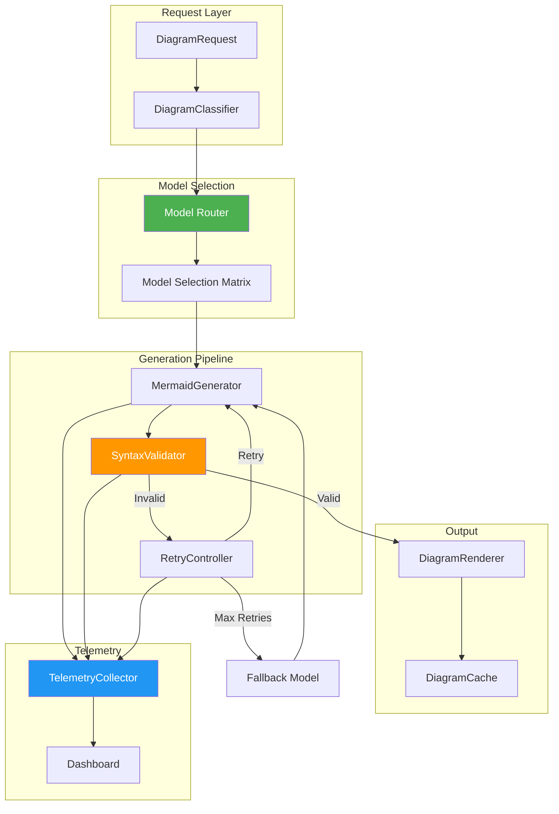

# Mermaid Diagram Generation System

**Version:** 1.0.0  
**Status:** Planned  
**Updated:** 2026-01-30  

---

## Overview

Automated generation of architectural diagrams using Mermaid syntax with intelligent model selection, syntax validation, and retry logic. Integrates with the Model Router and Telemetry Dashboard for performance tracking.

---

## Architecture



---

## Data Models

### Enums

```typescript
enum MermaidDiagramType {
  FLOWCHART = "FLOWCHART",
  SEQUENCE = "SEQUENCE",
  CLASS = "CLASS",
  STATE = "STATE",
  ER = "ER",
  GANTT = "GANTT",
  PIE = "PIE",
  JOURNEY = "JOURNEY",
  MINDMAP = "MINDMAP",
  TIMELINE = "TIMELINE",
  QUADRANT = "QUADRANT",
  GIT = "GIT"
}

enum DiagramComplexity {
  SIMPLE = "SIMPLE",     // < 10 nodes
  MEDIUM = "MEDIUM",     // 10-25 nodes
  COMPLEX = "COMPLEX",   // 25-50 nodes
  EXTREME = "EXTREME"    // > 50 nodes
}

enum GenerationStatus {
  PENDING = "PENDING",
  GENERATING = "GENERATING",
  VALIDATING = "VALIDATING",
  RETRYING = "RETRYING",
  SUCCESS = "SUCCESS",
  FAILED = "FAILED"
}
```

### Interfaces

```typescript
interface DiagramGenerationRequest {
  readonly id: string;
  readonly type: MermaidDiagramType;
  readonly description: string;
  readonly context?: string;
  readonly preferredModel?: string;
  readonly maxRetries?: number;        // Default: 3
  readonly temperature?: number;       // Default: 0.3
  readonly requestedAt: Date;
}

interface DiagramGenerationResult {
  readonly id: string;
  readonly requestId: string;
  readonly success: boolean;
  readonly status: GenerationStatus;
  readonly mermaidCode: string;
  readonly modelUsed: string;
  readonly attempts: number;
  readonly validationErrors?: readonly string[];
  readonly generatedAt: Date;
  readonly durationMs: number;
}

interface ModelSelectionEntry {
  readonly diagramType: MermaidDiagramType;
  readonly complexity: DiagramComplexity;
  readonly primaryModel: string;
  readonly fallbackModel: string;
  readonly maxTokens: number;
  readonly temperature: number;
}

interface DiagramTelemetryEvent {
  readonly eventType: DiagramTelemetryEventType;
  readonly requestId: string;
  readonly diagramType: MermaidDiagramType;
  readonly modelUsed: string;
  readonly attempt: number;
  readonly durationMs: number;
  readonly success: boolean;
  readonly errorCode?: string;
  readonly timestamp: Date;
}

enum DiagramTelemetryEventType {
  GENERATION_STARTED = "GENERATION_STARTED",
  GENERATION_COMPLETED = "GENERATION_COMPLETED",
  VALIDATION_PASSED = "VALIDATION_PASSED",
  VALIDATION_FAILED = "VALIDATION_FAILED",
  RETRY_TRIGGERED = "RETRY_TRIGGERED",
  FALLBACK_USED = "FALLBACK_USED"
}
```

---

## Model Selection Matrix

### Primary Selection

| Diagram Type | Simple/Medium | Complex/Extreme | Rationale |
|--------------|---------------|-----------------|-----------|
| FLOWCHART | llama-3-70b | gpt-4o | Logical flow understanding |
| SEQUENCE | claude-3-opus | gpt-4o | Temporal reasoning |
| CLASS | mistral-large | gpt-4o | Relationship mapping |
| STATE | gpt-4o | gpt-4o | Edge case handling |
| ER | mistral-large | gpt-4o | Schema comprehension |
| GANTT | llama-3-8b | llama-3-70b | Low complexity |
| PIE | llama-3-8b | llama-3-8b | Minimal logic |
| JOURNEY | claude-3-opus | gpt-4o | Narrative flow |
| MINDMAP | llama-3-70b | gpt-4o | Hierarchical thinking |
| GIT | codellama-34b | gpt-4o | Branch logic |

### Fallback Chain

```
Primary Model → Retry (3x) → Fallback Model → Retry (2x) → GPT-4o → Fail
```

---

## API Definitions

### REST Endpoints

#### Generate Diagram

```http
POST /api/v1/diagrams/generate
Content-Type: application/json
Authorization: Bearer {token}

{
  "type": "FLOWCHART",
  "description": "User authentication flow with OAuth and MFA",
  "context": "React frontend, Golang backend",
  "preferredModel": null,
  "maxRetries": 3
}
```

**Response (202 Accepted):**
```json
{
  "requestId": "diag_abc123",
  "status": "PENDING",
  "estimatedDurationMs": 3000,
  "pollUrl": "/api/v1/diagrams/diag_abc123"
}
```

#### Get Diagram Result

```http
GET /api/v1/diagrams/{requestId}
Authorization: Bearer {token}
```

**Response (200 OK):**
```json
{
  "id": "diag_abc123",
  "status": "SUCCESS",
  "mermaidCode": "graph TB\n    A[Start] --> B{Auth Method}\n    ...",
  "modelUsed": "llama-3-70b",
  "attempts": 1,
  "durationMs": 2340,
  "generatedAt": "2026-01-30T10:30:00Z"
}
```

#### Validate Mermaid Syntax

```http
POST /api/v1/diagrams/validate
Content-Type: application/json

{
  "mermaidCode": "graph TB\n    A --> B"
}
```

**Response (200 OK):**
```json
{
  "valid": true,
  "errors": [],
  "warnings": ["Node 'A' has no label"]
}
```

#### Get Model Preferences

```http
GET /api/v1/diagrams/models
Authorization: Bearer {token}
```

**Response:**
```json
{
  "preferences": {
    "FLOWCHART": { "primary": "llama-3-70b", "fallback": "gpt-4o" },
    "SEQUENCE": { "primary": "claude-3-opus", "fallback": "gpt-4o" }
  },
  "isUserModified": false,
  "seedVersion": "1.0.0"
}
```

#### Update Model Preferences

```http
PATCH /api/v1/diagrams/models
Content-Type: application/json
Authorization: Bearer {token}

{
  "preferences": {
    "FLOWCHART": { "primary": "gpt-4o" }
  }
}
```

**Response (200 OK):**
```json
{
  "updated": true,
  "isUserModified": true
}
```

---

## WebSocket Events

### Real-time Generation Progress

```typescript
// Connect
ws://localhost:8080/ws/diagrams/{requestId}

// Server → Client Events
interface DiagramProgressEvent {
  readonly type: "progress" | "complete" | "error";
  readonly requestId: string;
  readonly status: GenerationStatus;
  readonly attempt?: number;
  readonly progress?: number;          // 0-100
  readonly partialCode?: string;       // Streaming output
  readonly mermaidCode?: string;       // Final on complete
  readonly error?: string;
}
```

---

## Database Schema

### DiagramRequest Table (project.db)

| Field | Type | Constraints |
|-------|------|-------------|
| Id | TEXT | PK |
| Type | TEXT | NOT NULL, CHECK(Type IN enum) |
| Description | TEXT | NOT NULL |
| Context | TEXT | NULLABLE |
| PreferredModel | TEXT | NULLABLE |
| MaxRetries | INTEGER | DEFAULT 3 |
| Status | TEXT | NOT NULL |
| CreatedAt | DATETIME | NOT NULL |
| UpdatedAt | DATETIME | NOT NULL |

### DiagramResult Table (project.db)

| Field | Type | Constraints |
|-------|------|-------------|
| Id | TEXT | PK |
| RequestId | TEXT | FK → DiagramRequest.Id |
| MermaidCode | TEXT | NOT NULL |
| ModelUsed | TEXT | NOT NULL |
| Attempts | INTEGER | NOT NULL |
| DurationMs | INTEGER | NOT NULL |
| ValidationErrors | TEXT | NULLABLE, JSON array |
| GeneratedAt | DATETIME | NOT NULL |

### DiagramTelemetry Table (settings.db)

| Field | Type | Constraints |
|-------|------|-------------|
| Id | TEXT | PK |
| EventType | TEXT | NOT NULL |
| RequestId | TEXT | NOT NULL |
| DiagramType | TEXT | NOT NULL |
| ModelUsed | TEXT | NOT NULL |
| Attempt | INTEGER | NOT NULL |
| DurationMs | INTEGER | NOT NULL |
| Success | INTEGER | BOOLEAN |
| ErrorCode | TEXT | NULLABLE |
| Timestamp | DATETIME | NOT NULL |

---

## Telemetry Tracking

### Key Metrics

| Metric | Target | Alert Threshold |
|--------|--------|-----------------|
| First-attempt success rate | ≥ 85% | < 80% |
| Overall success rate (with retries) | ≥ 98% | < 95% |
| Average generation time | < 3s | > 5s |
| Fallback usage rate | < 5% | > 10% |
| Validation failure rate | < 15% | > 25% |

### Aggregation Queries

```sql
-- Success rate by diagram type (last 24h)
SELECT 
    DiagramType,
    COUNT(*) as Total,
    SUM(CASE WHEN Success = 1 THEN 1 ELSE 0 END) as Successful,
    ROUND(100.0 * SUM(CASE WHEN Success = 1 THEN 1 ELSE 0 END) / COUNT(*), 2) as SuccessRate
FROM DiagramTelemetry
WHERE Timestamp > datetime('now', '-24 hours')
    AND EventType = 'GENERATION_COMPLETED'
GROUP BY DiagramType;

-- Average attempts by model
SELECT 
    ModelUsed,
    AVG(Attempt) as AvgAttempts,
    MAX(Attempt) as MaxAttempts
FROM DiagramTelemetry
WHERE EventType = 'GENERATION_COMPLETED'
    AND Success = 1
GROUP BY ModelUsed;

-- Fallback trigger rate
SELECT 
    ROUND(100.0 * SUM(CASE WHEN EventType = 'FALLBACK_USED' THEN 1 ELSE 0 END) / 
          SUM(CASE WHEN EventType = 'GENERATION_STARTED' THEN 1 ELSE 0 END), 2) as FallbackRate
FROM DiagramTelemetry
WHERE Timestamp > datetime('now', '-7 days');
```

### Dashboard Integration

```typescript
interface DiagramTelemetryDashboard {
  readonly successRateByType: Record<MermaidDiagramType, number>;
  readonly avgGenerationTime: number;
  readonly fallbackRate: number;
  readonly modelPerformance: readonly ModelPerformanceEntry[];
  readonly recentFailures: readonly DiagramFailureEntry[];
}

interface ModelPerformanceEntry {
  readonly model: string;
  readonly totalRequests: number;
  readonly successRate: number;
  readonly avgDurationMs: number;
  readonly avgAttempts: number;
}

interface DiagramFailureEntry {
  readonly requestId: string;
  readonly diagramType: MermaidDiagramType;
  readonly errorCode: string;
  readonly modelUsed: string;
  readonly timestamp: Date;
}
```

---

## Seedable Configuration

### Seed File: `/seeds/config/mermaid-models.json`

```json
{
  "key": "mermaid.modelPreferences",
  "seedVersion": "1.0.0",
  "value": {
    "FLOWCHART": { "primary": "llama-3-70b", "fallback": "gpt-4o", "temperature": 0.3 },
    "SEQUENCE": { "primary": "claude-3-opus", "fallback": "gpt-4o", "temperature": 0.2 },
    "CLASS": { "primary": "mistral-large", "fallback": "gpt-4o", "temperature": 0.2 },
    "STATE": { "primary": "gpt-4o", "fallback": "gpt-4o", "temperature": 0.3 },
    "ER": { "primary": "mistral-large", "fallback": "gpt-4o", "temperature": 0.2 },
    "GANTT": { "primary": "llama-3-8b", "fallback": "llama-3-70b", "temperature": 0.1 },
    "PIE": { "primary": "llama-3-8b", "fallback": "llama-3-8b", "temperature": 0.1 },
    "JOURNEY": { "primary": "claude-3-opus", "fallback": "gpt-4o", "temperature": 0.4 },
    "MINDMAP": { "primary": "llama-3-70b", "fallback": "gpt-4o", "temperature": 0.3 },
    "GIT": { "primary": "codellama-34b", "fallback": "gpt-4o", "temperature": 0.2 },
    "default": { "primary": "llama-3-70b", "fallback": "gpt-4o", "temperature": 0.3 }
  }
}
```

### Seed File: `/seeds/config/mermaid-retry.json`

```json
{
  "key": "mermaid.retryConfig",
  "seedVersion": "1.0.0",
  "value": {
    "maxRetries": 3,
    "fallbackRetries": 2,
    "retryDelayMs": 500,
    "backoffMultiplier": 1.5,
    "validationTimeoutMs": 5000
  }
}
```

---

## Validation Rules

### Syntax Checks

1. **Opening directive** — Must start with valid diagram type
2. **Node definitions** — Valid ID format `[a-zA-Z][a-zA-Z0-9_]*`
3. **Edge syntax** — Correct arrow types (`-->`, `-.->`, `==>`)
4. **Subgraph closure** — All `subgraph` must have matching `end`
5. **Style definitions** — Valid CSS color values

### Correction Prompt Template

```
The generated Mermaid diagram has syntax errors:

{errors}

Original code:
```mermaid
{originalCode}
```

Please fix the syntax errors and return ONLY the corrected Mermaid code.
```

---

## Error Codes

| Code | Description | Recovery Action |
|------|-------------|-----------------|
| MERMAID_SYNTAX_ERROR | Invalid Mermaid syntax | Auto-retry with correction prompt |
| MODEL_TIMEOUT | Model response timeout | Retry with fallback model |
| MODEL_UNAVAILABLE | Model server unreachable | Route to available model |
| COMPLEXITY_EXCEEDED | Diagram too complex | Split into sub-diagrams |
| VALIDATION_TIMEOUT | Validator hung | Force timeout, retry |
| MAX_RETRIES_EXCEEDED | All retries exhausted | Return failure, log telemetry |

---

## Related Specs

- [Model Router](./01-ai-integration.md)
- [Resilient Execution System](./12-resilient-execution-system.md)
- [Telemetry Dashboard](./14-telemetry-dashboard.md)
- [Seedable Configuration](../../../.lovable/memories/patterns/seedable-configuration.md)
