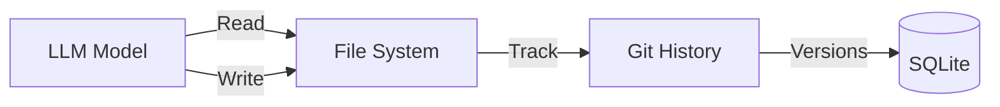

# LLM File System Access Confirmation

**Updated:** 2026-01-28  

---

## Confirmation: LLM File System Capabilities

This document confirms the LLM system specifications address all required capabilities:

---

## ✅ File System Access

**Covered in:** [AI Integration](./06-ai-integration/00-overview.md) → [Instruction System](./06-ai-integration/03-instruction-system.md)

| Capability | Spec Location | Status |
|------------|---------------|--------|
| Read files | Instruction System, Knowledge Memory | ✅ Covered |
| Write files | Instruction System (AIQ file generation) | ✅ Covered |
| Rewrite/modify files | Instruction System pipeline | ✅ Covered |
| File history tracking | History System integration | ✅ Covered |

### File Operations Flow



---

## ✅ Four Model Categories

**Covered in:** [AI Integration Overview](./06-ai-integration/00-overview.md) → Model Categories

| Category | Purpose | Example Models | Status |
|----------|---------|----------------|--------|
| Thinking | Reasoning, planning | r1, o1, qwen-thinking | ✅ Covered |
| Writing | Content generation | llama-3, mistral | ✅ Covered |
| Voice | Transcription | whisper-large-v3 | ✅ Covered |
| Coding | Code generation | codellama, deepseek | ✅ Covered |

---

## ✅ Runner Switching (OLMA ↔ LLAMA)

**Covered in:** [LLM Server Management](./06-ai-integration/07-llm-server-management.md)

| Feature | Description | Status |
|---------|-------------|--------|
| Multiple backends | Ollama, llama.cpp, llama-swap | ✅ Covered |
| Dynamic switching | Runtime backend selection | ✅ Covered |
| Seamless transition | No restart required | ✅ Covered |

### Backend Configuration

```yaml
# llama-swap config example
backends:
  - name: ollama
    port: 11434
    type: ollama
  - name: llama-cpp
    port: 8080
    type: llama-cpp
```

---

## ✅ Multi-Model Instant Switching

**Covered in:** [LLM Server Management](./06-ai-integration/07-llm-server-management.md)

| Feature | Description | Status |
|---------|-------------|--------|
| Multiple concurrent models | Different ports per model | ✅ Covered |
| Instant switching | ModelSlot pool with LRU | ✅ Covered |
| Port range | Configurable (default 8080-8089) | ✅ Covered |

---

## ✅ Multiple Model Folders

**Covered in:** Memory `model-category-four-types`

| Feature | Description | Status |
|---------|-------------|--------|
| Category folders | Separate folders per category | ✅ Covered |
| Config key | `llm.models.foldersByCategory` | ✅ Covered |
| Auto-detection | Pattern-based category detection | ✅ Covered |

### Folder Structure Example

```
/models/
├── thinking/
│   ├── r1-7b.gguf
│   └── qwen-thinking-14b.gguf
├── writing/
│   ├── llama-3-8b.gguf
│   └── mistral-7b.gguf
├── voice/
│   └── whisper-large-v3.bin
└── coding/
    ├── codellama-13b.gguf
    └── deepseek-coder-6.7b.gguf
```

---

## Summary

All requested LLM capabilities are addressed in the existing specifications:

1. ✅ **File system access** — Read, write, rewrite files
2. ✅ **Change history** — Git integration with History System
3. ✅ **Four model categories** — Thinking, Writing, Voice, Coding
4. ✅ **Runner switching** — OLMA ↔ LLAMA seamless switching
5. ✅ **Multi-model switching** — Instant model selection
6. ✅ **Multiple folders** — Category-based folder organization

---

## Related Specs

- [AI Integration](./06-ai-integration/00-overview.md)
- [LLM Server Management](./06-ai-integration/07-llm-server-management.md)
- [History System](./07-history-system/00-overview.md)
- [Knowledge Memory](./09-knowledge-memory/00-overview.md)
