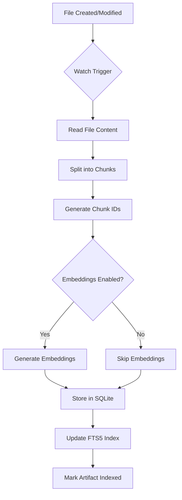
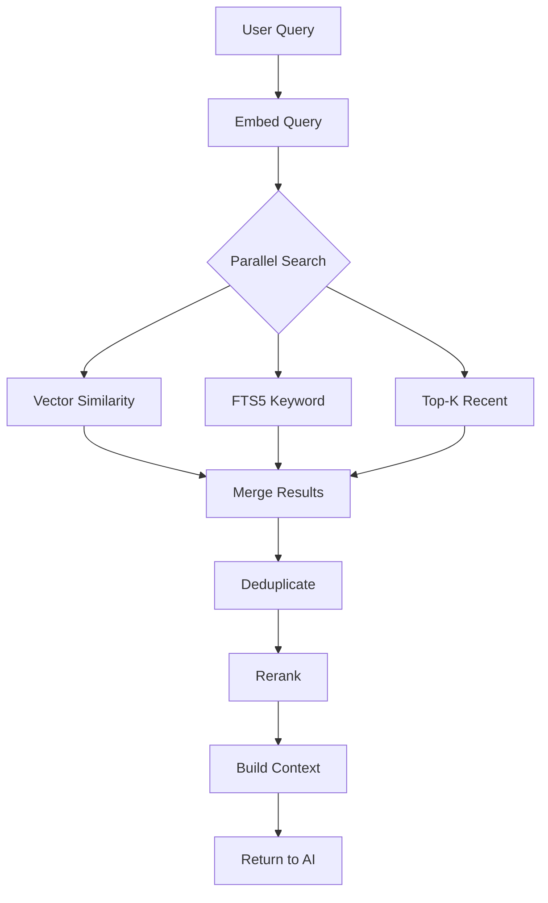
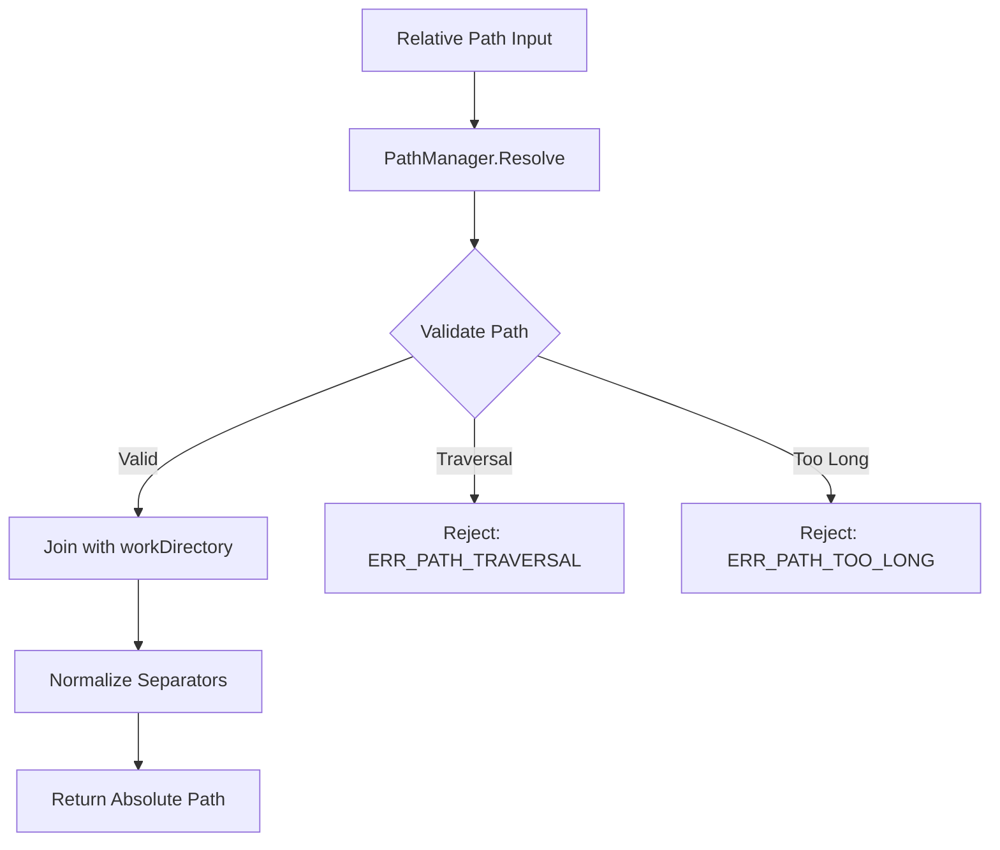

# RAG System Specification

**Version:** 2.0.0  
**Status:** Complete  
**Updated:** 2026-01-31  

---

## Overview

This specification defines the Retrieval-Augmented Generation (RAG) system for the Spec Management Software. The RAG pipeline enables intelligent context retrieval for AI operations by indexing Markdown artifacts (ideas and instructions) into SQLite with embeddings, then retrieving the top-K most relevant chunks plus recent artifacts to build working memory for AI prompts.

**Cross-References:**
- [Database Schema](../../07-database-design/01-schema.md) - Core entity models
- [File Operations](../02-file-management/01-file-operations.md) - Path validation rules
- [AI Integration](../06-ai-integration/01-ai-integration.md) - LLM invocation
- [Instruction System](../06-ai-integration/03-instruction-system.md) - Instruction pipeline
- [Path Manager](../02-file-management/02-path-manager.md) - Relative path handling
- [Vector Database Plan](./04-vector-database-plan.md) - sqlite-vss integration
- [Knowledge Worker Binary](./10-knowledge-worker-binary.md) - External Go worker

---

## 16.1 Goals

1. Define a **RAG-friendly spec structure** with consistent artifact organization
2. Capture voice/text inputs as step-by-step **idea files**
3. Define **idea → instruction promotion** workflow
4. Specify **top-K artifact retrieval** for AI working memory
5. Define **SQLite indexing** for fast chunk/embedding retrieval
6. Standardize **workDirectory-relative paths** throughout the system

---

## 16.2 File System Standard for RAG Artifacts

### Directory Structure

Within each project folder, RAG artifacts are organized as follows:

```
{workDirectory}/
└── spec/
    └── {project-slug}/
        ├── ideas/
        │   ├── README.md
        │   ├── 01-idea-initial-concept.md
        │   ├── 02-idea-api-redesign.md
        │   └── ...
        ├── instructions/
        │   ├── 01-instruction-add-logging.md
        │   ├── 02-instruction-rate-limiting.md
        │   └── ...
        └── spec/
            ├── 00-overview.md
            └── ...
```

### Naming Conventions

| Artifact Type | Pattern | Example |
|---------------|---------|---------|
| Idea | `{nn}-idea-{slug}.md` | `01-idea-api-redesign.md` |
| Instruction | `{nn}-instruction-{slug}.md` | `02-instruction-add-logging.md` |
| README | `README.md` | `ideas/README.md` |

### Numbering Rules

- Two-digit prefix (`01`, `02`, ..., `99`)
- Sequential numbering within each folder
- Gaps allowed (deleted artifacts keep numbering stable)
- Next number derived from `MAX(existing) + 1`

---

## 16.3 Idea Lifecycle

### Voice-to-Idea Pipeline

```
┌─────────────────────────────────────────────────────────────────────────┐
│                         VOICE TO IDEA FLOW                               │
├─────────────────────────────────────────────────────────────────────────┤
│                                                                          │
│  ┌──────────┐    ┌──────────┐    ┌──────────┐    ┌──────────┐          │
│  │  VOICE   │───▶│TRANSCRIBE│───▶│ PROOFREAD│───▶│  SAVE    │          │
│  │  INPUT   │    │  (Voice  │    │  (Reason │    │  AS IDEA │          │
│  │          │    │  Model)  │    │  Model)  │    │          │          │
│  └──────────┘    └──────────┘    └──────────┘    └──────────┘          │
│                                                        │                 │
│                                                        ▼                 │
│                                              ┌──────────────────┐       │
│                                              │ ideas/           │       │
│                                              │ {nn}-idea-{slug} │       │
│                                              │ .md              │       │
│                                              └──────────────────┘       │
│                                                        │                 │
│                                                        ▼                 │
│                                              ┌──────────────────┐       │
│                                              │  INDEX INTO      │       │
│                                              │  SQLite (chunks) │       │
│                                              └──────────────────┘       │
│                                                                          │
└─────────────────────────────────────────────────────────────────────────┘
```

### Idea File Format

```markdown
# Idea: {Title}

**ID:** idea_{uuid}  
**Status:** draft | refined | promoted | archived  
**Priority:** low | medium | high | critical  
**Created:** {ISO8601}  
**Updated:** {ISO8601}  

---

## Summary

One-paragraph description of the idea.

---

## Raw Transcription

> Original voice transcription preserved for reference.

---

## Proofread Content

Corrected and clarified version of the idea.

---

## Notes

Additional context, links, or references.

---

## Metadata

```json
{
  "sourceType": "voice" | "text",
  "voiceModelId": "model_abc",
  "reasoningModelId": "model_xyz",
  "transcriptionConfidence": 0.95,
  "promotedToInstructionId": null
}
```
```

---

## 16.4 Idea to Instruction Promotion

### Promotion Flow

```
┌─────────────────────────────────────────────────────────────────────────┐
│                       IDEA → INSTRUCTION PROMOTION                       │
├─────────────────────────────────────────────────────────────────────────┤
│                                                                          │
│  ┌──────────────┐     ┌──────────────┐     ┌──────────────┐            │
│  │    IDEA      │────▶│   REFINE     │────▶│   PROMOTE    │            │
│  │  (draft)     │     │   (edit)     │     │  (approval)  │            │
│  └──────────────┘     └──────────────┘     └──────────────┘            │
│                                                    │                     │
│                                                    ▼                     │
│                             ┌──────────────────────────────────────┐    │
│                             │  1. Create instruction file          │    │
│                             │  2. Update idea status → "promoted"  │    │
│                             │  3. Link idea to instruction         │    │
│                             │  4. Re-index both artifacts          │    │
│                             └──────────────────────────────────────┘    │
│                                                                          │
└─────────────────────────────────────────────────────────────────────────┘
```

### Promotion Rules

1. **Only refined ideas can be promoted** — Status must be `refined` or `draft` (if force-promoted)
2. **Preserve linkage** — Idea stores `promotedToInstructionId`; Instruction stores `sourceIdeaId`
3. **Re-index both** — Both artifacts are re-chunked and re-embedded after promotion
4. **Idea remains** — Ideas are not deleted; status changes to `promoted`

### Instruction File Format

See [Instruction System](../06-ai-integration/03-instruction-system.md) for full format. Key additions:

```markdown
## Source

**From Idea:** [01-idea-api-redesign.md](../ideas/01-idea-api-redesign.md)  
**Idea ID:** idea_abc123  
```

---

## 16.5 RAG Pipeline Architecture

### High-Level Flow

```
┌─────────────────────────────────────────────────────────────────────────┐
│                         RAG PIPELINE OVERVIEW                            │
├─────────────────────────────────────────────────────────────────────────┤
│                                                                          │
│  ┌─────────────────────────────────────────────────────────────────┐    │
│  │                      INGESTION PHASE                             │    │
│  ├─────────────────────────────────────────────────────────────────┤    │
│  │  1. Watch/Scan → 2. Chunk → 3. Embed → 4. Store (SQLite)        │    │
│  └─────────────────────────────────────────────────────────────────┘    │
│                                                                          │
│  ┌─────────────────────────────────────────────────────────────────┐    │
│  │                      RETRIEVAL PHASE                             │    │
│  ├─────────────────────────────────────────────────────────────────┤    │
│  │  1. Query Embed → 2. Vector Search → 3. Top-K Merge → 4. Prompt │    │
│  └─────────────────────────────────────────────────────────────────┘    │
│                                                                          │
└─────────────────────────────────────────────────────────────────────────┘
```

---

## 16.6 Ingestion Pipeline

### Trigger Conditions

| Trigger | Behavior |
|---------|----------|
| File created | Index immediately |
| File modified | Re-index (replace old chunks) |
| File deleted | Remove chunks from index |
| Manual re-index | Full project re-scan |
| Startup | Incremental sync based on `lastModifiedAt` |

### Chunking Strategy

```go
type ChunkConfig struct {
    MaxChunkSize    int    // Default: 512 tokens
    ChunkOverlap    int    // Default: 50 tokens
    SeparatorRegex  string // Default: `\n##|\n---|\n\n`
    MinChunkSize    int    // Default: 100 tokens
}
```

**Chunking Rules:**

1. **Split by headers first** — `## Section` creates natural boundaries
2. **Split by separators** — `---` and double newlines
3. **Enforce max size** — Split further if chunk exceeds `MaxChunkSize`
4. **Maintain overlap** — Include `ChunkOverlap` tokens from previous chunk
5. **Stable chunk IDs** — `{fileId}:{chunkIndex}` for deterministic references

### Chunk ID Generation

```go
func GenerateChunkId(fileId string, chunkIndex int) string {
    return fmt.Sprintf("%s:chunk_%03d", fileId, chunkIndex)
}
```

### Embedding Strategy

**Embedding Model Options:**

| Option | Description | Storage |
|--------|-------------|---------|
| Local LLaMA embeddings | Use reasoning model's embedding layer | In SQLite as BLOB |
| External API | OpenAI, Cohere, etc. | In SQLite as BLOB |
| No embeddings | BM25/FTS5 text search only | FTS5 virtual table |

**Default:** Local LLaMA embeddings with fallback to FTS5.

### Embedding Storage

```go
// EmbeddingStorage handles embedding persistence
type EmbeddingStorage interface {
    Store(chunkId string, embedding []float32) error
    Retrieve(chunkId string) ([]float32, error)
    Search(queryEmbedding []float32, limit int) ([]ChunkScore, error)
    Delete(chunkId string) error
}

// SQLite implementation stores as BLOB
// embedding BLOB encoded as little-endian float32 array
```

---

## 16.7 Retrieval Pipeline

### Query Processing

```
┌─────────────────────────────────────────────────────────────────────────┐
│                        RETRIEVAL PIPELINE                                │
├─────────────────────────────────────────────────────────────────────────┤
│                                                                          │
│  User Query                                                              │
│      │                                                                   │
│      ▼                                                                   │
│  ┌──────────────┐                                                       │
│  │ Embed Query  │                                                       │
│  └──────────────┘                                                       │
│      │                                                                   │
│      ▼                                                                   │
│  ┌──────────────────────────────────────────────────────────────────┐   │
│  │              PARALLEL RETRIEVAL                                   │   │
│  ├────────────────────┬────────────────────┬───────────────────────┤   │
│  │  Vector Search     │  FTS5 Keyword      │  Top-K Recent/Pinned │   │
│  │  (semantic)        │  (lexical)         │  (memory context)    │   │
│  └────────────────────┴────────────────────┴───────────────────────┘   │
│      │                      │                     │                     │
│      └──────────────────────┼─────────────────────┘                     │
│                             ▼                                            │
│  ┌──────────────────────────────────────────────────────────────────┐   │
│  │                    MERGE & DEDUPLICATE                            │   │
│  └──────────────────────────────────────────────────────────────────┘   │
│      │                                                                   │
│      ▼                                                                   │
│  ┌──────────────┐                                                       │
│  │   Rerank     │ (Optional: cross-encoder or heuristic)                │
│  └──────────────┘                                                       │
│      │                                                                   │
│      ▼                                                                   │
│  ┌──────────────────────────────────────────────────────────────────┐   │
│  │  BUILD PROMPT CONTEXT                                             │   │
│  │  - Top-K semantic chunks                                          │   │
│  │  - Top-K recent ideas/instructions (always included)              │   │
│  │  - Reference paths for grounding                                  │   │
│  └──────────────────────────────────────────────────────────────────┘   │
│                                                                          │
└─────────────────────────────────────────────────────────────────────────┘
```

### Top-K Memory Context

The system always includes **top-K recent or pinned artifacts** regardless of semantic relevance to ensure the AI has current context:

```go
type TopKConfig struct {
    RecentIdeasCount        int  // Default: 3
    RecentInstructionsCount int  // Default: 2
    PinnedArtifactsFirst    bool // Default: true
    SemanticChunksCount     int  // Default: 10
    KeywordChunksCount      int  // Default: 5
}
```

**Top-K Selection Priority:**

1. **Pinned artifacts** — User-marked as important
2. **Recent by UpdatedAt** — Most recently modified
3. **Semantic similarity** — Highest embedding similarity
4. **Keyword matches** — FTS5 BM25 score

### Retrieval Session Tracking

Each retrieval is logged for debugging and improvement:

```go
type RetrievalSession struct {
    Id             string
    ProjectId      string
    QueryText      string
    QueryEmbedding []float32
    RetrievedAt    time.Time
    ChunksUsed     []string  // Chunk IDs
    TokensUsed     int
    LatencyMs      int
}
```

---

## 16.8 Prompt Context Assembly

### Context Template

```markdown
## Working Memory

The following are the most recent and relevant artifacts from your project:

### Recent Ideas (Top {N})

{foreach recentIdea}
**{idea.Title}** (ideas/{idea.FileName})
> {idea.Summary}
{/foreach}

### Recent Instructions (Top {N})

{foreach recentInstruction}
**{instruction.Title}** (instructions/{instruction.FileName})
> {instruction.Summary}
{/foreach}

### Relevant Context (Semantic Search)

{foreach chunk}
**From:** {chunk.SourceFile}#{chunk.Section}
```
{chunk.Content}
```
{/foreach}

---

## Your Task

{userQuery}
```

### Grounding References

All retrieved content includes **file path references** for:
- AI attribution in responses
- User verification
- Link generation in UI

Format: `{relativePath}#{sectionAnchor}`

---

## 16.9 SQLite Schema for RAG

### New Tables

```go
// Artifact represents an indexed idea or instruction file
type Artifact struct {
    Id            string         `gorm:"type:text;primaryKey" json:"id"`
    ProjectId     string         `gorm:"type:text;not null;index:IX_Artifact_ProjectId" json:"projectId"`
    FileId        string         `gorm:"type:text;not null;index:IX_Artifact_FileId" json:"fileId"`
    ArtifactType  string         `gorm:"type:text;not null;index:IX_Artifact_Type" json:"artifactType"` // "idea" | "instruction"
    Title         string         `gorm:"type:text;not null" json:"title"`
    Summary       *string        `gorm:"type:text" json:"summary"`
    Status        string         `gorm:"type:text;not null;index:IX_Artifact_Status" json:"status"`
    RelativePath  string         `gorm:"type:text;not null;uniqueIndex:IX_Artifact_Path" json:"relativePath"`
    ContentHash   string         `gorm:"type:text;not null" json:"contentHash"`
    IsPinned      bool           `gorm:"default:false;index:IX_Artifact_Pinned" json:"isPinned"`
    CreatedAt     time.Time      `gorm:"not null" json:"createdAt"`
    UpdatedAt     time.Time      `gorm:"not null;index:IX_Artifact_UpdatedAt" json:"updatedAt"`
    IndexedAt     *time.Time     `gorm:"type:text" json:"indexedAt"`
    
    // Relations
    Project       Project        `gorm:"foreignKey:ProjectId;constraint:OnDelete:CASCADE" json:"-"`
    File          File           `gorm:"foreignKey:FileId;constraint:OnDelete:CASCADE" json:"-"`
    Chunks        []Chunk        `gorm:"foreignKey:ArtifactId;constraint:OnDelete:CASCADE" json:"-"`
}

func (Artifact) TableName() string { return "Artifact" }
```

```go
// Chunk represents a text segment for RAG indexing
type Chunk struct {
    Id            string    `gorm:"type:text;primaryKey" json:"id"`
    ArtifactId    string    `gorm:"type:text;not null;index:IX_Chunk_ArtifactId" json:"artifactId"`
    ChunkIndex    int       `gorm:"not null" json:"chunkIndex"`
    Content       string    `gorm:"type:text;not null" json:"content"`
    TokenCount    int       `gorm:"not null" json:"tokenCount"`
    SectionAnchor *string   `gorm:"type:text" json:"sectionAnchor"`
    StartOffset   int       `gorm:"not null" json:"startOffset"`
    EndOffset     int       `gorm:"not null" json:"endOffset"`
    CreatedAt     time.Time `gorm:"not null" json:"createdAt"`
    
    // Relations
    Artifact      Artifact  `gorm:"foreignKey:ArtifactId;constraint:OnDelete:CASCADE" json:"-"`
    Embedding     *Embedding `gorm:"foreignKey:ChunkId;constraint:OnDelete:CASCADE" json:"-"`
}

func (Chunk) TableName() string { return "Chunk" }
```

```go
// Embedding stores vector embeddings for chunks
type Embedding struct {
    ChunkId       string    `gorm:"type:text;primaryKey" json:"chunkId"`
    ModelId       string    `gorm:"type:text;not null;index:IX_Embedding_ModelId" json:"modelId"`
    Dimensions    int       `gorm:"not null" json:"dimensions"`
    Vector        []byte    `gorm:"type:blob;not null" json:"vector"` // Little-endian float32 array
    CreatedAt     time.Time `gorm:"not null" json:"createdAt"`
    
    // Relations
    Chunk         Chunk     `gorm:"foreignKey:ChunkId;constraint:OnDelete:CASCADE" json:"-"`
}

func (Embedding) TableName() string { return "Embedding" }
```

```go
// RetrievalSession logs each RAG retrieval for debugging
type RetrievalSession struct {
    Id            string         `gorm:"type:text;primaryKey" json:"id"`
    ProjectId     string         `gorm:"type:text;not null;index:IX_RetrievalSession_ProjectId" json:"projectId"`
    UserId        string         `gorm:"type:text;not null;index:IX_RetrievalSession_UserId" json:"userId"`
    QueryText     string         `gorm:"type:text;not null" json:"queryText"`
    QueryHash     string         `gorm:"type:text;not null;index:IX_RetrievalSession_QueryHash" json:"queryHash"`
    TokensUsed    int            `gorm:"not null" json:"tokensUsed"`
    LatencyMs     int            `gorm:"not null" json:"latencyMs"`
    RetrievedAt   time.Time      `gorm:"not null;index:IX_RetrievalSession_RetrievedAt" json:"retrievedAt"`
    CacheHit      bool           `gorm:"default:false" json:"cacheHit"`
    
    // Relations
    Project       Project        `gorm:"foreignKey:ProjectId;constraint:OnDelete:CASCADE" json:"-"`
    User          User           `gorm:"foreignKey:UserId;constraint:OnDelete:CASCADE" json:"-"`
    ChunksUsed    []RetrievalSessionChunk `gorm:"foreignKey:SessionId;constraint:OnDelete:CASCADE" json:"-"`
}

func (RetrievalSession) TableName() string { return "RetrievalSession" }
```

```go
// RetrievalSessionChunk links sessions to chunks used
type RetrievalSessionChunk struct {
    SessionId     string    `gorm:"type:text;primaryKey" json:"sessionId"`
    ChunkId       string    `gorm:"type:text;primaryKey" json:"chunkId"`
    Score         float64   `gorm:"not null" json:"score"`
    RankPosition  int       `gorm:"not null" json:"rankPosition"`
    SourceType    string    `gorm:"type:text;not null" json:"sourceType"` // "semantic" | "keyword" | "topk"
    
    // Relations
    Session       RetrievalSession `gorm:"foreignKey:SessionId;constraint:OnDelete:CASCADE" json:"-"`
    Chunk         Chunk            `gorm:"foreignKey:ChunkId;constraint:OnDelete:CASCADE" json:"-"`
}

func (RetrievalSessionChunk) TableName() string { return "RetrievalSessionChunk" }
```

### FTS5 Virtual Table for Keyword Search

```sql
-- Exception: FTS5 requires raw SQL (see ORM-Only Policy exception)
CREATE VIRTUAL TABLE ChunkFts USING fts5(
    chunkId,
    content,
    tokenize='porter unicode61'
);

-- Triggers to keep FTS in sync
CREATE TRIGGER Chunk_ai AFTER INSERT ON Chunk BEGIN
    INSERT INTO ChunkFts(chunkId, content) VALUES (new.Id, new.Content);
END;

CREATE TRIGGER Chunk_ad AFTER DELETE ON Chunk BEGIN
    DELETE FROM ChunkFts WHERE chunkId = old.Id;
END;

CREATE TRIGGER Chunk_au AFTER UPDATE ON Chunk BEGIN
    DELETE FROM ChunkFts WHERE chunkId = old.Id;
    INSERT INTO ChunkFts(chunkId, content) VALUES (new.Id, new.Content);
END;
```

---

## 16.10 Caching

### Cache Strategy

```go
type RAGCacheConfig struct {
    Enabled         bool          // Default: true
    TTLSeconds      int           // Default: 300 (5 minutes)
    MaxEntries      int           // Default: 100
    KeyPattern      string        // "{projectId}:{queryHash}"
    InvalidateOnWrite bool        // Default: true
}
```

### Cache Key Generation

```go
func GenerateCacheKey(projectId, queryText string) string {
    hash := sha256.Sum256([]byte(queryText))
    queryHash := hex.EncodeToString(hash[:8])
    return fmt.Sprintf("%s:%s", projectId, queryHash)
}
```

### Cache Invalidation

| Event | Action |
|-------|--------|
| File modified in project | Invalidate all project cache entries |
| Manual force refresh | Clear specific query cache |
| TTL expiry | Auto-evict |
| Embedding model changed | Clear all caches |

---

## 16.11 Configuration Keys

Add to seed.json:

```json
{
  "Key": "rag.chunking.maxSize",
  "Value": "512",
  "Description": "Maximum tokens per chunk"
},
{
  "Key": "rag.chunking.overlap",
  "Value": "50",
  "Description": "Token overlap between chunks"
},
{
  "Key": "rag.topk.recentIdeas",
  "Value": "3",
  "Description": "Recent ideas to always include"
},
{
  "Key": "rag.topk.recentInstructions",
  "Value": "2",
  "Description": "Recent instructions to always include"
},
{
  "Key": "rag.topk.semanticChunks",
  "Value": "10",
  "Description": "Semantic search results count"
},
{
  "Key": "rag.cache.enabled",
  "Value": "true",
  "Description": "Enable retrieval caching"
},
{
  "Key": "rag.cache.ttlSeconds",
  "Value": "300",
  "Description": "Cache TTL in seconds"
},
{
  "Key": "rag.embedding.enabled",
  "Value": "true",
  "Description": "Use embeddings (false = FTS5 only)"
}
```

---

## 16.12 API Endpoints

### Idea Endpoints

| Method | Endpoint | Description |
|--------|----------|-------------|
| POST | `/api/v1/projects/{projectId}/ideas` | Create idea from voice/text |
| GET | `/api/v1/projects/{projectId}/ideas` | List ideas |
| GET | `/api/v1/projects/{projectId}/ideas/{ideaId}` | Get idea |
| PUT | `/api/v1/projects/{projectId}/ideas/{ideaId}` | Update idea |
| POST | `/api/v1/projects/{projectId}/ideas/{ideaId}/promote` | Promote to instruction |
| DELETE | `/api/v1/projects/{projectId}/ideas/{ideaId}` | Delete idea |

### RAG Endpoints

| Method | Endpoint | Description |
|--------|----------|-------------|
| POST | `/api/v1/projects/{projectId}/rag/query` | Execute RAG retrieval |
| POST | `/api/v1/projects/{projectId}/rag/reindex` | Force re-index project |
| GET | `/api/v1/projects/{projectId}/rag/stats` | Get indexing statistics |
| DELETE | `/api/v1/projects/{projectId}/rag/cache` | Clear retrieval cache |

### Query Request/Response

**POST `/api/v1/projects/{projectId}/rag/query`**

Request:
```json
{
  "query": "How does the authentication flow work?",
  "options": {
    "includeRecentIdeas": true,
    "includeRecentInstructions": true,
    "maxChunks": 15,
    "forceRefresh": false
  }
}
```

Response:
```json
{
  "success": true,
  "data": {
    "query": "How does the authentication flow work?",
    "context": {
      "recentIdeas": [
        {
          "id": "idea_abc",
          "title": "OAuth2 Integration",
          "summary": "Add OAuth2 support...",
          "relativePath": "ideas/03-idea-oauth2.md"
        }
      ],
      "recentInstructions": [],
      "semanticChunks": [
        {
          "chunkId": "file_xyz:chunk_005",
          "content": "## Authentication Flow\n\n1. User submits credentials...",
          "score": 0.89,
          "sourcePath": "spec/backend/07-authentication.md",
          "sectionAnchor": "authentication-flow"
        }
      ],
      "keywordChunks": []
    },
    "assembledPrompt": "## Working Memory\n\n...",
    "tokenCount": 1250,
    "cacheHit": false,
    "latencyMs": 245
  },
  "error": null,
  "meta": {}
}
```

---

## 16.13 Reranking (Optional)

### Heuristic Reranking

When no cross-encoder is available, apply heuristic scoring:

```go
type RerankerConfig struct {
    SemanticWeight   float64 // Default: 0.5
    KeywordWeight    float64 // Default: 0.3
    RecencyWeight    float64 // Default: 0.2
    ExactMatchBoost  float64 // Default: 1.5
}

func ComputeFinalScore(chunk ChunkResult, config RerankerConfig) float64 {
    score := chunk.SemanticScore * config.SemanticWeight
    score += chunk.KeywordScore * config.KeywordWeight
    score += chunk.RecencyScore * config.RecencyWeight
    
    if chunk.HasExactMatch {
        score *= config.ExactMatchBoost
    }
    
    return score
}
```

---

## 16.14 Error Codes

| Code | Name | Description |
|------|------|-------------|
| 9001 | ERR_RAG_INDEX_FAILED | Failed to index artifact |
| 9002 | ERR_RAG_EMBED_FAILED | Failed to generate embedding |
| 9003 | ERR_RAG_QUERY_FAILED | Retrieval query failed |
| 9004 | ERR_RAG_NO_CONTEXT | No relevant context found |
| 9005 | ERR_RAG_CACHE_FULL | Cache capacity exceeded |
| 9006 | ERR_IDEA_INVALID_STATUS | Cannot promote idea with current status |
| 9007 | ERR_IDEA_ALREADY_PROMOTED | Idea already promoted |

---

## 16.15 Acceptance Criteria

### File References
- [ ] All file references stored as relative paths from `workDirectory`
- [ ] No absolute paths in database
- [ ] Path traversal prevented in all file operations

### Ideas and Instructions
- [ ] Ideas created with correct `{nn}-idea-{slug}.md` naming
- [ ] Instructions created with correct `{nn}-instruction-{slug}.md` naming
- [ ] Sequential numbering maintained per folder
- [ ] Promotion workflow updates both artifacts

### Top-K Memory
- [ ] Top-K recent ideas always included in context
- [ ] Top-K recent instructions always included in context
- [ ] Pinned artifacts prioritized
- [ ] Combined context respects token limits

### Indexing and Retrieval
- [ ] Chunks created with stable IDs
- [ ] Embeddings stored and retrievable
- [ ] FTS5 fallback works when embeddings disabled
- [ ] Cache invalidation on file changes

### Data Model
- [ ] All tables created via GORM AutoMigrate
- [ ] Foreign key constraints enforced
- [ ] Indexes created for query patterns
- [ ] FTS5 triggers maintain sync

---

## 16.16 Mermaid Diagrams

### Ingestion Pipeline



### Retrieval Pipeline



### Path Resolution



---

## 16.12 Acceptance Criteria

### Ingestion Pipeline (99% Required)

| ID | Criterion | Priority | Validation Method |
|----|-----------|----------|-------------------|
| IN-001 | File watcher detects new/modified files in ideas/ and instructions/ | Critical | File watch test |
| IN-002 | File creation triggers immediate indexing | Critical | Create trigger test |
| IN-003 | File modification triggers re-indexing (replace old chunks) | Critical | Update trigger test |
| IN-004 | File deletion removes chunks from index | Critical | Delete cleanup test |
| IN-005 | Startup performs incremental sync based on lastModifiedAt | Critical | Startup sync test |
| IN-006 | Manual re-index endpoint available at /api/v1/rag/reindex | High | Manual reindex test |
| IN-007 | Content unchanged skips re-indexing (unless forced) | Medium | Skip unchanged test |

### Chunking (99% Required)

| ID | Criterion | Priority | Validation Method |
|----|-----------|----------|-------------------|
| CH-001 | Chunks split by headers (## Section) first | Critical | Header split test |
| CH-002 | Chunks respect MaxChunkSize (default 512 tokens) | Critical | Size limit test |
| CH-003 | Chunk overlap maintains ChunkOverlap tokens (default 50) | High | Overlap test |
| CH-004 | Chunk IDs are stable: `{fileId}:chunk_{nnn}` | High | ID stability test |
| CH-005 | MinChunkSize (default 100) prevents tiny chunks | Medium | Min size test |
| CH-006 | Code blocks preserved intact within chunks | Medium | Code block test |
| CH-007 | Tables preserved intact within chunks | Medium | Table test |

### Embedding (99% Required)

| ID | Criterion | Priority | Validation Method |
|----|-----------|----------|-------------------|
| EM-001 | Local LLaMA embeddings generated for each chunk | Critical | Embedding gen test |
| EM-002 | Embeddings stored as BLOB in SQLite | Critical | Storage test |
| EM-003 | FTS5 fallback works when embeddings disabled | Critical | FTS5 fallback test |
| EM-004 | Embedding dimension matches model output | High | Dimension test |
| EM-005 | Batch embedding for efficiency on large re-index | Medium | Batch test |

### Retrieval (99% Required)

| ID | Criterion | Priority | Validation Method |
|----|-----------|----------|-------------------|
| RT-001 | Query embedding generated from user input | Critical | Query embed test |
| RT-002 | Vector similarity search returns ranked results | Critical | Vector search test |
| RT-003 | FTS5 keyword search runs in parallel | Critical | Parallel search test |
| RT-004 | Top-K recent artifacts always included | Critical | Recent inclusion test |
| RT-005 | Results merged and deduplicated | High | Merge dedup test |
| RT-006 | Optional reranking improves relevance | Medium | Rerank test |
| RT-007 | Retrieval cache with configurable TTL | Medium | Cache test |
| RT-008 | Force refresh bypasses cache | Medium | Force refresh test |

### Idea Lifecycle (99% Required)

| ID | Criterion | Priority | Validation Method |
|----|-----------|----------|-------------------|
| IL-001 | Voice input saves as idea file in ideas/ folder | Critical | Voice save test |
| IL-002 | Idea file follows `{nn}-idea-{slug}.md` pattern | Critical | Naming test |
| IL-003 | Idea status transitions: draft → refined → promoted/archived | Critical | Status flow test |
| IL-004 | Idea indexed immediately after creation | High | Auto-index test |
| IL-005 | Idea metadata (priority, tags) stored in frontmatter | High | Metadata test |

### Promotion Flow (99% Required)

| ID | Criterion | Priority | Validation Method |
|----|-----------|----------|-------------------|
| PF-001 | Only refined/draft ideas can be promoted | Critical | Promotion guard test |
| PF-002 | Promotion creates instruction file in instructions/ | Critical | File creation test |
| PF-003 | Promotion sets idea status to `promoted` | Critical | Status update test |
| PF-004 | Bidirectional link: idea.promotedToInstructionId ↔ instruction.sourceIdeaId | Critical | Link test |
| PF-005 | Both artifacts re-indexed after promotion | High | Reindex trigger test |
| PF-006 | Promotion event logged with timestamp | High | Event logging test |
| PF-007 | Re-promotion of already promoted idea returns 409 | High | Duplicate guard test |

### Path & Storage (99% Required)

| ID | Criterion | Priority | Validation Method |
|----|-----------|----------|-------------------|
| PS-001 | All paths stored as workDirectory-relative | Critical | Relative path test |
| PS-002 | PathManager.ToAbsolute used for filesystem ops | Critical | Path resolution test |
| PS-003 | Path traversal rejected | Critical | Traversal guard test |
| PS-004 | SQLite indexes on projectId, filePath, chunkId | High | Index existence test |
| PS-005 | Embedding BLOB format: little-endian float32 array | Medium | Format test |

### Error Handling (99% Required)

| ID | Criterion | Priority | Validation Method |
|----|-----------|----------|-------------------|
| EH-001 | Invalid file path returns ERR_INVALID_PATH (6001) | Critical | Error code test |
| EH-002 | Embedding generation failure returns ERR_EMBEDDING_FAILED (8001) | Critical | Error code test |
| EH-003 | Retrieval failure returns ERR_RETRIEVAL_FAILED (8002) | Critical | Error code test |
| EH-004 | Promotion failure returns ERR_PROMOTION_FAILED (8003) | Critical | Error code test |
| EH-005 | All errors include projectId and filePath context | High | Error context test |

---

## Related Specs

- [Path Manager](../02-file-management/02-path-manager.md)
- [Database Schema](../../07-database-design/01-schema.md)
- [File Operations](../02-file-management/01-file-operations.md)
- [AI Integration](../06-ai-integration/01-ai-integration.md)
- [Instruction System](../06-ai-integration/03-instruction-system.md)
