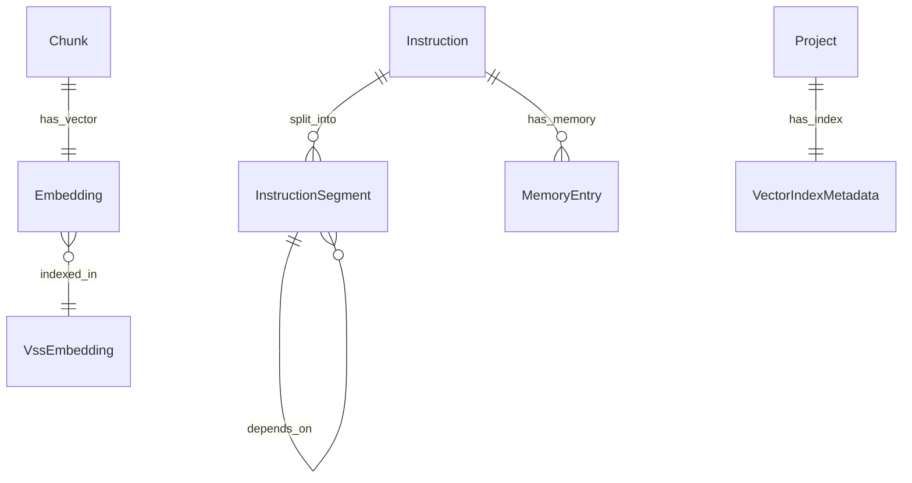

# Vector Database Enhancement Plan

**Version:** 1.0.0  
**Status:** Draft  
**Updated:** 2026-01-28  

---

## Overview

This document provides a detailed plan for enhancing the RAG system with true vector database capabilities, addressing context window limitations, and implementing memory-based instruction segmentation strategies.

**Cross-References:**
- [RAG System](./01-rag-system.md) - Current RAG implementation
- [Database Schema](../../07-database-design/01-schema.md) - GORM models
- [AI Integration](../06-ai-integration/01-ai-integration.md) - LLM invocation
- [Path Manager](../02-file-management/02-path-manager.md) - File path handling

---

## 20.1 Current State Assessment

### What We Have ✅

The current specification includes:

| Component | Status | Location |
|-----------|--------|----------|
| **Artifact Table** | ✅ Defined | `02-database-schema.md` §RAG Tables |
| **Chunk Table** | ✅ Defined | `02-database-schema.md` §Chunk |
| **Embedding Table** | ✅ Defined | `02-database-schema.md` §Embedding |
| **RetrievalSession** | ✅ Defined | `02-database-schema.md` §RetrievalSession |
| **FTS5 Virtual Table** | ✅ Defined | `16-rag-system.md` §16.9 |
| **Chunking Strategy** | ✅ Defined | `16-rag-system.md` §16.6 |
| **Top-K Memory** | ✅ Defined | `16-rag-system.md` §16.7 |
| **Ingestion Pipeline** | ✅ Defined | `16-rag-system.md` §16.6 |
| **Retrieval Pipeline** | ✅ Defined | `16-rag-system.md` §16.7 |

### What Needs Enhancement 🔶

| Component | Current State | Enhancement Needed |
|-----------|---------------|-------------------|
| **Vector Storage** | SQLite BLOB | Consider sqlite-vss or external vector DB |
| **Similarity Search** | Basic dot product | Implement HNSW or IVF index |
| **Context Splitting** | Not specified | Multi-turn context assembly |
| **Memory Continuity** | Not specified | Cross-session memory management |
| **Embedding Models** | LLaMA only | Multiple model support |

### What's Missing ❌

| Component | Priority | Description |
|-----------|----------|-------------|
| **Vector Index** | HIGH | Fast approximate nearest neighbor (ANN) search |
| **Context Window Manager** | HIGH | Split instructions across model limits |
| **Memory Persistence** | MEDIUM | Long-term conversation memory |
| **Embedding Versioning** | MEDIUM | Track model changes |
| **Hybrid Retrieval Scoring** | LOW | Combine semantic + keyword scores |

---

## 20.2 Vector Database Options

### Option A: SQLite with sqlite-vss Extension (Recommended)

SQLite-based vector search using the official SQLite Vector Similarity Search extension.

```
┌─────────────────────────────────────────────────────────────────────────┐
│                     SQLITE-VSS ARCHITECTURE                              │
├─────────────────────────────────────────────────────────────────────────┤
│                                                                          │
│  ┌──────────────┐     ┌──────────────┐     ┌──────────────┐            │
│  │   Chunk      │────▶│  Embedding   │────▶│  vss_table   │            │
│  │   Table      │     │  Table       │     │  (Virtual)   │            │
│  └──────────────┘     └──────────────┘     └──────────────┘            │
│        │                    │                    │                      │
│        │                    │                    │                      │
│        ▼                    ▼                    ▼                      │
│  ┌──────────────────────────────────────────────────────────────────┐  │
│  │                    HYBRID SEARCH LAYER                            │  │
│  ├───────────────────┬───────────────────┬──────────────────────────┤  │
│  │  FTS5 Keyword     │  VSS Semantic     │  Fusion Scorer           │  │
│  │  (BM25 Score)     │  (Cosine/L2)      │  (RRF Algorithm)         │  │
│  └───────────────────┴───────────────────┴──────────────────────────┘  │
│                                                                          │
└─────────────────────────────────────────────────────────────────────────┘
```

**Pros:**
- Single database file (backup/restore simplicity)
- No external dependencies
- GORM compatible (with raw SQL for virtual table)
- Sub-millisecond similarity search for <100K vectors

**Cons:**
- Limited to ~1M vectors efficiently
- Requires sqlite-vss extension loading
- No GPU acceleration

**Implementation:**

```go
// VectorSearchService handles sqlite-vss operations
type VectorSearchService struct {
    db *gorm.DB
}

// Initialize creates the vss virtual table (exception to ORM-only policy)
func (v *VectorSearchService) Initialize() error {
    return v.db.Exec(`
        CREATE VIRTUAL TABLE IF NOT EXISTS VssEmbedding USING vss0(
            embedding(768),
            chunk_id TEXT
        );
    `).Error
}

// SearchSimilar finds top-K similar chunks
func (v *VectorSearchService) SearchSimilar(
    queryEmbedding []float32, 
    limit int,
) ([]ChunkScore, error) {
    // Convert to blob format
    blob := embedToBlob(queryEmbedding)
    
    var results []struct {
        ChunkId  string
        Distance float64
    }
    
    err := v.db.Raw(`
        SELECT chunk_id, distance
        FROM VssEmbedding
        WHERE vss_search(embedding, ?)
        LIMIT ?
    `, blob, limit).Scan(&results).Error
    
    return convertToChunkScores(results), err
}
```

---

### Option B: External Vector Database (For Scale)

For projects exceeding 1M vectors, consider external vector databases:

| Database | Best For | Integration |
|----------|----------|-------------|
| **Qdrant** | Self-hosted, Rust performance | REST API / gRPC |
| **Milvus** | Cloud-scale, GPU support | Python SDK / REST |
| **Weaviate** | GraphQL native | GraphQL API |
| **Pinecone** | Managed service | REST API |
| **Chroma** | Python ecosystem | Python SDK |

**Recommendation:** Start with sqlite-vss, migrate to Qdrant if >500K vectors.

---

## 20.3 Context Window Limitation Strategy

### The Problem

LLM models have fixed context windows:

| Model | Context Window | Effective Usable |
|-------|----------------|------------------|
| LLaMA 3 8B | 8,192 tokens | ~6,000 tokens |
| LLaMA 3 70B | 8,192 tokens | ~6,000 tokens |
| Gemini Pro | 32,768 tokens | ~28,000 tokens |
| Gemini Flash | 1,000,000 tokens | ~900,000 tokens |

When an instruction + context exceeds the model's limit, we need strategies.

### Strategy 1: Hierarchical Context Assembly

```
┌─────────────────────────────────────────────────────────────────────────┐
│                  HIERARCHICAL CONTEXT ASSEMBLY                           │
├─────────────────────────────────────────────────────────────────────────┤
│                                                                          │
│  Total Available: 8000 tokens                                            │
│                                                                          │
│  ┌──────────────────────────────────────────────────────────────────┐   │
│  │  LAYER 1: System Prompt (Fixed)                    [500 tokens]  │   │
│  └──────────────────────────────────────────────────────────────────┘   │
│                                                                          │
│  ┌──────────────────────────────────────────────────────────────────┐   │
│  │  LAYER 2: Critical Context (Always Included)      [1000 tokens]  │   │
│  │  - Project metadata                                               │   │
│  │  - Active instruction summary                                     │   │
│  │  - Pinned artifacts (top priority)                                │   │
│  └──────────────────────────────────────────────────────────────────┘   │
│                                                                          │
│  ┌──────────────────────────────────────────────────────────────────┐   │
│  │  LAYER 3: User Query + Instruction               [1500 tokens]   │   │
│  └──────────────────────────────────────────────────────────────────┘   │
│                                                                          │
│  ┌──────────────────────────────────────────────────────────────────┐   │
│  │  LAYER 4: Retrieved Context (Dynamic)            [3500 tokens]   │   │
│  │  - Semantic chunks (top-K)                                        │   │
│  │  - Keyword chunks (top-K)                                         │   │
│  │  - Recent ideas (top-K)                                           │   │
│  └──────────────────────────────────────────────────────────────────┘   │
│                                                                          │
│  ┌──────────────────────────────────────────────────────────────────┐   │
│  │  LAYER 5: Response Buffer (Reserved)             [1500 tokens]   │   │
│  └──────────────────────────────────────────────────────────────────┘   │
│                                                                          │
└─────────────────────────────────────────────────────────────────────────┘
```

**Configuration:**

```go
type ContextWindowConfig struct {
    ModelContextSize     int // Total model context window
    SystemPromptReserve  int // Fixed system prompt
    CriticalReserve      int // Always-included context
    ResponseReserve      int // Output buffer
    SafetyMargin         int // Buffer for tokenization variance
}

func (c *ContextWindowConfig) AvailableForRetrieval() int {
    return c.ModelContextSize - 
           c.SystemPromptReserve - 
           c.CriticalReserve - 
           c.ResponseReserve - 
           c.SafetyMargin
}
```

---

### Strategy 2: Multi-Turn Instruction Segmentation

When a single instruction exceeds context limits, break it into segments:

```
┌─────────────────────────────────────────────────────────────────────────┐
│              INSTRUCTION SEGMENTATION WORKFLOW                           │
├─────────────────────────────────────────────────────────────────────────┤
│                                                                          │
│  ┌──────────────────────────────────────────────────────────────────┐   │
│  │  LARGE INSTRUCTION (15,000 tokens)                                │   │
│  │  "Build complete authentication system with OAuth, RBAC,          │   │
│  │   session management, audit logging, password reset..."           │   │
│  └──────────────────────────────────────────────────────────────────┘   │
│                               │                                          │
│                               ▼                                          │
│  ┌──────────────────────────────────────────────────────────────────┐   │
│  │  SEGMENTATION ENGINE                                              │   │
│  │  1. Parse instruction into semantic sections                      │   │
│  │  2. Group by dependency order                                     │   │
│  │  3. Assign priority scores                                        │   │
│  │  4. Create execution segments                                     │   │
│  └──────────────────────────────────────────────────────────────────┘   │
│                               │                                          │
│         ┌─────────────────────┼─────────────────────┐                   │
│         ▼                     ▼                     ▼                   │
│  ┌────────────┐        ┌────────────┐        ┌────────────┐            │
│  │ SEGMENT 1  │───────▶│ SEGMENT 2  │───────▶│ SEGMENT 3  │            │
│  │ OAuth      │        │ RBAC       │        │ Audit Log  │            │
│  │ (4000 tok) │        │ (4500 tok) │        │ (3500 tok) │            │
│  └────────────┘        └────────────┘        └────────────┘            │
│        │                     │                     │                    │
│        ▼                     ▼                     ▼                    │
│  ┌────────────┐        ┌────────────┐        ┌────────────┐            │
│  │ EXECUTE +  │        │ EXECUTE +  │        │ EXECUTE +  │            │
│  │ SUMMARIZE  │───────▶│ SUMMARIZE  │───────▶│ SUMMARIZE  │            │
│  │ (Memory)   │        │ (Memory)   │        │ (Memory)   │            │
│  └────────────┘        └────────────┘        └────────────┘            │
│                                                                          │
└─────────────────────────────────────────────────────────────────────────┘
```

**Data Model:**

```go
// InstructionSegment stores a segment of a large instruction
type InstructionSegment struct {
    BaseModel
    InstructionId      string    `gorm:"type:text;not null;index:IX_InstructionSegment_Instruction" json:"instructionId"`
    SegmentIndex       int       `gorm:"not null" json:"segmentIndex"`
    Title              string    `gorm:"type:text;not null" json:"title"`
    Content            string    `gorm:"type:text;not null" json:"content"`
    TokenCount         int       `gorm:"not null" json:"tokenCount"`
    DependsOnSegments  string    `gorm:"type:text" json:"dependsOnSegments"` // JSON array of segment IDs
    Status             string    `gorm:"type:text;not null;default:'pending'" json:"status"` // pending, executing, completed
    SummaryForNext     *string   `gorm:"type:text" json:"summaryForNext"` // Compressed output for next segment
    ExecutedAt         *time.Time `gorm:"type:text" json:"executedAt"`
    
    // Relations
    Instruction Instruction `gorm:"foreignKey:InstructionId;constraint:OnDelete:CASCADE" json:"-"`
}

func (InstructionSegment) TableName() string { return "InstructionSegment" }
```

---

### Strategy 3: Memory Compression (Summarization)

Compress previous conversation/execution context into summaries:

```go
// MemoryEntry stores compressed context for multi-turn execution
type MemoryEntry struct {
    BaseModel
    InstructionId    string    `gorm:"type:text;not null;index:IX_MemoryEntry_Instruction" json:"instructionId"`
    SessionId        string    `gorm:"type:text;not null;index:IX_MemoryEntry_Session" json:"sessionId"`
    TurnIndex        int       `gorm:"not null" json:"turnIndex"`
    OriginalTokens   int       `gorm:"not null" json:"originalTokens"`
    CompressedTokens int       `gorm:"not null" json:"compressedTokens"`
    Summary          string    `gorm:"type:text;not null" json:"summary"`
    KeyDecisions     string    `gorm:"type:text" json:"keyDecisions"` // JSON array
    ArtifactsCreated string    `gorm:"type:text" json:"artifactsCreated"` // JSON array of file paths
    
    // Relations
    Instruction Instruction `gorm:"foreignKey:InstructionId;constraint:OnDelete:CASCADE" json:"-"`
}

func (MemoryEntry) TableName() string { return "MemoryEntry" }
```

**Compression Flow:**

```
┌─────────────────────────────────────────────────────────────────────────┐
│                    MEMORY COMPRESSION FLOW                               │
├─────────────────────────────────────────────────────────────────────────┤
│                                                                          │
│  Turn 1 Output (3000 tokens)                                             │
│      │                                                                   │
│      ▼                                                                   │
│  ┌──────────────────────────────────────────────────────────────────┐   │
│  │  SUMMARIZATION PROMPT                                             │   │
│  │  "Summarize the following execution output, preserving:           │   │
│  │   - Key decisions made                                            │   │
│  │   - Files created/modified                                        │   │
│  │   - Dependencies established                                      │   │
│  │   - Open questions for next turn                                  │   │
│  │   Limit: 500 tokens"                                              │   │
│  └──────────────────────────────────────────────────────────────────┘   │
│      │                                                                   │
│      ▼                                                                   │
│  ┌──────────────────────────────────────────────────────────────────┐   │
│  │  COMPRESSED MEMORY (500 tokens)                                   │   │
│  │  "In Turn 1, created User model with GORM tags, implemented       │   │
│  │   password hashing with bcrypt. Pending: session management."     │   │
│  └──────────────────────────────────────────────────────────────────┘   │
│      │                                                                   │
│      ▼                                                                   │
│  Turn 2 Context = Compressed Memory + New Instruction Segment           │
│                                                                          │
└─────────────────────────────────────────────────────────────────────────┘
```

---

## 20.4 Implementation Plan

### Phase 1: Vector Search Enhancement (Priority: HIGH) ✅ IMPLEMENTED

**Implementation:** [05-vector-search-service.md](./05-vector-search-service.md)

| Task | Effort | Status |
|------|--------|--------|
| Add sqlite-vss extension support | 2 days | ✅ DONE |
| Create VssEmbedding virtual table | 1 day | ✅ DONE |
| Implement VectorSearchService | 2 days | ✅ DONE |
| Add hybrid scoring (RRF algorithm) | 1 day | ✅ DONE |
| Update RAG retrieval to use VSS | 1 day | ✅ DONE |
| Add unit tests | 1 day | ✅ DONE |

### Phase 2: Context Window Manager (Priority: HIGH) ✅ IMPLEMENTED

**Implementation:** [06-context-window-manager.md](./06-context-window-manager.md)

| Task | Effort | Status |
|------|--------|--------|
| Create ContextWindowConfig struct | 0.5 day | ✅ DONE |
| Implement token counting service | 1 day | ✅ DONE |
| Build hierarchical context assembler | 2 days | ✅ DONE |
| Add budget allocation logic | 1 day | ✅ DONE |
| Create context overflow handling | 1 day | ✅ DONE |
| Add unit tests | 1 day | ✅ DONE |

### Phase 3: Instruction Segmentation (Priority: MEDIUM) ✅ IMPLEMENTED

**Implementation:** [../06-ai-integration/05-instruction-segmentation.md](../06-ai-integration/05-instruction-segmentation.md)

| Task | Effort | Status |
|------|--------|--------|
| Add InstructionSegment model | 0.5 day | ✅ DONE |
| Create segmentation parser | 2 days | ✅ DONE |
| Implement dependency ordering | 1 day | ✅ DONE |
| Build segment execution engine | 2 days | ✅ DONE |
| Add segment status tracking | 1 day | ✅ DONE |
| Add unit tests | 1 day | ✅ DONE |

### Phase 4: Memory Compression (Priority: MEDIUM) ✅ IMPLEMENTED

**Implementation:** [07-memory-compression.md](./07-memory-compression.md)

| Task | Effort | Status |
|------|--------|--------|
| Add MemoryEntry model | 0.5 day | ✅ DONE |
| Create summarization prompts | 1 day | ✅ DONE |
| Build compression service | 2 days | ✅ DONE |
| Integrate with multi-turn execution | 1 day | ✅ DONE |
| Add unit tests | 1 day | ✅ DONE |

---

## 20.5 Database Schema Additions

### New Tables Required

```go
// Add to 02-database-schema.md

// InstructionSegment - see Strategy 2
// MemoryEntry - see Strategy 3

// VectorIndexMetadata tracks vector index state
type VectorIndexMetadata struct {
    Id             string    `gorm:"type:text;primaryKey" json:"id"`
    ProjectId      string    `gorm:"type:text;not null;uniqueIndex:IX_VectorIndexMetadata_Project" json:"projectId"`
    TotalVectors   int       `gorm:"default:0" json:"totalVectors"`
    Dimensions     int       `gorm:"not null" json:"dimensions"`
    IndexType      string    `gorm:"type:text;not null" json:"indexType"` // "vss" | "hnsw" | "ivf"
    LastReindexAt  *time.Time `gorm:"type:text" json:"lastReindexAt"`
    IndexSizeBytes int64     `gorm:"default:0" json:"indexSizeBytes"`
    
    // Relations
    Project Project `gorm:"foreignKey:ProjectId;constraint:OnDelete:CASCADE" json:"-"`
}

func (VectorIndexMetadata) TableName() string { return "VectorIndexMetadata" }
```

### Updated ER Diagram



---

## 20.6 Configuration Keys

Add to `09-seeding-configuration.md`:

```json
{
  "Key": "vector.engine",
  "Value": "sqlite-vss",
  "Description": "Vector search engine: sqlite-vss | qdrant | milvus"
},
{
  "Key": "vector.dimensions",
  "Value": "768",
  "Description": "Embedding vector dimensions"
},
{
  "Key": "vector.indexType",
  "Value": "vss",
  "Description": "Index algorithm: vss | hnsw | ivf"
},
{
  "Key": "context.modelMaxTokens",
  "Value": "8192",
  "Description": "Model context window size"
},
{
  "Key": "context.systemReserve",
  "Value": "500",
  "Description": "Reserved tokens for system prompt"
},
{
  "Key": "context.responseReserve",
  "Value": "1500",
  "Description": "Reserved tokens for response"
},
{
  "Key": "memory.compressionEnabled",
  "Value": "true",
  "Description": "Enable memory compression for multi-turn"
},
{
  "Key": "memory.maxTurnsBeforeCompression",
  "Value": "3",
  "Description": "Turns before forced compression"
},
{
  "Key": "segmentation.enabled",
  "Value": "true",
  "Description": "Enable instruction segmentation"
},
{
  "Key": "segmentation.maxTokensPerSegment",
  "Value": "4000",
  "Description": "Maximum tokens per instruction segment"
}
```

---

## 20.7 API Endpoints

Add to `03-api-endpoints.md`:

### Vector Index Endpoints

| Method | Endpoint | Description |
|--------|----------|-------------|
| GET | `/api/v1/projects/{id}/vector/stats` | Get vector index statistics |
| POST | `/api/v1/projects/{id}/vector/reindex` | Rebuild vector index |
| DELETE | `/api/v1/projects/{id}/vector/cache` | Clear vector cache |

### Instruction Segment Endpoints

| Method | Endpoint | Description |
|--------|----------|-------------|
| GET | `/api/v1/instructions/{id}/segments` | List instruction segments |
| POST | `/api/v1/instructions/{id}/segments/{segmentId}/execute` | Execute specific segment |
| GET | `/api/v1/instructions/{id}/segments/{segmentId}/status` | Get segment status |

### Memory Endpoints

| Method | Endpoint | Description |
|--------|----------|-------------|
| GET | `/api/v1/instructions/{id}/memory` | Get memory entries |
| POST | `/api/v1/instructions/{id}/memory/compress` | Force memory compression |

---

## 20.8 Acceptance Criteria

### Vector Search
- [ ] sqlite-vss extension loads correctly
- [ ] Semantic search returns relevant chunks
- [ ] Hybrid scoring combines FTS5 + VSS
- [ ] Search latency <100ms for 100K vectors
- [ ] Index rebuilds correctly on file changes

### Context Management
- [ ] Token counting accurate within 5%
- [ ] Context never exceeds model limit
- [ ] Hierarchical assembly prioritizes correctly
- [ ] Warning when approaching limits

### Instruction Segmentation
- [ ] Large instructions split correctly
- [ ] Dependencies tracked and respected
- [ ] Segments execute in order
- [ ] Summary passed between segments

### Memory Compression
- [ ] Compression reduces tokens by >70%
- [ ] Key decisions preserved
- [ ] Artifacts referenced correctly
- [ ] Multi-turn execution works seamlessly

---

## Related Specs

- [RAG System](./01-rag-system.md)
- [Database Schema](../../07-database-design/01-schema.md)
- [AI Integration](../06-ai-integration/01-ai-integration.md)
- [Instruction System](../06-ai-integration/03-instruction-system.md)
