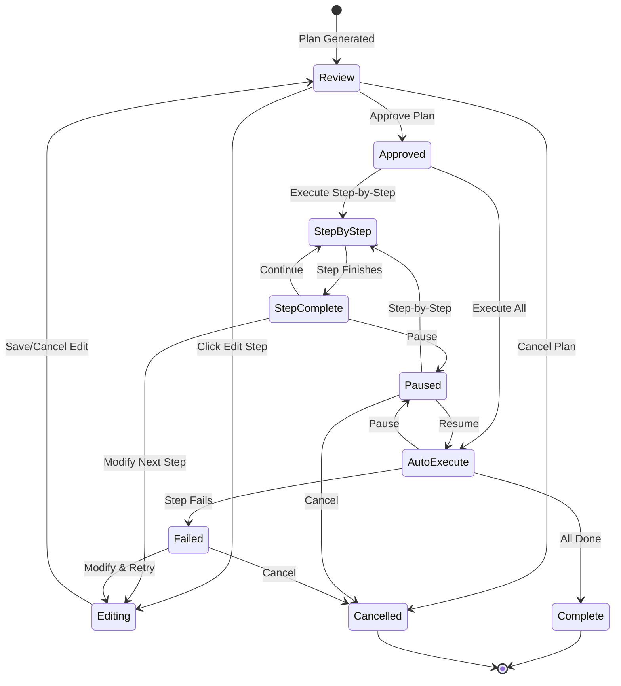

# Phase 3.3: Approval Workflow

**Version:** 1.0.0  
**Status:** Draft  
**Updated:** 2026-01-29  
**Parent:** [03-plan-mode.md](./03-plan-mode.md)

---

## Overview

User-facing approval workflow UI allowing plan review, step modification, and execution control. Follows Draft → Approval → Execution pattern.

---

## Workflow States



---

## UI Components

### PlanApprovalPanel

```typescript
// components/ai/PlanApprovalPanel.tsx

import { useState } from 'react';
import { 
  Check, X, Play, Pause, SkipForward, 
  ChevronDown, ChevronRight, AlertTriangle,
  Clock, Loader2, Edit3, RotateCcw
} from 'lucide-react';
import { Button } from '@/components/ui/button';
import { Card, CardHeader, CardContent, CardFooter } from '@/components/ui/card';
import { Badge } from '@/components/ui/badge';
import { Progress } from '@/components/ui/progress';
import { Separator } from '@/components/ui/separator';
import { 
  AlertDialog, AlertDialogAction, AlertDialogCancel,
  AlertDialogContent, AlertDialogDescription, AlertDialogFooter,
  AlertDialogHeader, AlertDialogTitle, AlertDialogTrigger 
} from '@/components/ui/alert-dialog';
import { ExecutionPlan, PlanStep, PlanStatus } from '@/types/plan';
import { MermaidDiagram } from './MermaidDiagram';
import { StepEditor } from './StepEditor';
import { cn } from '@/lib/utils';

interface PlanApprovalPanelProps {
  plan: ExecutionPlan;
  onApprove: () => Promise<void>;
  onCancel: () => Promise<void>;
  onModifyStep: (stepId: string, updates: Partial<PlanStep>) => Promise<void>;
  onExecuteStep: (stepIndex: number) => Promise<void>;
  onExecuteAll: () => Promise<void>;
  onPause: () => Promise<void>;
  onResume: () => Promise<void>;
  onSkipStep: (stepIndex: number) => Promise<void>;
  onRetryStep: (stepIndex: number) => Promise<void>;
}

export function PlanApprovalPanel({
  plan,
  onApprove,
  onCancel,
  onModifyStep,
  onExecuteStep,
  onExecuteAll,
  onPause,
  onResume,
  onSkipStep,
  onRetryStep,
}: PlanApprovalPanelProps) {
  const [editingStepId, setEditingStepId] = useState<string | null>(null);
  const [expandedSteps, setExpandedSteps] = useState<Set<string>>(new Set());
  const [showDiagram, setShowDiagram] = useState(true);
  const [isLoading, setIsLoading] = useState(false);
  
  const completedSteps = plan.steps.filter(s => s.status === 'completed').length;
  const progress = (completedSteps / plan.steps.length) * 100;
  
  const isDraft = plan.status === 'draft';
  const isApproved = plan.status === 'approved';
  const isExecuting = plan.status === 'executing';
  const isPaused = plan.status === 'paused';
  const isFailed = plan.status === 'failed';
  const isComplete = plan.status === 'completed';
  
  const toggleStepExpanded = (stepId: string) => {
    setExpandedSteps(prev => {
      const next = new Set(prev);
      if (next.has(stepId)) {
        next.delete(stepId);
      } else {
        next.add(stepId);
      }
      return next;
    });
  };
  
  const handleApprove = async () => {
    setIsLoading(true);
    try {
      await onApprove();
    } finally {
      setIsLoading(false);
    }
  };
  
  const handleCancel = async () => {
    setIsLoading(true);
    try {
      await onCancel();
    } finally {
      setIsLoading(false);
    }
  };
  
  return (
    <Card className="w-full">
      <CardHeader className="pb-3">
        <div className="flex items-start justify-between">
          <div className="space-y-1">
            <div className="flex items-center gap-2">
              <h3 className="text-lg font-semibold">Execution Plan</h3>
              <PlanStatusBadge status={plan.status} />
            </div>
            {plan.summary && (
              <p className="text-sm text-muted-foreground">{plan.summary}</p>
            )}
          </div>
          
          {plan.estimatedTotalDuration && (
            <div className="flex items-center gap-1 text-sm text-muted-foreground">
              <Clock className="h-4 w-4" />
              {plan.estimatedTotalDuration}
            </div>
          )}
        </div>
        
        {/* Progress bar for execution */}
        {(isExecuting || isPaused || isComplete) && (
          <div className="mt-3 space-y-1">
            <div className="flex justify-between text-xs text-muted-foreground">
              <span>Progress</span>
              <span>{completedSteps} / {plan.steps.length} steps</span>
            </div>
            <Progress value={progress} className="h-2" />
          </div>
        )}
      </CardHeader>
      
      <CardContent className="space-y-4">
        {/* Mermaid Diagram */}
        {plan.mermaidDiagram && (
          <div className="space-y-2">
            <Button
              variant="ghost"
              size="sm"
              className="w-full justify-start"
              onClick={() => setShowDiagram(!showDiagram)}
            >
              {showDiagram ? (
                <ChevronDown className="h-4 w-4 mr-2" />
              ) : (
                <ChevronRight className="h-4 w-4 mr-2" />
              )}
              Workflow Diagram
            </Button>
            
            {showDiagram && (
              <Card className="bg-muted/30">
                <CardContent className="p-4">
                  <MermaidDiagram 
                    code={plan.mermaidDiagram} 
                    highlightStep={plan.currentStepIndex}
                  />
                </CardContent>
              </Card>
            )}
          </div>
        )}
        
        <Separator />
        
        {/* Steps List */}
        <div className="space-y-2">
          <h4 className="text-sm font-medium">Steps</h4>
          
          {plan.steps.map((step, index) => (
            <StepCard
              key={step.id}
              step={step}
              index={index}
              isCurrentStep={index === plan.currentStepIndex}
              isEditing={editingStepId === step.id}
              isExpanded={expandedSteps.has(step.id)}
              planStatus={plan.status}
              onToggleExpand={() => toggleStepExpanded(step.id)}
              onEdit={() => setEditingStepId(step.id)}
              onSaveEdit={async (updates) => {
                await onModifyStep(step.id, updates);
                setEditingStepId(null);
              }}
              onCancelEdit={() => setEditingStepId(null)}
              onExecute={() => onExecuteStep(index)}
              onSkip={() => onSkipStep(index)}
              onRetry={() => onRetryStep(index)}
            />
          ))}
        </div>
      </CardContent>
      
      <CardFooter className="flex justify-between border-t pt-4">
        {/* Left actions */}
        <div>
          {(isDraft || isFailed) && (
            <AlertDialog>
              <AlertDialogTrigger asChild>
                <Button variant="outline" size="sm" disabled={isLoading}>
                  <X className="h-4 w-4 mr-1" />
                  Cancel Plan
                </Button>
              </AlertDialogTrigger>
              <AlertDialogContent>
                <AlertDialogHeader>
                  <AlertDialogTitle>Cancel Execution Plan?</AlertDialogTitle>
                  <AlertDialogDescription>
                    This will discard the plan. Any completed steps will remain, but no further execution will occur.
                  </AlertDialogDescription>
                </AlertDialogHeader>
                <AlertDialogFooter>
                  <AlertDialogCancel>Keep Plan</AlertDialogCancel>
                  <AlertDialogAction onClick={handleCancel}>
                    Cancel Plan
                  </AlertDialogAction>
                </AlertDialogFooter>
              </AlertDialogContent>
            </AlertDialog>
          )}
          
          {(isExecuting) && (
            <Button variant="outline" size="sm" onClick={onPause}>
              <Pause className="h-4 w-4 mr-1" />
              Pause
            </Button>
          )}
          
          {isPaused && (
            <Button variant="outline" size="sm" onClick={handleCancel}>
              <X className="h-4 w-4 mr-1" />
              Cancel
            </Button>
          )}
        </div>
        
        {/* Right actions */}
        <div className="flex gap-2">
          {isDraft && (
            <Button 
              size="sm" 
              onClick={handleApprove}
              disabled={isLoading}
            >
              {isLoading ? (
                <Loader2 className="h-4 w-4 mr-1 animate-spin" />
              ) : (
                <Check className="h-4 w-4 mr-1" />
              )}
              Approve Plan
            </Button>
          )}
          
          {isApproved && (
            <>
              <Button 
                variant="outline" 
                size="sm" 
                onClick={() => onExecuteStep(0)}
              >
                <Play className="h-4 w-4 mr-1" />
                Step-by-Step
              </Button>
              <Button size="sm" onClick={onExecuteAll}>
                <Play className="h-4 w-4 mr-1" />
                Execute All
              </Button>
            </>
          )}
          
          {isPaused && (
            <>
              <Button 
                variant="outline" 
                size="sm" 
                onClick={() => onExecuteStep(plan.currentStepIndex)}
              >
                <SkipForward className="h-4 w-4 mr-1" />
                Next Step
              </Button>
              <Button size="sm" onClick={onResume}>
                <Play className="h-4 w-4 mr-1" />
                Resume All
              </Button>
            </>
          )}
          
          {isFailed && (
            <Button 
              size="sm" 
              onClick={() => onRetryStep(plan.currentStepIndex)}
            >
              <RotateCcw className="h-4 w-4 mr-1" />
              Retry Failed Step
            </Button>
          )}
          
          {isComplete && (
            <div className="flex items-center gap-2 text-sm text-success">
              <Check className="h-4 w-4" />
              Plan completed successfully
            </div>
          )}
        </div>
      </CardFooter>
    </Card>
  );
}

// Status badge component
function PlanStatusBadge({ status }: { status: PlanStatus }) {
  const variants: Record<PlanStatus, { variant: string; label: string }> = {
    draft: { variant: 'secondary', label: 'Draft' },
    approved: { variant: 'default', label: 'Approved' },
    executing: { variant: 'default', label: 'Executing' },
    paused: { variant: 'warning', label: 'Paused' },
    completed: { variant: 'success', label: 'Completed' },
    cancelled: { variant: 'secondary', label: 'Cancelled' },
    failed: { variant: 'destructive', label: 'Failed' },
  };
  
  const { variant, label } = variants[status];
  
  return (
    <Badge variant={variant as any} className="text-xs">
      {status === 'executing' && (
        <Loader2 className="h-3 w-3 mr-1 animate-spin" />
      )}
      {label}
    </Badge>
  );
}
```

### StepCard Component

```typescript
// components/ai/StepCard.tsx

import { useState } from 'react';
import { 
  Check, X, Play, Loader2, AlertCircle, 
  ChevronDown, ChevronRight, Edit3, SkipForward, RotateCcw
} from 'lucide-react';
import { Button } from '@/components/ui/button';
import { Card, CardContent } from '@/components/ui/card';
import { Badge } from '@/components/ui/badge';
import { Collapsible, CollapsibleTrigger, CollapsibleContent } from '@/components/ui/collapsible';
import { PlanStep, StepStatus, PlanStatus } from '@/types/plan';
import { StepEditor } from './StepEditor';
import { cn } from '@/lib/utils';

interface StepCardProps {
  step: PlanStep;
  index: number;
  isCurrentStep: boolean;
  isEditing: boolean;
  isExpanded: boolean;
  planStatus: PlanStatus;
  onToggleExpand: () => void;
  onEdit: () => void;
  onSaveEdit: (updates: Partial<PlanStep>) => Promise<void>;
  onCancelEdit: () => void;
  onExecute: () => void;
  onSkip: () => void;
  onRetry: () => void;
}

export function StepCard({
  step,
  index,
  isCurrentStep,
  isEditing,
  isExpanded,
  planStatus,
  onToggleExpand,
  onEdit,
  onSaveEdit,
  onCancelEdit,
  onExecute,
  onSkip,
  onRetry,
}: StepCardProps) {
  const canEdit = planStatus === 'draft' || 
    (planStatus === 'paused' && step.status === 'pending');
  const canExecute = step.status === 'ready' && 
    (planStatus === 'approved' || planStatus === 'paused');
  const canSkip = step.status === 'pending' || step.status === 'ready';
  const canRetry = step.status === 'failed';
  
  return (
    <Card className={cn(
      'transition-all duration-200',
      isCurrentStep && 'ring-2 ring-primary shadow-md',
      step.status === 'completed' && 'opacity-70',
      step.status === 'skipped' && 'opacity-50',
    )}>
      <Collapsible open={isExpanded} onOpenChange={onToggleExpand}>
        <div className="flex items-start gap-3 p-3">
          {/* Step indicator */}
          <div className="flex flex-col items-center gap-1 pt-0.5">
            <StepIndicator status={step.status} index={index} />
          </div>
          
          {/* Content */}
          <div className="flex-1 min-w-0">
            <div className="flex items-center gap-2 flex-wrap">
              <CollapsibleTrigger asChild>
                <Button variant="ghost" size="sm" className="h-auto p-0 hover:bg-transparent">
                  {isExpanded ? (
                    <ChevronDown className="h-4 w-4 mr-1" />
                  ) : (
                    <ChevronRight className="h-4 w-4 mr-1" />
                  )}
                  <span className="font-medium text-sm">{step.title}</span>
                </Button>
              </CollapsibleTrigger>
              
              <StepTypeBadge type={step.type} />
              
              {step.estimatedDuration && (
                <span className="text-xs text-muted-foreground">
                  {step.estimatedDuration}
                </span>
              )}
              
              {step.status === 'running' && (
                <Loader2 className="h-3 w-3 animate-spin text-primary" />
              )}
            </div>
            
            {/* Error message */}
            {step.error && (
              <div className="mt-2 p-2 rounded bg-destructive/10 text-destructive text-xs flex items-start gap-2">
                <AlertCircle className="h-4 w-4 flex-shrink-0 mt-0.5" />
                <span>{step.error}</span>
              </div>
            )}
            
            {/* Expanded content */}
            <CollapsibleContent className="mt-3 space-y-3">
              {isEditing ? (
                <StepEditor
                  step={step}
                  onSave={onSaveEdit}
                  onCancel={onCancelEdit}
                />
              ) : (
                <>
                  <p className="text-sm text-muted-foreground">
                    {step.description}
                  </p>
                  
                  {/* Dependencies */}
                  {step.dependencies.length > 0 && (
                    <div className="text-xs text-muted-foreground">
                      <span className="font-medium">Depends on: </span>
                      {step.dependencies.join(', ')}
                    </div>
                  )}
                  
                  {/* Outputs */}
                  {step.outputs && Object.keys(step.outputs).length > 0 && (
                    <div className="text-xs">
                      <span className="font-medium">Outputs: </span>
                      <pre className="mt-1 p-2 rounded bg-muted text-xs overflow-x-auto">
                        {JSON.stringify(step.outputs, null, 2)}
                      </pre>
                    </div>
                  )}
                </>
              )}
            </CollapsibleContent>
          </div>
          
          {/* Actions */}
          <div className="flex items-center gap-1">
            {canEdit && !isEditing && (
              <Button variant="ghost" size="icon" onClick={onEdit}>
                <Edit3 className="h-4 w-4" />
              </Button>
            )}
            
            {canSkip && (
              <Button variant="ghost" size="icon" onClick={onSkip}>
                <SkipForward className="h-4 w-4" />
              </Button>
            )}
            
            {canExecute && (
              <Button variant="ghost" size="icon" onClick={onExecute}>
                <Play className="h-4 w-4" />
              </Button>
            )}
            
            {canRetry && (
              <Button variant="ghost" size="icon" onClick={onRetry}>
                <RotateCcw className="h-4 w-4" />
              </Button>
            )}
          </div>
        </div>
      </Collapsible>
    </Card>
  );
}

function StepIndicator({ status, index }: { status: StepStatus; index: number }) {
  const baseClasses = "flex items-center justify-center w-6 h-6 rounded-full text-xs font-medium";
  
  switch (status) {
    case 'completed':
      return (
        <div className={cn(baseClasses, 'bg-success text-success-foreground')}>
          <Check className="h-3 w-3" />
        </div>
      );
    case 'running':
      return (
        <div className={cn(baseClasses, 'bg-primary text-primary-foreground')}>
          <Loader2 className="h-3 w-3 animate-spin" />
        </div>
      );
    case 'failed':
      return (
        <div className={cn(baseClasses, 'bg-destructive text-destructive-foreground')}>
          <X className="h-3 w-3" />
        </div>
      );
    case 'skipped':
      return (
        <div className={cn(baseClasses, 'bg-muted text-muted-foreground')}>
          <SkipForward className="h-3 w-3" />
        </div>
      );
    case 'ready':
      return (
        <div className={cn(baseClasses, 'bg-primary/20 text-primary border-2 border-primary')}>
          {index + 1}
        </div>
      );
    case 'blocked':
      return (
        <div className={cn(baseClasses, 'bg-warning/20 text-warning border-2 border-warning')}>
          {index + 1}
        </div>
      );
    default:
      return (
        <div className={cn(baseClasses, 'bg-muted text-muted-foreground border-2 border-muted-foreground')}>
          {index + 1}
        </div>
      );
  }
}

function StepTypeBadge({ type }: { type: string }) {
  const colors: Record<string, string> = {
    analyze: 'bg-blue-500/10 text-blue-600 dark:text-blue-400',
    generate: 'bg-green-500/10 text-green-600 dark:text-green-400',
    modify: 'bg-yellow-500/10 text-yellow-600 dark:text-yellow-400',
    validate: 'bg-purple-500/10 text-purple-600 dark:text-purple-400',
    review: 'bg-indigo-500/10 text-indigo-600 dark:text-indigo-400',
    diagram: 'bg-pink-500/10 text-pink-600 dark:text-pink-400',
    execute: 'bg-orange-500/10 text-orange-600 dark:text-orange-400',
    wait: 'bg-gray-500/10 text-gray-600 dark:text-gray-400',
    conditional: 'bg-cyan-500/10 text-cyan-600 dark:text-cyan-400',
  };
  
  return (
    <Badge 
      variant="secondary" 
      className={cn('text-xs', colors[type] || 'bg-muted text-muted-foreground')}
    >
      {type}
    </Badge>
  );
}
```

### StepEditor Component

```typescript
// components/ai/StepEditor.tsx

import { useState } from 'react';
import { Check, X, Loader2 } from 'lucide-react';
import { Button } from '@/components/ui/button';
import { Input } from '@/components/ui/input';
import { Textarea } from '@/components/ui/textarea';
import { Select, SelectContent, SelectItem, SelectTrigger, SelectValue } from '@/components/ui/select';
import { Label } from '@/components/ui/label';
import { PlanStep, StepType } from '@/types/plan';

interface StepEditorProps {
  step: PlanStep;
  onSave: (updates: Partial<PlanStep>) => Promise<void>;
  onCancel: () => void;
}

export function StepEditor({ step, onSave, onCancel }: StepEditorProps) {
  const [title, setTitle] = useState(step.title);
  const [description, setDescription] = useState(step.description);
  const [type, setType] = useState(step.type);
  const [estimatedDuration, setEstimatedDuration] = useState(step.estimatedDuration || '');
  const [isSaving, setIsSaving] = useState(false);
  
  const stepTypes: StepType[] = [
    'analyze', 'generate', 'modify', 'validate', 
    'review', 'diagram', 'execute', 'wait', 'conditional'
  ];
  
  const handleSave = async () => {
    setIsSaving(true);
    try {
      await onSave({
        title,
        description,
        type,
        estimatedDuration: estimatedDuration || undefined,
      });
    } finally {
      setIsSaving(false);
    }
  };
  
  return (
    <div className="space-y-3 p-3 rounded-lg border bg-muted/30">
      <div className="space-y-2">
        <Label htmlFor="step-title">Title</Label>
        <Input
          id="step-title"
          value={title}
          onChange={(e) => setTitle(e.target.value)}
          placeholder="Step title"
        />
      </div>
      
      <div className="space-y-2">
        <Label htmlFor="step-description">Description</Label>
        <Textarea
          id="step-description"
          value={description}
          onChange={(e) => setDescription(e.target.value)}
          placeholder="What this step does..."
          rows={3}
        />
      </div>
      
      <div className="grid grid-cols-2 gap-3">
        <div className="space-y-2">
          <Label htmlFor="step-type">Type</Label>
          <Select value={type} onValueChange={(v) => setType(v as StepType)}>
            <SelectTrigger id="step-type">
              <SelectValue />
            </SelectTrigger>
            <SelectContent>
              {stepTypes.map((t) => (
                <SelectItem key={t} value={t}>
                  {t}
                </SelectItem>
              ))}
            </SelectContent>
          </Select>
        </div>
        
        <div className="space-y-2">
          <Label htmlFor="step-duration">Est. Duration</Label>
          <Input
            id="step-duration"
            value={estimatedDuration}
            onChange={(e) => setEstimatedDuration(e.target.value)}
            placeholder="~2 min"
          />
        </div>
      </div>
      
      <div className="flex justify-end gap-2 pt-2">
        <Button variant="outline" size="sm" onClick={onCancel} disabled={isSaving}>
          <X className="h-4 w-4 mr-1" />
          Cancel
        </Button>
        <Button size="sm" onClick={handleSave} disabled={isSaving}>
          {isSaving ? (
            <Loader2 className="h-4 w-4 mr-1 animate-spin" />
          ) : (
            <Check className="h-4 w-4 mr-1" />
          )}
          Save Changes
        </Button>
      </div>
    </div>
  );
}
```

---

## usePlanApproval Hook

```typescript
// hooks/usePlanApproval.ts

import { useState, useCallback } from 'react';
import { useMutation, useQueryClient } from '@tanstack/react-query';
import { ExecutionPlan, PlanStep } from '@/types/plan';
import { useOfflineStorage } from './useOfflineStorage';

export function usePlanApproval(planId: string | null) {
  const queryClient = useQueryClient();
  const { saveWithSync } = useOfflineStorage();
  const [plan, setPlan] = useState<ExecutionPlan | null>(null);
  
  const approvePlan = useMutation({
    mutationFn: async () => {
      if (!planId) throw new Error('No plan');
      
      const response = await fetch(`/api/v1/plans/${planId}/approve`, {
        method: 'POST',
      });
      
      if (!response.ok) throw new Error('Failed to approve plan');
      return response.json();
    },
    onSuccess: (updatedPlan) => {
      setPlan(updatedPlan);
      saveWithSync(`plan:${planId}`, updatedPlan, 'plan', 'update');
      queryClient.invalidateQueries({ queryKey: ['plan', planId] });
    },
  });
  
  const cancelPlan = useMutation({
    mutationFn: async () => {
      if (!planId) throw new Error('No plan');
      
      const response = await fetch(`/api/v1/plans/${planId}/cancel`, {
        method: 'POST',
      });
      
      if (!response.ok) throw new Error('Failed to cancel plan');
      return response.json();
    },
    onSuccess: (updatedPlan) => {
      setPlan(updatedPlan);
      queryClient.invalidateQueries({ queryKey: ['plan', planId] });
    },
  });
  
  const modifyStep = useMutation({
    mutationFn: async ({ stepId, updates }: { stepId: string; updates: Partial<PlanStep> }) => {
      if (!planId) throw new Error('No plan');
      
      const response = await fetch(`/api/v1/plans/${planId}/steps/${stepId}`, {
        method: 'PATCH',
        headers: { 'Content-Type': 'application/json' },
        body: JSON.stringify(updates),
      });
      
      if (!response.ok) throw new Error('Failed to modify step');
      return response.json();
    },
    onSuccess: (updatedPlan) => {
      setPlan(updatedPlan);
      saveWithSync(`plan:${planId}`, updatedPlan, 'plan', 'update');
    },
  });
  
  const skipStep = useMutation({
    mutationFn: async (stepIndex: number) => {
      if (!planId) throw new Error('No plan');
      
      const response = await fetch(`/api/v1/plans/${planId}/steps/${stepIndex}/skip`, {
        method: 'POST',
      });
      
      if (!response.ok) throw new Error('Failed to skip step');
      return response.json();
    },
    onSuccess: (updatedPlan) => {
      setPlan(updatedPlan);
    },
  });
  
  return {
    plan,
    setPlan,
    approvePlan: approvePlan.mutateAsync,
    cancelPlan: cancelPlan.mutateAsync,
    modifyStep: (stepId: string, updates: Partial<PlanStep>) => 
      modifyStep.mutateAsync({ stepId, updates }),
    skipStep: skipStep.mutateAsync,
    isApproving: approvePlan.isPending,
    isCancelling: cancelPlan.isPending,
    isModifying: modifyStep.isPending,
  };
}
```

---

## Testing

| Test Case | Description | Expected Result |
|-----------|-------------|-----------------|
| Approve plan | Click approve button | Status changes to approved |
| Cancel draft | Cancel from draft state | Status changes to cancelled |
| Edit step | Modify step title/description | Step updated in plan |
| Skip step | Skip pending step | Step marked as skipped |
| Expand/collapse | Toggle step details | Collapsible animates |
| Retry failed | Retry from failed state | Step re-executes |
| Progress display | Execute steps | Progress bar updates |
| Keyboard nav | Tab through controls | Focus moves correctly |

---

## Related Specs

- [03-plan-mode.md](./03-plan-mode.md) - Parent spec
- [03-02-plan-execution.md](./03-02-plan-execution.md) - Execution engine
- [03-04-mermaid-integration.md](./03-04-mermaid-integration.md) - Diagram display
