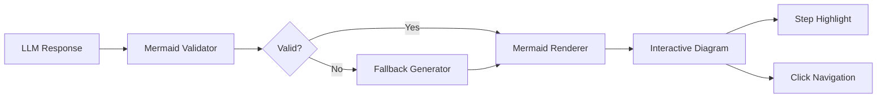

# Phase 3.4: Mermaid Diagram Integration

**Version:** 1.0.0  
**Status:** Draft  
**Updated:** 2026-01-29  
**Parent:** [03-plan-mode.md](./03-plan-mode.md)

---

## Overview

Mermaid diagram generation, validation, and rendering for plan visualization. Includes step highlighting and interactive navigation.

---

## Architecture



---

## Mermaid Validator

```go
// internal/ai/mermaid/validator.go

package mermaid

import (
	"fmt"
	"regexp"
	"strings"
)

type ValidationResult struct {
	Valid    bool     `json:"valid"`
	Errors   []string `json:"errors,omitempty"`
	Warnings []string `json:"warnings,omitempty"`
}

type Validator struct {
	maxNodes    int
	maxEdges    int
	allowedTypes []string
}

func NewValidator() *Validator {
	return &Validator{
		maxNodes: 50,
		maxEdges: 100,
		allowedTypes: []string{
			"flowchart", "graph", "sequenceDiagram", 
			"classDiagram", "stateDiagram", "erDiagram",
			"gantt", "pie", "journey",
		},
	}
}

func (v *Validator) Validate(code string) *ValidationResult {
	result := &ValidationResult{Valid: true}
	
	code = strings.TrimSpace(code)
	
	// Check empty
	if code == "" {
		result.Valid = false
		result.Errors = append(result.Errors, "Empty diagram code")
		return result
	}
	
	// Check diagram type
	lines := strings.Split(code, "\n")
	firstLine := strings.TrimSpace(lines[0])
	
	validType := false
	for _, t := range v.allowedTypes {
		if strings.HasPrefix(firstLine, t) {
			validType = true
			break
		}
	}
	
	if !validType {
		result.Valid = false
		result.Errors = append(result.Errors, 
			fmt.Sprintf("Invalid diagram type. Must start with one of: %s", 
				strings.Join(v.allowedTypes, ", ")))
		return result
	}
	
	// Check balanced brackets
	if err := v.checkBalancedBrackets(code); err != nil {
		result.Valid = false
		result.Errors = append(result.Errors, err.Error())
	}
	
	// Check for common syntax errors
	syntaxErrors := v.checkSyntax(code)
	if len(syntaxErrors) > 0 {
		result.Valid = false
		result.Errors = append(result.Errors, syntaxErrors...)
	}
	
	// Count nodes and edges
	nodeCount := v.countNodes(code)
	edgeCount := v.countEdges(code)
	
	if nodeCount > v.maxNodes {
		result.Warnings = append(result.Warnings, 
			fmt.Sprintf("Diagram has %d nodes (recommended max: %d)", nodeCount, v.maxNodes))
	}
	
	if edgeCount > v.maxEdges {
		result.Warnings = append(result.Warnings,
			fmt.Sprintf("Diagram has %d edges (recommended max: %d)", edgeCount, v.maxEdges))
	}
	
	return result
}

func (v *Validator) checkBalancedBrackets(code string) error {
	brackets := map[rune]rune{
		'[': ']',
		'{': '}',
		'(': ')',
	}
	
	stack := []rune{}
	inString := false
	
	for _, ch := range code {
		if ch == '"' || ch == '\'' {
			inString = !inString
			continue
		}
		
		if inString {
			continue
		}
		
		if _, isOpen := brackets[ch]; isOpen {
			stack = append(stack, ch)
		}
		
		for open, close := range brackets {
			if ch == close {
				if len(stack) == 0 || stack[len(stack)-1] != open {
					return fmt.Errorf("unbalanced %c bracket", ch)
				}
				stack = stack[:len(stack)-1]
			}
		}
	}
	
	if len(stack) > 0 {
		return fmt.Errorf("unclosed bracket: %c", stack[len(stack)-1])
	}
	
	return nil
}

func (v *Validator) checkSyntax(code string) []string {
	var errors []string
	
	// Check for invalid arrow syntax
	invalidArrows := regexp.MustCompile(`[<>]-{3,}[<>]`)
	if invalidArrows.MatchString(code) {
		errors = append(errors, "Invalid arrow syntax (too many dashes)")
	}
	
	// Check for unclosed node labels
	unclosedLabel := regexp.MustCompile(`\[[^\]]*$`)
	for _, line := range strings.Split(code, "\n") {
		if unclosedLabel.MatchString(line) {
			errors = append(errors, fmt.Sprintf("Unclosed label in: %s", strings.TrimSpace(line)))
		}
	}
	
	return errors
}

func (v *Validator) countNodes(code string) int {
	// Match node definitions: A[label], B{label}, C(label), etc.
	nodePattern := regexp.MustCompile(`[A-Za-z_][A-Za-z0-9_]*[\[\{\(]`)
	matches := nodePattern.FindAllString(code, -1)
	
	// Deduplicate
	seen := make(map[string]bool)
	for _, m := range matches {
		nodeID := m[:len(m)-1] // Remove bracket
		seen[nodeID] = true
	}
	
	return len(seen)
}

func (v *Validator) countEdges(code string) int {
	// Match arrow patterns: -->, --->, ==>, -.->
	edgePattern := regexp.MustCompile(`[-=.]+>`)
	return len(edgePattern.FindAllString(code, -1))
}
```

---

## Fallback Diagram Generator

```go
// internal/ai/mermaid/fallback.go

package mermaid

import (
	"fmt"
	"strings"
)

type Step struct {
	ID           string
	Title        string
	Dependencies []string
	Type         string
}

// GenerateFallback creates a simple flowchart from steps
func GenerateFallback(steps []Step) string {
	var builder strings.Builder
	builder.WriteString("flowchart TD\n")
	
	// Track nodes and edges
	edges := make(map[string][]string)
	
	for _, step := range steps {
		// Add node with type-based shape
		nodeShape := getNodeShape(step.Type)
		builder.WriteString(fmt.Sprintf("    %s%s%s%s\n", 
			step.ID,
			nodeShape.open,
			sanitizeLabel(step.Title),
			nodeShape.close,
		))
		
		// Track dependencies
		if len(step.Dependencies) == 0 && step.ID != steps[0].ID {
			// Connect to previous step if no explicit dependencies
			prevStep := steps[findPrevIndex(steps, step.ID)]
			edges[prevStep.ID] = append(edges[prevStep.ID], step.ID)
		} else {
			for _, dep := range step.Dependencies {
				edges[dep] = append(edges[dep], step.ID)
			}
		}
	}
	
	builder.WriteString("\n")
	
	// Add edges
	for from, tos := range edges {
		for _, to := range tos {
			builder.WriteString(fmt.Sprintf("    %s --> %s\n", from, to))
		}
	}
	
	// Add styling based on step types
	builder.WriteString("\n")
	for _, step := range steps {
		style := getNodeStyle(step.Type)
		if style != "" {
			builder.WriteString(fmt.Sprintf("    style %s %s\n", step.ID, style))
		}
	}
	
	return builder.String()
}

type nodeShape struct {
	open  string
	close string
}

func getNodeShape(stepType string) nodeShape {
	shapes := map[string]nodeShape{
		"analyze":     {"[", "]"},
		"generate":    {"[/", "/]"},
		"modify":      {"[", "]"},
		"validate":    {"{", "}"},
		"review":      {"((", "))"},
		"diagram":     {"[", "]"},
		"execute":     {"[[", "]]"},
		"wait":        {"(", ")"},
		"conditional": {"{", "}"},
	}
	
	if shape, ok := shapes[stepType]; ok {
		return shape
	}
	return nodeShape{"[", "]"}
}

func getNodeStyle(stepType string) string {
	styles := map[string]string{
		"analyze":   "fill:#e3f2fd,stroke:#1976d2",
		"generate":  "fill:#e8f5e9,stroke:#388e3c",
		"modify":    "fill:#fff8e1,stroke:#f9a825",
		"validate":  "fill:#f3e5f5,stroke:#7b1fa2",
		"execute":   "fill:#fff3e0,stroke:#ef6c00",
		"wait":      "fill:#eceff1,stroke:#546e7a",
	}
	
	if style, ok := styles[stepType]; ok {
		return style
	}
	return ""
}

func sanitizeLabel(label string) string {
	// Escape special Mermaid characters
	label = strings.ReplaceAll(label, "[", "(")
	label = strings.ReplaceAll(label, "]", ")")
	label = strings.ReplaceAll(label, "{", "(")
	label = strings.ReplaceAll(label, "}", ")")
	label = strings.ReplaceAll(label, "\"", "'")
	
	// Truncate long labels
	if len(label) > 40 {
		label = label[:37] + "..."
	}
	
	return label
}

func findPrevIndex(steps []Step, currentID string) int {
	for i, s := range steps {
		if s.ID == currentID && i > 0 {
			return i - 1
		}
	}
	return 0
}
```

---

## React Mermaid Component

```typescript
// components/ai/MermaidDiagram.tsx

import { useEffect, useRef, useState, useCallback } from 'react';
import mermaid from 'mermaid';
import { ZoomIn, ZoomOut, Maximize2, Download } from 'lucide-react';
import { Button } from '@/components/ui/button';
import { cn } from '@/lib/utils';

// Initialize mermaid with theme
mermaid.initialize({
  startOnLoad: false,
  theme: 'base',
  themeVariables: {
    primaryColor: 'hsl(var(--primary))',
    primaryTextColor: 'hsl(var(--primary-foreground))',
    primaryBorderColor: 'hsl(var(--primary))',
    lineColor: 'hsl(var(--muted-foreground))',
    secondaryColor: 'hsl(var(--secondary))',
    tertiaryColor: 'hsl(var(--muted))',
    background: 'hsl(var(--background))',
    mainBkg: 'hsl(var(--card))',
    textColor: 'hsl(var(--foreground))',
    fontSize: '14px',
  },
  flowchart: {
    curve: 'basis',
    padding: 20,
    nodeSpacing: 50,
    rankSpacing: 50,
  },
  securityLevel: 'strict',
});

interface MermaidDiagramProps {
  code: string;
  highlightStep?: number;
  onStepClick?: (stepId: string) => void;
  className?: string;
}

export function MermaidDiagram({
  code,
  highlightStep,
  onStepClick,
  className,
}: MermaidDiagramProps) {
  const containerRef = useRef<HTMLDivElement>(null);
  const [svg, setSvg] = useState<string>('');
  const [error, setError] = useState<string | null>(null);
  const [zoom, setZoom] = useState(1);
  const [isPanEnabled, setIsPanEnabled] = useState(false);
  
  // Render diagram
  useEffect(() => {
    if (!code) return;
    
    const render = async () => {
      try {
        // Generate unique ID for this render
        const id = `mermaid-${Date.now()}`;
        
        // Add highlight styling if needed
        let modifiedCode = code;
        if (highlightStep !== undefined) {
          modifiedCode = addHighlightStyling(code, highlightStep);
        }
        
        const { svg: renderedSvg } = await mermaid.render(id, modifiedCode);
        setSvg(renderedSvg);
        setError(null);
      } catch (err) {
        console.error('Mermaid render error:', err);
        setError(err instanceof Error ? err.message : 'Failed to render diagram');
      }
    };
    
    render();
  }, [code, highlightStep]);
  
  // Handle node clicks
  useEffect(() => {
    if (!containerRef.current || !onStepClick) return;
    
    const handleClick = (e: MouseEvent) => {
      const target = e.target as Element;
      const node = target.closest('.node');
      if (node) {
        const nodeId = node.id?.replace('flowchart-', '').split('-')[0];
        if (nodeId) {
          onStepClick(nodeId);
        }
      }
    };
    
    containerRef.current.addEventListener('click', handleClick);
    return () => containerRef.current?.removeEventListener('click', handleClick);
  }, [svg, onStepClick]);
  
  const handleZoomIn = () => setZoom(z => Math.min(z + 0.25, 3));
  const handleZoomOut = () => setZoom(z => Math.max(z - 0.25, 0.5));
  const handleResetZoom = () => setZoom(1);
  
  const handleDownload = useCallback(() => {
    if (!svg) return;
    
    const blob = new Blob([svg], { type: 'image/svg+xml' });
    const url = URL.createObjectURL(blob);
    const a = document.createElement('a');
    a.href = url;
    a.download = 'diagram.svg';
    a.click();
    URL.revokeObjectURL(url);
  }, [svg]);
  
  if (error) {
    return (
      <div className="p-4 rounded-lg bg-destructive/10 text-destructive text-sm">
        <p className="font-medium">Failed to render diagram</p>
        <p className="text-xs mt-1 opacity-70">{error}</p>
        <pre className="mt-2 p-2 rounded bg-muted text-xs overflow-x-auto">
          {code}
        </pre>
      </div>
    );
  }
  
  return (
    <div className={cn('relative group', className)}>
      {/* Toolbar */}
      <div className="absolute top-2 right-2 z-10 flex gap-1 opacity-0 group-hover:opacity-100 transition-opacity">
        <Button variant="secondary" size="icon" onClick={handleZoomOut}>
          <ZoomOut className="h-4 w-4" />
        </Button>
        <Button variant="secondary" size="icon" onClick={handleResetZoom}>
          <Maximize2 className="h-4 w-4" />
        </Button>
        <Button variant="secondary" size="icon" onClick={handleZoomIn}>
          <ZoomIn className="h-4 w-4" />
        </Button>
        <Button variant="secondary" size="icon" onClick={handleDownload}>
          <Download className="h-4 w-4" />
        </Button>
      </div>
      
      {/* Diagram container */}
      <div 
        ref={containerRef}
        className={cn(
          'overflow-auto rounded-lg',
          onStepClick && 'cursor-pointer [&_.node]:hover:opacity-80 [&_.node]:transition-opacity',
        )}
        style={{
          transform: `scale(${zoom})`,
          transformOrigin: 'top left',
          maxHeight: '400px',
        }}
        dangerouslySetInnerHTML={{ __html: svg }}
      />
      
      {/* Zoom indicator */}
      {zoom !== 1 && (
        <div className="absolute bottom-2 left-2 text-xs text-muted-foreground bg-background/80 px-2 py-1 rounded">
          {Math.round(zoom * 100)}%
        </div>
      )}
    </div>
  );
}

// Add highlight styling to specific step
function addHighlightStyling(code: string, stepIndex: number): string {
  // This assumes step IDs follow pattern: step_0, step_1, etc.
  // or S0, S1, etc.
  const stepId = `step_${stepIndex}`;
  const altStepId = `S${stepIndex}`;
  
  // Add style directive for highlighted step
  const highlightStyle = `
    style ${stepId} fill:#fef3c7,stroke:#f59e0b,stroke-width:3px
    style ${altStepId} fill:#fef3c7,stroke:#f59e0b,stroke-width:3px
  `;
  
  return code + '\n' + highlightStyle;
}
```

---

## Diagram Generation Prompts

```go
// internal/ai/mermaid/prompts.go

package mermaid

const FlowchartPrompt = `Generate a Mermaid flowchart diagram for the execution plan.

Requirements:
1. Use flowchart TD (top-down) orientation
2. Each step should be a node with clear label
3. Show dependencies as arrows between nodes
4. Use decision diamonds for conditional steps
5. Mark parallel steps that can run concurrently
6. Keep diagram readable (max 15 nodes)

Node shapes:
- [label] for standard steps
- {label} for decisions
- ((label)) for review/validation
- [[label]] for external commands

Arrow types:
- --> for normal flow
- ==> for critical path (bold)
- -.-> for optional/conditional flow

Example:
flowchart TD
    A[Analyze Requirements] --> B[Generate Schema]
    B --> C{Validate?}
    C -->|Pass| D[Generate Code]
    C -->|Fail| E[Fix Issues]
    E --> C
    D --> F((Review Changes))
    F --> G[[Deploy]]
`

const SequenceDiagramPrompt = `Generate a Mermaid sequence diagram showing interactions.

Requirements:
1. Show actors/participants clearly
2. Use proper message types (sync, async, return)
3. Include activation boxes for processing time
4. Add notes for complex operations
5. Group related interactions with alt/opt/loop

Example:
sequenceDiagram
    participant User
    participant AI
    participant Backend
    
    User->>AI: Submit request
    activate AI
    AI->>Backend: Fetch context
    Backend-->>AI: Return specs
    AI->>AI: Generate plan
    AI-->>User: Display plan
    deactivate AI
`

const StateDiagramPrompt = `Generate a Mermaid state diagram for the workflow.

Requirements:
1. Show all possible states
2. Include transitions with trigger labels
3. Mark start and end states
4. Group related states if needed

Example:
stateDiagram-v2
    [*] --> Draft
    Draft --> Approved: approve
    Draft --> Cancelled: cancel
    Approved --> Executing: start
    Executing --> Completed: success
    Executing --> Failed: error
    Failed --> Executing: retry
    Completed --> [*]
`
```

---

## Mermaid Theme Configuration

```typescript
// lib/mermaid-config.ts

import type { MermaidConfig } from 'mermaid';

export function getMermaidConfig(isDark: boolean): MermaidConfig {
  return {
    startOnLoad: false,
    theme: 'base',
    themeVariables: isDark ? darkTheme : lightTheme,
    flowchart: {
      curve: 'basis',
      padding: 20,
      nodeSpacing: 50,
      rankSpacing: 50,
      htmlLabels: true,
      useMaxWidth: true,
    },
    sequence: {
      diagramMarginX: 50,
      diagramMarginY: 10,
      actorMargin: 50,
      width: 150,
      height: 65,
      boxMargin: 10,
      boxTextMargin: 5,
      noteMargin: 10,
      messageMargin: 35,
    },
    securityLevel: 'strict',
    logLevel: 'error',
  };
}

const lightTheme = {
  primaryColor: '#6366f1',
  primaryTextColor: '#ffffff',
  primaryBorderColor: '#4f46e5',
  lineColor: '#64748b',
  secondaryColor: '#f1f5f9',
  tertiaryColor: '#e2e8f0',
  background: '#ffffff',
  mainBkg: '#ffffff',
  textColor: '#1e293b',
  nodeBorder: '#cbd5e1',
  clusterBkg: '#f8fafc',
  clusterBorder: '#e2e8f0',
  fontSize: '14px',
  
  // Flowchart specific
  edgeLabelBackground: '#ffffff',
  
  // State diagram specific
  labelColor: '#1e293b',
  
  // Sequence diagram specific
  actorBkg: '#f1f5f9',
  actorBorder: '#cbd5e1',
  actorTextColor: '#1e293b',
  signalColor: '#64748b',
  signalTextColor: '#1e293b',
  noteBkgColor: '#fef3c7',
  noteBorderColor: '#f59e0b',
  noteTextColor: '#1e293b',
};

const darkTheme = {
  primaryColor: '#818cf8',
  primaryTextColor: '#ffffff',
  primaryBorderColor: '#6366f1',
  lineColor: '#94a3b8',
  secondaryColor: '#1e293b',
  tertiaryColor: '#334155',
  background: '#0f172a',
  mainBkg: '#1e293b',
  textColor: '#f1f5f9',
  nodeBorder: '#475569',
  clusterBkg: '#1e293b',
  clusterBorder: '#334155',
  fontSize: '14px',
  
  // Flowchart specific
  edgeLabelBackground: '#1e293b',
  
  // State diagram specific
  labelColor: '#f1f5f9',
  
  // Sequence diagram specific
  actorBkg: '#334155',
  actorBorder: '#475569',
  actorTextColor: '#f1f5f9',
  signalColor: '#94a3b8',
  signalTextColor: '#f1f5f9',
  noteBkgColor: '#422006',
  noteBorderColor: '#f59e0b',
  noteTextColor: '#fef3c7',
};
```

---

## useMermaid Hook

```typescript
// hooks/useMermaid.ts

import { useState, useEffect, useCallback } from 'react';
import mermaid from 'mermaid';
import { getMermaidConfig } from '@/lib/mermaid-config';
import { useTheme } from 'next-themes';

interface UseMermaidResult {
  svg: string;
  error: string | null;
  isLoading: boolean;
  rerender: () => void;
}

export function useMermaid(code: string): UseMermaidResult {
  const { resolvedTheme } = useTheme();
  const [svg, setSvg] = useState('');
  const [error, setError] = useState<string | null>(null);
  const [isLoading, setIsLoading] = useState(false);
  const [renderKey, setRenderKey] = useState(0);
  
  useEffect(() => {
    const isDark = resolvedTheme === 'dark';
    mermaid.initialize(getMermaidConfig(isDark));
  }, [resolvedTheme]);
  
  useEffect(() => {
    if (!code) {
      setSvg('');
      return;
    }
    
    const render = async () => {
      setIsLoading(true);
      setError(null);
      
      try {
        const id = `mermaid-${Date.now()}-${renderKey}`;
        const { svg: renderedSvg } = await mermaid.render(id, code);
        setSvg(renderedSvg);
      } catch (err) {
        const message = err instanceof Error ? err.message : 'Render failed';
        setError(message);
        setSvg('');
      } finally {
        setIsLoading(false);
      }
    };
    
    render();
  }, [code, renderKey, resolvedTheme]);
  
  const rerender = useCallback(() => {
    setRenderKey(k => k + 1);
  }, []);
  
  return { svg, error, isLoading, rerender };
}
```

---

## Testing

| Test Case | Description | Expected Result |
|-----------|-------------|-----------------|
| Valid flowchart | Render valid flowchart code | SVG displayed |
| Invalid syntax | Malformed Mermaid code | Error message shown |
| Empty code | No code provided | Empty container |
| Step highlight | Highlight step 2 | Step 2 has accent styling |
| Node click | Click on a node | onStepClick called with ID |
| Zoom controls | Zoom in/out | Diagram scales |
| Download SVG | Click download | SVG file downloaded |
| Theme switch | Toggle dark/light | Colors update |
| Fallback generation | Invalid LLM output | Simple flowchart generated |
| Large diagram | 50+ nodes | Warning shown, renders ok |

---

## Related Specs

- [03-plan-mode.md](./03-plan-mode.md) - Parent spec
- [04-mermaid-diagrams.md](./04-mermaid-diagrams.md) - General Mermaid spec
- [03-03-approval-workflow.md](./03-03-approval-workflow.md) - UI integration
