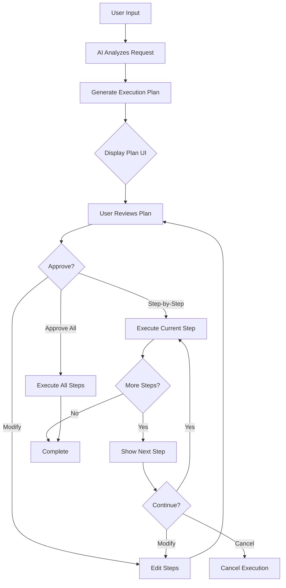

# Phase 3: Plan Mode

**Version:** 1.1.0  
**Status:** Draft  
**Updated:** 2026-01-29  

---

## Overview

New AI mode that shows a structured execution plan before running, similar to Lovable's planning feature. Users can review, modify steps, and approve before AI executes each phase.

**Workflow:** Draft → Approval → Execution

**Sub-Specifications:**
| File | Description |
|------|-------------|
| [03-01-plan-generation.md](./03-01-plan-generation.md) | AI plan generation service and prompts |
| [03-02-plan-execution.md](./03-02-plan-execution.md) | Step execution engine and state machine |
| [03-03-approval-workflow.md](./03-03-approval-workflow.md) | User approval UI and modification flow |
| [03-04-mermaid-integration.md](./03-04-mermaid-integration.md) | Mermaid diagram generation and rendering |

**Cross-References:**
- [AI Integration](../06-ai-integration/00-overview.md)
- [AI Chat UI](../06-ai-integration/08-ai-chat-ui.md)
- [Mermaid Diagrams](./04-mermaid-diagrams.md)

---

## Core Data Structures

### Execution Plan

```typescript
// types/plan.ts

export interface ExecutionPlan {
  id: string;
  projectId: string;
  sessionId: string;
  userPrompt: string;
  status: PlanStatus;
  steps: PlanStep[];
  createdAt: Date;
  approvedAt?: Date;
  completedAt?: Date;
  cancelledAt?: Date;
  currentStepIndex: number;
  mermaidDiagram?: string;
  summary?: string;
  estimatedTotalDuration?: string;
}

export type PlanStatus = 
  | 'draft'       // Plan generated, awaiting approval
  | 'approved'    // User approved, ready to execute
  | 'executing'   // Currently running steps
  | 'paused'      // User paused execution
  | 'completed'   // All steps finished
  | 'cancelled'   // User cancelled
  | 'failed';     // Step failed, execution stopped

export interface PlanStep {
  id: string;
  index: number;
  title: string;
  description: string;
  type: StepType;
  status: StepStatus;
  estimatedDuration?: string;
  dependencies: string[]; // IDs of steps that must complete first
  inputs?: Record<string, unknown>;
  outputs?: Record<string, unknown>;
  error?: string;
  startedAt?: Date;
  completedAt?: Date;
  retryCount?: number;
  maxRetries?: number;
}

export type StepType =
  | 'analyze'     // Analyze existing specs/code
  | 'generate'    // Generate new content
  | 'modify'      // Modify existing file
  | 'validate'    // Run consistency checks
  | 'review'      // AI self-review step
  | 'diagram'     // Generate architectural diagram
  | 'execute'     // Run external command (brun)
  | 'wait'        // Wait for user input
  | 'conditional' // Branching based on previous output

export type StepStatus =
  | 'pending'     // Not started
  | 'ready'       // Dependencies met, can execute
  | 'running'     // Currently executing
  | 'completed'   // Successfully finished
  | 'failed'      // Error occurred
  | 'skipped'     // User skipped this step
  | 'blocked';    // Dependencies not met
```

---

## Workflow Diagram



---

## Database Schema

```sql
-- Execution plans table
CREATE TABLE IF NOT EXISTS execution_plans (
  id TEXT PRIMARY KEY,
  project_id TEXT NOT NULL,
  session_id TEXT NOT NULL,
  user_prompt TEXT NOT NULL,
  summary TEXT,
  plan_data TEXT NOT NULL, -- JSON blob with steps
  mermaid_diagram TEXT,
  status TEXT DEFAULT 'draft' 
    CHECK (status IN ('draft', 'approved', 'executing', 'paused', 'completed', 'cancelled', 'failed')),
  current_step_index INTEGER DEFAULT 0,
  estimated_duration TEXT,
  created_at DATETIME DEFAULT CURRENT_TIMESTAMP,
  approved_at DATETIME,
  completed_at DATETIME,
  cancelled_at DATETIME,
  FOREIGN KEY (project_id) REFERENCES projects(id)
);

-- Step execution history for audit trail
CREATE TABLE IF NOT EXISTS plan_step_history (
  id TEXT PRIMARY KEY,
  plan_id TEXT NOT NULL,
  step_id TEXT NOT NULL,
  step_index INTEGER NOT NULL,
  status TEXT NOT NULL,
  started_at DATETIME,
  completed_at DATETIME,
  inputs TEXT, -- JSON
  outputs TEXT, -- JSON
  error TEXT,
  retry_count INTEGER DEFAULT 0,
  FOREIGN KEY (plan_id) REFERENCES execution_plans(id)
);

CREATE INDEX idx_plans_project ON execution_plans(project_id);
CREATE INDEX idx_plans_status ON execution_plans(status);
CREATE INDEX idx_step_history_plan ON plan_step_history(plan_id);
```

---

## API Endpoints

| Method | Endpoint | Description |
|--------|----------|-------------|
| POST | `/api/v1/plans/generate` | Generate new plan from prompt |
| GET | `/api/v1/plans/:id` | Get plan details |
| POST | `/api/v1/plans/:id/approve` | Approve plan for execution |
| POST | `/api/v1/plans/:id/cancel` | Cancel plan |
| PATCH | `/api/v1/plans/:id/steps/:stepId` | Modify step |
| POST | `/api/v1/plans/:id/steps/:index/execute` | Execute single step |
| POST | `/api/v1/plans/:id/execute-all` | Execute all remaining steps |
| POST | `/api/v1/plans/:id/pause` | Pause execution |
| POST | `/api/v1/plans/:id/resume` | Resume execution |
| GET | `/api/v1/plans/:id/history` | Get step execution history |

---

## Testing Checklist

| Test | Description | Priority |
|------|-------------|----------|
| Plan generation | Valid plan returned from LLM | Critical |
| Mermaid generation | Valid Mermaid syntax in response | Critical |
| Step modification | User can edit step before approval | Critical |
| Step-by-step execution | Each step executes correctly | Critical |
| Execute all | All steps run in sequence | High |
| Pause/resume | Execution can be paused and resumed | High |
| Failure handling | Failed step stops execution gracefully | High |
| Retry logic | Failed steps retry with backoff | High |
| Dependency resolution | Steps wait for dependencies | Medium |
| Mermaid rendering | Workflow diagram displays correctly | Medium |
| Offline plan storage | Plans persist in localStorage | Medium |

---

## Related Specs

- [AI Integration](../06-ai-integration/00-overview.md)
- [Mermaid Diagrams](./04-mermaid-diagrams.md)
- [AI Chat UI](../06-ai-integration/08-ai-chat-ui.md)
- [Offline Storage](./01-offline-first-storage.md)
