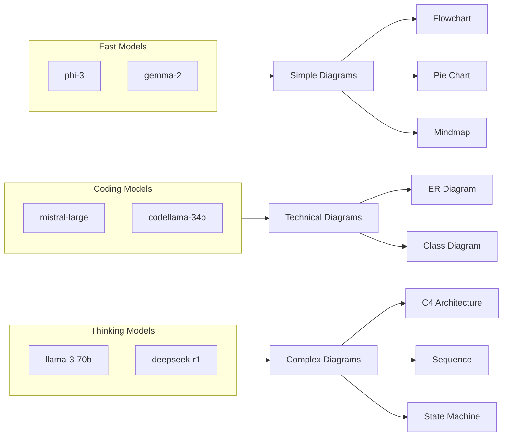

# Phase 4.1: Model Categorization for Diagrams

**Version:** 1.0.0  
**Status:** Draft  
**Updated:** 2026-01-29  
**Parent:** [04-mermaid-diagrams.md](./04-mermaid-diagrams.md)

---

## Overview

AI model categorization system that selects the optimal model for each diagram type based on capabilities, performance, and availability.

---

## Model Categories



---

## Model Capability Matrix

| Model | Flowchart | Sequence | Class | ER | State | C4 | Gantt | Journey |
|-------|:---------:|:--------:|:-----:|:--:|:-----:|:--:|:-----:|:-------:|
| llama-3-70b | ★★★ | ★★★ | ★★★ | ★★ | ★★★ | ★★★ | ★★ | ★★★ |
| deepseek-r1 | ★★★ | ★★★ | ★★★ | ★★ | ★★★ | ★★★ | ★★ | ★★ |
| mistral-large | ★★ | ★★ | ★★★ | ★★★ | ★★ | ★★ | ★★★ | ★★ |
| codellama-34b | ★★ | ★★ | ★★★ | ★★★ | ★★ | ★ | ★ | ★ |
| phi-3 | ★★ | ★ | ★ | ★ | ★ | ★ | ★★ | ★ |
| gemma-2 | ★★ | ★ | ★ | ★ | ★ | ★ | ★ | ★ |

**Rating:** ★★★ = Excellent, ★★ = Good, ★ = Basic

---

## Model Configuration

### Seeding Configuration

```yaml
# config/diagram-models.yaml

models:
  # Thinking models - best for complex architectural diagrams
  - id: "llama-3-70b"
    name: "LLaMA 3 70B"
    provider: "ollama"
    category: "thinking"
    priority: 1
    capabilities:
      - flowchart
      - sequence
      - class
      - state
      - c4
      - journey
    parameters:
      temperature: 0.2
      max_tokens: 4096
      context_window: 8192
    enabled: true
    
  - id: "deepseek-r1"
    name: "DeepSeek R1"
    provider: "ollama"
    category: "thinking"
    priority: 2
    capabilities:
      - flowchart
      - sequence
      - class
      - state
      - c4
    parameters:
      temperature: 0.1
      max_tokens: 4096
      context_window: 32768
    enabled: true
    
  # Coding models - best for technical/database diagrams
  - id: "mistral-large"
    name: "Mistral Large"
    provider: "ollama"
    category: "coding"
    priority: 1
    capabilities:
      - flowchart
      - sequence
      - class
      - er
      - gantt
      - mindmap
    parameters:
      temperature: 0.2
      max_tokens: 4096
    enabled: true
    
  - id: "codellama-34b"
    name: "CodeLlama 34B"
    provider: "ollama"
    category: "coding"
    priority: 2
    capabilities:
      - class
      - er
    parameters:
      temperature: 0.1
      max_tokens: 2048
    enabled: true
    
  # Fast models - for simple diagrams and quick iteration
  - id: "phi-3"
    name: "Phi-3 Medium"
    provider: "ollama"
    category: "fast"
    priority: 1
    capabilities:
      - flowchart
      - pie
      - gantt
    parameters:
      temperature: 0.3
      max_tokens: 2048
    enabled: true
    
  - id: "gemma-2"
    name: "Gemma 2 9B"
    provider: "ollama"
    category: "fast"
    priority: 2
    capabilities:
      - flowchart
      - pie
    parameters:
      temperature: 0.3
      max_tokens: 2048
    enabled: true

# Default model for each diagram type
defaults:
  flowchart: "llama-3-70b"
  sequence: "llama-3-70b"
  class: "mistral-large"
  er: "mistral-large"
  state: "llama-3-70b"
  c4: "llama-3-70b"
  gantt: "mistral-large"
  pie: "phi-3"
  journey: "llama-3-70b"
  mindmap: "mistral-large"
  git: "phi-3"

# Fallback chain when primary model unavailable
fallbacks:
  llama-3-70b: ["deepseek-r1", "mistral-large"]
  deepseek-r1: ["llama-3-70b", "mistral-large"]
  mistral-large: ["codellama-34b", "llama-3-70b"]
  codellama-34b: ["mistral-large", "llama-3-70b"]
  phi-3: ["gemma-2", "mistral-large"]
  gemma-2: ["phi-3", "mistral-large"]
```

---

## Model Selector Service

```go
// internal/ai/diagram/model_selector.go

package diagram

import (
	"context"
	"fmt"
	"sync"
	
	"specmgmt/internal/config"
)

type ModelSelector struct {
	config      *config.DiagramModelsConfig
	healthCheck *ModelHealthChecker
	mu          sync.RWMutex
	modelStatus map[string]ModelStatus
}

type ModelStatus struct {
	Available    bool
	LastChecked  time.Time
	ResponseTime time.Duration
	ErrorCount   int
}

type SelectedModel struct {
	ID           string
	Name         string
	Provider     string
	Category     string
	Parameters   ModelParameters
	SystemPrompt string
}

type ModelParameters struct {
	Temperature   float64
	MaxTokens     int
	ContextWindow int
}

func NewModelSelector(cfg *config.DiagramModelsConfig) *ModelSelector {
	return &ModelSelector{
		config:      cfg,
		healthCheck: NewModelHealthChecker(),
		modelStatus: make(map[string]ModelStatus),
	}
}

// SelectModel chooses the best model for a diagram type
func (s *ModelSelector) SelectModel(ctx context.Context, diagramType DiagramType, preferences *UserPreferences) (*SelectedModel, error) {
	// Check user override
	if preferences != nil && preferences.PreferredModel != "" {
		model, err := s.getModel(preferences.PreferredModel)
		if err == nil && s.isModelAvailable(ctx, model.ID) {
			return s.buildSelectedModel(model), nil
		}
	}
	
	// Get default for diagram type
	defaultID, ok := s.config.Defaults[string(diagramType)]
	if !ok {
		defaultID = "llama-3-70b" // Ultimate fallback
	}
	
	// Try default model
	model, err := s.getModel(defaultID)
	if err == nil && s.isModelAvailable(ctx, model.ID) {
		return s.buildSelectedModel(model), nil
	}
	
	// Try fallbacks
	fallbacks := s.config.Fallbacks[defaultID]
	for _, fallbackID := range fallbacks {
		model, err := s.getModel(fallbackID)
		if err != nil {
			continue
		}
		
		// Check capability
		if !s.hasCapability(model, diagramType) {
			continue
		}
		
		if s.isModelAvailable(ctx, model.ID) {
			return s.buildSelectedModel(model), nil
		}
	}
	
	return nil, fmt.Errorf("no available model for diagram type: %s", diagramType)
}

// SelectModelByCategory chooses a model from a specific category
func (s *ModelSelector) SelectModelByCategory(ctx context.Context, category string, diagramType DiagramType) (*SelectedModel, error) {
	var candidates []config.ModelConfig
	
	for _, model := range s.config.Models {
		if model.Category == category && model.Enabled {
			if s.hasCapability(&model, diagramType) {
				candidates = append(candidates, model)
			}
		}
	}
	
	// Sort by priority
	sort.Slice(candidates, func(i, j int) bool {
		return candidates[i].Priority < candidates[j].Priority
	})
	
	// Find first available
	for _, model := range candidates {
		if s.isModelAvailable(ctx, model.ID) {
			return s.buildSelectedModel(&model), nil
		}
	}
	
	return nil, fmt.Errorf("no available model in category: %s", category)
}

func (s *ModelSelector) getModel(id string) (*config.ModelConfig, error) {
	for _, model := range s.config.Models {
		if model.ID == id && model.Enabled {
			return &model, nil
		}
	}
	return nil, fmt.Errorf("model not found: %s", id)
}

func (s *ModelSelector) hasCapability(model *config.ModelConfig, diagramType DiagramType) bool {
	for _, cap := range model.Capabilities {
		if cap == string(diagramType) {
			return true
		}
	}
	return false
}

func (s *ModelSelector) isModelAvailable(ctx context.Context, modelID string) bool {
	s.mu.RLock()
	status, exists := s.modelStatus[modelID]
	s.mu.RUnlock()
	
	// Use cached status if recent
	if exists && time.Since(status.LastChecked) < 30*time.Second {
		return status.Available
	}
	
	// Perform health check
	available := s.healthCheck.Check(ctx, modelID)
	
	s.mu.Lock()
	s.modelStatus[modelID] = ModelStatus{
		Available:   available,
		LastChecked: time.Now(),
	}
	s.mu.Unlock()
	
	return available
}

func (s *ModelSelector) buildSelectedModel(cfg *config.ModelConfig) *SelectedModel {
	return &SelectedModel{
		ID:       cfg.ID,
		Name:     cfg.Name,
		Provider: cfg.Provider,
		Category: cfg.Category,
		Parameters: ModelParameters{
			Temperature:   cfg.Parameters.Temperature,
			MaxTokens:     cfg.Parameters.MaxTokens,
			ContextWindow: cfg.Parameters.ContextWindow,
		},
	}
}

// ListModels returns all models with their status
func (s *ModelSelector) ListModels(ctx context.Context) []ModelInfo {
	var models []ModelInfo
	
	for _, cfg := range s.config.Models {
		if !cfg.Enabled {
			continue
		}
		
		available := s.isModelAvailable(ctx, cfg.ID)
		
		models = append(models, ModelInfo{
			ID:           cfg.ID,
			Name:         cfg.Name,
			Provider:     cfg.Provider,
			Category:     cfg.Category,
			Capabilities: cfg.Capabilities,
			Available:    available,
			Priority:     cfg.Priority,
		})
	}
	
	return models
}

type ModelInfo struct {
	ID           string   `json:"id"`
	Name         string   `json:"name"`
	Provider     string   `json:"provider"`
	Category     string   `json:"category"`
	Capabilities []string `json:"capabilities"`
	Available    bool     `json:"available"`
	Priority     int      `json:"priority"`
}
```

---

## Model Health Checker

```go
// internal/ai/diagram/health_checker.go

package diagram

import (
	"context"
	"net/http"
	"time"
)

type ModelHealthChecker struct {
	httpClient *http.Client
	endpoints  map[string]string
}

func NewModelHealthChecker() *ModelHealthChecker {
	return &ModelHealthChecker{
		httpClient: &http.Client{Timeout: 5 * time.Second},
		endpoints: map[string]string{
			"ollama":    "http://localhost:11434/api/tags",
			"llama-cpp": "http://localhost:8080/health",
		},
	}
}

func (h *ModelHealthChecker) Check(ctx context.Context, modelID string) bool {
	// Get provider for model
	provider := h.getProvider(modelID)
	endpoint, ok := h.endpoints[provider]
	if !ok {
		return false
	}
	
	req, err := http.NewRequestWithContext(ctx, "GET", endpoint, nil)
	if err != nil {
		return false
	}
	
	resp, err := h.httpClient.Do(req)
	if err != nil {
		return false
	}
	defer resp.Body.Close()
	
	return resp.StatusCode == http.StatusOK
}

func (h *ModelHealthChecker) getProvider(modelID string) string {
	// Map model IDs to providers
	providers := map[string]string{
		"llama-3-70b":   "ollama",
		"deepseek-r1":   "ollama",
		"mistral-large": "ollama",
		"codellama-34b": "ollama",
		"phi-3":         "ollama",
		"gemma-2":       "ollama",
	}
	
	if provider, ok := providers[modelID]; ok {
		return provider
	}
	return "ollama"
}

func (h *ModelHealthChecker) CheckAll(ctx context.Context) map[string]bool {
	results := make(map[string]bool)
	
	for provider := range h.endpoints {
		results[provider] = h.checkProvider(ctx, provider)
	}
	
	return results
}

func (h *ModelHealthChecker) checkProvider(ctx context.Context, provider string) bool {
	endpoint, ok := h.endpoints[provider]
	if !ok {
		return false
	}
	
	req, err := http.NewRequestWithContext(ctx, "GET", endpoint, nil)
	if err != nil {
		return false
	}
	
	resp, err := h.httpClient.Do(req)
	if err != nil {
		return false
	}
	defer resp.Body.Close()
	
	return resp.StatusCode == http.StatusOK
}
```

---

## Diagram Type Detector

```go
// internal/ai/diagram/type_detector.go

package diagram

import (
	"regexp"
	"strings"
)

type TypeDetector struct {
	patterns map[DiagramType][]string
	keywords map[DiagramType][]string
}

func NewTypeDetector() *TypeDetector {
	return &TypeDetector{
		patterns: map[DiagramType][]string{
			DiagramFlowchart: {`process`, `flow`, `workflow`, `steps`, `decision`},
			DiagramSequence:  {`api`, `request`, `response`, `call`, `message`, `interaction`},
			DiagramClass:     {`class`, `object`, `inherit`, `interface`, `method`, `property`},
			DiagramER:        {`database`, `table`, `entity`, `relation`, `schema`, `field`, `column`},
			DiagramState:     {`state`, `transition`, `lifecycle`, `status`, `machine`},
			DiagramC4:        {`architecture`, `system`, `container`, `component`, `context`},
			DiagramGantt:     {`timeline`, `schedule`, `project`, `milestone`, `task`, `deadline`},
			DiagramPie:       {`distribution`, `percentage`, `breakdown`, `composition`, `share`},
			DiagramJourney:   {`user journey`, `experience`, `persona`, `touchpoint`},
			DiagramMindmap:   {`brainstorm`, `mindmap`, `concepts`, `ideas`, `hierarchy`},
		},
		keywords: map[DiagramType][]string{
			DiagramFlowchart: {`if`, `then`, `else`, `loop`, `branch`},
			DiagramSequence:  {`send`, `receive`, `async`, `sync`, `webhook`},
			DiagramClass:     {`extends`, `implements`, `abstract`, `static`},
			DiagramER:        {`one-to-many`, `many-to-many`, `foreign key`, `primary key`},
			DiagramState:     {`initial`, `final`, `pending`, `active`, `completed`},
		},
	}
}

func (d *TypeDetector) Detect(description string) DiagramType {
	description = strings.ToLower(description)
	scores := make(map[DiagramType]int)
	
	// Score based on pattern matches
	for diagramType, patterns := range d.patterns {
		for _, pattern := range patterns {
			if strings.Contains(description, pattern) {
				scores[diagramType] += 2
			}
		}
	}
	
	// Score based on keyword matches
	for diagramType, keywords := range d.keywords {
		for _, keyword := range keywords {
			if strings.Contains(description, keyword) {
				scores[diagramType] += 1
			}
		}
	}
	
	// Find highest score
	var bestType DiagramType = DiagramFlowchart
	bestScore := 0
	
	for diagramType, score := range scores {
		if score > bestScore {
			bestScore = score
			bestType = diagramType
		}
	}
	
	return bestType
}

func (d *TypeDetector) DetectWithConfidence(description string) (DiagramType, float64) {
	description = strings.ToLower(description)
	scores := make(map[DiagramType]float64)
	totalMatches := 0.0
	
	// Calculate weighted scores
	for diagramType, patterns := range d.patterns {
		for _, pattern := range patterns {
			if matched, _ := regexp.MatchString(`\b`+pattern+`\b`, description); matched {
				scores[diagramType] += 2.0
				totalMatches += 2.0
			}
		}
	}
	
	for diagramType, keywords := range d.keywords {
		for _, keyword := range keywords {
			if strings.Contains(description, keyword) {
				scores[diagramType] += 1.0
				totalMatches += 1.0
			}
		}
	}
	
	// Find highest score
	var bestType DiagramType = DiagramFlowchart
	bestScore := 0.0
	
	for diagramType, score := range scores {
		if score > bestScore {
			bestScore = score
			bestType = diagramType
		}
	}
	
	// Calculate confidence
	confidence := 0.5 // Base confidence
	if totalMatches > 0 {
		confidence = bestScore / totalMatches
	}
	
	return bestType, confidence
}
```

---

## Frontend Model Selector

```typescript
// hooks/useDiagramModels.ts

import { useQuery } from '@tanstack/react-query';

interface ModelInfo {
  id: string;
  name: string;
  provider: string;
  category: string;
  capabilities: string[];
  available: boolean;
  priority: number;
}

export function useDiagramModels() {
  return useQuery({
    queryKey: ['diagram-models'],
    queryFn: async (): Promise<ModelInfo[]> => {
      const response = await fetch('/api/v1/diagrams/models');
      if (!response.ok) throw new Error('Failed to fetch models');
      return response.json();
    },
    staleTime: 30000, // Cache for 30 seconds
  });
}

export function useModelForType(diagramType: string) {
  const { data: models } = useDiagramModels();
  
  if (!models) return null;
  
  // Find available models with this capability
  const capable = models
    .filter(m => m.available && m.capabilities.includes(diagramType))
    .sort((a, b) => a.priority - b.priority);
  
  return capable[0] || null;
}
```

---

## Testing

| Test Case | Description | Expected Result |
|-----------|-------------|-----------------|
| Default selection | Select model for flowchart | Returns llama-3-70b |
| Capability check | ER diagram model | Returns mistral-large |
| Fallback chain | Primary unavailable | Falls back to next model |
| Health check | Model offline | Marked as unavailable |
| Type detection | "Show database schema" | Returns ER diagram type |
| Category selection | Request "thinking" model | Returns llama-3 or deepseek |
| User preference | Override default model | Uses preferred model |
| Confidence scoring | Ambiguous description | Returns confidence < 0.7 |

---

## Related Specs

- [04-mermaid-diagrams.md](./04-mermaid-diagrams.md) - Parent spec
- [04-02-diagram-prompts.md](./04-02-diagram-prompts.md) - Prompt templates
- [../06-ai-integration/03-model-management.md](../06-ai-integration/03-model-management.md) - Model management
