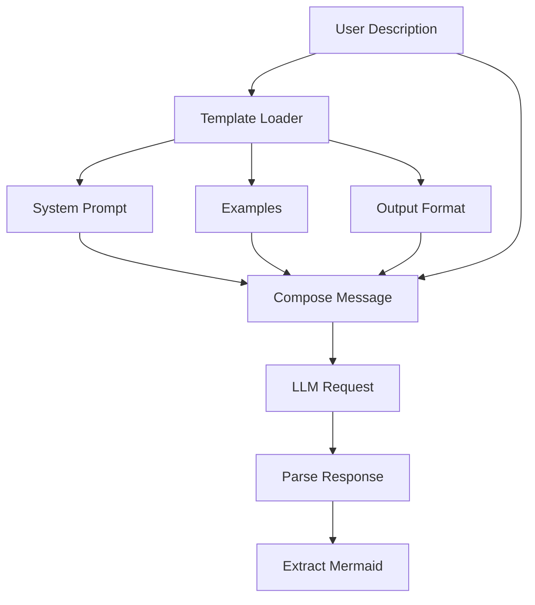

# Phase 4.2: Diagram Prompts

**Version:** 1.0.0  
**Status:** Draft  
**Updated:** 2026-01-29  
**Parent:** [04-mermaid-diagrams.md](./04-mermaid-diagrams.md)

---

## Overview

Specialized prompt templates for each diagram type, including system prompts, few-shot examples, and output format specifications.

---

## Prompt Architecture



---

## Base System Prompt

```go
// internal/ai/diagram/prompts/base.go

package prompts

const BaseSystemPrompt = `You are an expert software architect and diagram specialist.
Your task is to generate clear, well-structured Mermaid diagrams.

## Core Principles

1. **Clarity First**: Prioritize readability over completeness
2. **Meaningful Labels**: Use descriptive names, not just A, B, C
3. **Proper Structure**: Group related elements logically
4. **Consistent Style**: Maintain uniform formatting throughout
5. **Appropriate Complexity**: Keep diagrams focused (max 20-30 nodes)

## Output Format

Always respond with:
1. A brief title (# Title)
2. A short description of the diagram
3. The complete Mermaid code in a code block

## Common Mistakes to Avoid

- Don't use special characters in node IDs
- Don't create overly complex nested subgraphs
- Don't forget to close brackets and quotes
- Don't use inconsistent arrow styles
- Don't exceed reasonable node counts`
```

---

## Flowchart Prompt

```go
// internal/ai/diagram/prompts/flowchart.go

package prompts

const FlowchartSystemPrompt = BaseSystemPrompt + `

## Flowchart Specific Guidelines

### Syntax Reference
- Direction: TD (top-down), LR (left-right), BT (bottom-top), RL (right-left)
- Nodes: [rectangle], (rounded), {diamond}, [[subroutine]], [(database)]
- Arrows: --> (solid), -.-> (dotted), ==> (thick), --text--> (labeled)

### Shape Selection
- [Process] - Standard operations
- {Decision} - Yes/no branches
- (Start/End) - Entry/exit points
- [(Database)] - Data storage
- [[External]] - External systems

### Best Practices
- Start with a clear entry point
- Use decision diamonds for branches
- Label all arrows with conditions
- Group related nodes in subgraphs
- End with clear termination points`

const FlowchartUserTemplate = `Generate a flowchart diagram for the following:

{{.Description}}

{{if .Context}}
Additional Context:
{{range $key, $value := .Context}}
- {{$key}}: {{$value}}
{{end}}
{{end}}

Requirements:
- Use flowchart {{.Direction}} direction
- Include clear decision points
- Label all connections
- Group related steps if appropriate`

var FlowchartExamples = []Example{
	{
		Input: "User authentication flow",
		Output: `# User Authentication Flow

This diagram shows the authentication process from login to session creation.

` + "```mermaid" + `
flowchart TD
    Start([User Visits Login]) --> InputCreds[Enter Credentials]
    InputCreds --> Validate{Valid Format?}
    
    Validate -->|No| ShowError[Display Error]
    ShowError --> InputCreds
    
    Validate -->|Yes| CheckDB[(Verify in Database)]
    CheckDB --> AuthResult{Authenticated?}
    
    AuthResult -->|No| IncAttempt[Increment Attempts]
    IncAttempt --> Locked{Account Locked?}
    Locked -->|Yes| LockMsg[Show Lock Message]
    Locked -->|No| ShowError
    
    AuthResult -->|Yes| Create2FA{2FA Required?}
    Create2FA -->|Yes| Send2FA[Send 2FA Code]
    Send2FA --> Verify2FA{Code Valid?}
    Verify2FA -->|No| ShowError
    Verify2FA -->|Yes| CreateSession
    
    Create2FA -->|No| CreateSession[Create Session]
    CreateSession --> Dashboard([Redirect to Dashboard])
` + "```",
	},
}
```

---

## Sequence Diagram Prompt

```go
// internal/ai/diagram/prompts/sequence.go

package prompts

const SequenceSystemPrompt = BaseSystemPrompt + `

## Sequence Diagram Specific Guidelines

### Syntax Reference
- Participants: participant Name or actor Name
- Messages: ->> (solid), -->> (dotted), -) (async), --) (async dotted)
- Activations: activate/deactivate or +/- notation
- Notes: Note over/left of/right of
- Loops: loop Description ... end
- Alternatives: alt/else/end, opt/end

### Message Types
- Synchronous: A->>B: Request
- Asynchronous: A-)B: Event
- Response: B-->>A: Response
- Self-call: A->>A: Process

### Best Practices
- List participants in order of first appearance
- Use activation boxes for processing time
- Group related interactions with loops/alts
- Add notes for complex operations
- Keep participant names short but meaningful`

const SequenceUserTemplate = `Generate a sequence diagram for the following interaction:

{{.Description}}

{{if .Context}}
Systems/Services involved:
{{range $key, $value := .Context}}
- {{$key}}: {{$value}}
{{end}}
{{end}}

Requirements:
- Show all participants explicitly
- Include request and response messages
- Add activation boxes for processing
- Use notes for important details`

var SequenceExamples = []Example{
	{
		Input: "REST API payment processing with Stripe",
		Output: `# Payment Processing Sequence

This diagram shows the interaction between frontend, backend, and Stripe for payment processing.

` + "```mermaid" + `
sequenceDiagram
    participant User
    participant Frontend
    participant Backend
    participant Stripe
    participant Database
    
    User->>Frontend: Click "Pay Now"
    activate Frontend
    Frontend->>Backend: POST /create-payment-intent
    activate Backend
    
    Backend->>Stripe: Create PaymentIntent
    activate Stripe
    Stripe-->>Backend: PaymentIntent (client_secret)
    deactivate Stripe
    
    Backend-->>Frontend: { clientSecret }
    deactivate Backend
    
    Frontend->>Stripe: Confirm payment (card details)
    activate Stripe
    
    Note over Stripe: Process payment
    
    alt Payment Successful
        Stripe-->>Frontend: Payment confirmed
        Frontend->>Backend: POST /payment-success
        activate Backend
        Backend->>Database: Update order status
        Backend->>Stripe: Retrieve payment details
        Backend-->>Frontend: Order confirmation
        deactivate Backend
        Frontend-->>User: Show success page
    else Payment Failed
        Stripe-->>Frontend: Payment failed
        Frontend-->>User: Show error message
    end
    
    deactivate Stripe
    deactivate Frontend
` + "```",
	},
}
```

---

## ER Diagram Prompt

```go
// internal/ai/diagram/prompts/er.go

package prompts

const ERSystemPrompt = BaseSystemPrompt + `

## ER Diagram Specific Guidelines

### Syntax Reference
- Entity: EntityName { type field_name }
- Relationships: ||--o{ (one to many), }o--o{ (many to many), ||--|| (one to one)
- Field types: string, int, datetime, boolean, etc.
- Keys: PK (primary key), FK (foreign key)

### Relationship Notation
- || : exactly one
- |o : zero or one
- }o : zero or more
- }| : one or more

### Best Practices
- Name entities in singular form (User, not Users)
- Include primary keys for all entities
- Show foreign key relationships explicitly
- Add common fields (created_at, updated_at)
- Group related entities visually`

const ERUserTemplate = `Generate an ER diagram for the following database schema:

{{.Description}}

{{if .Context}}
Additional Requirements:
{{range $key, $value := .Context}}
- {{$key}}: {{$value}}
{{end}}
{{end}}

Requirements:
- Include primary and foreign keys
- Show all relationships with cardinality
- Use appropriate data types
- Include timestamps where appropriate`

var ERExamples = []Example{
	{
		Input: "E-commerce system with users, products, orders",
		Output: `# E-Commerce Database Schema

This ER diagram shows the core entities for an e-commerce platform.

` + "```mermaid" + `
erDiagram
    USER {
        uuid id PK
        string email UK
        string password_hash
        string name
        datetime created_at
        datetime updated_at
    }
    
    ADDRESS {
        uuid id PK
        uuid user_id FK
        string street
        string city
        string state
        string postal_code
        string country
        boolean is_default
    }
    
    PRODUCT {
        uuid id PK
        uuid category_id FK
        string name
        text description
        decimal price
        int stock_quantity
        string sku UK
        datetime created_at
    }
    
    CATEGORY {
        uuid id PK
        uuid parent_id FK
        string name
        string slug UK
    }
    
    ORDER {
        uuid id PK
        uuid user_id FK
        uuid shipping_address_id FK
        string status
        decimal subtotal
        decimal tax
        decimal total
        datetime ordered_at
    }
    
    ORDER_ITEM {
        uuid id PK
        uuid order_id FK
        uuid product_id FK
        int quantity
        decimal unit_price
        decimal total_price
    }
    
    USER ||--o{ ADDRESS : "has"
    USER ||--o{ ORDER : "places"
    ORDER ||--|{ ORDER_ITEM : "contains"
    PRODUCT ||--o{ ORDER_ITEM : "included in"
    CATEGORY ||--o{ PRODUCT : "contains"
    CATEGORY ||--o{ CATEGORY : "parent of"
    ADDRESS ||--o{ ORDER : "ships to"
` + "```",
	},
}
```

---

## State Diagram Prompt

```go
// internal/ai/diagram/prompts/state.go

package prompts

const StateSystemPrompt = BaseSystemPrompt + `

## State Diagram Specific Guidelines

### Syntax Reference
- States: state "Description"
- Transitions: StateA --> StateB : event
- Start: [*] --> FirstState
- End: LastState --> [*]
- Composite: state Parent { StateA --> StateB }
- Fork/Join: For concurrent states
- Choice: <<choice>> for decision points

### Best Practices
- Include start and end states
- Label all transitions with triggering events
- Use composite states for complex substates
- Add notes for entry/exit actions
- Show guard conditions where applicable`

const StateUserTemplate = `Generate a state diagram for the following lifecycle:

{{.Description}}

{{if .Context}}
Context:
{{range $key, $value := .Context}}
- {{$key}}: {{$value}}
{{end}}
{{end}}

Requirements:
- Include clear start and end states
- Label all transitions
- Show any parallel states if applicable
- Include guard conditions where relevant`

var StateExamples = []Example{
	{
		Input: "Order lifecycle from creation to delivery",
		Output: `# Order Lifecycle State Diagram

This diagram shows all possible states of an order from creation to completion.

` + "```mermaid" + `
stateDiagram-v2
    [*] --> Draft : Create order
    
    Draft --> Pending : Submit order
    Draft --> Cancelled : User cancels
    
    state Pending {
        [*] --> AwaitingPayment
        AwaitingPayment --> PaymentProcessing : Payment initiated
        PaymentProcessing --> PaymentConfirmed : Payment success
        PaymentProcessing --> PaymentFailed : Payment error
        PaymentFailed --> AwaitingPayment : Retry
        PaymentConfirmed --> [*]
    }
    
    Pending --> Confirmed : Payment confirmed
    Pending --> Cancelled : Payment timeout
    
    Confirmed --> Processing : Begin fulfillment
    
    state Processing {
        [*] --> Picking
        Picking --> Packing : Items picked
        Packing --> ReadyToShip : Packed
        ReadyToShip --> [*]
    }
    
    Processing --> Shipped : Carrier pickup
    Shipped --> OutForDelivery : In transit
    OutForDelivery --> Delivered : Delivery confirmed
    OutForDelivery --> DeliveryFailed : Delivery attempt failed
    DeliveryFailed --> OutForDelivery : Retry delivery
    DeliveryFailed --> Returned : Max attempts exceeded
    
    Delivered --> [*]
    Returned --> Refunded : Process refund
    Refunded --> [*]
    Cancelled --> [*]
    
    note right of Pending : 24-hour payment window
    note right of Processing : 1-3 business days
` + "```",
	},
}
```

---

## C4 Architecture Prompt

```go
// internal/ai/diagram/prompts/c4.go

package prompts

const C4SystemPrompt = BaseSystemPrompt + `

## C4 Architecture Diagram Guidelines

### C4 Levels
1. Context: System landscape and external actors
2. Container: High-level technical building blocks
3. Component: Components within a container
4. Code: Class-level detail (rarely used)

### Syntax Reference
- Person: Person(alias, "Label", "Description")
- System: System(alias, "Label", "Description")
- Container: Container(alias, "Label", "Technology", "Description")
- Component: Component(alias, "Label", "Technology", "Description")
- Relationships: Rel(from, to, "Label")

### Best Practices
- Start with Context for overview
- Use Container for deployment view
- Add technology labels to containers
- Show external systems clearly
- Include databases and message queues`

const C4UserTemplate = `Generate a C4 architecture diagram for:

{{.Description}}

Level: {{.Level}}

{{if .Context}}
Architecture Context:
{{range $key, $value := .Context}}
- {{$key}}: {{$value}}
{{end}}
{{end}}

Requirements:
- Use appropriate C4 level (Context/Container/Component)
- Include all relevant actors and systems
- Show relationships with labels
- Add technology annotations`

var C4Examples = []Example{
	{
		Input: "SaaS application with microservices architecture",
		Output: `# SaaS Platform Container Diagram

This C4 Container diagram shows the technical architecture of the SaaS platform.

` + "```mermaid" + `
C4Container
    title Container diagram for SaaS Platform

    Person(user, "User", "End user accessing the platform")
    Person(admin, "Admin", "Platform administrator")

    System_Boundary(platform, "SaaS Platform") {
        Container(web, "Web Application", "React, TypeScript", "User interface for the platform")
        Container(admin_web, "Admin Portal", "React, TypeScript", "Administration interface")
        
        Container(api, "API Gateway", "Kong/Nginx", "Routes and authenticates API requests")
        
        Container(auth, "Auth Service", "Go", "Handles authentication and authorization")
        Container(users, "User Service", "Go", "Manages user accounts and profiles")
        Container(billing, "Billing Service", "Go", "Subscription and payment handling")
        Container(core, "Core Service", "Go", "Main business logic")
        
        ContainerDb(db, "PostgreSQL", "PostgreSQL 15", "Primary data storage")
        ContainerDb(cache, "Redis", "Redis 7", "Session and cache storage")
        ContainerQueue(queue, "RabbitMQ", "RabbitMQ", "Async message processing")
    }

    System_Ext(stripe, "Stripe", "Payment processing")
    System_Ext(email, "SendGrid", "Email delivery")
    System_Ext(storage, "S3", "File storage")

    Rel(user, web, "Uses", "HTTPS")
    Rel(admin, admin_web, "Manages", "HTTPS")
    
    Rel(web, api, "API calls", "HTTPS/JSON")
    Rel(admin_web, api, "API calls", "HTTPS/JSON")
    
    Rel(api, auth, "Authenticates", "gRPC")
    Rel(api, users, "User ops", "gRPC")
    Rel(api, billing, "Billing ops", "gRPC")
    Rel(api, core, "Business logic", "gRPC")
    
    Rel(auth, db, "Reads/Writes", "SQL")
    Rel(auth, cache, "Sessions", "Redis Protocol")
    Rel(users, db, "Reads/Writes", "SQL")
    Rel(billing, db, "Reads/Writes", "SQL")
    Rel(core, db, "Reads/Writes", "SQL")
    
    Rel(billing, stripe, "Payments", "HTTPS")
    Rel(core, queue, "Publishes", "AMQP")
    Rel(core, email, "Sends", "HTTPS")
    Rel(core, storage, "Files", "HTTPS")
` + "```",
	},
}
```

---

## Prompt Manager

```go
// internal/ai/diagram/prompts/manager.go

package prompts

import (
	"bytes"
	"text/template"
)

type PromptManager struct {
	templates    map[DiagramType]*PromptTemplate
	customPrompts map[string]string // User overrides
}

type PromptTemplate struct {
	SystemPrompt     string
	UserTemplate     string
	Examples         []Example
	ValidationRules  []string
}

type Example struct {
	Input  string
	Output string
}

type PromptData struct {
	Description string
	Direction   string
	Level       string
	Context     map[string]string
}

func NewPromptManager() *PromptManager {
	pm := &PromptManager{
		templates:     make(map[DiagramType]*PromptTemplate),
		customPrompts: make(map[string]string),
	}
	
	// Register all templates
	pm.Register(DiagramFlowchart, &PromptTemplate{
		SystemPrompt: FlowchartSystemPrompt,
		UserTemplate: FlowchartUserTemplate,
		Examples:     FlowchartExamples,
	})
	
	pm.Register(DiagramSequence, &PromptTemplate{
		SystemPrompt: SequenceSystemPrompt,
		UserTemplate: SequenceUserTemplate,
		Examples:     SequenceExamples,
	})
	
	pm.Register(DiagramER, &PromptTemplate{
		SystemPrompt: ERSystemPrompt,
		UserTemplate: ERUserTemplate,
		Examples:     ERExamples,
	})
	
	pm.Register(DiagramState, &PromptTemplate{
		SystemPrompt: StateSystemPrompt,
		UserTemplate: StateUserTemplate,
		Examples:     StateExamples,
	})
	
	pm.Register(DiagramC4, &PromptTemplate{
		SystemPrompt: C4SystemPrompt,
		UserTemplate: C4UserTemplate,
		Examples:     C4Examples,
	})
	
	return pm
}

func (pm *PromptManager) Register(diagramType DiagramType, template *PromptTemplate) {
	pm.templates[diagramType] = template
}

func (pm *PromptManager) GetSystemPrompt(diagramType DiagramType) string {
	tmpl, ok := pm.templates[diagramType]
	if !ok {
		return BaseSystemPrompt
	}
	return tmpl.SystemPrompt
}

func (pm *PromptManager) BuildUserPrompt(diagramType DiagramType, data PromptData) (string, error) {
	tmpl, ok := pm.templates[diagramType]
	if !ok {
		return data.Description, nil
	}
	
	t, err := template.New("prompt").Parse(tmpl.UserTemplate)
	if err != nil {
		return "", err
	}
	
	var buf bytes.Buffer
	if err := t.Execute(&buf, data); err != nil {
		return "", err
	}
	
	return buf.String(), nil
}

func (pm *PromptManager) GetExamples(diagramType DiagramType) []Example {
	tmpl, ok := pm.templates[diagramType]
	if !ok {
		return nil
	}
	return tmpl.Examples
}

func (pm *PromptManager) BuildFewShotMessages(diagramType DiagramType, userPrompt string) []Message {
	examples := pm.GetExamples(diagramType)
	messages := []Message{
		{Role: "system", Content: pm.GetSystemPrompt(diagramType)},
	}
	
	// Add few-shot examples
	for _, ex := range examples {
		messages = append(messages,
			Message{Role: "user", Content: ex.Input},
			Message{Role: "assistant", Content: ex.Output},
		)
	}
	
	// Add actual user prompt
	messages = append(messages, Message{Role: "user", Content: userPrompt})
	
	return messages
}

type Message struct {
	Role    string
	Content string
}
```

---

## Testing

| Test Case | Description | Expected Result |
|-----------|-------------|-----------------|
| Flowchart prompt | Generate auth flow | Valid flowchart with decisions |
| Sequence prompt | API interaction | Valid sequence with activations |
| ER prompt | Database schema | Valid ER with relationships |
| State prompt | Order lifecycle | Valid state diagram |
| C4 prompt | System architecture | Valid C4 container diagram |
| Template rendering | Context variables | Variables substituted |
| Few-shot inclusion | Examples added | Messages include examples |
| Missing template | Unknown type | Falls back to base prompt |

---

## Related Specs

- [04-mermaid-diagrams.md](./04-mermaid-diagrams.md) - Parent spec
- [04-01-model-categorization.md](./04-01-model-categorization.md) - Model selection
- [04-03-diagram-service.md](./04-03-diagram-service.md) - Generation service
