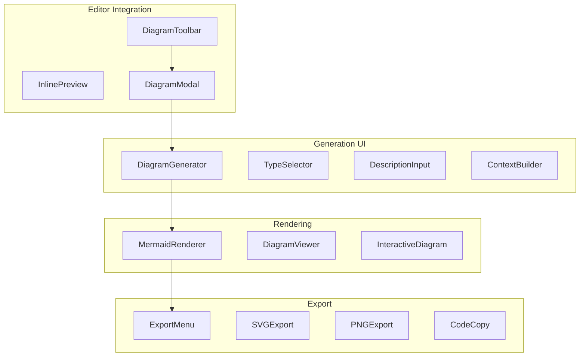

# Phase 4.4: Diagram UI Components

**Version:** 1.0.0  
**Status:** Draft  
**Updated:** 2026-01-29  
**Parent:** [04-mermaid-diagrams.md](./04-mermaid-diagrams.md)

---

## Overview

React components for diagram rendering, generation UI, editor integration, and export functionality.

---

## Component Architecture



---

## MermaidRenderer Component

```typescript
// components/diagrams/MermaidRenderer.tsx

import { useEffect, useRef, useState, useCallback, memo } from 'react';
import mermaid from 'mermaid';
import { useTheme } from 'next-themes';
import { Loader2, AlertCircle, RefreshCw } from 'lucide-react';
import { cn } from '@/lib/utils';

interface MermaidRendererProps {
  code: string;
  className?: string;
  onRenderComplete?: (svg: string) => void;
  onRenderError?: (error: Error) => void;
  interactive?: boolean;
  onNodeClick?: (nodeId: string) => void;
}

export const MermaidRenderer = memo(function MermaidRenderer({
  code,
  className,
  onRenderComplete,
  onRenderError,
  interactive = false,
  onNodeClick,
}: MermaidRendererProps) {
  const containerRef = useRef<HTMLDivElement>(null);
  const { resolvedTheme } = useTheme();
  const [isLoading, setIsLoading] = useState(true);
  const [error, setError] = useState<string | null>(null);
  const [retryCount, setRetryCount] = useState(0);
  
  // Configure mermaid based on theme
  useEffect(() => {
    const isDark = resolvedTheme === 'dark';
    
    mermaid.initialize({
      startOnLoad: false,
      theme: 'base',
      themeVariables: isDark ? {
        primaryColor: '#6366f1',
        primaryTextColor: '#f1f5f9',
        primaryBorderColor: '#4f46e5',
        lineColor: '#94a3b8',
        secondaryColor: '#1e293b',
        tertiaryColor: '#334155',
        background: '#0f172a',
        mainBkg: '#1e293b',
        textColor: '#f1f5f9',
        nodeBorder: '#475569',
        fontSize: '14px',
      } : {
        primaryColor: '#6366f1',
        primaryTextColor: '#ffffff',
        primaryBorderColor: '#4f46e5',
        lineColor: '#64748b',
        secondaryColor: '#f1f5f9',
        tertiaryColor: '#e2e8f0',
        background: '#ffffff',
        mainBkg: '#ffffff',
        textColor: '#1e293b',
        nodeBorder: '#cbd5e1',
        fontSize: '14px',
      },
      flowchart: {
        curve: 'basis',
        padding: 20,
        nodeSpacing: 50,
        rankSpacing: 50,
        htmlLabels: true,
      },
      sequence: {
        diagramMarginX: 50,
        diagramMarginY: 10,
        actorMargin: 50,
        boxMargin: 10,
        noteMargin: 10,
        messageMargin: 35,
      },
      securityLevel: 'strict',
    });
  }, [resolvedTheme]);
  
  // Render diagram
  useEffect(() => {
    if (!code || !containerRef.current) return;
    
    const render = async () => {
      setIsLoading(true);
      setError(null);
      
      try {
        const id = `mermaid-${Date.now()}-${retryCount}`;
        const { svg } = await mermaid.render(id, code);
        
        if (containerRef.current) {
          containerRef.current.innerHTML = svg;
          
          // Add click handlers for interactive mode
          if (interactive && onNodeClick) {
            const nodes = containerRef.current.querySelectorAll('.node');
            nodes.forEach(node => {
              node.addEventListener('click', (e) => {
                const nodeId = extractNodeId(node.id);
                if (nodeId) onNodeClick(nodeId);
              });
              (node as HTMLElement).style.cursor = 'pointer';
            });
          }
          
          onRenderComplete?.(svg);
        }
      } catch (err) {
        const errorMessage = err instanceof Error ? err.message : 'Render failed';
        setError(errorMessage);
        onRenderError?.(err instanceof Error ? err : new Error(errorMessage));
      } finally {
        setIsLoading(false);
      }
    };
    
    render();
  }, [code, retryCount, interactive, onNodeClick, onRenderComplete, onRenderError]);
  
  const handleRetry = useCallback(() => {
    setRetryCount(c => c + 1);
  }, []);
  
  if (error) {
    return (
      <div className={cn('rounded-lg border bg-destructive/5 p-4', className)}>
        <div className="flex items-start gap-3">
          <AlertCircle className="h-5 w-5 text-destructive flex-shrink-0 mt-0.5" />
          <div className="flex-1 min-w-0">
            <p className="font-medium text-destructive">Failed to render diagram</p>
            <p className="text-sm text-muted-foreground mt-1">{error}</p>
            <pre className="mt-3 p-3 rounded bg-muted text-xs overflow-x-auto">
              {code}
            </pre>
            <button
              onClick={handleRetry}
              className="mt-3 inline-flex items-center gap-1 text-sm text-primary hover:underline"
            >
              <RefreshCw className="h-3 w-3" />
              Retry
            </button>
          </div>
        </div>
      </div>
    );
  }
  
  return (
    <div className={cn('relative', className)}>
      {isLoading && (
        <div className="absolute inset-0 flex items-center justify-center bg-background/80 z-10">
          <Loader2 className="h-6 w-6 animate-spin text-muted-foreground" />
        </div>
      )}
      <div
        ref={containerRef}
        className={cn(
          'flex items-center justify-center overflow-auto',
          interactive && '[&_.node]:transition-opacity [&_.node]:hover:opacity-80',
        )}
      />
    </div>
  );
});

function extractNodeId(fullId: string): string | null {
  // Mermaid node IDs follow patterns like "flowchart-NodeName-123"
  const match = fullId.match(/flowchart-([^-]+)-\d+/);
  return match ? match[1] : null;
}
```

---

## DiagramGenerator Component

```typescript
// components/diagrams/DiagramGenerator.tsx

import { useState } from 'react';
import { useMutation } from '@tanstack/react-query';
import { 
  Wand2, Loader2, ChevronDown, Sparkles,
  GitBranch, Database, Workflow, Users, Box
} from 'lucide-react';
import { Button } from '@/components/ui/button';
import { Textarea } from '@/components/ui/textarea';
import { Card, CardContent, CardHeader, CardTitle } from '@/components/ui/card';
import {
  Select,
  SelectContent,
  SelectItem,
  SelectTrigger,
  SelectValue,
} from '@/components/ui/select';
import {
  Collapsible,
  CollapsibleContent,
  CollapsibleTrigger,
} from '@/components/ui/collapsible';
import { Label } from '@/components/ui/label';
import { Input } from '@/components/ui/input';
import { MermaidRenderer } from './MermaidRenderer';
import { useDiagramModels } from '@/hooks/useDiagramModels';

type DiagramType = 'flowchart' | 'sequence' | 'class' | 'er' | 'state' | 'c4' | 'journey' | 'gantt';

interface DiagramGeneratorProps {
  projectId: string;
  onGenerated?: (code: string, title: string) => void;
  initialType?: DiagramType;
}

const diagramTypes: { value: DiagramType; label: string; icon: React.ReactNode; description: string }[] = [
  { value: 'flowchart', label: 'Flowchart', icon: <Workflow className="h-4 w-4" />, description: 'Process flows and decisions' },
  { value: 'sequence', label: 'Sequence', icon: <GitBranch className="h-4 w-4" />, description: 'API and message interactions' },
  { value: 'class', label: 'Class', icon: <Box className="h-4 w-4" />, description: 'Object relationships' },
  { value: 'er', label: 'ER Diagram', icon: <Database className="h-4 w-4" />, description: 'Database schemas' },
  { value: 'state', label: 'State', icon: <Workflow className="h-4 w-4" />, description: 'State machines' },
  { value: 'c4', label: 'C4 Architecture', icon: <Box className="h-4 w-4" />, description: 'System architecture' },
  { value: 'journey', label: 'User Journey', icon: <Users className="h-4 w-4" />, description: 'User experience flows' },
];

export function DiagramGenerator({ projectId, onGenerated, initialType }: DiagramGeneratorProps) {
  const [diagramType, setDiagramType] = useState<DiagramType>(initialType || 'flowchart');
  const [description, setDescription] = useState('');
  const [direction, setDirection] = useState('TD');
  const [showAdvanced, setShowAdvanced] = useState(false);
  const [context, setContext] = useState<Record<string, string>>({});
  const [generatedCode, setGeneratedCode] = useState<string | null>(null);
  const [generatedTitle, setGeneratedTitle] = useState<string>('');
  
  const { data: models } = useDiagramModels();
  
  const generateMutation = useMutation({
    mutationFn: async () => {
      const response = await fetch('/api/v1/diagrams/generate', {
        method: 'POST',
        headers: { 'Content-Type': 'application/json' },
        body: JSON.stringify({
          type: diagramType,
          description,
          direction,
          context,
          project_id: projectId,
        }),
      });
      
      if (!response.ok) {
        throw new Error('Generation failed');
      }
      
      return response.json();
    },
    onSuccess: (data) => {
      setGeneratedCode(data.mermaid_code);
      setGeneratedTitle(data.title);
      onGenerated?.(data.mermaid_code, data.title);
    },
  });
  
  const handleAddContext = () => {
    setContext(prev => ({ ...prev, [`field_${Object.keys(prev).length + 1}`]: '' }));
  };
  
  const handleUpdateContext = (key: string, value: string) => {
    setContext(prev => ({ ...prev, [key]: value }));
  };
  
  const handleRemoveContext = (key: string) => {
    setContext(prev => {
      const next = { ...prev };
      delete next[key];
      return next;
    });
  };
  
  const selectedType = diagramTypes.find(t => t.value === diagramType);
  const recommendedModel = models?.find(m => 
    m.available && m.capabilities.includes(diagramType)
  );
  
  return (
    <div className="space-y-4">
      {/* Type Selection */}
      <div className="space-y-2">
        <Label>Diagram Type</Label>
        <Select value={diagramType} onValueChange={(v) => setDiagramType(v as DiagramType)}>
          <SelectTrigger>
            <SelectValue>
              {selectedType && (
                <div className="flex items-center gap-2">
                  {selectedType.icon}
                  {selectedType.label}
                </div>
              )}
            </SelectValue>
          </SelectTrigger>
          <SelectContent>
            {diagramTypes.map(type => (
              <SelectItem key={type.value} value={type.value}>
                <div className="flex items-center gap-2">
                  {type.icon}
                  <div>
                    <div className="font-medium">{type.label}</div>
                    <div className="text-xs text-muted-foreground">{type.description}</div>
                  </div>
                </div>
              </SelectItem>
            ))}
          </SelectContent>
        </Select>
      </div>
      
      {/* Description */}
      <div className="space-y-2">
        <Label htmlFor="description">Description</Label>
        <Textarea
          id="description"
          placeholder={`Describe what you want to visualize...\n\nExample: "User authentication flow with OAuth, 2FA, and session management"`}
          value={description}
          onChange={(e) => setDescription(e.target.value)}
          rows={4}
        />
      </div>
      
      {/* Advanced Options */}
      <Collapsible open={showAdvanced} onOpenChange={setShowAdvanced}>
        <CollapsibleTrigger asChild>
          <Button variant="ghost" size="sm" className="w-full justify-between">
            Advanced Options
            <ChevronDown className={`h-4 w-4 transition-transform ${showAdvanced ? 'rotate-180' : ''}`} />
          </Button>
        </CollapsibleTrigger>
        <CollapsibleContent className="space-y-4 pt-4">
          {/* Direction (for flowcharts) */}
          {diagramType === 'flowchart' && (
            <div className="space-y-2">
              <Label>Direction</Label>
              <Select value={direction} onValueChange={setDirection}>
                <SelectTrigger>
                  <SelectValue />
                </SelectTrigger>
                <SelectContent>
                  <SelectItem value="TD">Top to Bottom</SelectItem>
                  <SelectItem value="LR">Left to Right</SelectItem>
                  <SelectItem value="BT">Bottom to Top</SelectItem>
                  <SelectItem value="RL">Right to Left</SelectItem>
                </SelectContent>
              </Select>
            </div>
          )}
          
          {/* Context Fields */}
          <div className="space-y-2">
            <div className="flex items-center justify-between">
              <Label>Additional Context</Label>
              <Button variant="ghost" size="sm" onClick={handleAddContext}>
                + Add Field
              </Button>
            </div>
            
            {Object.entries(context).map(([key, value]) => (
              <div key={key} className="flex gap-2">
                <Input
                  placeholder="Key"
                  value={key}
                  onChange={(e) => {
                    const newContext = { ...context };
                    delete newContext[key];
                    newContext[e.target.value] = value;
                    setContext(newContext);
                  }}
                  className="w-1/3"
                />
                <Input
                  placeholder="Value"
                  value={value}
                  onChange={(e) => handleUpdateContext(key, e.target.value)}
                  className="flex-1"
                />
                <Button 
                  variant="ghost" 
                  size="icon"
                  onClick={() => handleRemoveContext(key)}
                >
                  ×
                </Button>
              </div>
            ))}
          </div>
          
          {/* Model Info */}
          {recommendedModel && (
            <div className="text-xs text-muted-foreground">
              Using model: <span className="font-medium">{recommendedModel.name}</span>
            </div>
          )}
        </CollapsibleContent>
      </Collapsible>
      
      {/* Generate Button */}
      <Button
        onClick={() => generateMutation.mutate()}
        disabled={!description.trim() || generateMutation.isPending}
        className="w-full"
      >
        {generateMutation.isPending ? (
          <>
            <Loader2 className="h-4 w-4 mr-2 animate-spin" />
            Generating...
          </>
        ) : (
          <>
            <Sparkles className="h-4 w-4 mr-2" />
            Generate Diagram
          </>
        )}
      </Button>
      
      {/* Preview */}
      {generatedCode && (
        <Card className="mt-4">
          <CardHeader className="py-3">
            <CardTitle className="text-sm">{generatedTitle}</CardTitle>
          </CardHeader>
          <CardContent>
            <MermaidRenderer code={generatedCode} />
          </CardContent>
        </Card>
      )}
    </div>
  );
}
```

---

## DiagramViewer Component

```typescript
// components/diagrams/DiagramViewer.tsx

import { useState, useCallback } from 'react';
import { 
  ZoomIn, ZoomOut, Maximize2, Minimize2, 
  Download, Copy, Code, Share2
} from 'lucide-react';
import { Button } from '@/components/ui/button';
import { Card, CardContent, CardHeader } from '@/components/ui/card';
import {
  DropdownMenu,
  DropdownMenuContent,
  DropdownMenuItem,
  DropdownMenuTrigger,
} from '@/components/ui/dropdown-menu';
import { Dialog, DialogContent, DialogTrigger } from '@/components/ui/dialog';
import { useToast } from '@/hooks/use-toast';
import { MermaidRenderer } from './MermaidRenderer';
import { cn } from '@/lib/utils';

interface DiagramViewerProps {
  code: string;
  title?: string;
  className?: string;
  showToolbar?: boolean;
  allowEdit?: boolean;
  onEdit?: (code: string) => void;
}

export function DiagramViewer({
  code,
  title,
  className,
  showToolbar = true,
  allowEdit = false,
  onEdit,
}: DiagramViewerProps) {
  const { toast } = useToast();
  const [zoom, setZoom] = useState(1);
  const [isFullscreen, setIsFullscreen] = useState(false);
  const [showCode, setShowCode] = useState(false);
  const [editCode, setEditCode] = useState(code);
  const [svg, setSvg] = useState<string>('');
  
  const handleZoomIn = () => setZoom(z => Math.min(z + 0.25, 3));
  const handleZoomOut = () => setZoom(z => Math.max(z - 0.25, 0.5));
  const handleResetZoom = () => setZoom(1);
  
  const handleCopyCode = async () => {
    await navigator.clipboard.writeText(code);
    toast({ title: 'Mermaid code copied to clipboard' });
  };
  
  const handleCopySvg = async () => {
    if (svg) {
      await navigator.clipboard.writeText(svg);
      toast({ title: 'SVG copied to clipboard' });
    }
  };
  
  const handleDownloadSvg = () => {
    if (!svg) return;
    
    const blob = new Blob([svg], { type: 'image/svg+xml' });
    const url = URL.createObjectURL(blob);
    const a = document.createElement('a');
    a.href = url;
    a.download = `${title || 'diagram'}.svg`;
    a.click();
    URL.revokeObjectURL(url);
  };
  
  const handleDownloadPng = useCallback(async () => {
    if (!svg) return;
    
    const canvas = document.createElement('canvas');
    const ctx = canvas.getContext('2d');
    const img = new Image();
    
    const svgBlob = new Blob([svg], { type: 'image/svg+xml;charset=utf-8' });
    const url = URL.createObjectURL(svgBlob);
    
    img.onload = () => {
      canvas.width = img.width * 2;
      canvas.height = img.height * 2;
      ctx?.scale(2, 2);
      ctx?.drawImage(img, 0, 0);
      
      const link = document.createElement('a');
      link.download = `${title || 'diagram'}.png`;
      link.href = canvas.toDataURL('image/png');
      link.click();
      
      URL.revokeObjectURL(url);
    };
    
    img.src = url;
  }, [svg, title]);
  
  const handleApplyEdit = () => {
    onEdit?.(editCode);
    setShowCode(false);
  };
  
  const content = (
    <div className={cn('relative', className)}>
      {/* Toolbar */}
      {showToolbar && (
        <div className="absolute top-2 right-2 z-10 flex items-center gap-1 bg-background/80 backdrop-blur rounded-lg p-1 shadow-sm border">
          <Button variant="ghost" size="icon" onClick={handleZoomOut} title="Zoom out">
            <ZoomOut className="h-4 w-4" />
          </Button>
          <span className="text-xs text-muted-foreground min-w-[3rem] text-center">
            {Math.round(zoom * 100)}%
          </span>
          <Button variant="ghost" size="icon" onClick={handleZoomIn} title="Zoom in">
            <ZoomIn className="h-4 w-4" />
          </Button>
          <Button variant="ghost" size="icon" onClick={handleResetZoom} title="Reset zoom">
            <Maximize2 className="h-4 w-4" />
          </Button>
          
          <div className="w-px h-4 bg-border mx-1" />
          
          {allowEdit && (
            <Button 
              variant="ghost" 
              size="icon" 
              onClick={() => setShowCode(!showCode)}
              title="View/edit code"
            >
              <Code className="h-4 w-4" />
            </Button>
          )}
          
          <DropdownMenu>
            <DropdownMenuTrigger asChild>
              <Button variant="ghost" size="icon" title="Export">
                <Download className="h-4 w-4" />
              </Button>
            </DropdownMenuTrigger>
            <DropdownMenuContent align="end">
              <DropdownMenuItem onClick={handleCopyCode}>
                <Copy className="h-4 w-4 mr-2" />
                Copy Mermaid Code
              </DropdownMenuItem>
              <DropdownMenuItem onClick={handleCopySvg}>
                <Copy className="h-4 w-4 mr-2" />
                Copy SVG
              </DropdownMenuItem>
              <DropdownMenuItem onClick={handleDownloadSvg}>
                <Download className="h-4 w-4 mr-2" />
                Download SVG
              </DropdownMenuItem>
              <DropdownMenuItem onClick={handleDownloadPng}>
                <Download className="h-4 w-4 mr-2" />
                Download PNG
              </DropdownMenuItem>
            </DropdownMenuContent>
          </DropdownMenu>
          
          <Button 
            variant="ghost" 
            size="icon" 
            onClick={() => setIsFullscreen(true)}
            title="Fullscreen"
          >
            <Maximize2 className="h-4 w-4" />
          </Button>
        </div>
      )}
      
      {/* Diagram */}
      <div 
        className="overflow-auto p-4"
        style={{ 
          transform: `scale(${zoom})`,
          transformOrigin: 'top left',
        }}
      >
        <MermaidRenderer
          code={code}
          onRenderComplete={setSvg}
        />
      </div>
      
      {/* Code Editor */}
      {showCode && allowEdit && (
        <div className="border-t p-4 space-y-2">
          <textarea
            className="w-full h-48 p-3 rounded border bg-background font-mono text-sm"
            value={editCode}
            onChange={(e) => setEditCode(e.target.value)}
          />
          <div className="flex gap-2">
            <Button size="sm" onClick={handleApplyEdit}>Apply Changes</Button>
            <Button size="sm" variant="outline" onClick={() => setShowCode(false)}>Cancel</Button>
          </div>
        </div>
      )}
    </div>
  );
  
  if (isFullscreen) {
    return (
      <Dialog open={isFullscreen} onOpenChange={setIsFullscreen}>
        <DialogContent className="max-w-[90vw] max-h-[90vh] overflow-auto">
          {title && <h3 className="text-lg font-semibold mb-4">{title}</h3>}
          {content}
        </DialogContent>
      </Dialog>
    );
  }
  
  return (
    <Card className={className}>
      {title && (
        <CardHeader className="py-3 border-b">
          <h4 className="text-sm font-medium">{title}</h4>
        </CardHeader>
      )}
      <CardContent className="p-0">
        {content}
      </CardContent>
    </Card>
  );
}
```

---

## Editor Toolbar Integration

```typescript
// components/editor/DiagramToolbarButton.tsx

import { useState } from 'react';
import { GitBranch } from 'lucide-react';
import { Button } from '@/components/ui/button';
import {
  Dialog,
  DialogContent,
  DialogHeader,
  DialogTitle,
  DialogTrigger,
} from '@/components/ui/dialog';
import { DiagramGenerator } from '@/components/diagrams/DiagramGenerator';

interface DiagramToolbarButtonProps {
  projectId: string;
  onInsert: (markdown: string) => void;
}

export function DiagramToolbarButton({ projectId, onInsert }: DiagramToolbarButtonProps) {
  const [open, setOpen] = useState(false);
  
  const handleGenerated = (code: string, title: string) => {
    const markdown = `\n## ${title}\n\n\`\`\`mermaid\n${code}\n\`\`\`\n`;
    onInsert(markdown);
    setOpen(false);
  };
  
  return (
    <Dialog open={open} onOpenChange={setOpen}>
      <DialogTrigger asChild>
        <Button variant="ghost" size="sm" title="Insert Diagram">
          <GitBranch className="h-4 w-4" />
        </Button>
      </DialogTrigger>
      <DialogContent className="max-w-2xl max-h-[80vh] overflow-y-auto">
        <DialogHeader>
          <DialogTitle>Generate Diagram</DialogTitle>
        </DialogHeader>
        <DiagramGenerator
          projectId={projectId}
          onGenerated={handleGenerated}
        />
      </DialogContent>
    </Dialog>
  );
}
```

---

## Inline Preview Component

```typescript
// components/editor/InlineDiagramPreview.tsx

import { useState, useEffect } from 'react';
import { Eye, EyeOff, Edit2 } from 'lucide-react';
import { Button } from '@/components/ui/button';
import { MermaidRenderer } from '@/components/diagrams/MermaidRenderer';
import { cn } from '@/lib/utils';

interface InlineDiagramPreviewProps {
  code: string;
  onEdit?: (code: string) => void;
  className?: string;
}

export function InlineDiagramPreview({ code, onEdit, className }: InlineDiagramPreviewProps) {
  const [showPreview, setShowPreview] = useState(true);
  const [isEditing, setIsEditing] = useState(false);
  const [editCode, setEditCode] = useState(code);
  
  useEffect(() => {
    setEditCode(code);
  }, [code]);
  
  if (!showPreview) {
    return (
      <div className={cn('relative rounded border bg-muted p-4', className)}>
        <pre className="text-xs font-mono overflow-x-auto">{code}</pre>
        <Button
          variant="ghost"
          size="icon"
          className="absolute top-2 right-2"
          onClick={() => setShowPreview(true)}
        >
          <Eye className="h-4 w-4" />
        </Button>
      </div>
    );
  }
  
  return (
    <div className={cn('relative rounded border bg-background p-4', className)}>
      <div className="absolute top-2 right-2 flex gap-1 z-10">
        {onEdit && (
          <Button
            variant="ghost"
            size="icon"
            onClick={() => setIsEditing(!isEditing)}
          >
            <Edit2 className="h-4 w-4" />
          </Button>
        )}
        <Button
          variant="ghost"
          size="icon"
          onClick={() => setShowPreview(false)}
        >
          <EyeOff className="h-4 w-4" />
        </Button>
      </div>
      
      {isEditing ? (
        <div className="space-y-2">
          <textarea
            className="w-full h-48 p-3 rounded border bg-muted font-mono text-sm"
            value={editCode}
            onChange={(e) => setEditCode(e.target.value)}
          />
          <div className="flex gap-2">
            <Button 
              size="sm" 
              onClick={() => {
                onEdit?.(editCode);
                setIsEditing(false);
              }}
            >
              Apply
            </Button>
            <Button 
              size="sm" 
              variant="outline"
              onClick={() => {
                setEditCode(code);
                setIsEditing(false);
              }}
            >
              Cancel
            </Button>
          </div>
        </div>
      ) : (
        <MermaidRenderer code={code} />
      )}
    </div>
  );
}
```

---

## useDiagramGeneration Hook

```typescript
// hooks/useDiagramGeneration.ts

import { useMutation, useQueryClient } from '@tanstack/react-query';

type DiagramType = 'flowchart' | 'sequence' | 'class' | 'er' | 'state' | 'c4' | 'journey' | 'gantt';

interface GenerateRequest {
  type?: DiagramType;
  description: string;
  direction?: string;
  level?: string;
  context?: Record<string, string>;
}

interface GenerateResponse {
  id: string;
  type: DiagramType;
  title: string;
  mermaidCode: string;
  modelUsed: string;
  fromCache: boolean;
  generationMs: number;
}

export function useDiagramGeneration(projectId: string) {
  const queryClient = useQueryClient();
  
  return useMutation({
    mutationFn: async (request: GenerateRequest): Promise<GenerateResponse> => {
      const response = await fetch('/api/v1/diagrams/generate', {
        method: 'POST',
        headers: { 'Content-Type': 'application/json' },
        body: JSON.stringify({
          ...request,
          project_id: projectId,
        }),
      });
      
      if (!response.ok) {
        const error = await response.text();
        throw new Error(error || 'Diagram generation failed');
      }
      
      const data = await response.json();
      return {
        id: data.id,
        type: data.type,
        title: data.title,
        mermaidCode: data.mermaid_code,
        modelUsed: data.model_used,
        fromCache: data.from_cache,
        generationMs: data.generation_ms,
      };
    },
    onSuccess: () => {
      queryClient.invalidateQueries({ queryKey: ['diagrams', projectId] });
    },
  });
}
```

---

## Testing

| Test Case | Description | Expected Result |
|-----------|-------------|-----------------|
| Render valid diagram | Pass valid mermaid | SVG displayed |
| Render error | Pass invalid mermaid | Error state shown |
| Zoom controls | Click zoom in/out | Diagram scales |
| Export SVG | Click download SVG | File downloaded |
| Export PNG | Click download PNG | PNG file created |
| Copy code | Click copy code | Code in clipboard |
| Edit mode | Toggle code editor | Textarea shown |
| Apply edit | Change and apply | Diagram updates |
| Type selection | Choose ER diagram | Type updates |
| Generate | Fill form and submit | Diagram generated |

---

## Related Specs

- [04-mermaid-diagrams.md](./04-mermaid-diagrams.md) - Parent spec
- [04-03-diagram-service.md](./04-03-diagram-service.md) - Backend service
- [../04-spec-editor/00-overview.md](../04-spec-editor/00-overview.md) - Editor integration
