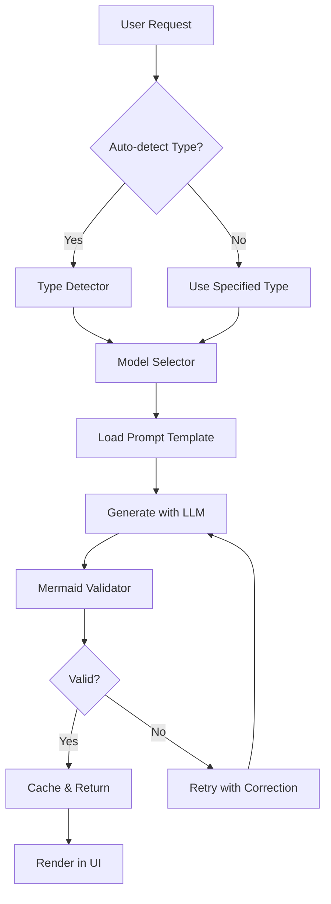

# Phase 4: Mermaid Diagrams

**Version:** 1.1.0  
**Status:** Draft  
**Updated:** 2026-01-29  

---

## Overview

AI-powered architectural diagram generation using Mermaid syntax. Supports flowcharts, sequence diagrams, ER diagrams, and more. Includes model categorization for diagram-specific prompts and automatic diagram type detection.

**Sub-Specifications:**
| File | Description |
|------|-------------|
| [04-01-model-categorization.md](./04-01-model-categorization.md) | AI model selection and capabilities by diagram type |
| [04-02-diagram-prompts.md](./04-02-diagram-prompts.md) | Specialized prompts for each diagram type |
| [04-03-diagram-service.md](./04-03-diagram-service.md) | Backend generation, validation, and caching |
| [04-04-diagram-ui.md](./04-04-diagram-ui.md) | React components, editor integration, export |

**Cross-References:**
- [AI Integration](../06-ai-integration/00-overview.md)
- [Plan Mode](./03-plan-mode.md)
- [Spec Editor](../04-spec-editor/00-overview.md)

---

## Supported Diagram Types

| Type | Use Case | Mermaid Syntax | Best Model |
|------|----------|----------------|------------|
| Flowchart | Process flows, decision trees | `flowchart TD/LR` | llama-3 |
| Sequence | API interactions, message flows | `sequenceDiagram` | llama-3 |
| Class | Object relationships, inheritance | `classDiagram` | llama-3 |
| ER | Database schemas | `erDiagram` | mistral |
| State | State machines, lifecycle | `stateDiagram-v2` | llama-3 |
| Gantt | Project timelines | `gantt` | mistral |
| Pie | Distribution charts | `pie` | any |
| Journey | User experience flows | `journey` | llama-3 |
| C4 | System architecture | `C4Context/C4Container` | llama-3 |
| Mindmap | Brainstorming, concepts | `mindmap` | mistral |
| Git | Branch visualization | `gitGraph` | any |

---

## Architecture



---

## Database Schema

```sql
-- AI model capabilities for diagrams
CREATE TABLE IF NOT EXISTS diagram_models (
  id TEXT PRIMARY KEY,
  name TEXT NOT NULL,
  provider TEXT NOT NULL, -- "ollama", "llama-cpp"
  priority INTEGER DEFAULT 10,
  capabilities TEXT NOT NULL, -- JSON array of diagram types
  system_prompt TEXT,
  max_tokens INTEGER DEFAULT 4096,
  temperature REAL DEFAULT 0.2,
  enabled BOOLEAN DEFAULT 1,
  created_at DATETIME DEFAULT CURRENT_TIMESTAMP
);

-- Diagram type-specific prompt templates
CREATE TABLE IF NOT EXISTS diagram_prompts (
  type TEXT PRIMARY KEY,
  system_prompt TEXT NOT NULL,
  user_prompt_template TEXT NOT NULL,
  examples TEXT, -- JSON array of examples
  validation_rules TEXT, -- JSON validation config
  updated_at DATETIME DEFAULT CURRENT_TIMESTAMP
);

-- Diagram preferences per project
CREATE TABLE IF NOT EXISTS diagram_preferences (
  project_id TEXT PRIMARY KEY,
  default_model TEXT DEFAULT 'llama-3',
  theme TEXT DEFAULT 'default',
  direction TEXT DEFAULT 'TD',
  max_nodes INTEGER DEFAULT 30,
  updated_at DATETIME DEFAULT CURRENT_TIMESTAMP,
  FOREIGN KEY (project_id) REFERENCES projects(id)
);

-- Generated diagrams cache
CREATE TABLE IF NOT EXISTS diagrams (
  id TEXT PRIMARY KEY,
  project_id TEXT NOT NULL,
  type TEXT NOT NULL,
  title TEXT,
  mermaid_code TEXT NOT NULL,
  source_prompt TEXT,
  source_context TEXT, -- JSON
  model_used TEXT,
  generation_time_ms INTEGER,
  retry_count INTEGER DEFAULT 0,
  created_at DATETIME DEFAULT CURRENT_TIMESTAMP,
  FOREIGN KEY (project_id) REFERENCES projects(id)
);

CREATE INDEX idx_diagrams_project ON diagrams(project_id);
CREATE INDEX idx_diagrams_type ON diagrams(type);
```

---

## API Endpoints

| Method | Endpoint | Description |
|--------|----------|-------------|
| POST | `/api/v1/diagrams/generate` | Generate new diagram |
| POST | `/api/v1/diagrams/detect-type` | Auto-detect diagram type from description |
| GET | `/api/v1/diagrams/:id` | Get diagram by ID |
| GET | `/api/v1/diagrams/project/:projectId` | List project diagrams |
| DELETE | `/api/v1/diagrams/:id` | Delete diagram |
| POST | `/api/v1/diagrams/validate` | Validate Mermaid syntax |
| GET | `/api/v1/diagrams/models` | List available models |
| GET | `/api/v1/diagrams/prompts/:type` | Get prompt template for type |
| PATCH | `/api/v1/diagrams/preferences/:projectId` | Update project preferences |

---

## Testing Checklist

| Test | Description | Priority |
|------|-------------|----------|
| Flowchart generation | Valid flowchart from description | Critical |
| Sequence diagram | API flow renders correctly | Critical |
| ER diagram | Database schema visualization | Critical |
| Type auto-detection | Correct type inferred from prompt | High |
| Model selection | Best model chosen for diagram type | High |
| Mermaid validation | Invalid syntax caught and reported | High |
| Retry on failure | Corrects syntax errors automatically | High |
| Copy/download | Export functions work | Medium |
| Fullscreen mode | Diagram displays in modal | Medium |
| Caching | Duplicate requests use cache | Medium |
| C4 diagrams | Architecture diagrams render | Medium |

---

## Related Specs

- [Plan Mode](./03-plan-mode.md) — Uses diagrams for workflow visualization
- [Spec Editor](../04-spec-editor/00-overview.md) — Diagram insertion
- [AI Integration](../06-ai-integration/00-overview.md)
