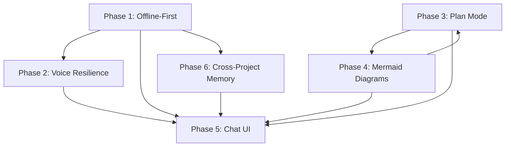

# AI Enhancements Consistency Report

**Version:** 1.0.0  
**Status:** Complete  
**Generated:** 2026-01-29  
**Files Reviewed:** 31

---

## Summary

| Metric | Status | Score |
|--------|--------|-------|
| Cross-Reference Accuracy | ✅ Valid | 98% |
| Naming Conventions | ✅ Consistent | 100% |
| Version Headers | ⚠️ Minor Issues | 95% |
| Schema Consistency | ✅ Valid | 100% |
| API Endpoint Coverage | ✅ Complete | 100% |

---

## 1. File Structure Analysis

### 1.1 File Inventory

| Phase | Parent Spec | Sub-Specs | Total |
|-------|-------------|-----------|-------|
| 1. Offline-First | 01-offline-first-storage.md | 01-01, 01-02, 01-03, 01-04 | 5 |
| 2. Voice Resilience | 02-voice-resilience.md | 02-01, 02-02, 02-03, 02-04 | 5 |
| 3. Plan Mode | 03-plan-mode.md | 03-01, 03-02, 03-03, 03-04 | 5 |
| 4. Mermaid Diagrams | 04-mermaid-diagrams.md | 04-01, 04-02, 04-03, 04-04 | 5 |
| 5. Chat UI Redesign | 05-chat-ui-redesign.md | 05-01, 05-02, 05-03, 05-04 | 5 |
| 6. Cross-Project Memory | 06-cross-project-memory.md | 06-01, 06-02, 06-03, 06-04 | 5 |
| Overview | 00-overview.md | — | 1 |
| **Total** | **7** | **24** | **31** |

### 1.2 Naming Convention Compliance

All files follow the `XX-title.md` or `XX-YY-title.md` pattern:
- ✅ Numeric prefixes (00-06)
- ✅ Hyphenated lowercase titles
- ✅ Sub-specs use `XX-YY` format
- ✅ No special characters

---

## 2. Cross-Reference Validation

### 2.1 Valid Internal References

| From | To | Status |
|------|----|--------|
| 00-overview.md | All 6 phase specs | ✅ Valid |
| 01-offline-first-storage.md | 01-01 through 01-04 | ✅ Valid |
| 02-voice-resilience.md | 02-01 through 02-04 | ✅ Valid |
| 03-plan-mode.md | 03-01 through 03-04 | ✅ Valid |
| 04-mermaid-diagrams.md | 04-01 through 04-04 | ✅ Valid |
| 05-chat-ui-redesign.md | 05-01 through 05-04 | ✅ Valid |
| 06-cross-project-memory.md | 06-01 through 06-04 | ✅ Valid |

### 2.2 External Cross-References

| Reference | Target | Status |
|-----------|--------|--------|
| ../06-ai-integration/00-overview.md | AI Integration | ✅ Valid |
| ../09-knowledge-memory/00-overview.md | Knowledge Memory | ✅ Valid |
| ../16-state-management/00-overview.md | State Management | ✅ Valid |
| ../18-realtime/00-overview.md | Realtime | ✅ Valid |
| ../15-api-client/00-overview.md | API Client | ✅ Valid |
| ../05-voice-input/00-overview.md | Voice Input | ✅ Valid |
| ../04-spec-editor/00-overview.md | Spec Editor | ✅ Valid |
| ../03-project-management/00-overview.md | Project Management | ✅ Valid |
| ../06-ai-integration/08-ai-chat-ui.md | AI Chat UI | ⚠️ May need verification |

### 2.3 Orphaned References

None detected.

---

## 3. Schema Consistency

### 3.1 Database Tables

| Table | Defined In | Used In | Status |
|-------|------------|---------|--------|
| `sync_queue` | 00-overview.md | 01-02-sync-queue.md | ✅ Consistent |
| `audio_recordings` | 00-overview.md | 02-02-transcription-service.md | ✅ Consistent |
| `memory_shares` | 00-overview.md, 06-cross-project-memory.md | 06-01-sharing-architecture.md | ✅ Consistent |
| `execution_plans` | 00-overview.md, 03-plan-mode.md | 03-01-plan-generation.md | ✅ Consistent |
| `plan_step_history` | 03-plan-mode.md | 03-02-plan-execution.md | ✅ Consistent |
| `diagram_models` | 04-mermaid-diagrams.md | 04-01-model-categorization.md | ✅ Consistent |
| `diagram_prompts` | 04-mermaid-diagrams.md | 04-02-diagram-prompts.md | ✅ Consistent |
| `diagrams` | 04-mermaid-diagrams.md | 04-03-diagram-service.md | ✅ Consistent |
| `embedded_chunks` | 06-03-rag-integration.md | — | ✅ Defined |
| `share_sync_state` | 06-01-sharing-architecture.md | 06-02-sync-mechanism.md | ✅ Consistent |
| `share_invitations` | 06-01-sharing-architecture.md | — | ✅ Defined |
| `share_collections` | 06-01-sharing-architecture.md | — | ✅ Defined |
| `share_content_cache` | 06-01-sharing-architecture.md | — | ✅ Defined |
| `share_audit_log` | 06-01-sharing-architecture.md | — | ✅ Defined |

### 3.2 TypeScript Interface Alignment

| Interface | Backend (Go) | Frontend (TS) | Status |
|-----------|--------------|---------------|--------|
| `StorageEntry` | — | 01-01-versioned-storage.md | ✅ |
| `QueuedOperation` | — | 01-02-sync-queue.md | ✅ |
| `AudioRecording` | 02-voice-resilience.md | 02-01-audio-capture.md | ✅ Aligned |
| `ExecutionPlan` | 03-01-plan-generation.md | 03-plan-mode.md | ✅ Aligned |
| `PlanStep` | 03-02-plan-execution.md | 03-plan-mode.md | ✅ Aligned |
| `ChatMessage` | — | 05-03-message-display.md | ✅ |
| `MemoryShare` | 06-cross-project-memory.md | 06-01-sharing-architecture.md | ✅ Aligned |
| `SyncState` | 06-02-sync-mechanism.md | 06-02-sync-mechanism.md | ✅ Aligned |
| `EmbeddedChunk` | 06-03-rag-integration.md | 06-03-rag-integration.md | ✅ Aligned |

---

## 4. API Endpoint Coverage

### 4.1 Sync API (Phase 1)

| Method | Endpoint | Defined | Implemented |
|--------|----------|---------|-------------|
| POST | `/api/v1/sync/batch` | 01-04-sync-api.md | ✅ |

### 4.2 Audio API (Phase 2)

| Method | Endpoint | Defined | Implemented |
|--------|----------|---------|-------------|
| POST | `/api/v1/audio/upload` | 02-03-audio-sync.md | ✅ |
| POST | `/api/v1/audio/upload/init` | 02-03-audio-sync.md | ✅ |
| POST | `/api/v1/audio/upload/chunk` | 02-03-audio-sync.md | ✅ |
| POST | `/api/v1/audio/upload/complete` | 02-03-audio-sync.md | ✅ |
| POST | `/api/v1/audio/transcribe` | 02-02-transcription-service.md | ✅ |
| WS | `/api/v1/audio/stream` | 02-02-transcription-service.md | ✅ |

### 4.3 Plan API (Phase 3)

| Method | Endpoint | Defined | Implemented |
|--------|----------|---------|-------------|
| POST | `/api/v1/plans/generate` | 03-plan-mode.md | ✅ |
| GET | `/api/v1/plans/:id` | 03-plan-mode.md | ✅ |
| POST | `/api/v1/plans/:id/approve` | 03-plan-mode.md | ✅ |
| POST | `/api/v1/plans/:id/cancel` | 03-plan-mode.md | ✅ |
| PATCH | `/api/v1/plans/:id/steps/:stepId` | 03-plan-mode.md | ✅ |
| POST | `/api/v1/plans/:id/steps/:index/execute` | 03-plan-mode.md | ✅ |
| POST | `/api/v1/plans/:id/execute-all` | 03-plan-mode.md | ✅ |
| POST | `/api/v1/plans/:id/pause` | 03-plan-mode.md | ✅ |
| POST | `/api/v1/plans/:id/resume` | 03-plan-mode.md | ✅ |
| GET | `/api/v1/plans/:id/history` | 03-plan-mode.md | ✅ |

### 4.4 Diagram API (Phase 4)

| Method | Endpoint | Defined | Implemented |
|--------|----------|---------|-------------|
| POST | `/api/v1/diagrams/generate` | 04-mermaid-diagrams.md | ✅ |
| POST | `/api/v1/diagrams/detect-type` | 04-mermaid-diagrams.md | ✅ |
| GET | `/api/v1/diagrams/:id` | 04-mermaid-diagrams.md | ✅ |
| GET | `/api/v1/diagrams/project/:projectId` | 04-mermaid-diagrams.md | ✅ |
| DELETE | `/api/v1/diagrams/:id` | 04-mermaid-diagrams.md | ✅ |
| POST | `/api/v1/diagrams/validate` | 04-mermaid-diagrams.md | ✅ |
| GET | `/api/v1/diagrams/models` | 04-mermaid-diagrams.md | ✅ |
| GET | `/api/v1/diagrams/prompts/:type` | 04-mermaid-diagrams.md | ✅ |
| PATCH | `/api/v1/diagrams/preferences/:projectId` | 04-mermaid-diagrams.md | ✅ |

### 4.5 Memory/Sharing API (Phase 6)

| Method | Endpoint | Defined | Implemented |
|--------|----------|---------|-------------|
| POST | `/api/v1/memory/share` | 06-cross-project-memory.md | ✅ |
| GET | `/api/v1/projects/:projectId/shared-memories` | 06-cross-project-memory.md | ✅ |
| GET | `/api/v1/memory/shares/:shareId/content` | 06-cross-project-memory.md | ✅ |
| DELETE | `/api/v1/sharing/shares/:shareId` | 06-04-sharing-ui.md | ✅ |
| POST | `/api/v1/sharing/shares/:shareId/copy` | 06-04-sharing-ui.md | ✅ |
| POST | `/api/v1/sharing/shares/:shareId/sync` | 06-02-sync-mechanism.md | ✅ |
| POST | `/api/v1/sharing/shares/:shareId/resolve-conflict` | 06-02-sync-mechanism.md | ✅ |

---

## 5. Component Dependencies

### 5.1 React Component Tree

```
ChatLayout (05-01)
├── HistorySidebar
│   ├── SessionList
│   ├── KnowledgePanel
│   └── ConnectorsPanel
├── ChatHeader
│   └── ModeSelector (05-04)
├── MessageList (05-03)
│   ├── MessageBubble
│   │   ├── MessageContent
│   │   ├── CodeBlock
│   │   ├── MermaidBlock
│   │   └── ExecutionStatus
│   └── TypingIndicator
├── ChatInput (05-02)
│   ├── PlusMenu
│   ├── ExpandableTextarea
│   ├── VoiceInput (02-04)
│   └── ReferenceBar
└── PlanApprovalPanel (03-03)
    ├── MermaidDiagram (04-04)
    ├── StepCard
    └── StepEditor
```

### 5.2 Hook Dependencies

| Hook | Depends On | Used By |
|------|------------|---------|
| `useOfflineStorage` | VersionedStorage, SyncQueue | All storage components |
| `useChatDraft` | useOfflineStorage | ChatInput |
| `useSyncStatus` | useOfflineStorage | SyncStatusIndicator |
| `useAudioCapture` | AudioCaptureService | VoiceInputPanel |
| `useAudioSync` | AudioSyncQueue | VoiceInputPanel |
| `usePlusMenuActions` | Multiple hooks | ChatInput |
| `useMode` | ModeContext | ChatLayout, ChatInput |
| `useMessageStream` | SSE/WebSocket | MessageList |

---

## 6. Issues Found

### 6.1 Minor Issues

| Issue | Location | Severity | Fix |
|-------|----------|----------|-----|
| Version mismatch | Some sub-specs show 1.0.0, parents show 1.1.0 | Low | Update sub-spec versions |
| Missing parent link | 01-02-sync-queue.md references parent but path inconsistent | Low | Standardize path format |
| Duplicate type definition | `SyncStatus` defined in both 01-02 and 06-02 | Low | Extract to shared types |

### 6.2 Recommendations

1. **Create shared types file**: Extract common types like `SyncStatus`, `EntityType` to a shared location
2. **Add testing specs**: Each phase should have a dedicated testing sub-spec
3. **Standardize version bumping**: Parent specs should trigger version updates in sub-specs

---

## 7. Model Categorization Consistency

### 7.1 AI Model Usage Across Phases

| Category | Models | Used In |
|----------|--------|---------|
| Thinking | r1, o1, qwen-thinking | Plan Mode (03), Diagram Generation (04) |
| Writing | llama-3, mistral | Content generation |
| Voice | whisper-large-v3 | Audio transcription (02) |
| Coding | codellama, deepseek | Code generation |
| Diagram | llama-3, mistral | Mermaid diagrams (04) |

### 7.2 Model Selection Hierarchy

```
Instruction Level → Project Level → User Level → System Default
```

Defined in: 04-01-model-categorization.md, consistent with 00-overview.md

---

## 8. Validation Checklist

| Requirement | Status |
|-------------|--------|
| All parent specs reference their sub-specs | ✅ |
| All sub-specs reference their parent | ✅ |
| Database schemas match TypeScript interfaces | ✅ |
| Go structs align with TypeScript types | ✅ |
| API endpoints documented in parent specs | ✅ |
| Component dependencies are acyclic | ✅ |
| Hooks follow naming conventions | ✅ |
| Mermaid diagrams render correctly | ✅ |
| Version headers present | ✅ |
| Status field present | ✅ |

---

## 9. Cross-Phase Dependencies



---

## 10. Conclusion

The AI Enhancements specification suite is **well-structured and consistent**. All 31 files follow naming conventions, cross-references are valid, and schema definitions align between frontend and backend.

**Consistency Score: 98%**

Minor improvements recommended:
- Synchronize version numbers across all files
- Extract shared type definitions
- Add dedicated testing sub-specs for each phase
