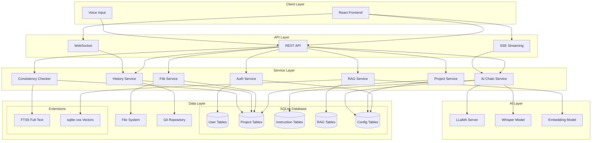
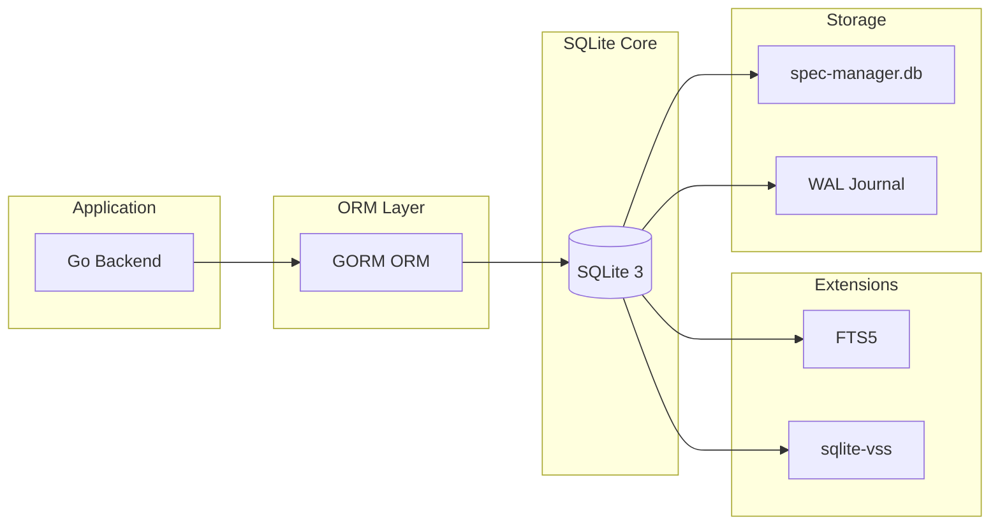
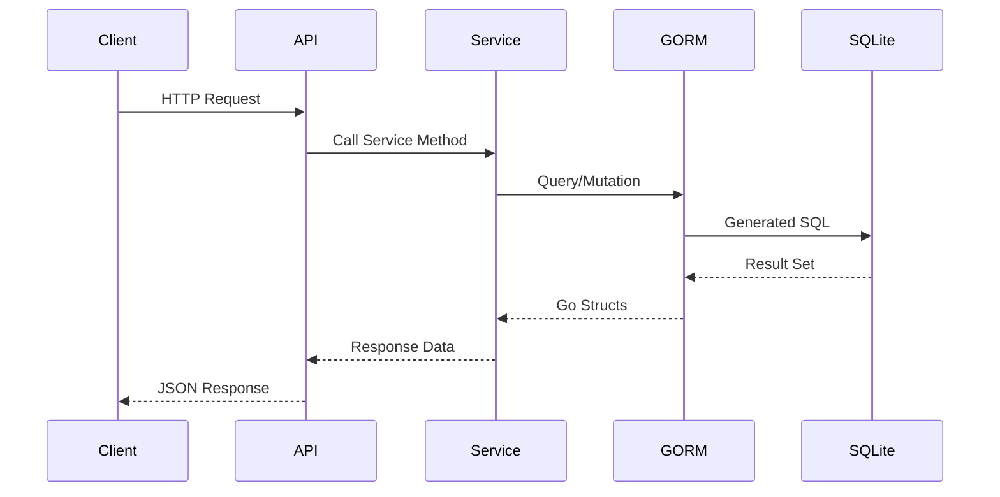
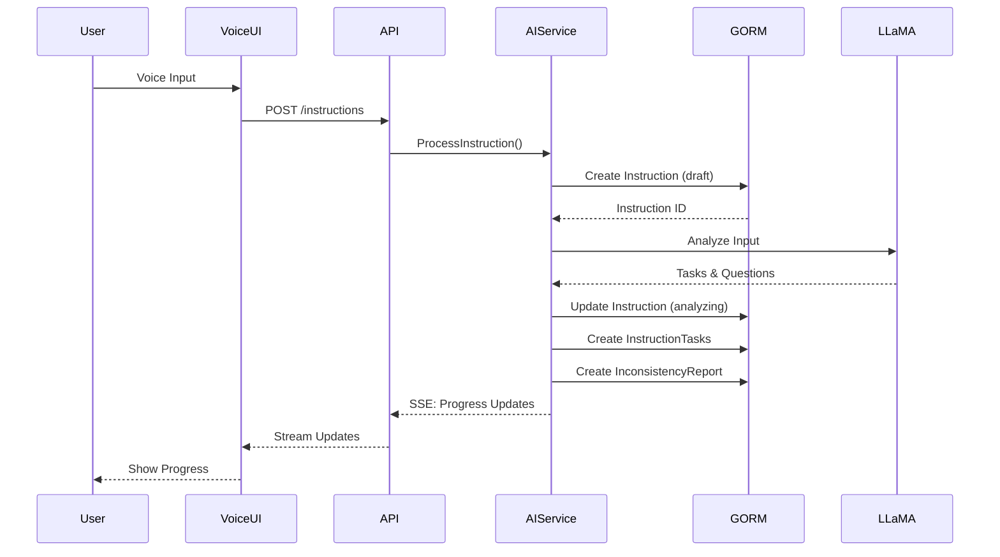
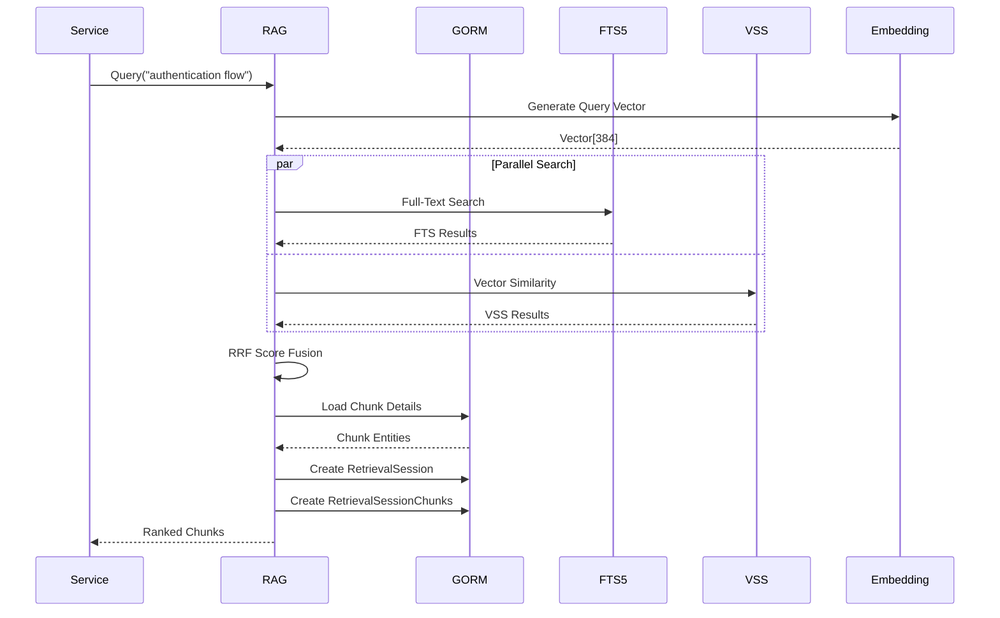
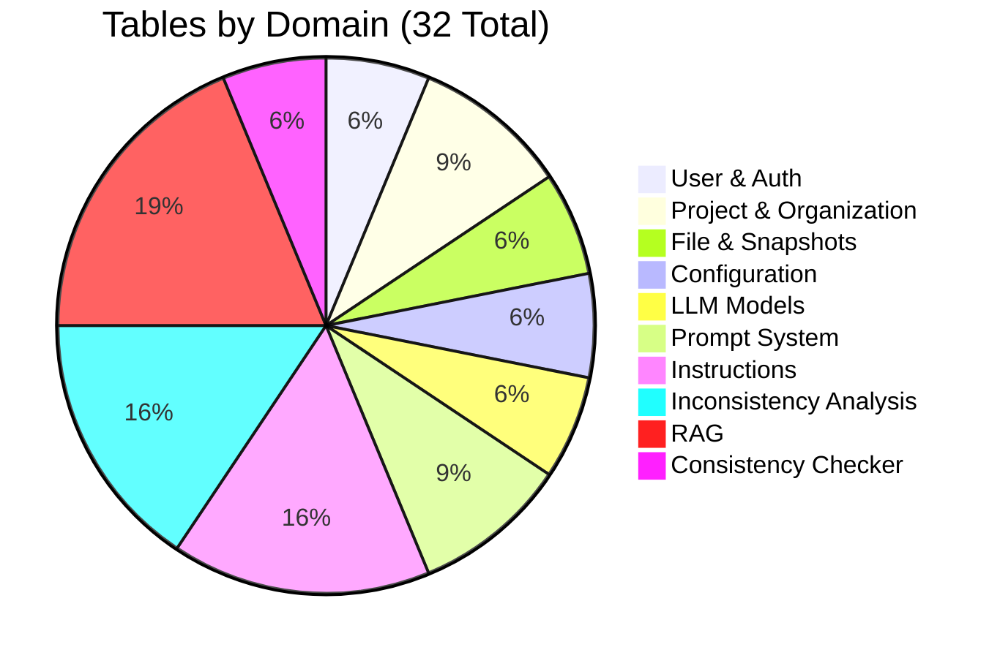
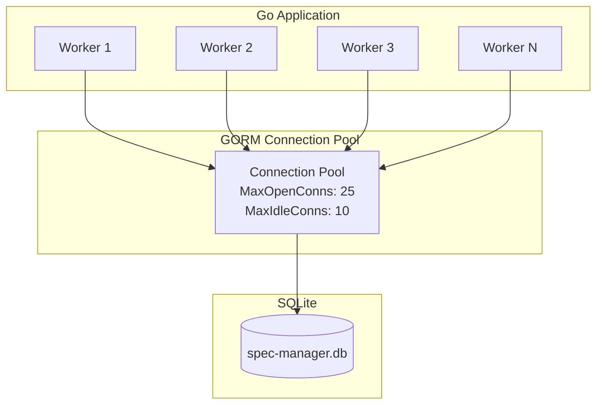
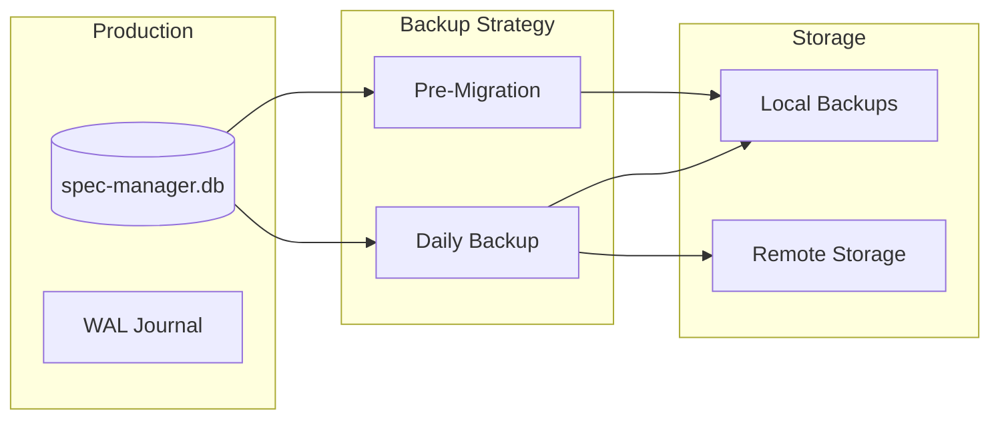

# System Architecture Diagram

**Version:** 1.0.0  
**Status:** Active  
**Updated:** 2026-01-28  

---

## Overview

High-level system architecture showing how database components integrate with the overall Spec Management Software.

**Cross-References:**
- [Schema Definition](../01-schema.md)
- [System Architecture Overview](../../09-diagrams/00-system-architecture-overview.md)

---

## Full System Architecture



---

## Database Component Architecture



---

## Data Flow: User Request



---

## Data Flow: AI Instruction



---

## Data Flow: RAG Retrieval



---

## Table Distribution by Domain



---

## Database Tables Summary

| Domain | Tables | Purpose |
|--------|--------|---------|
| **User & Auth** | User, Session | Authentication, sessions |
| **Project & Organization** | Project, ProjectMetadata, VectorIndexMetadata | Project hierarchy, metadata, vector indexing |
| **File & Snapshots** | File, Snapshot | Content organization, versioning |
| **Configuration** | Config, ConfigSeedEvent | System settings, seeding audit |
| **LLM Models** | ModelRegistry, ModelSlot | AI model management |
| **Prompt System** | PromptPreset, PromptPresetVersion, UserPromptOverride | Prompt templates |
| **Instructions** | Instruction, InstructionTask, FileChange, InstructionSegment, MemoryEntry | AI task processing, file tracking, segmentation |
| **Inconsistency Analysis** | InconsistencyReport, InconsistencyIssue, ClarificationQuestion, ClarificationAnswer, RegenerationEvent | Quality analysis, clarifications |
| **RAG** | Artifact, Chunk, Embedding, RetrievalSession, RetrievalSessionChunk, PromotionEvent | Knowledge retrieval, promotion tracking |
| **Consistency Checker** | ConsistencyLoop, ConsistencyLoopIteration | Iterative validation with scoring |

**Total: 32 tables**

---

## Connection Pooling



**Pool Configuration:**

```go
sqlDB, _ := db.DB()
sqlDB.SetMaxOpenConns(25)
sqlDB.SetMaxIdleConns(10)
sqlDB.SetConnMaxLifetime(time.Hour)
```

---

## Backup & Recovery



---

## Related Specs

- [ERD Diagram](./01-erd.md) — Entity relationships
- [Schema Definition](../01-schema.md) — Complete GORM models
- [RAG System](../../05-features/09-knowledge-memory/01-rag-system.md) — Retrieval architecture
