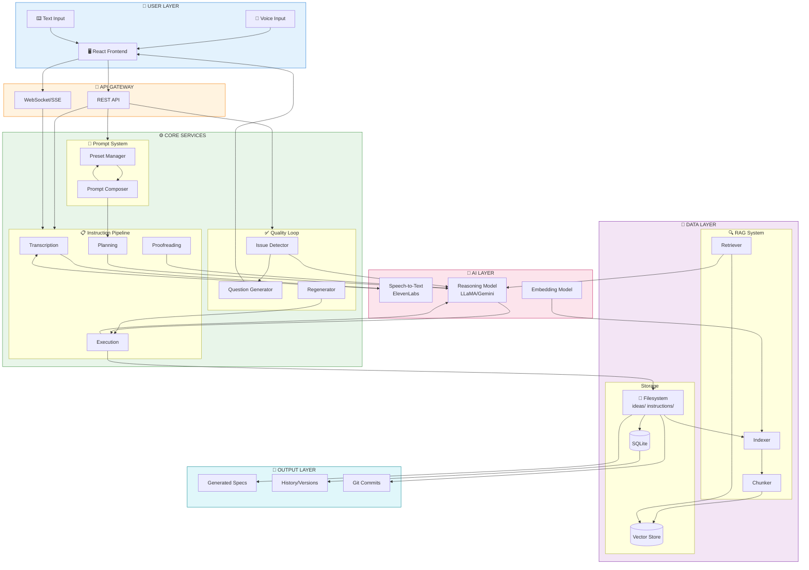
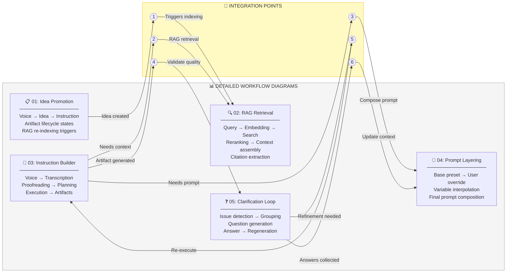
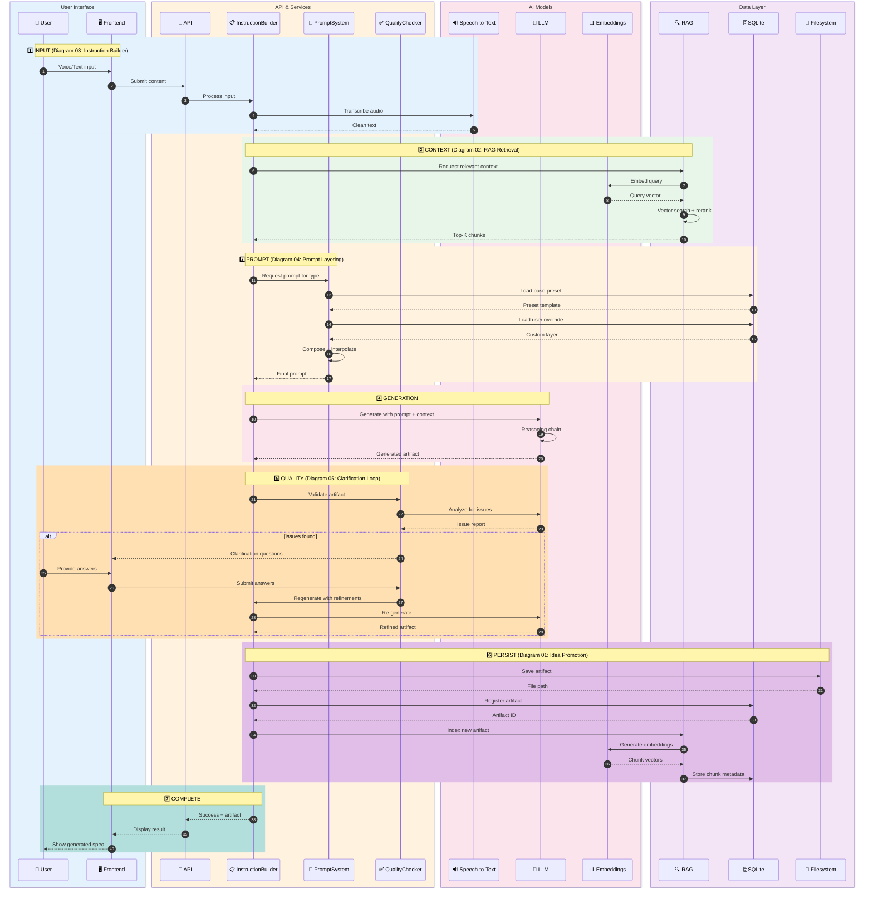
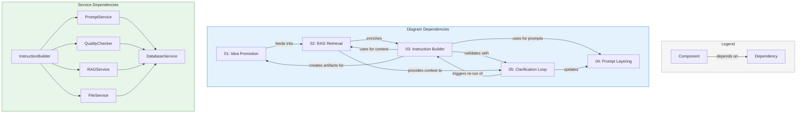
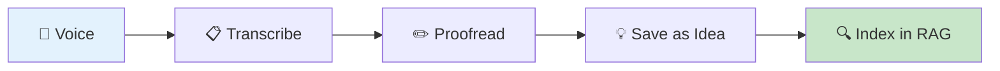
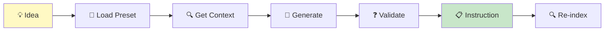
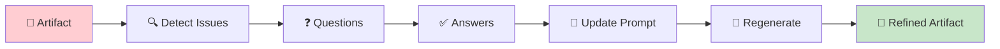
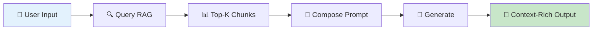
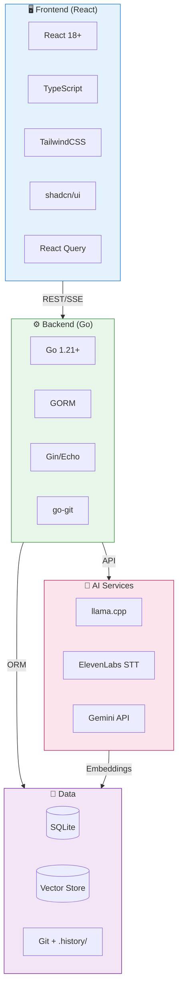

# System Architecture Overview

> **Version:** 1.0.0  
> **Status:** Active  
> **Last Updated:** 2026-01-28

---

## 1. Overview

This document provides a comprehensive system architecture view showing how all workflow components interconnect. It serves as a map linking to the 5 detailed workflow diagrams and illustrates the complete data flow from user input to generated specifications.

---

## 2. High-Level System Architecture

---

## 3. Workflow Integration Map

---

## 4. Complete Data Flow Sequence

---

## 5. Component Dependency Matrix

---

## 6. Layer Responsibility Matrix

| Layer | Components | Responsibilities | Diagrams Referenced |
|-------|------------|------------------|---------------------|
| **User Interface** | React Frontend, Voice Recorder, Question Wizard | User input capture, result display, clarification collection | 03, 05 |
| **API Gateway** | REST endpoints, WebSocket streams | Request routing, auth, streaming responses | All |
| **Instruction Pipeline** | Transcription, Proofreading, Planning, Execution | Voice-to-spec transformation | 03 |
| **Prompt System** | Preset Manager, Composer, Variable Interpolator | Prompt assembly and customization | 04 |
| **Quality Loop** | Issue Detector, Question Generator, Regenerator | Artifact validation and refinement | 05 |
| **RAG System** | Indexer, Chunker, Embedder, Retriever | Context retrieval for generation | 01, 02 |
| **AI Models** | STT (ElevenLabs), LLM (LLaMA/Gemini), Embeddings | Transcription, reasoning, vectorization | 02, 03 |
| **Data Storage** | SQLite, Filesystem, Vector Store | Persistence of artifacts, metadata, vectors | 01, 02 |
| **Version Control** | Git Integration, History Snapshots | Change tracking and rollback | 01 |

---

## 7. Request Flow Patterns

### Pattern A: New Idea from Voice

**Diagrams:** 03 → 01 → 02

---

### Pattern B: Promote Idea to Instruction

**Diagrams:** 01 → 04 → 02 → 03 → 05 → 01

---

### Pattern C: Clarification Refinement

**Diagrams:** 05 → 04 → 03

---

### Pattern D: RAG-Enhanced Generation

**Diagrams:** 02 → 04 → 03

---

## 8. Technology Stack Summary

---

## 9. Diagram Quick Reference

| # | Diagram | Primary Focus | Key Entities | Entry Points |
|---|---------|---------------|--------------|--------------|
| 01 | [Idea Promotion](./01-idea-promotion-workflow.md) | Artifact lifecycle | Idea, Instruction, PromotionEvent | Voice input, Manual create |
| 02 | [RAG Retrieval](./02-rag-retrieval-flow.md) | Context retrieval | Query, Chunk, Embedding, Citation | Generation request |
| 03 | [Instruction Builder](./03-instruction-builder-pipeline.md) | Voice-to-spec | Transcript, Plan, Artifact | Voice/Text input |
| 04 | [Prompt Layering](./04-prompt-preset-layering.md) | Prompt composition | Preset, Override, Variables | Generation request |
| 05 | [Clarification Loop](./05-inconsistency-clarification-workflow.md) | Quality assurance | Issue, Question, Answer, Regeneration | Post-generation |

---

## 10. Cross-References

- **Overview:** [00-overview.md](../00-overview.md)
- **Features Index:** [05-features/00-overview.md](../05-features/00-overview.md)
- **RAG System:** [01-rag-system.md](../05-features/09-knowledge-memory/01-rag-system.md)
- **Instruction System:** [03-instruction-system.md](../05-features/06-ai-integration/03-instruction-system.md)
- **Consistency Report:** [99-consistency-report.md](../99-consistency-report.md)

---

## 11. Version History

| Version | Date | Changes |
|---------|------|---------|
| 1.0.0 | 2026-01-28 | Initial system architecture overview integrating all 5 workflow diagrams |
