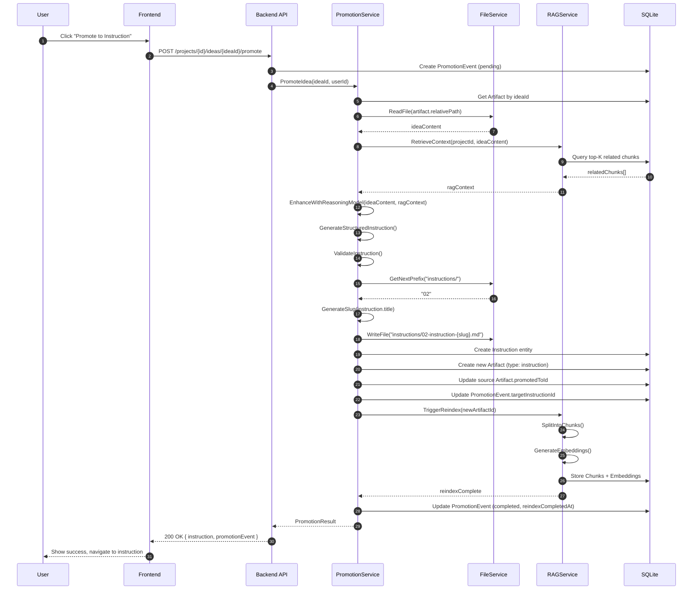
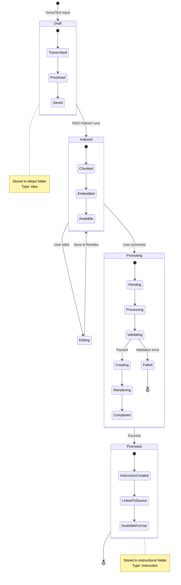
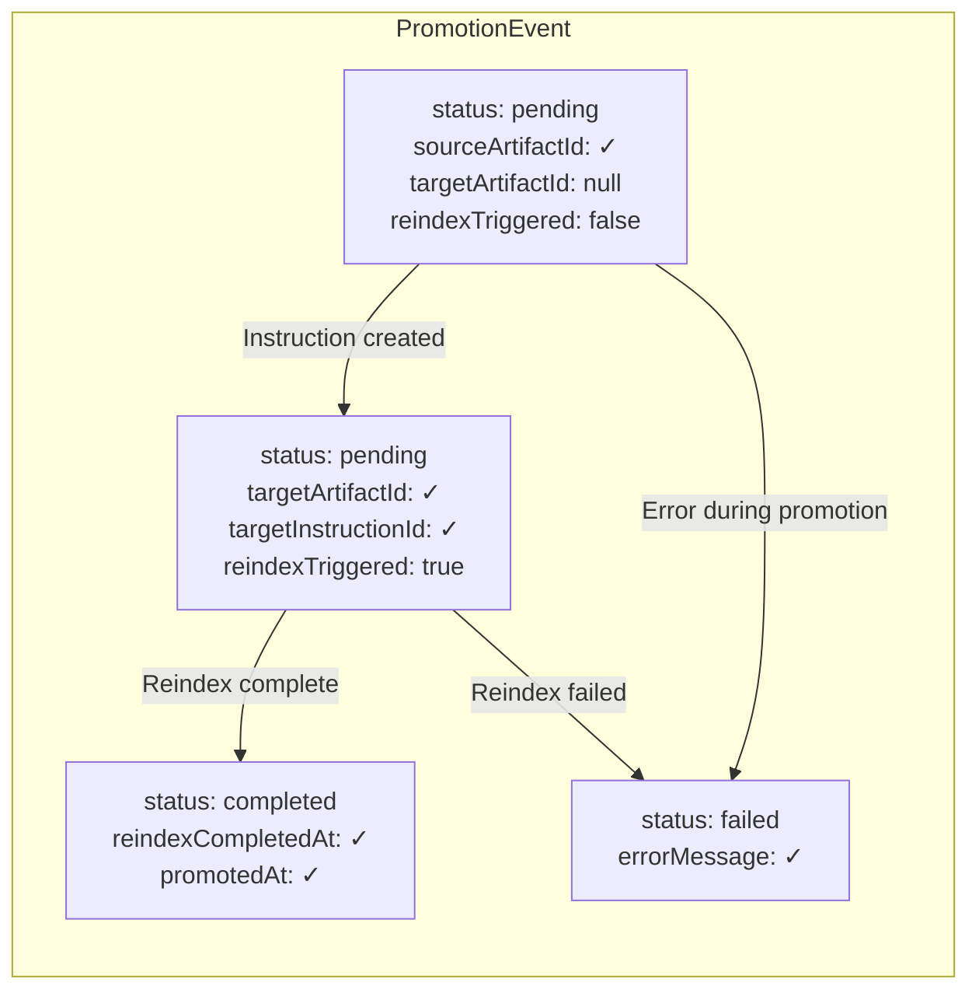

# Idea Promotion Workflow Diagram

**Version:** 1.0.0  
**Updated:** 2026-01-28  

---

## Overview

This diagram illustrates the complete lifecycle of an idea from initial voice/text input through promotion to a refined instruction, including RAG indexing at each stage.

---

## Complete Workflow Diagram

```mermaid
flowchart TD
    subgraph Input["📥 Input Layer"]
        VI[🎤 Voice Input]
        TI[⌨️ Text Input]
        VI --> TR[Transcribe via Voice Model]
        TR --> PR[Proofread & Clean]
        TI --> PR
        PR --> CT{Classify Content Type}
    end

    subgraph IdeaCreation["💡 Idea Creation"]
        CT -->|idea| GS[Generate Slug]
        CT -->|feature/task| GS
        GS --> NP[Get Next Prefix Number]
        NP --> FN["Create Filename<br/>01-idea-{slug}.md"]
        FN --> WF["Write to ideas/ folder"]
        WF --> DB1[(Create Artifact Record)]
    end

    subgraph RAGIndex1["🔍 Initial RAG Indexing"]
        DB1 --> SP1[Split into Chunks]
        SP1 --> SID[Generate Stable IDs]
        SID --> EMB1[Generate Embeddings]
        EMB1 --> IDX1[(Store in SQLite)]
        IDX1 --> AV1[✅ Idea Available for Retrieval]
    end

    subgraph Refinement["✨ Refinement Phase"]
        AV1 --> RV[User Reviews Idea]
        RV --> ED{Edit Needed?}
        ED -->|Yes| UPD[Update Idea Content]
        UPD --> REHASH[Recalculate Hash]
        REHASH --> REINX[Re-index Changed Chunks]
        REINX --> RV
        ED -->|No| RDY{Ready for Promotion?}
        RDY -->|No| RV
        RDY -->|Yes| PROM[Initiate Promotion]
    end

    subgraph Promotion["🚀 Promotion Process"]
        PROM --> PE1[(Create PromotionEvent<br/>status: pending)]
        PE1 --> RC[Read Idea Content]
        RC --> ENH[Enhance via Reasoning Model]
        ENH --> RAG[Inject RAG Context<br/>top-K related artifacts]
        RAG --> GEN[Generate Structured Instruction]
        GEN --> VAL{Validation Passed?}
        VAL -->|No| ERR[Mark PromotionEvent Failed]
        VAL -->|Yes| INP[Get Instruction Prefix Number]
    end

    subgraph InstructionCreation["📋 Instruction Creation"]
        INP --> IFN["Create Filename<br/>01-instruction-{slug}.md"]
        IFN --> WIF["Write to instructions/ folder"]
        WIF --> DB2[(Create Instruction Entity)]
        DB2 --> LINK[Link PromotionEvent<br/>targetInstructionId]
        LINK --> UPS[Update Source Artifact<br/>promotedToId]
    end

    subgraph RAGIndex2["🔄 Post-Promotion Reindexing"]
        UPS --> TRI[Trigger Reindex]
        TRI --> SP2[Split Instruction into Chunks]
        SP2 --> EMB2[Generate Embeddings]
        EMB2 --> IDX2[(Store in SQLite)]
        IDX2 --> PE2[(Update PromotionEvent<br/>reindexCompletedAt)]
        PE2 --> PE3[(Update PromotionEvent<br/>status: completed)]
    end

    subgraph Available["✅ Ready for Use"]
        PE3 --> AV2[Instruction Available for Retrieval]
        AV2 --> USE1[🤖 AI Context Injection]
        AV2 --> USE2[📂 File Browser Display]
        AV2 --> USE3[🔎 Search Results]
    end

    style Input fill:#e1f5fe
    style IdeaCreation fill:#fff3e0
    style RAGIndex1 fill:#f3e5f5
    style Refinement fill:#e8f5e9
    style Promotion fill:#fff8e1
    style InstructionCreation fill:#fce4ec
    style RAGIndex2 fill:#f3e5f5
    style Available fill:#e8f5e9
```

---

## Sequence Diagram: Promotion API Flow

---

## State Diagram: Artifact Lifecycle

---

## Data Flow: PromotionEvent Lifecycle

---

## Cross-References

- [Instruction System](../05-features/06-ai-integration/03-instruction-system.md) - Promotion service implementation
- [RAG System](../05-features/09-knowledge-memory/01-rag-system.md) - Indexing and retrieval
- [Database Schema](../07-database-design/01-schema.md) - PromotionEvent and Artifact tables
- [File Operations](../05-features/02-file-management/01-file-operations.md) - ideas/instructions folder structure
- [Path Manager](../05-features/02-file-management/02-path-manager.md) - Path handling
