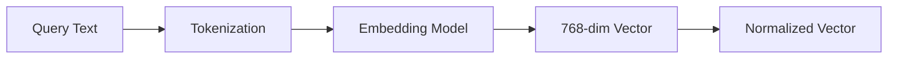
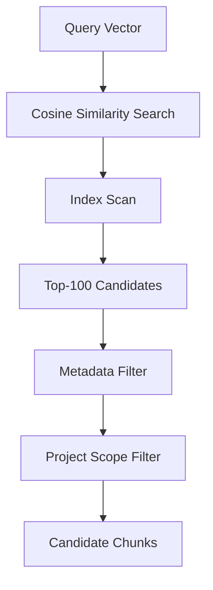
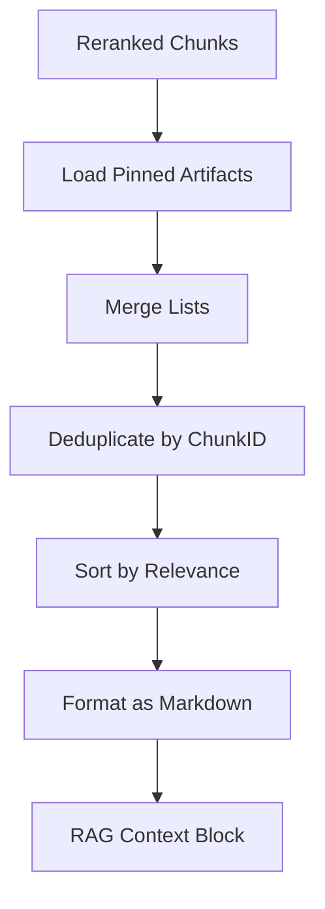
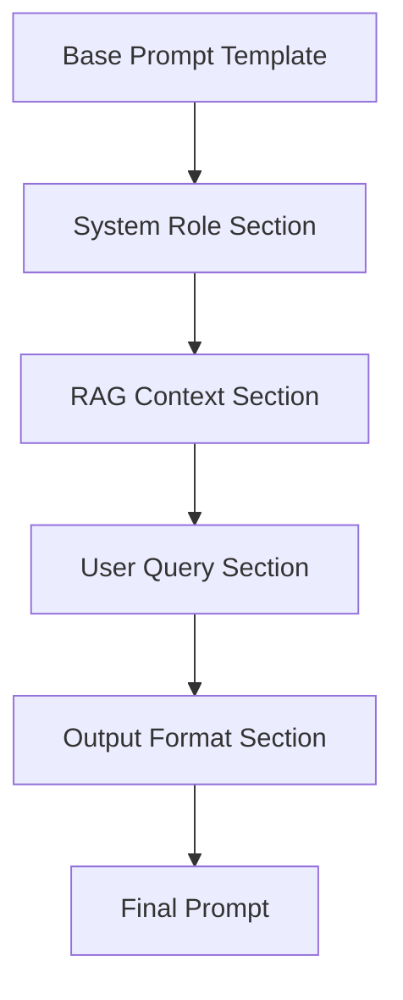
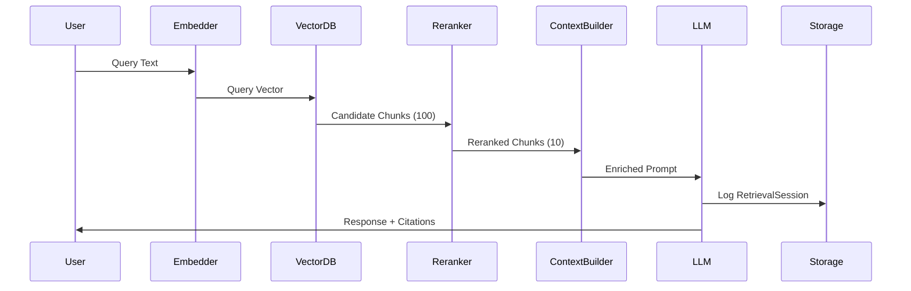

# RAG Retrieval Flow Diagram

## Overview

This diagram illustrates the complete Retrieval-Augmented Generation (RAG) pipeline from user query to context-enriched prompt generation.

## Flow Diagram

```mermaid
flowchart TD
    subgraph Input["🎤 Input Layer"]
        A[User Query] --> B{Input Type}
        B -->|Text| C[Text Input]
        B -->|Voice| D[Voice Input]
        D --> E[Transcription Service]
        E --> C
    end

    subgraph Embedding["🧮 Embedding Stage"]
        C --> F[Query Preprocessor]
        F --> G[Generate Query Embedding]
        G --> H[Query Vector]
    end

    subgraph Retrieval["🔍 Vector Search Stage"]
        H --> I[Vector Database Query]
        I --> J[(SQLite + Embeddings)]
        J --> K[Candidate Chunks]
        K --> L{Chunk Count > 0?}
        L -->|No| M[Fallback: Recent Artifacts]
        L -->|Yes| N[Raw Results]
        M --> N
    end

    subgraph Reranking["⚖️ Reranking Stage"]
        N --> O[Cross-Encoder Reranker]
        O --> P[Score & Sort Chunks]
        P --> Q[Apply Top-K Filter]
        Q --> R[Filtered Chunks]
    end

    subgraph Context["📋 Context Assembly"]
        R --> S[Merge with Pinned Artifacts]
        S --> T[Deduplicate Chunks]
        T --> U[Format Context Block]
        U --> V[Assembled RAG Context]
    end

    subgraph Injection["💉 Prompt Injection"]
        V --> W[Load Base Prompt Template]
        W --> X[Inject RAG Context]
        X --> Y[Inject System Instructions]
        Y --> Z[Final Enriched Prompt]
    end

    subgraph Generation["🤖 Generation Stage"]
        Z --> AA[LLM Reasoning Model]
        AA --> AB[Generate Response]
        AB --> AC[Response with Citations]
    end

    subgraph Output["📤 Output Layer"]
        AC --> AD[Extract Artifact References]
        AD --> AE[Store in RetrievalSession]
        AE --> AF[Return to User]
    end

    style Input fill:#e1f5fe
    style Embedding fill:#f3e5f5
    style Retrieval fill:#e8f5e9
    style Reranking fill:#fff3e0
    style Context fill:#fce4ec
    style Injection fill:#e0f2f1
    style Generation fill:#f5f5f5
    style Output fill:#e8eaf6
```



## Detailed Component Descriptions

### 1. Input Layer

| Component | Description |
|-----------|-------------|
| User Query | Raw text or voice input from user |
| Transcription Service | Converts voice to text using voice model |
| Text Input | Normalized query string |

### 2. Embedding Stage



| Component | Description |
|-----------|-------------|
| Query Preprocessor | Cleans, normalizes, and tokenizes input |
| Generate Query Embedding | Converts text to vector using embedding model |
| Query Vector | 768-dimensional float array |

### 3. Vector Search Stage



| Parameter | Default | Description |
|-----------|---------|-------------|
| `rag.vectorSearch.topK` | 100 | Initial candidate count |
| `rag.vectorSearch.similarityThreshold` | 0.7 | Minimum cosine similarity |
| `rag.vectorSearch.projectScope` | true | Limit to current project |

### 4. Reranking Stage


| Component | Description |
|-----------|-------------|
| Cross-Encoder Reranker | Scores query-chunk pairs for relevance |
| Top-K Filter | Selects highest-scoring chunks |

**Configuration:**
- `rag.reranking.enabled`: true
- `rag.reranking.topK`: 10
- `rag.reranking.model`: "cross-encoder/ms-marco-MiniLM-L-6-v2"

### 5. Context Assembly



**Context Block Format:**
```markdown
## Retrieved Context

### From: spec/backend/08-ai-integration.md
> [Chunk content here...]

### From: spec/backend/16-rag-system.md  
> [Chunk content here...]

---
```

### 6. Prompt Injection



**Template Structure:**
```
[SYSTEM_ROLE]
You are an AI assistant for spec management...

[RAG_CONTEXT]
{injected_rag_context}

[USER_QUERY]
{original_user_query}

[OUTPUT_FORMAT]
Respond in structured markdown...
```

### 7. Generation & Output

| Component | Description |
|-----------|-------------|
| LLM Reasoning Model | Processes enriched prompt |
| Citation Extraction | Identifies referenced artifacts |
| RetrievalSession | Logs chunks used for traceability |

## Data Flow Summary



## Error Handling

| Scenario | Fallback Behavior |
|----------|-------------------|
| No chunks found | Use recent artifacts from project |
| Embedding service down | Return error, skip RAG injection |
| Reranker timeout | Use raw vector search results |
| Context too large | Truncate oldest chunks first |

## Performance Targets

| Metric | Target | Description |
|--------|--------|-------------|
| Embedding Latency | < 50ms | Query vectorization time |
| Vector Search | < 100ms | Database retrieval time |
| Reranking | < 200ms | Cross-encoder scoring |
| Total Pipeline | < 500ms | End-to-end retrieval |

## Cross-References

- **RAG System Spec**: [01-rag-system.md](../05-features/09-knowledge-memory/01-rag-system.md)
- **AI Integration**: [01-ai-integration.md](../05-features/06-ai-integration/01-ai-integration.md)
- **Database Schema**: [01-schema.md](../07-database-design/01-schema.md)
- **Knowledge Memory Overview**: [00-overview.md](../05-features/09-knowledge-memory/00-overview.md)
