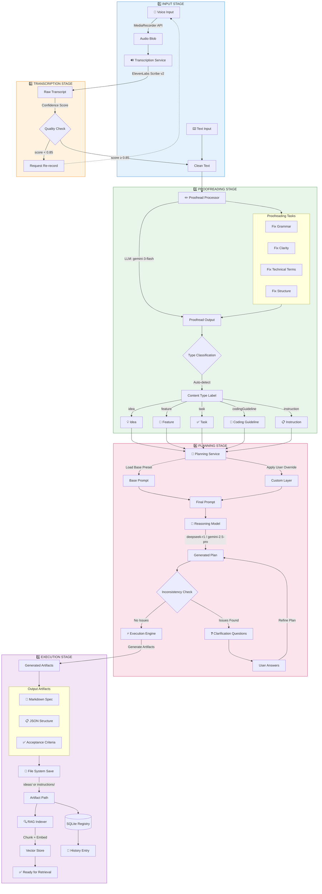
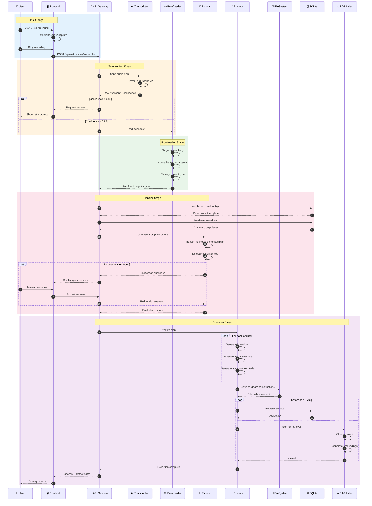
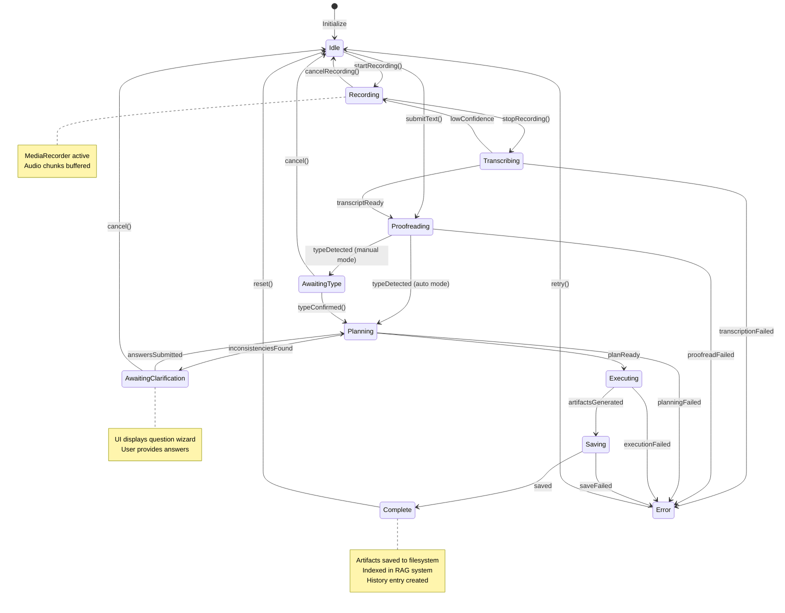

# Instruction Builder: Voice-to-Spec Pipeline

> **Version:** 1.0.0  
> **Status:** Active  
> **Last Updated:** 2026-01-28

---

## 1. Overview

This document visualizes the complete Instruction Builder pipeline that transforms voice or text input into structured specification artifacts. The pipeline consists of five stages: Input → Transcription → Proofreading → Planning → Execution.

---

## 2. Pipeline Flowchart



---

## 3. Sequence Diagram



---

## 4. State Diagram



---

## 5. Stage Details

### 5.1 Input Stage

| Component | Technology | Description |
|-----------|------------|-------------|
| Voice Capture | MediaRecorder API | Browser-native audio recording |
| Audio Format | WebM/Opus or WAV | Configurable based on browser |
| Text Input | React Textarea | Direct text entry alternative |
| Chunk Size | 1-5 seconds | Configurable for streaming |

**API Endpoint:**
```
POST /api/instructions/transcribe
Content-Type: multipart/form-data

Body:
  - audio: Blob (audio file)
  - projectId: string
  - language?: string (default: auto-detect)
```

---

### 5.2 Transcription Stage

| Component | Technology | Description |
|-----------|------------|-------------|
| STT Model | ElevenLabs Scribe v2 | High-accuracy transcription |
| Streaming | WebSocket (optional) | Real-time partial transcripts |
| Quality Threshold | 0.85 confidence | Minimum for acceptance |
| Retry Logic | 3 attempts max | Before manual fallback |

**Quality Check Criteria:**
- Word confidence scores averaged
- Silence detection for incomplete audio
- Language detection confidence
- Speaker clarity assessment

---

### 5.3 Proofreading Stage

| Task | Description | Priority |
|------|-------------|----------|
| Grammar Fix | Correct spelling, punctuation, syntax | High |
| Clarity Enhancement | Simplify complex sentences | Medium |
| Technical Normalization | Standardize technical terms | High |
| Structure Improvement | Add paragraph breaks, lists | Low |

**Content Type Classification:**

| Type | Indicators | Output Location |
|------|------------|-----------------|
| `idea` | Exploratory, "what if", brainstorming | `ideas/` |
| `feature` | User story format, acceptance criteria | `instructions/` |
| `task` | Action-oriented, specific deliverable | `instructions/` |
| `codingGuideline` | Standards, patterns, conventions | `instructions/` |
| `instruction` | Step-by-step, imperative | `instructions/` |

---

### 5.4 Planning Stage

| Component | Model | Purpose |
|-----------|-------|---------|
| Reasoning Engine | deepseek-r1:14b / gemini-2.5-pro | Long-chain task decomposition |
| Preset Loader | SQLite query | Load base + user prompts |
| Inconsistency Detector | Same reasoning model | Detect ambiguities, conflicts |
| Question Generator | Structured output | UI-friendly question format |

**Prompt Composition:**
```
Final Prompt = Base Preset + User Custom Layer + Proofread Content

Example:
┌─────────────────────────────────────────────────────┐
│ BASE PRESET (from Prompts/feature/base.md)          │
│ ─────────────────────────────────────────────       │
│ You are a specification writer. Generate a feature │
│ spec with user stories, acceptance criteria...      │
├─────────────────────────────────────────────────────┤
│ USER CUSTOM LAYER (from user override)              │
│ ─────────────────────────────────────────────       │
│ Always include database schema changes.             │
│ Use Mermaid diagrams for complex flows.             │
├─────────────────────────────────────────────────────┤
│ PROOFREAD CONTENT                                   │
│ ─────────────────────────────────────────────       │
│ [User's cleaned and classified input]               │
└─────────────────────────────────────────────────────┘
```

**Clarification Question Format:**
```json
{
  "questions": [
    {
      "id": "q1",
      "phase": "critical",
      "text": "Should this feature require authentication?",
      "type": "radio",
      "options": [
        { "value": "yes", "label": "Yes, require login" },
        { "value": "no", "label": "No, public access" }
      ]
    },
    {
      "id": "q2",
      "phase": "conflict",
      "text": "You mentioned both REST and GraphQL. Which should be primary?",
      "type": "radio",
      "options": [
        { "value": "rest", "label": "REST API" },
        { "value": "graphql", "label": "GraphQL" },
        { "value": "both", "label": "Both (REST primary)" }
      ]
    }
  ]
}
```

---

### 5.5 Execution Stage

| Component | Description | Output |
|-----------|-------------|--------|
| Markdown Generator | Structured spec document | `*.md` file |
| JSON Exporter | Machine-readable structure | `*.json` file |
| Acceptance Criteria | Testable requirements | Embedded in spec |
| File Saver | Atomic write with backup | Filesystem path |
| DB Registrar | Artifact metadata | SQLite entry |
| RAG Indexer | Chunk + embed for retrieval | Vector store |

**Artifact Naming Convention:**
```
ideas/
  └── 01-idea-{slug}.md
  └── 02-idea-{slug}.md

instructions/
  └── 01-instruction-{slug}.md
  └── 02-instruction-{slug}.md
```

**Dual-Format Storage:**
```
ideas/01-idea-user-auth/
  ├── 01-idea-user-auth.md      # Human-readable
  └── 01-idea-user-auth.json    # Machine-readable
```

---

## 6. Error Handling

| Stage | Error Type | Recovery Action |
|-------|------------|-----------------|
| Input | Microphone access denied | Show permission guide |
| Input | Audio too short (<1s) | Prompt to re-record |
| Transcription | Low confidence | Offer re-record or manual edit |
| Transcription | Service timeout | Retry with exponential backoff |
| Proofreading | LLM rate limit | Queue and retry |
| Planning | Inconsistencies unresolvable | Escalate to manual review |
| Execution | File write failed | Rollback and retry |
| Execution | RAG indexing failed | Log warning, continue (non-blocking) |

---

## 7. Performance Targets

| Stage | Target Latency | Notes |
|-------|----------------|-------|
| Voice Recording | Real-time | No added latency |
| Transcription | < 2s per 10s audio | Batch mode |
| Transcription (streaming) | < 200ms | Partial results |
| Proofreading | < 3s | Single LLM call |
| Planning | < 10s | Reasoning model |
| Clarification UI | Instant | Frontend only |
| Execution | < 5s | File + DB + RAG |
| **Total (no clarification)** | **< 20s** | End-to-end |

---

## 8. Cross-References

- **Instruction System Spec:** [03-instruction-system.md](../05-features/06-ai-integration/03-instruction-system.md)
- **Instruction History:** [04-instruction-history.md](../05-features/06-ai-integration/04-instruction-history.md)
- **RAG System:** [01-rag-system.md](../05-features/09-knowledge-memory/01-rag-system.md)
- **Voice Input:** [00-overview.md](../05-features/05-voice-input/00-overview.md)
- **Instruction Builder UI:** [09-instruction-builder-ui.md](../05-features/06-ai-integration/09-instruction-builder-ui.md)
- **AI Prompt Panel:** [10-ai-prompt-panel.md](../05-features/06-ai-integration/10-ai-prompt-panel.md)
