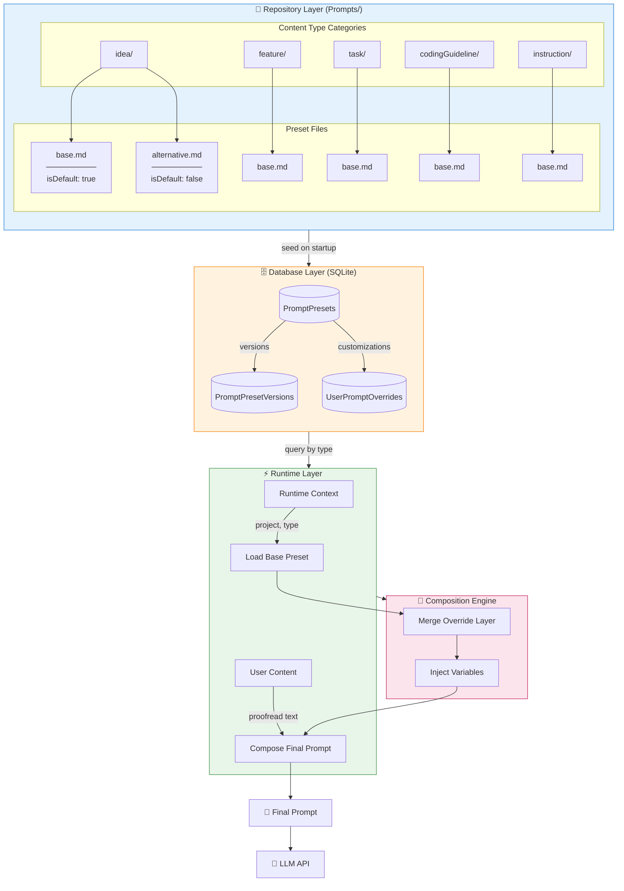
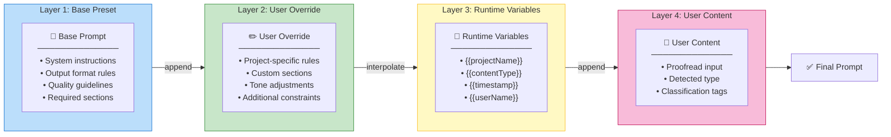
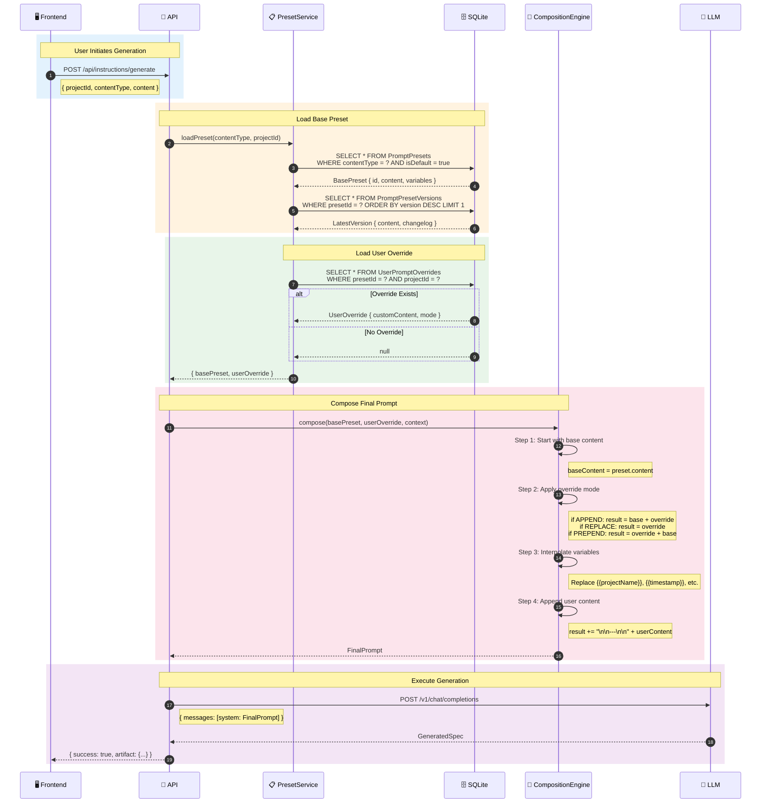
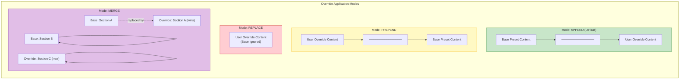
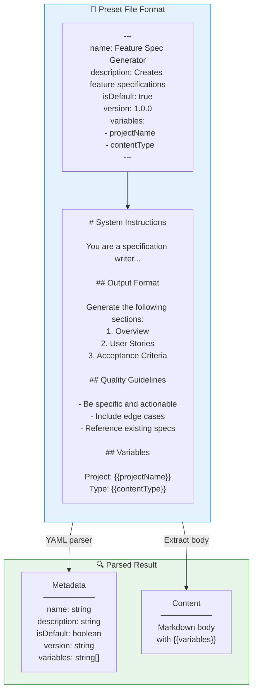
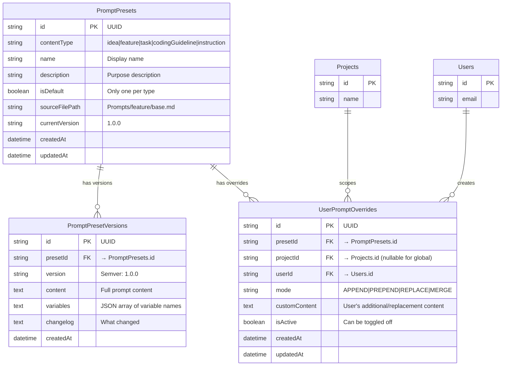
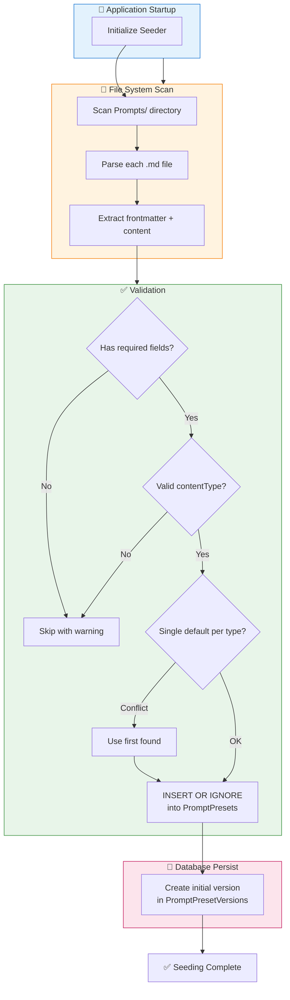
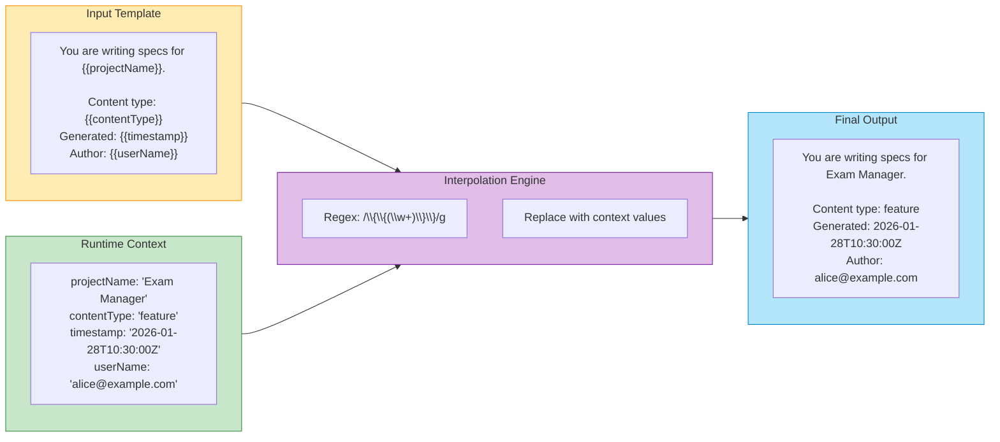
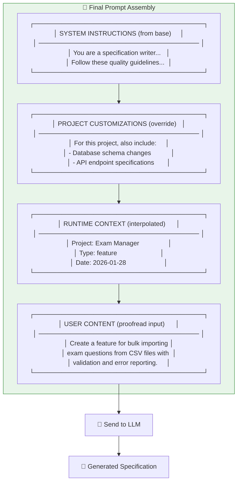

# Prompt Preset Layering System

> **Version:** 1.0.0  
> **Status:** Active  
> **Last Updated:** 2026-01-28

---

## 1. Overview

This document visualizes the prompt preset layering system that composes final prompts from base presets, user overrides, and runtime context. The system enables customization while maintaining consistency through a structured inheritance model.

---

## 2. Layering Architecture

---

## 3. Layer Inheritance Model

---

## 4. Detailed Composition Sequence

---

## 5. Override Modes

---

## 6. Preset File Structure

---

## 7. Database Schema

---

## 8. Seeding Flow

---

## 9. Variable Interpolation

**Supported Variables:**

| Variable | Source | Example |
|----------|--------|---------|
| `{{projectName}}` | Project.name | "Exam Manager" |
| `{{contentType}}` | Classification result | "feature" |
| `{{timestamp}}` | Current ISO8601 | "2026-01-28T10:30:00Z" |
| `{{userName}}` | Current user email | "alice@example.com" |
| `{{userId}}` | Current user ID | "usr_abc123" |
| `{{date}}` | Current date | "2026-01-28" |
| `{{specVersion}}` | From config | "1.0.0" |

---

## 10. Final Prompt Structure

---

## 11. API Endpoints

| Endpoint | Method | Description |
|----------|--------|-------------|
| `/api/presets` | GET | List all presets (optionally filter by contentType) |
| `/api/presets/:id` | GET | Get preset with versions |
| `/api/presets/:id/versions` | GET | List all versions of a preset |
| `/api/presets/:id/override` | POST | Create/update user override for a preset |
| `/api/presets/:id/override` | DELETE | Remove user override |
| `/api/presets/compose` | POST | Preview composed prompt without execution |
| `/api/presets/seed` | POST | Trigger re-seeding from filesystem (admin) |

---

## 12. Error Handling

| Error | Code | Resolution |
|-------|------|------------|
| Preset not found | 4001 | Fall back to system default |
| Invalid content type | 4002 | Reject with supported types list |
| Variable not in context | 4003 | Leave placeholder or use empty string |
| Override syntax error | 4004 | Reject with parse error details |
| Circular override reference | 4005 | Detect and reject |
| Version conflict | 4006 | Use latest version with warning |

---

## 13. Cross-References

- **Instruction System:** [03-instruction-system.md](../05-features/06-ai-integration/03-instruction-system.md)
- **Presets Guidelines:** [02-presets-guidelines.md](../05-features/06-ai-integration/02-presets-guidelines.md)
- **AI Integration:** [01-ai-integration.md](../05-features/06-ai-integration/01-ai-integration.md)
- **Instruction Builder Pipeline:** [03-instruction-builder-pipeline.md](./03-instruction-builder-pipeline.md)
- **Instruction Builder UI:** [09-instruction-builder-ui.md](../05-features/06-ai-integration/09-instruction-builder-ui.md)
