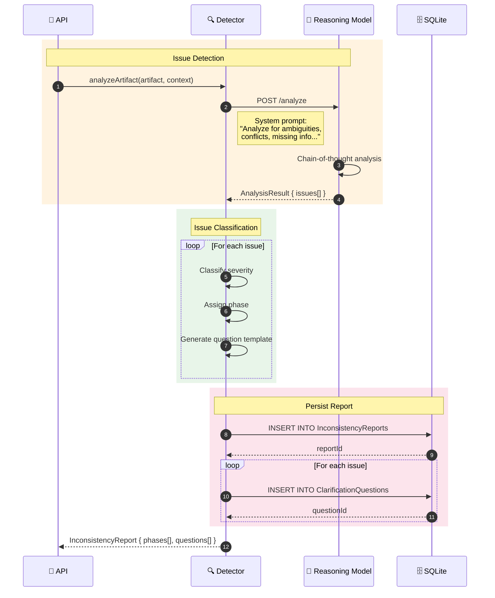
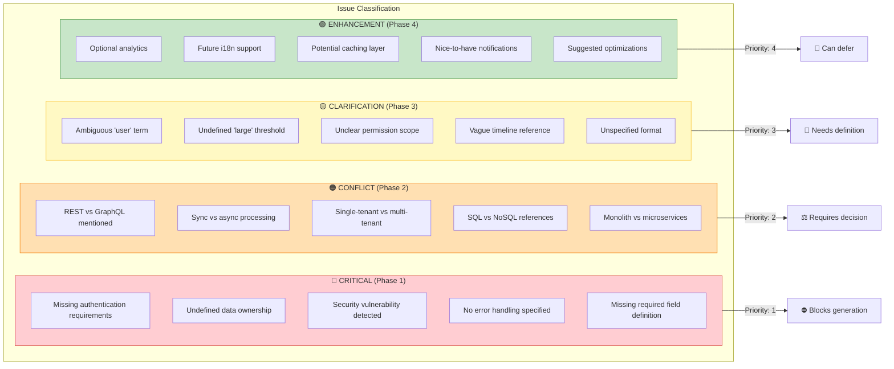
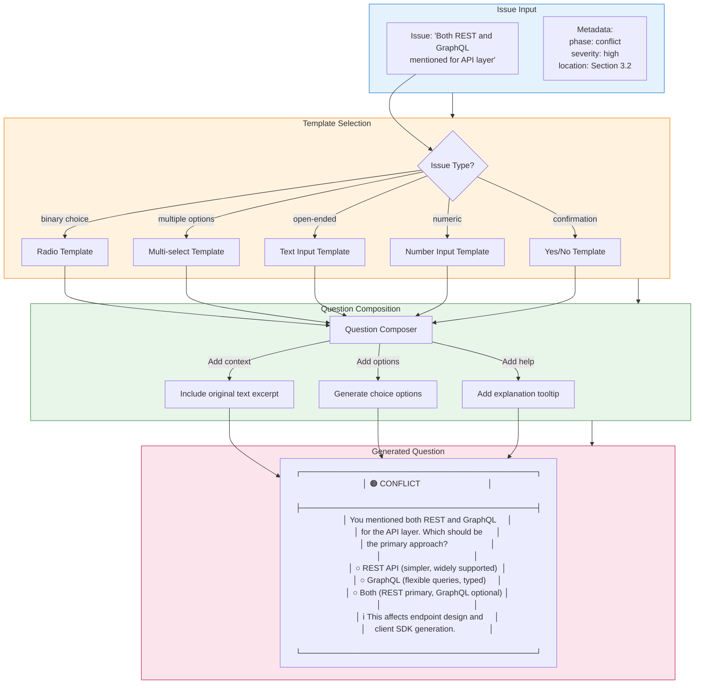
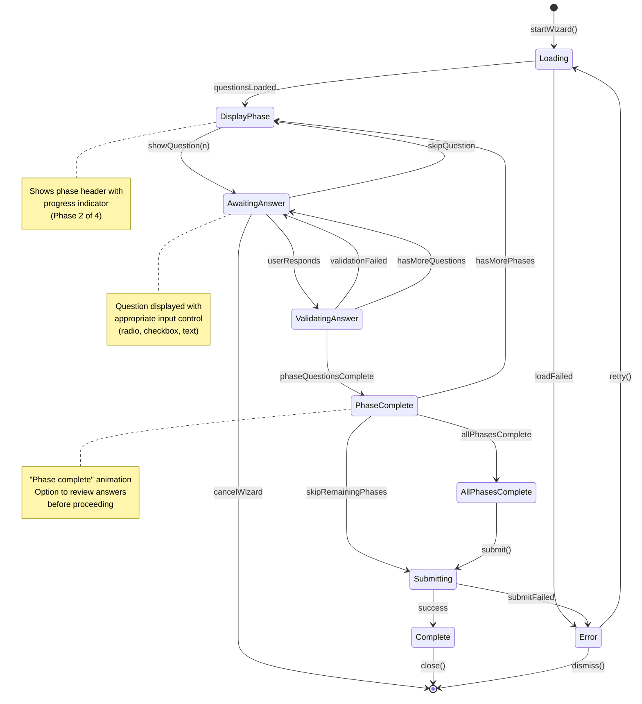
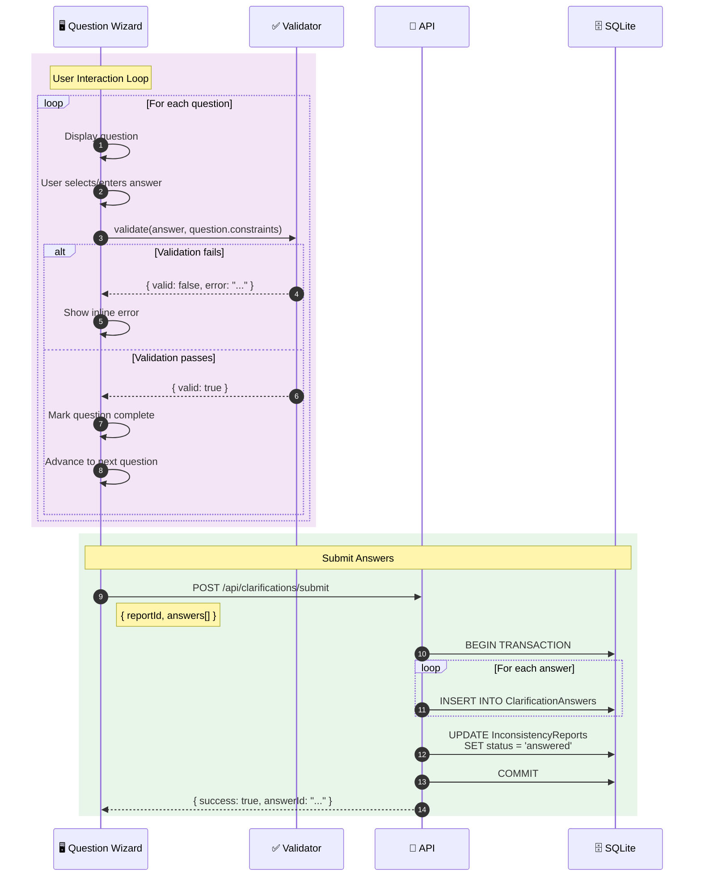
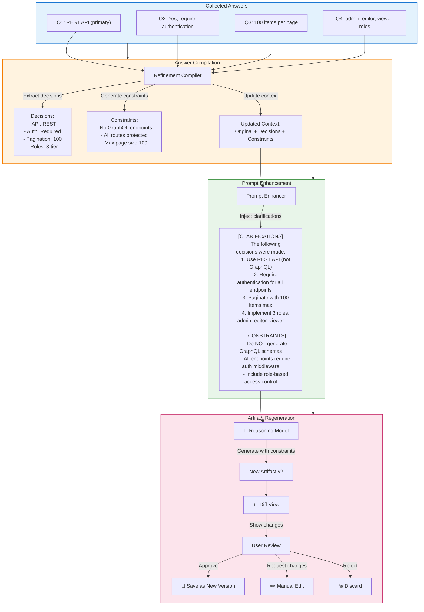
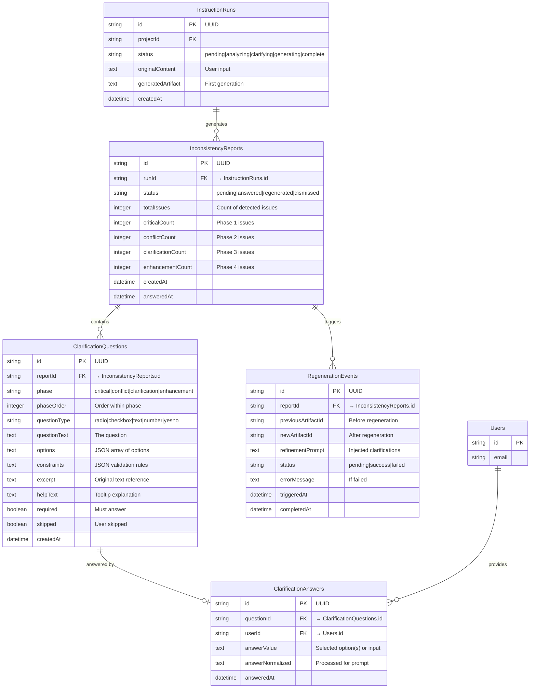
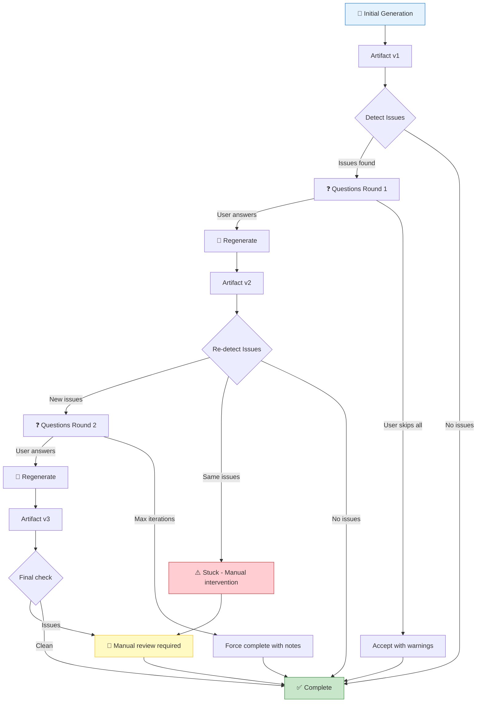

# Inconsistency Detection & Clarification Workflow

> **Version:** 1.0.0  
> **Status:** Active  
> **Last Updated:** 2026-01-28

---

## 1. Overview

This document visualizes the inconsistency detection and clarification workflow that analyzes generated artifacts for ambiguities, conflicts, and missing information. The system groups issues by phase, generates structured clarification questions, collects user answers, and triggers regeneration with refined context.

---

## 2. End-to-End Workflow

```mermaid
flowchart TD
    subgraph Input["📥 INPUT"]
        GA[Generated Artifact]
        CTX[Generation Context]
    end

    subgraph Detection["🔍 DETECTION STAGE"]
        RM[🧠 Reasoning Model]
        
        RM --> |Analyze| DET{Detect Issues}
        
        DET --> AMB[⚠️ Ambiguities]
        DET --> CON[❌ Conflicts]
        DET --> MIS[❓ Missing Info]
        DET --> INC[📋 Incomplete Sections]
        
        AMB & CON & MIS & INC --> IC[Issue Collector]
    end

    subgraph Grouping["📊 GROUPING STAGE"]
        IC --> PG[Phase Grouper]
        
        PG --> P1["🔴 Phase 1: CRITICAL<br/>─────────────<br/>Blocking issues<br/>Missing core requirements<br/>Security concerns"]
        
        PG --> P2["🟠 Phase 2: CONFLICT<br/>─────────────<br/>Contradictory requirements<br/>Mutually exclusive choices<br/>Architecture decisions"]
        
        PG --> P3["🟡 Phase 3: CLARIFICATION<br/>─────────────<br/>Ambiguous language<br/>Undefined terms<br/>Scope questions"]
        
        PG --> P4["🟢 Phase 4: ENHANCEMENT<br/>─────────────<br/>Optional features<br/>Nice-to-haves<br/>Future considerations"]
    end

    subgraph QuestionGen["❓ QUESTION GENERATION"]
        P1 & P2 & P3 & P4 --> QG[Question Generator]
        
        QG --> |Format for UI| QS[Question Set]
        
        subgraph QuestionTypes["Question Types"]
            RB[🔘 Radio (single choice)]
            CB[☑️ Checkbox (multi-select)]
            TXT[📝 Text Input]
            NUM[🔢 Number Input]
        end
        
        QG --> QuestionTypes
    end

    subgraph UserInput["👤 USER INPUT"]
        QS --> UI[Question Wizard UI]
        UI --> |User responds| ANS[Collected Answers]
        
        UI --> |Skip phase| SKIP[Mark as Deferred]
        UI --> |Cancel| CANCEL[Abort Workflow]
    end

    subgraph Regeneration["🔄 REGENERATION"]
        ANS --> RC[Refinement Compiler]
        RC --> |Merge with context| RCTX[Refined Context]
        
        RCTX --> RG[🧠 Regenerate Artifact]
        RG --> NEW[New Artifact Version]
        
        NEW --> VALIDATE{Re-validate}
        
        VALIDATE --> |More issues| Detection
        VALIDATE --> |Clean| DONE[✅ Complete]
    end

    Input --> Detection
    SKIP --> Regeneration
    CANCEL --> ABORT[❌ Workflow Aborted]

    style Input fill:#e3f2fd,stroke:#1976d2
    style Detection fill:#fff3e0,stroke:#f57c00
    style Grouping fill:#e8f5e9,stroke:#388e3c
    style QuestionGen fill:#fce4ec,stroke:#c2185b
    style UserInput fill:#f3e5f5,stroke:#7b1fa2
    style Regeneration fill:#e0f7fa,stroke:#00838f
```

---

## 3. Detection Analysis Sequence



---

## 4. Phase Classification Matrix



---

## 5. Question Generation Flow



---

## 6. Question UI State Machine



---

## 7. Answer Collection & Validation



**Validation Rules:**

| Question Type | Validation |
|---------------|------------|
| Radio | Exactly one option selected |
| Checkbox | At least one option (if required) |
| Text | Min/max length, pattern match |
| Number | Min/max range, integer/float |
| Yes/No | Boolean value |

---

## 8. Regeneration Flow



---

## 9. Database Schema



---

## 10. Iteration Loop



**Iteration Limits:**

| Metric | Limit | Action When Exceeded |
|--------|-------|---------------------|
| Max iterations | 3 | Force complete with warnings |
| Questions per phase | 10 | Group remaining as "Other" |
| Total questions | 25 | Prioritize critical only |
| Time per question | 5 min | Auto-skip with default |
| Session timeout | 30 min | Save progress, allow resume |

---

## 11. API Endpoints

| Endpoint | Method | Description |
|----------|--------|-------------|
| `/api/inconsistencies/analyze` | POST | Analyze artifact for issues |
| `/api/inconsistencies/:reportId` | GET | Get report with questions |
| `/api/inconsistencies/:reportId/questions` | GET | List questions by phase |
| `/api/clarifications/submit` | POST | Submit answers for a report |
| `/api/clarifications/:reportId/answers` | GET | Get submitted answers |
| `/api/regeneration/trigger` | POST | Trigger regeneration with answers |
| `/api/regeneration/:eventId/status` | GET | Check regeneration status |
| `/api/regeneration/:eventId/diff` | GET | Get before/after diff |

---

## 12. Error Handling

| Error | Code | Resolution |
|-------|------|------------|
| Analysis timeout | 5001 | Retry with smaller context |
| No issues detected | 5002 | Proceed to completion |
| Question generation failed | 5003 | Fall back to generic questions |
| Invalid answer format | 5004 | Show validation error |
| Regeneration failed | 5005 | Offer manual edit option |
| Max iterations exceeded | 5006 | Force complete with notes |
| Session expired | 5007 | Allow answer resume |

---

## 13. Cross-References

- **Instruction System:** [03-instruction-system.md](../05-features/06-ai-integration/03-instruction-system.md)
- **Instruction History:** [04-instruction-history.md](../05-features/06-ai-integration/04-instruction-history.md)
- **AI Integration:** [01-ai-integration.md](../05-features/06-ai-integration/01-ai-integration.md)
- **Instruction Builder Pipeline:** [03-instruction-builder-pipeline.md](./03-instruction-builder-pipeline.md)
- **Prompt Preset Layering:** [04-prompt-preset-layering.md](./04-prompt-preset-layering.md)
- **Instruction Builder UI:** [09-instruction-builder-ui.md](../05-features/06-ai-integration/09-instruction-builder-ui.md)
- **Error UI:** [00-overview.md](../05-features/13-error-ui/00-overview.md)
