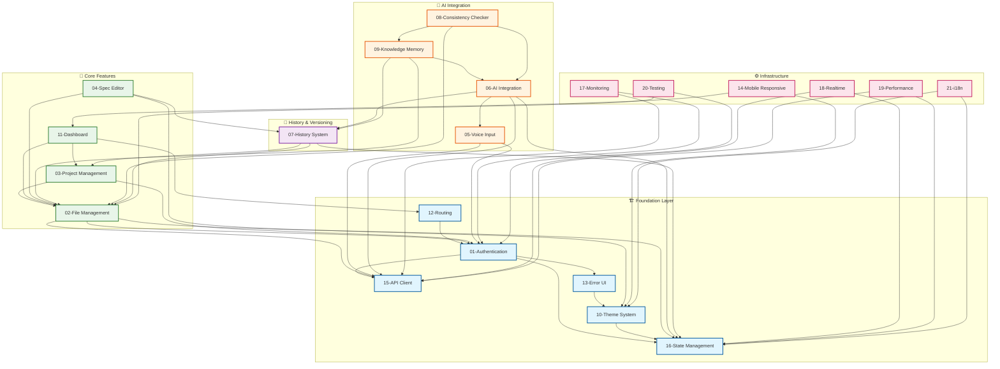
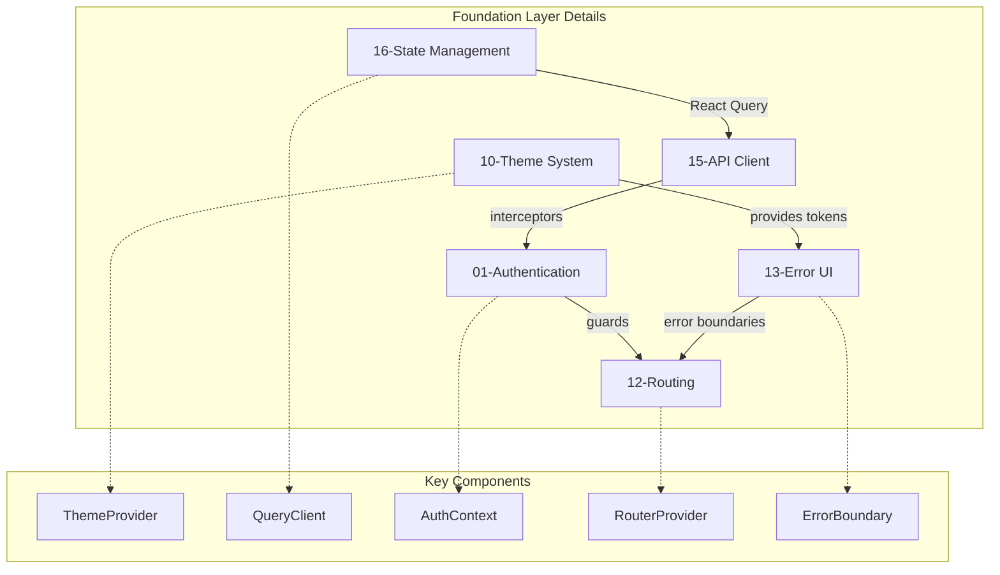
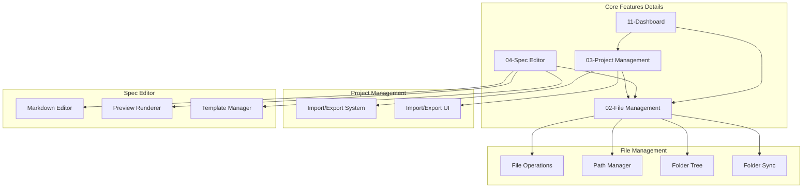
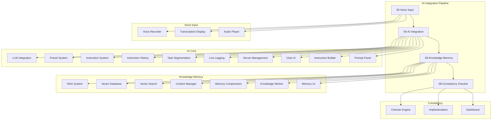
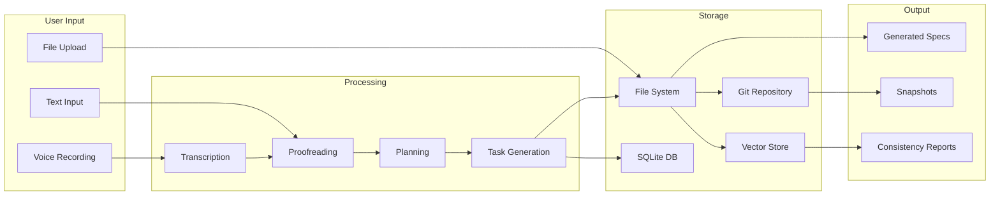
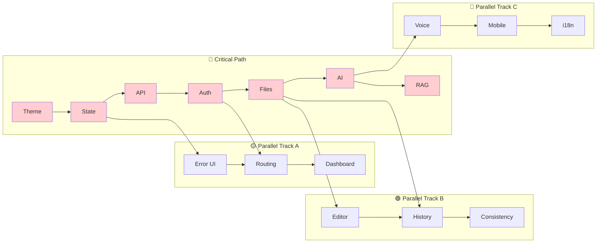

# Feature Dependency Graph

**Version:** 1.0.0  
**Status:** Active  
**Updated:** 2026-01-28  

---

## Overview

This diagram visualizes dependencies between all feature specifications, showing which features must be implemented before others and how they interconnect.

---

## Master Dependency Graph

---

## Implementation Order (Topological Sort)

```mermaid
graph LR
    subgraph Phase1["Phase 1: Foundation"]
        P1A[Theme System]
        P1B[State Management]
        P1C[API Client]
        P1D[Error UI]
    end

    subgraph Phase2["Phase 2: Auth & Routing"]
        P2A[Authentication]
        P2B[Routing]
    end

    subgraph Phase3["Phase 3: Core Management"]
        P3A[File Management]
        P3B[Project Management]
        P3C[Dashboard]
        P3D[Spec Editor]
    end

    subgraph Phase4["Phase 4: History"]
        P4A[History System]
    end

    subgraph Phase5["Phase 5: AI Pipeline"]
        P5A[Voice Input]
        P5B[AI Integration]
        P5C[Knowledge Memory]
        P5D[Consistency Checker]
    end

    subgraph Phase6["Phase 6: Infrastructure"]
        P6A[Mobile Responsive]
        P6B[Monitoring]
        P6C[Realtime]
        P6D[Performance]
        P6E[Testing]
        P6F[i18n]
    end

    Phase1 --> Phase2 --> Phase3 --> Phase4 --> Phase5 --> Phase6

    style Phase1 fill:#e3f2fd
    style Phase2 fill:#e8f5e9
    style Phase3 fill:#fff8e1
    style Phase4 fill:#f3e5f5
    style Phase5 fill:#fff3e0
    style Phase6 fill:#fce4ec
```

---

## Detailed Feature Dependencies

### Foundation Layer

### Core Features

### AI Integration Pipeline

---

## Cross-Feature Data Flows

---

## Feature Coupling Matrix

| Feature | High Coupling | Medium Coupling | Low Coupling |
|---------|---------------|-----------------|--------------|
| **01-Authentication** | API Client, State | Routing, Error UI | All features |
| **02-File Management** | Project Mgmt, Editor | History, RAG | Dashboard |
| **03-Project Management** | File Mgmt | Dashboard, Import/Export | History |
| **04-Spec Editor** | File Mgmt, Theme | History, Preview | Templates |
| **05-Voice Input** | AI Integration | Transcription | Audio Player |
| **06-AI Integration** | Voice, RAG, History | Presets, Tasks | UI components |
| **07-History System** | File Mgmt, Project | Git, Snapshots | Diff viewer |
| **08-Consistency Checker** | RAG, AI, Files | Dashboard | Reports |
| **09-Knowledge Memory** | AI, Files, Vector DB | Context Mgmt | Memory UI |
| **10-Theme System** | State Mgmt | All UI components | i18n |
| **11-Dashboard** | Project, Files, Route | Quick actions | Stats |
| **12-Routing** | Auth, Dashboard | Protected routes | Navigation |
| **13-Error UI** | Theme, API | Error boundaries | Toast |
| **14-Mobile Responsive** | Theme, Dashboard | Layouts | Breakpoints |
| **15-API Client** | Auth, State | Interceptors | React Query |
| **16-State Management** | Theme, Auth, API | Context, Query | Stores |
| **17-Monitoring** | API, Auth | Metrics, Logging | Alerts |
| **18-Realtime** | API, State | WebSocket, SSE | Events |
| **19-Performance** | State, API | Caching, Lazy load | Optimization |
| **20-Testing** | Auth, Files | Unit, E2E | Coverage |
| **21-i18n** | Theme, State | Translations | Locale |

---

## Critical Path Analysis

---

## Legend

| Symbol | Meaning |
|--------|---------|
| 🏗️ | Foundation infrastructure |
| 📁 | Core file/project features |
| 🤖 | AI-powered features |
| 📜 | History and versioning |
| ⚙️ | Infrastructure and tooling |
| → | Direct dependency |
| ⟶ | Data flow |
| -.-> | Component relationship |

---

## Related Documents

- [System Architecture](./00-system-architecture-overview.md)
- [Implementation Order Guide](../08-roadmap-overview/02a-implementation-order-guide.md)
- [Master Index](../00-master-index.md)
