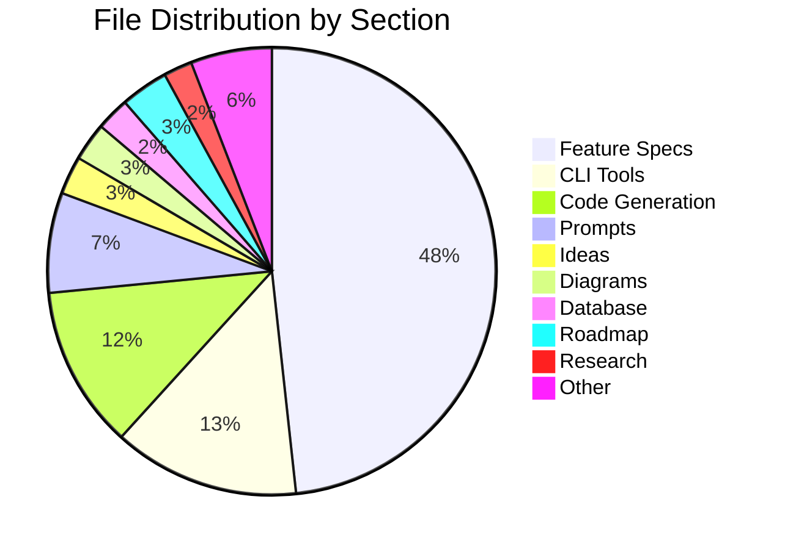
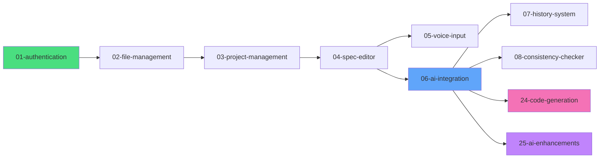

# Spec Folder Structure Diagram

**Version:** 1.0.0  
**Updated:** 2026-01-29

---

## Visual Overview

```mermaid
graph TD
    ROOT[spec-management-software/]
    
    subgraph "Core Documentation"
        I00[00-overview.md]
        I01[00-master-index.md]
    end
    
    subgraph "01-ideas"
        ID[01-ideas/]
        ID1[01-initial-concept.md]
        ID2[02-voice-input.md]
        ID3[03-ai-integration.md]
        ID4[04-history-system.md]
        ID5[05-consistency-checker.md]
        ID6[06-golang-search-cli.md]
        ID7[07-theme-system.md]
        ID8[08-mobile-responsive.md]
    end
    
    subgraph "02-04 Foundation"
        INST[02-instructions/]
        PROJ[03-project-overview/]
        CODE[04-coding-guidelines/]
    end
    
    subgraph "05-features (140+ files)"
        F05[05-features/]
        F01[01-authentication/]
        F02[02-file-management/]
        F03[03-project-management/]
        F04[04-spec-editor/]
        F05V[05-voice-input/]
        F06[06-ai-integration/]
        F07[07-history-system/]
        F08[08-consistency-checker/]
        F22[22-golang-search-cli/]
        F24[24-code-generation-system/]
        F25[25-ai-enhancements/]
        FMORE[...12 more feature folders]
    end
    
    subgraph "06-08 Technical"
        ERR[06-error-management/]
        DB[07-database-design/]
        ROAD[08-roadmap-overview/]
    end
    
    subgraph "09-12 Reference"
        DIAG[09-diagrams/]
        RES[10-research/]
        SKIP[11-skipped-features/]
        PROMPT[12-prompts/]
    end
    
    subgraph "API & Reports"
        API[api/]
        REP[99-consistency-report.md]
    end
    
    ROOT --> I00
    ROOT --> I01
    ROOT --> ID
    ROOT --> INST
    ROOT --> PROJ
    ROOT --> CODE
    ROOT --> F05
    ROOT --> ERR
    ROOT --> DB
    ROOT --> ROAD
    ROOT --> DIAG
    ROOT --> RES
    ROOT --> SKIP
    ROOT --> PROMPT
    ROOT --> API
    ROOT --> REP
    
    ID --> ID1
    ID --> ID2
    ID --> ID3
    ID --> ID4
    ID --> ID5
    ID --> ID6
    ID --> ID7
    ID --> ID8
    
    F05 --> F01
    F05 --> F02
    F05 --> F03
    F05 --> F04
    F05 --> F05V
    F05 --> F06
    F05 --> F07
    F05 --> F08
    F05 --> F22
    F05 --> F24
    F05 --> F25
    F05 --> FMORE
```

---

## File Distribution

---

## Feature Dependencies

---

## See Also

- [Master Index](../00-master-index.md)
- [Feature Dependency Graph](./06-feature-dependency-graph.md)
