# Master Architecture Diagram

**Version:** 1.0.0  
**Status:** Active  
**Updated:** 2026-01-30  

---

## Overview

This document provides comprehensive architectural visualizations of the SpecBuilder Pro microservices system, including service topology, communication patterns, database architecture, and data flows.

**Cross-References:**
- [Microservices Overview](../14-microservices/00-overview.md)
- [Database Design](../07-database-design/00-overview.md)
- [System Architecture Overview](./00-system-architecture-overview.md)

---

## 1. System Overview Diagram

High-level view of all system components and their relationships.

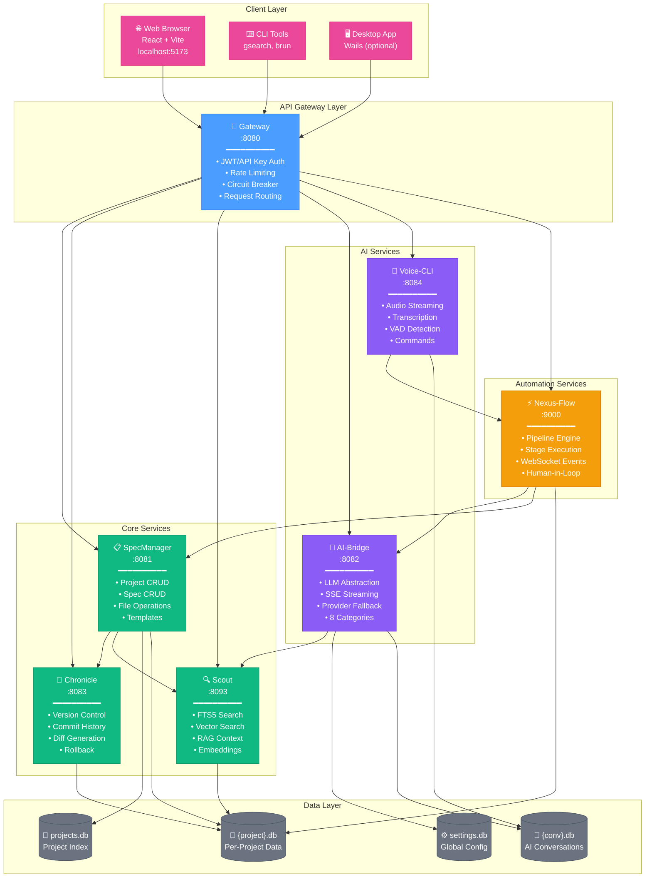

---

## 2. Service Communication Matrix

Detailed view of inter-service communication patterns.

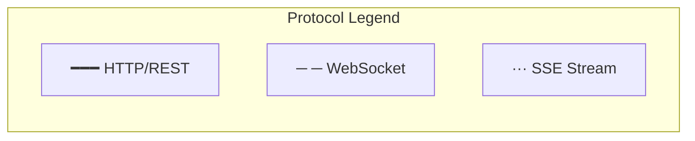

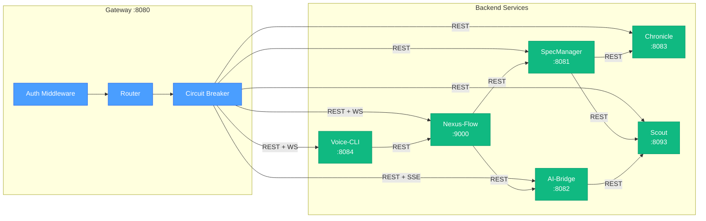

---

## 3. Port & Protocol Reference

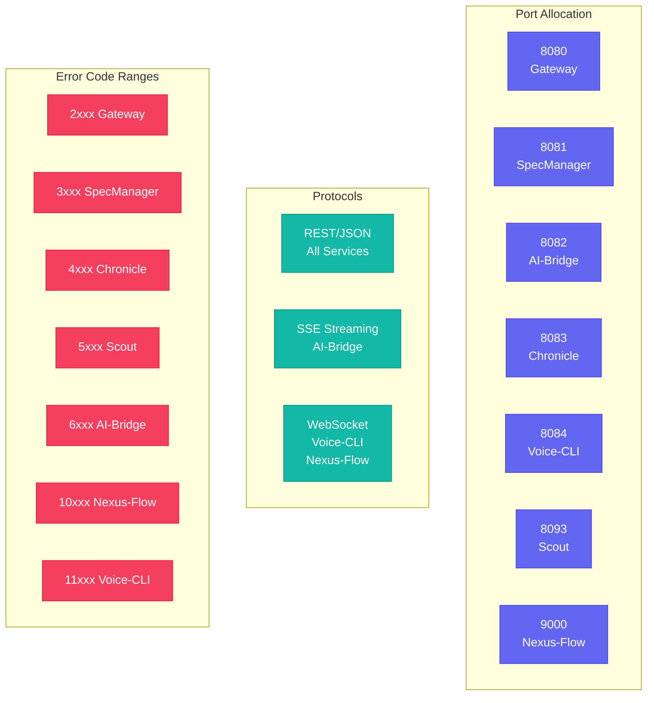

---

## 4. Database Architecture

Four-tier SQLite database architecture.

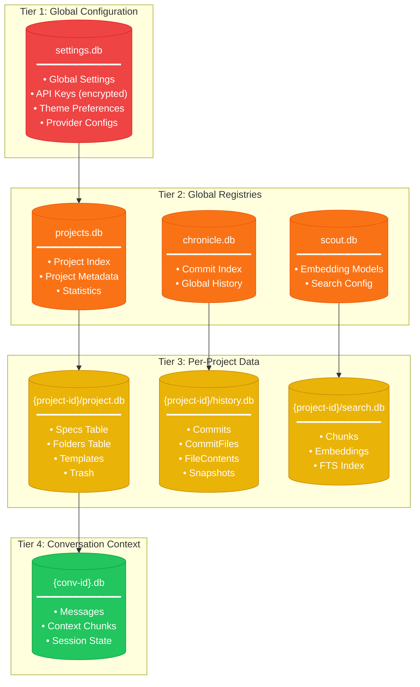

---

## 5. Request Flow Diagrams

### 5.1 Create Spec Flow

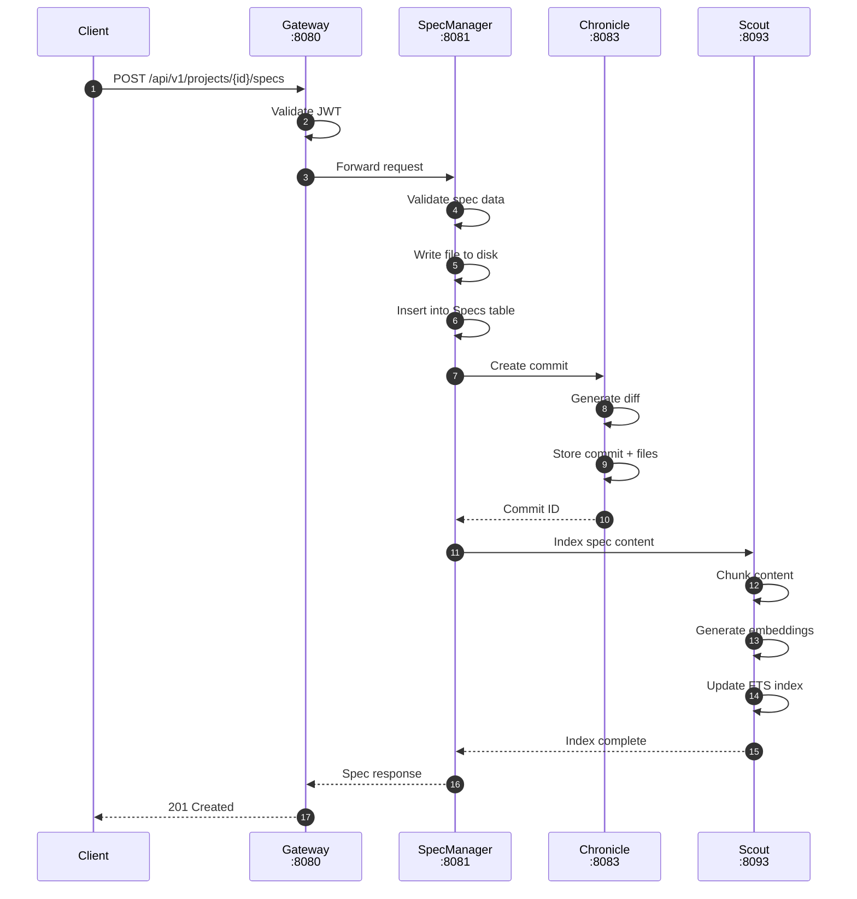

### 5.2 Search with RAG Flow

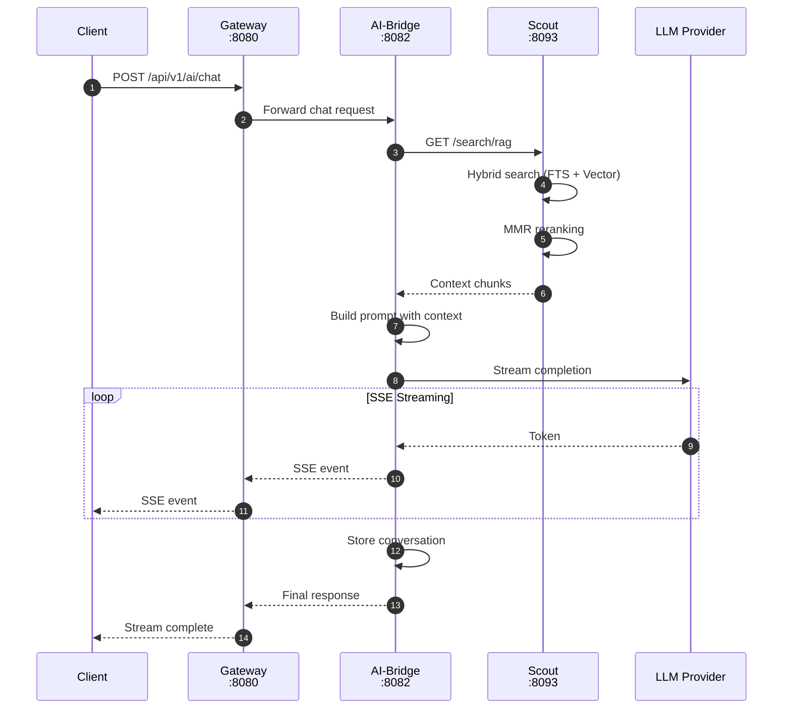

### 5.3 Voice Recording Flow

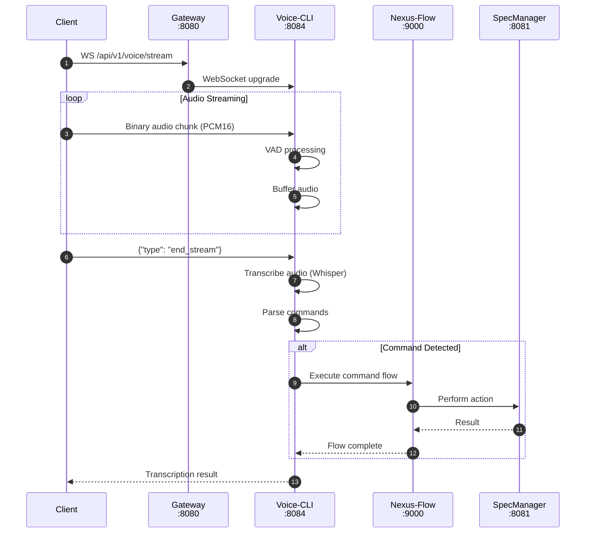

### 5.4 Pipeline Execution Flow

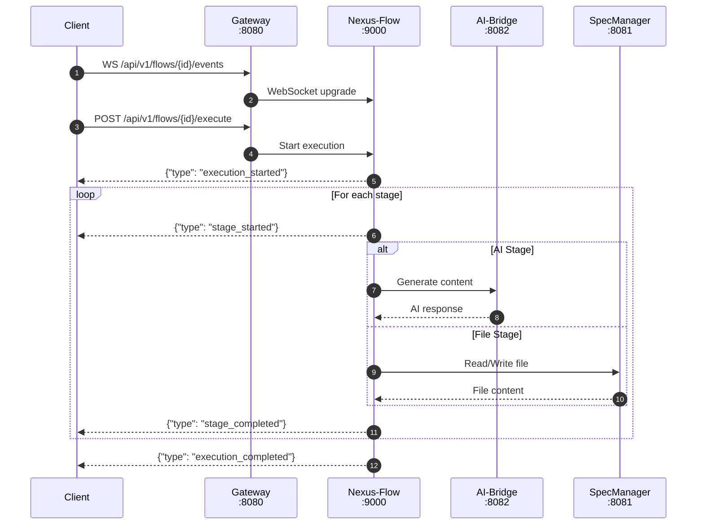

---

## 6. Error Propagation Flow

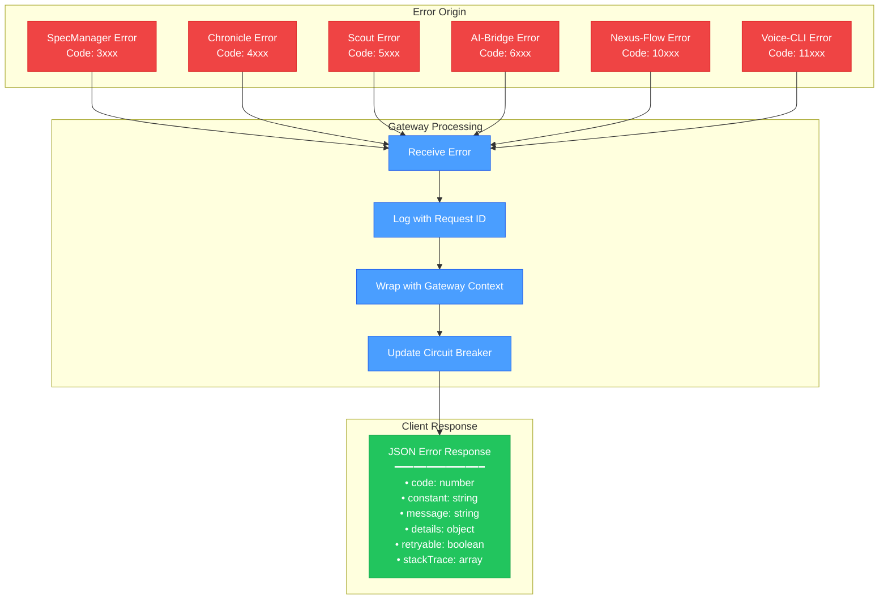

---

## 7. Resilience Patterns

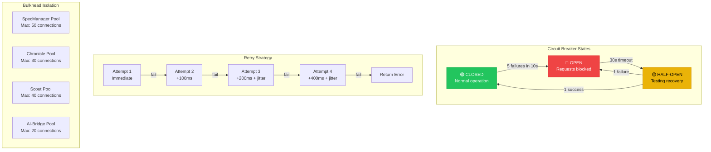

---

## 8. Deployment Architecture

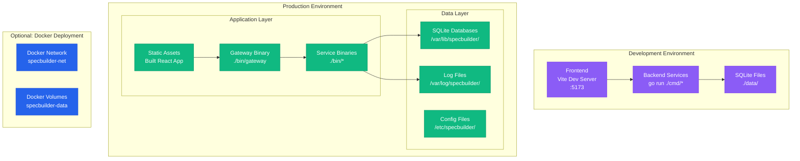

---

## 9. Service Dependency Graph

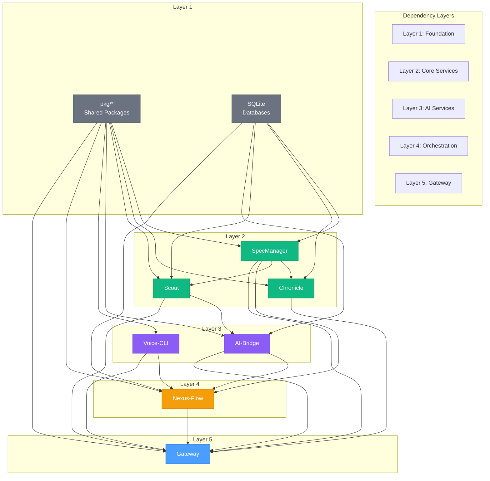

---

## 10. Quick Reference Table

| Service | Port | Protocol | Database Tier | Error Range | Key Dependencies |
|---------|------|----------|---------------|-------------|------------------|
| Gateway | 8080 | REST | - | 2xxx | All services |
| SpecManager | 8081 | REST | T2, T3 | 3xxx | Chronicle, Scout |
| AI-Bridge | 8082 | REST + SSE | T1, T4 | 6xxx | Scout, LLM Providers |
| Chronicle | 8083 | REST | T3 | 4xxx | - |
| Voice-CLI | 8084 | REST + WS | T4 | 11xxx | Nexus-Flow |
| Scout | 8093 | REST | T2, T3 | 5xxx | - |
| Nexus-Flow | 9000 | REST + WS | T3 | 10xxx | AI-Bridge, SpecManager |

---

## See Also

- [Microservices Overview](../14-microservices/00-overview.md)
- [Database Design](../07-database-design/00-overview.md)
- [Error Management](../06-error-management/00-overview.md)
- [Integration Tests](../14-microservices/21-integration-tests.md)
