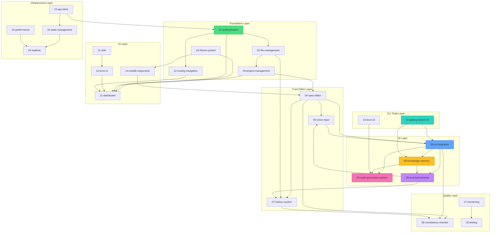
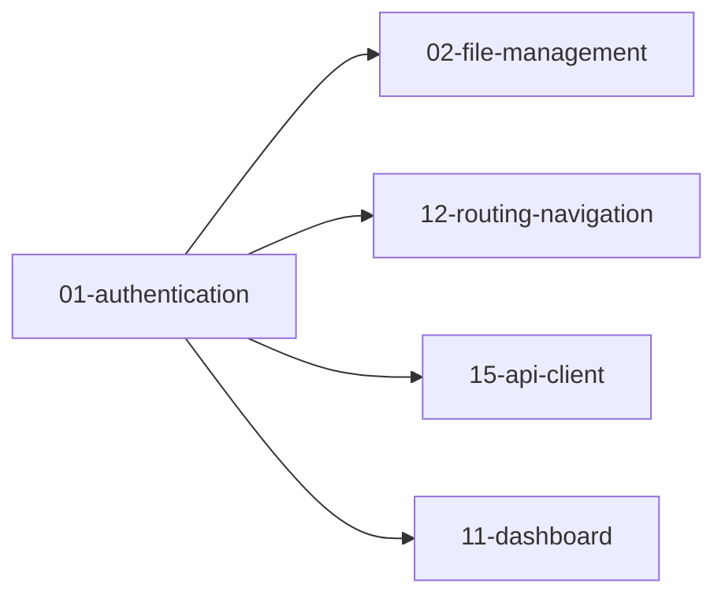
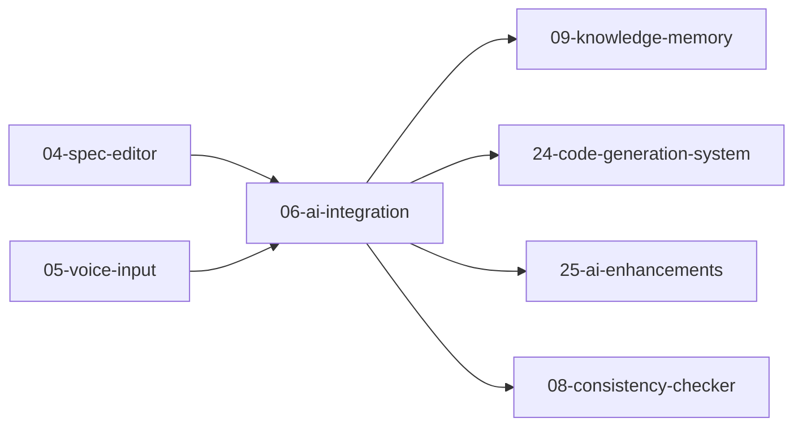
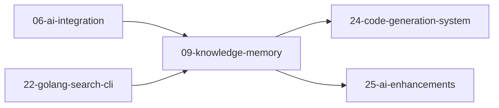
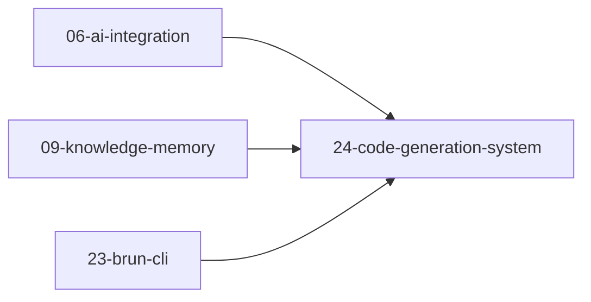
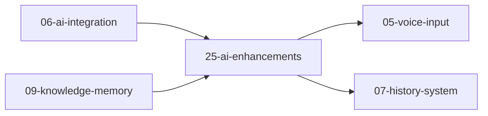

# Feature Dependency Diagram

**Version:** 1.0.0  
**Updated:** 2026-01-29

---

## Complete Feature Dependency Graph

This diagram shows all 25 feature folders and their interdependencies.



---

## Dependency Matrix

### Layer Dependencies

| Layer | Depends On | Depended By |
|-------|------------|-------------|
| **Foundation** | - | All layers |
| **Core Editor** | Foundation | AI, Quality, UI |
| **AI** | Foundation, Core Editor | Quality, CLI Tools |
| **Quality** | Core Editor, AI | UI |
| **UI** | Foundation, Quality | - |
| **Infrastructure** | Foundation | AI, Quality |
| **CLI Tools** | AI | - |

---

## Feature-Level Dependencies

### 01-Authentication


### 06-AI-Integration


### 09-Knowledge-Memory


### 24-Code-Generation-System


### 25-AI-Enhancements


---

## Implementation Order

Based on the dependency graph, the recommended implementation order is:

### Phase 1: Foundation (No Dependencies)
1. `10-theme-system` - No upstream dependencies
2. `12-routing-navigation` - No upstream dependencies
3. `01-authentication` - Core security layer

### Phase 2: Core Infrastructure
4. `15-api-client` - Depends on auth
5. `16-state-management` - Depends on API
6. `02-file-management` - Depends on auth

### Phase 3: Project Core
7. `03-project-management` - Depends on file management
8. `04-spec-editor` - Depends on project
9. `07-history-system` - Depends on editor, files

### Phase 4: AI Foundation
10. `05-voice-input` - Depends on editor
11. `06-ai-integration` - Depends on editor, voice
12. `09-knowledge-memory` - Depends on AI

### Phase 5: Advanced AI
13. `24-code-generation-system` - Depends on AI, knowledge
14. `25-ai-enhancements` - Depends on AI, knowledge
15. `08-consistency-checker` - Depends on AI, history

### Phase 6: UI Polish
16. `11-dashboard` - Depends on auth, project, theme
17. `13-error-ui` - Depends on routing
18. `14-mobile-responsive` - Depends on theme, editor
19. `21-i18n` - Depends on error UI

### Phase 7: Performance & Quality
20. `17-monitoring` - Infrastructure ready
21. `18-realtime` - Depends on state, perf
22. `19-performance` - Optimization layer
23. `20-testing` - Depends on monitoring

### Phase 8: CLI Tools
24. `22-golang-search-cli` - Depends on AI, knowledge
25. `23-brun-cli` - Depends on code generation

---

## Critical Paths

### Shortest Path to MVP
```
auth → file → project → editor → AI
```

### AI Feature Critical Path
```
editor → AI → knowledge → code-generation → enhancements
```

### Full-Stack Critical Path
```
auth → API → state → realtime → dashboard
```

---

## See Also

- [Master Index](../00-master-index.md)
- [Folder Structure Diagram](./07-folder-structure-diagram.md)
- [Roadmap Overview](../08-roadmap-overview/00-overview.md)
