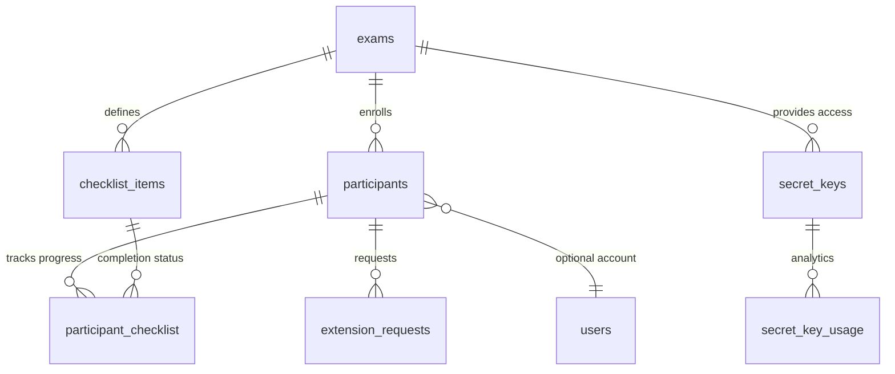

# Database Entity-Relationship Diagram

## Overview
Visual representation of the 27-table database schema for Exam Questions Manager.

---

## Full ER Diagram

```mermaid
erDiagram
    %% ═══════════════════════════════════════════════════════════════
    %% CORE ENTITIES
    %% ═══════════════════════════════════════════════════════════════
    
    exams {
        int id PK
        string title
        string slug UK
        string description
        enum status "DRAFT|PUBLISHED|ARCHIVED"
        int parentId FK "nullable, self-reference"
        bool inheritDeadline
        int softDeadlineDays
        int hardDeadlineDays
        bool usePhaseWeighting
        float prePhaseWeight
        float inExamPhaseWeight
        float postPhaseWeight
        int sectionCount
        json settings
        datetime createdAt
        datetime updatedAt
        datetime deletedAt "nullable"
    }
    
    participants {
        int id PK
        int examId FK
        int userId FK "nullable for anonymous"
        string trackingId "for anonymous"
        string email
        string name
        string linkedinUrl
        enum status "9 states"
        enum accessMethod "SIGNUP|SECRET_KEY|MIGRATED"
        int secretKeyId FK "nullable"
        datetime softDeadlineDate
        datetime hardDeadlineDate
        datetime extensionDeadlineDate "nullable"
        datetime originalSoftDeadline
        datetime originalHardDeadline
        datetime deadlineOverride "nullable"
        string deadlineOverrideReason
        int extensionDays
        datetime migratedAt "nullable"
        string migratedFromTrackingId
        bool emailOptOut
        datetime createdAt
        datetime updatedAt
        datetime deletedAt "nullable"
    }
    
    users {
        int id PK
        string email UK
        string passwordHash
        string name
        datetime lastLoginAt
        datetime createdAt
        datetime updatedAt
    }
    
    user_roles {
        int id PK
        int userId FK
        enum role "ADMIN|EXAM_EDITOR|EXAMINEE"
        datetime createdAt
    }

    %% ═══════════════════════════════════════════════════════════════
    %% CHECKLIST & PROGRESS
    %% ═══════════════════════════════════════════════════════════════
    
    checklist_items {
        int id PK
        int examId FK
        enum phase "PRE|IN_EXAM|POST"
        enum type "VIDEO|LINK|TEXT|SECTION_CHECKPOINT|RUBRIC_ITEM|CUSTOM"
        string title
        string description
        string url "nullable"
        int sortOrder
        bool isRequired
        bool isAutoGenerated
        float weight
        json metadata "sectionNumber, lineNumber, slug"
        datetime createdAt
        datetime updatedAt
    }
    
    participant_checklist {
        int id PK
        int participantId FK
        int checklistItemId FK
        enum status "NOT_STARTED|IN_PROGRESS|PENDING_REVIEW|APPROVED|COMPLETED|SKIPPED"
        datetime startedAt "nullable"
        datetime completedAt "nullable"
        int approvedBy FK "nullable"
        string notes
        datetime createdAt
        datetime updatedAt
    }
    
    prerequisites {
        int id PK
        int examId FK
        enum type "CONTENT|ACCESS_GATE"
        string title
        string description
        string url "nullable"
        bool isRequired
        int sortOrder
        datetime createdAt
    }
    
    participant_prerequisites {
        int id PK
        int participantId FK
        int prerequisiteId FK
        bool isCompleted
        datetime completedAt "nullable"
        datetime createdAt
    }

    %% ═══════════════════════════════════════════════════════════════
    %% EXTENSIONS
    %% ═══════════════════════════════════════════════════════════════
    
    extension_requests {
        int id PK
        int participantId FK
        string reason
        int requestedDays
        int approvedDays "nullable"
        enum status "PENDING|APPROVED|REJECTED|EXPIRED"
        int reviewedBy FK "nullable"
        string reviewerNotes
        datetime reviewedAt "nullable"
        datetime createdAt
    }
    
    extension_files {
        int id PK
        int extensionRequestId FK
        string filename
        string storagePath
        string mimeType
        int fileSize
        datetime createdAt
    }

    %% ═══════════════════════════════════════════════════════════════
    %% SECRET KEYS
    %% ═══════════════════════════════════════════════════════════════
    
    secret_keys {
        int id PK
        int examId FK
        string keyHash UK
        string label
        int usageCount
        int maxUses "nullable"
        datetime expiresAt "nullable"
        bool isActive
        int createdBy FK
        datetime createdAt
    }
    
    secret_key_usage {
        int id PK
        int secretKeyId FK
        int participantId FK "nullable"
        string ipHash
        string userAgent
        string referrer
        datetime accessedAt
    }

    %% ═══════════════════════════════════════════════════════════════
    %% WIKI SYSTEM
    %% ═══════════════════════════════════════════════════════════════
    
    wiki_categories {
        int id PK
        int parentId FK "nullable, self-reference"
        string name
        string slug UK
        int sortOrder
        datetime createdAt
    }
    
    wiki_pages {
        int id PK
        int categoryId FK
        string title
        string slug UK
        string content
        enum visibility "PUBLIC|AUTHENTICATED|ROLE|PRIVATE"
        json allowedRoles "nullable"
        int createdBy FK
        int updatedBy FK
        datetime createdAt
        datetime updatedAt
        datetime deletedAt "nullable"
    }
    
    wiki_revisions {
        int id PK
        int pageId FK
        string content
        string changeSummary
        int createdBy FK
        datetime createdAt
    }

    %% ═══════════════════════════════════════════════════════════════
    %% NOTIFICATIONS & EMAIL
    %% ═══════════════════════════════════════════════════════════════
    
    notifications {
        int id PK
        int userId FK
        enum type "INFO|WARNING|SUCCESS|ERROR"
        string title
        string message
        string actionUrl "nullable"
        bool isRead
        datetime readAt "nullable"
        datetime createdAt
    }
    
    email_queue {
        int id PK
        int participantId FK "nullable"
        string toEmail
        string toName
        enum templateKey "11 templates"
        json templateData
        enum status "PENDING|SENT|FAILED|BOUNCED"
        enum priority "LOW|NORMAL|HIGH|URGENT"
        int attempts
        string lastError "nullable"
        datetime scheduledFor
        datetime sentAt "nullable"
        datetime createdAt
    }

    %% ═══════════════════════════════════════════════════════════════
    %% SYSTEM TABLES
    %% ═══════════════════════════════════════════════════════════════
    
    audit_log {
        int id PK
        enum action "28 action types"
        int userId FK "nullable"
        int participantId FK "nullable"
        string ipHash
        json data
        datetime createdAt
    }
    
    settings {
        int id PK
        string key UK
        string value
        string valueType
        string source
        datetime createdAt
        datetime updatedAt
    }
    
    rate_limits {
        int id PK
        string ipHash
        string endpointCategory
        string examSlug "nullable"
        datetime requestTimestamp
    }
    
    rate_lockouts {
        int id PK
        string ipHash
        string endpointCategory
        datetime lockedUntil
        string reason
        datetime createdAt
    }
    
    participant_milestones {
        int id PK
        int participantId FK
        string milestoneType
        json milestoneData
        datetime reachedAt
        datetime notifiedAt "nullable"
    }

    %% ═══════════════════════════════════════════════════════════════
    %% RELATIONSHIPS
    %% ═══════════════════════════════════════════════════════════════
    
    %% Exam relationships
    exams ||--o{ participants : "has many"
    exams ||--o{ checklist_items : "has many"
    exams ||--o{ prerequisites : "has many"
    exams ||--o{ secret_keys : "has many"
    exams ||--o| exams : "parent-child"
    
    %% Participant relationships
    participants ||--o{ participant_checklist : "has many"
    participants ||--o{ participant_prerequisites : "has many"
    participants ||--o{ extension_requests : "has many"
    participants ||--o{ participant_milestones : "has many"
    participants }o--|| users : "optional user"
    participants }o--|| secret_keys : "optional secret key"
    
    %% Checklist relationships
    checklist_items ||--o{ participant_checklist : "has many"
    prerequisites ||--o{ participant_prerequisites : "has many"
    
    %% Extension relationships
    extension_requests ||--o{ extension_files : "has many"
    extension_requests }o--|| users : "reviewed by"
    
    %% Secret key relationships
    secret_keys ||--o{ secret_key_usage : "has many"
    secret_keys }o--|| users : "created by"
    
    %% User relationships
    users ||--o{ user_roles : "has many"
    users ||--o{ participants : "optional"
    users ||--o{ notifications : "has many"
    users ||--o{ wiki_pages : "created"
    users ||--o{ wiki_revisions : "created"
    users ||--o{ audit_log : "actor"
    
    %% Wiki relationships
    wiki_categories ||--o{ wiki_pages : "contains"
    wiki_categories ||--o| wiki_categories : "parent-child"
    wiki_pages ||--o{ wiki_revisions : "has many"
```

---

## Simplified Core Diagram

For quick reference, here's the core exam-participant relationship:

---

## Table Counts by Category

| Category | Tables | Description |
|----------|--------|-------------|
| **Core** | 4 | exams, participants, users, user_roles |
| **Progress** | 4 | checklist_items, participant_checklist, prerequisites, participant_prerequisites |
| **Extensions** | 2 | extension_requests, extension_files |
| **Access** | 2 | secret_keys, secret_key_usage |
| **Wiki** | 3 | wiki_categories, wiki_pages, wiki_revisions |
| **Communication** | 2 | notifications, email_queue |
| **System** | 7 | audit_log, settings, rate_limits, rate_lockouts, participant_milestones, feature_flag, feature_flag_override |
| **UI/Config** | 3 | theme, theme_override, cache_meta |
| **Total** | **27** | |

---

## Key Relationships Summary

1. **Exam → Participant**: One exam has many participants
2. **Participant → User**: Optional (anonymous participants have no user)
3. **Participant → Secret Key**: Optional (tracks which key was used)
4. **Exam → Exam**: Self-referential for parent-child hierarchy
5. **Checklist Item → Participant Checklist**: Many-to-many through junction table
6. **Wiki Category → Wiki Category**: Self-referential for nested categories
7. **Theme → Theme Override**: One theme can have many exam-specific overrides
8. **Theme Override → Exam**: Optional link for exam-specific theming
9. **Feature Flag → Feature Flag Override**: One flag can have many user/exam/role overrides
