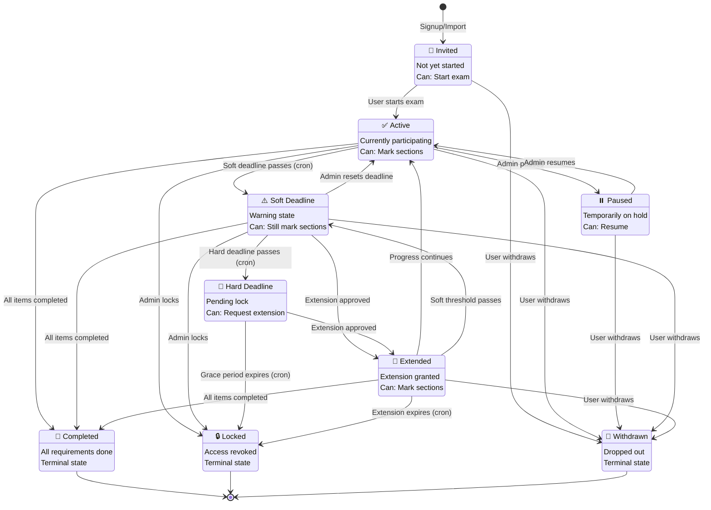
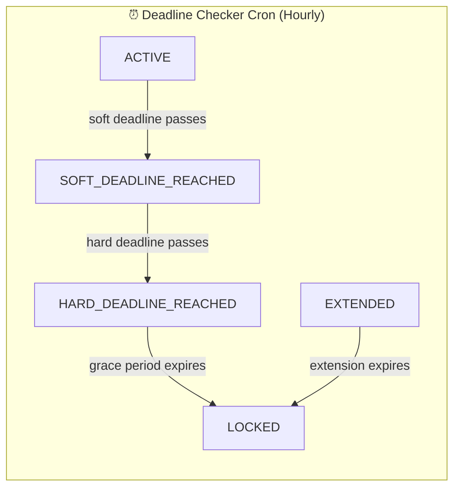
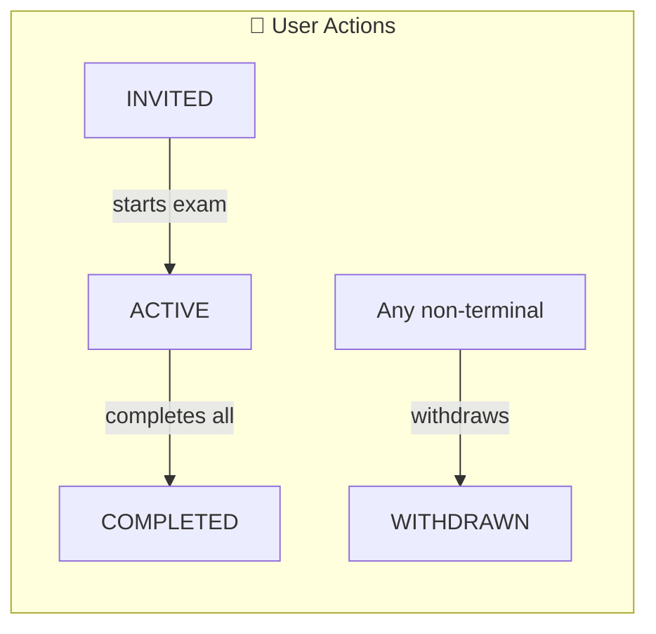
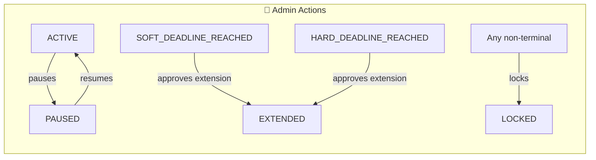
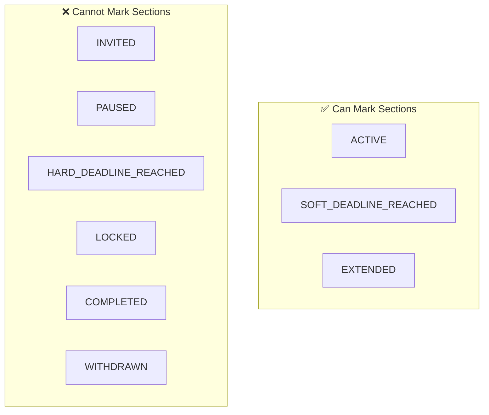
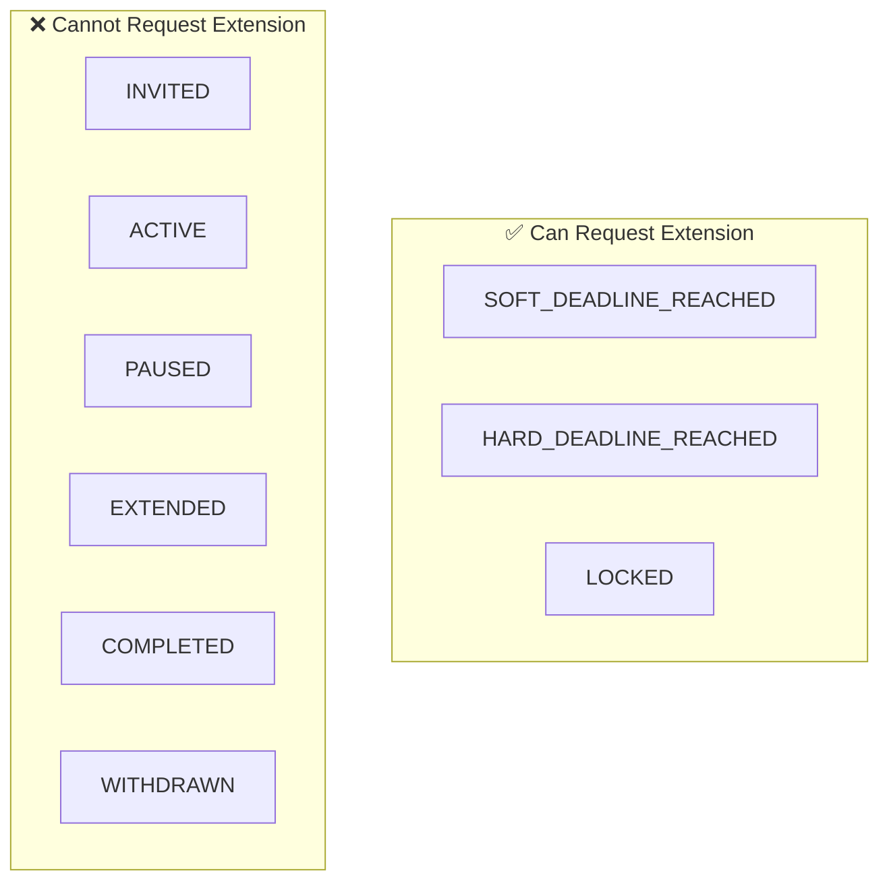
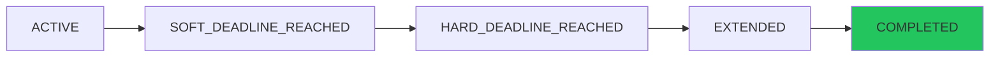
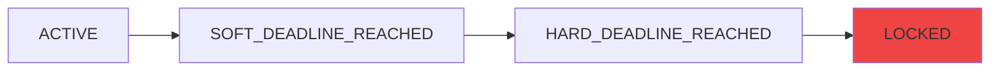
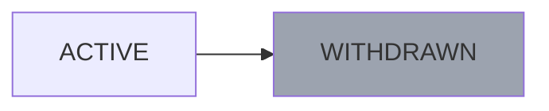

# Participant Status State Machine

## Overview
Visual representation of the 9 participant statuses and their allowed transitions.

---

## Complete State Diagram

---

## Transition Matrix

| From → To | INVITED | ACTIVE | PAUSED | SOFT_DL | HARD_DL | EXTENDED | COMPLETED | LOCKED | WITHDRAWN |
|-----------|---------|--------|--------|---------|---------|----------|-----------|--------|-----------|
| **INVITED** | - | ✅ | ❌ | ❌ | ❌ | ❌ | ❌ | ❌ | ✅ |
| **ACTIVE** | ❌ | - | ✅ | ✅ | ❌ | ❌ | ✅ | ✅ | ✅ |
| **PAUSED** | ❌ | ✅ | - | ❌ | ❌ | ❌ | ❌ | ❌ | ✅ |
| **SOFT_DL** | ❌ | ✅ | ❌ | - | ✅ | ✅ | ✅ | ✅ | ✅ |
| **HARD_DL** | ❌ | ❌ | ❌ | ❌ | - | ✅ | ❌ | ✅ | ❌ |
| **EXTENDED** | ❌ | ✅ | ❌ | ✅ | ❌ | - | ✅ | ✅ | ✅ |
| **COMPLETED** | ❌ | ❌ | ❌ | ❌ | ❌ | ❌ | - | ❌ | ❌ |
| **LOCKED** | ❌ | ❌ | ❌ | ❌ | ❌ | ❌ | ❌ | - | ❌ |
| **WITHDRAWN** | ❌ | ❌ | ❌ | ❌ | ❌ | ❌ | ❌ | ❌ | - |

---

## Transition Triggers

### Automatic (Cron Job)

### Manual (User Action)

### Manual (Admin Action)

---

## Can Mark Sections?

---

## Can Request Extension?

---

## Status Badge Colors

| Status | Color | CSS Class | Hex |
|--------|-------|-----------|-----|
| INVITED | Gray | `badge-secondary` | `#6b7280` |
| ACTIVE | Green | `badge-success` | `#22c55e` |
| PAUSED | Gray | `badge-secondary` | `#6b7280` |
| SOFT_DEADLINE_REACHED | Yellow | `badge-warning` | `#eab308` |
| HARD_DEADLINE_REACHED | Orange | `badge-danger` | `#f97316` |
| EXTENDED | Blue | `badge-info` | `#3b82f6` |
| COMPLETED | Purple | `badge-primary` | `#8b5cf6` |
| LOCKED | Red | `badge-danger` | `#ef4444` |
| WITHDRAWN | Gray | `badge-muted` | `#9ca3af` |

---

## Typical Lifecycle Flows

### Happy Path (Completes on Time)

### Extension Path

### Locked Path

### Withdrawal Path

