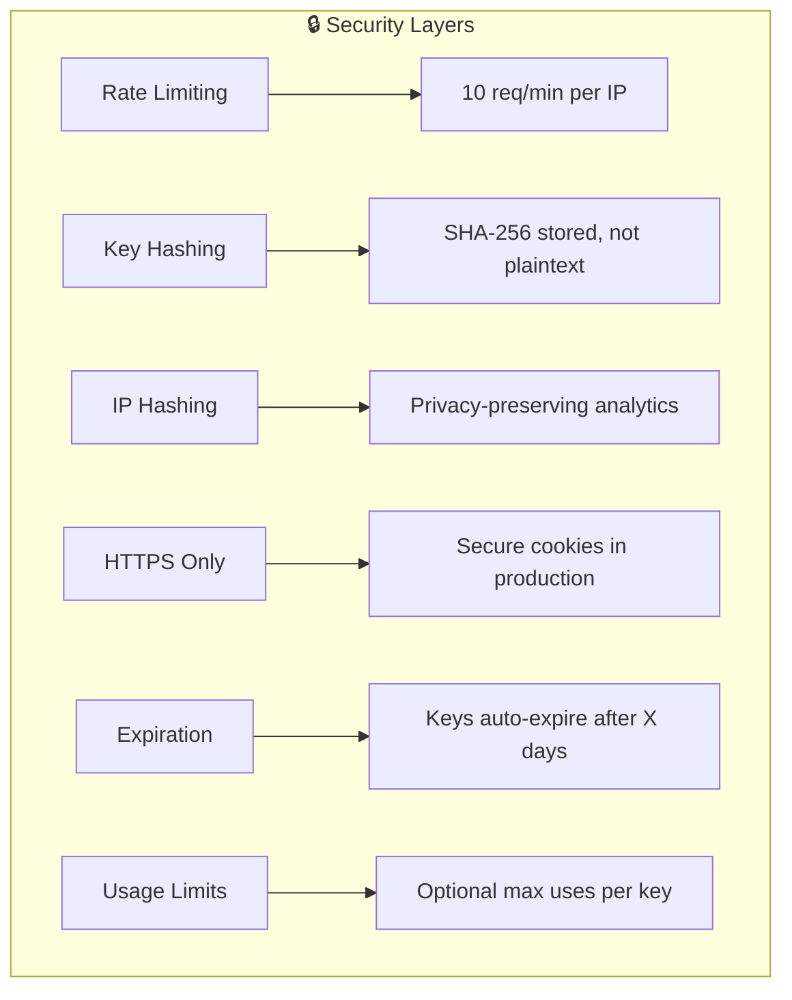

# Secret Key Authentication Flow

## Overview
Sequence diagram showing the complete flow when a user accesses an exam via a secret key URL.

---

## Complete Flow Diagram

```mermaid
sequenceDiagram
    autonumber
    
    actor User
    participant Browser
    participant Frontend
    participant API as REST API
    participant SecretKey as SecretKeyService
    participant Participant as ParticipantService
    participant RateLimit as RateLimitService
    participant DB as Database
    participant Cookie as Cookie Store
    
    %% ═══════════════════════════════════════════════════════════════
    %% PHASE 1: URL ACCESS
    %% ═══════════════════════════════════════════════════════════════
    
    User->>Browser: Clicks secret key URL<br/>/{examSlug}/{secretKey}
    Browser->>Frontend: Load exam page
    Frontend->>Frontend: Parse URL parameters
    
    %% ═══════════════════════════════════════════════════════════════
    %% PHASE 2: SECRET KEY VALIDATION
    %% ═══════════════════════════════════════════════════════════════
    
    Frontend->>API: POST /validate-secret-key<br/>{examSlug, secretKey}
    
    API->>RateLimit: Check rate limit (secret_key_validate)
    
    alt Rate Limited
        RateLimit-->>API: BLOCKED (429)
        API-->>Frontend: Error: Too many attempts
        Frontend-->>User: Show rate limit message
    end
    
    RateLimit-->>API: ALLOWED
    
    API->>SecretKey: validateKey(examSlug, secretKey)
    SecretKey->>DB: Find key by hash
    
    alt Key Not Found
        DB-->>SecretKey: null
        SecretKey-->>API: INVALID_KEY
        API-->>Frontend: Error: Invalid key
        Frontend-->>User: Show invalid key message
    end
    
    DB-->>SecretKey: SecretKey record
    
    SecretKey->>SecretKey: Check expiration
    
    alt Key Expired
        SecretKey-->>API: KEY_EXPIRED
        API-->>Frontend: Error: Key expired
        Frontend-->>User: Show expired message
    end
    
    SecretKey->>SecretKey: Check max uses
    
    alt Max Uses Reached
        SecretKey-->>API: MAX_USES_REACHED
        API-->>Frontend: Error: Key limit reached
        Frontend-->>User: Show limit message
    end
    
    SecretKey-->>API: KEY_VALID + exam data
    
    %% ═══════════════════════════════════════════════════════════════
    %% PHASE 3: CHECK EXISTING SESSION
    %% ═══════════════════════════════════════════════════════════════
    
    API->>Cookie: Check eqm_anon_{examSlug}
    
    alt Has Existing Anonymous Session
        Cookie-->>API: trackingId
        API->>Participant: findByTrackingId(trackingId, examSlug)
        DB-->>Participant: Existing participant
        Participant-->>API: Existing participant with progress
        API-->>Frontend: {participant, exam, isReturning: true}
        Frontend-->>User: "Welcome back!" + show progress
    end
    
    alt Has Authenticated Session
        Cookie-->>API: eqm_session_{examSlug}
        API->>Participant: findByUserId(userId, examSlug)
        
        alt Already Participating
            DB-->>Participant: Existing participant
            Participant-->>API: Existing participant
            API-->>Frontend: {participant, exam, isAuthenticated: true}
            Frontend-->>User: Show exam with progress
        else New Exam for User
            API-->>Frontend: {exam, needsParticipation: true}
            Frontend-->>User: Show "Participate" confirmation
        end
    end
    
    %% ═══════════════════════════════════════════════════════════════
    %% PHASE 4: CREATE ANONYMOUS PARTICIPANT
    %% ═══════════════════════════════════════════════════════════════
    
    Note over API,DB: No existing session - create anonymous participant
    
    API->>Participant: createAnonymous(exam, secretKeyId, ipHash)
    
    Participant->>Participant: Generate trackingId (UUID)
    Participant->>Participant: Calculate deadlines
    
    Participant->>DB: INSERT participant record
    Note right of DB: userId = NULL<br/>trackingId = 'anon_xxx'<br/>accessMethod = 'SECRET_KEY'<br/>secretKeyId = {id}
    
    DB-->>Participant: New participant
    
    %% ═══════════════════════════════════════════════════════════════
    %% PHASE 5: LOG USAGE & SET COOKIES
    %% ═══════════════════════════════════════════════════════════════
    
    API->>SecretKey: logUsage(keyId, participantId, ipHash, userAgent)
    SecretKey->>DB: INSERT secret_key_usage
    SecretKey->>DB: UPDATE secret_keys SET usageCount = usageCount + 1
    
    API->>Cookie: Set eqm_anon_{examSlug} = {trackingId}_{timestamp}
    Note right of Cookie: HttpOnly: true<br/>Secure: true<br/>SameSite: Lax<br/>Expires: 30 days
    
    API->>Cookie: Set eqm_track_{examSlug} = {hashedParticipantId}
    
    %% ═══════════════════════════════════════════════════════════════
    %% PHASE 6: RETURN TO FRONTEND
    %% ═══════════════════════════════════════════════════════════════
    
    API-->>Frontend: {<br/>  success: true,<br/>  participant: {...},<br/>  exam: {...},<br/>  deadlines: {...},<br/>  isAnonymous: true,<br/>  canRegister: true<br/>}
    
    Frontend->>Frontend: Store exam data in state
    Frontend->>Frontend: Initialize progress tracking
    Frontend-->>User: Show exam content<br/>with deadline countdown
    
    %% ═══════════════════════════════════════════════════════════════
    %% PHASE 7: OPTIONAL REGISTRATION
    %% ═══════════════════════════════════════════════════════════════
    
    Note over User,DB: User decides to register (optional)
    
    User->>Frontend: Clicks "Create Account"
    Frontend->>API: POST /auth/register<br/>{email, password}
    API->>DB: CREATE user
    
    API->>Participant: migrateAnonymous(userId, examSlug)
    Note right of Participant: See Migration Algorithm<br/>in 27-participant-service.md
    
    Participant->>DB: UPDATE participant SET userId = {userId}
    
    API->>Cookie: Delete eqm_anon_{examSlug}
    API->>Cookie: Set eqm_session_{examSlug}
    
    API-->>Frontend: {success: true, migrated: true}
    Frontend-->>User: "Account created! Progress saved."
```

---

## Simplified Flow

```mermaid
flowchart TB
    subgraph Access["1️⃣ URL Access"]
        A[User clicks<br/>/{exam}/{key}] --> B{Valid key?}
    end
    
    subgraph Validate["2️⃣ Validation"]
        B -->|No| C[Show error]
        B -->|Yes| D{Existing<br/>session?}
    end
    
    subgraph Session["3️⃣ Session Check"]
        D -->|Anonymous cookie| E[Load existing<br/>progress]
        D -->|Auth cookie| F[Load user<br/>participant]
        D -->|No cookie| G[Create anonymous<br/>participant]
    end
    
    subgraph Cookies["4️⃣ Set Cookies"]
        G --> H[Set eqm_anon_*<br/>Set eqm_track_*]
    end
    
    subgraph Display["5️⃣ Show Exam"]
        E --> I[Display exam<br/>with progress]
        F --> I
        H --> I
    end
    
    subgraph Register["6️⃣ Optional Register"]
        I --> J{User<br/>registers?}
        J -->|Yes| K[Migrate anonymous<br/>to user account]
        J -->|No| L[Continue as<br/>anonymous]
    end
```

---

## URL Format

```
https://example.com/{examSlug}/{secretKey}

Examples:
- https://example.com/javascript-basics/abc123def456
- https://example.com/react-advanced/xyz789ghi012
```

---

## Cookie Summary

| Cookie | When Set | Purpose | Lifetime |
|--------|----------|---------|----------|
| `eqm_anon_{examSlug}` | New anonymous access | Track anonymous participant | 30 days |
| `eqm_track_{examSlug}` | Any secret key access | Analytics tracking | 30 days |
| `eqm_session_{examSlug}` | After registration | Authenticated session | Session |

---

## Error Responses

| Error Code | HTTP Status | Message | User Action |
|------------|-------------|---------|-------------|
| `ERR_INVALID_KEY` | 404 | Invalid or unknown key | Check URL, contact admin |
| `ERR_KEY_EXPIRED` | 410 | Key has expired | Request new key |
| `ERR_KEY_LIMIT` | 403 | Key usage limit reached | Contact admin |
| `ERR_RATE_LIMITED` | 429 | Too many attempts | Wait and retry |
| `ERR_EXAM_NOT_FOUND` | 404 | Exam not found | Check URL |
| `ERR_EXAM_ARCHIVED` | 410 | Exam no longer available | Contact admin |

---

## Security Measures


