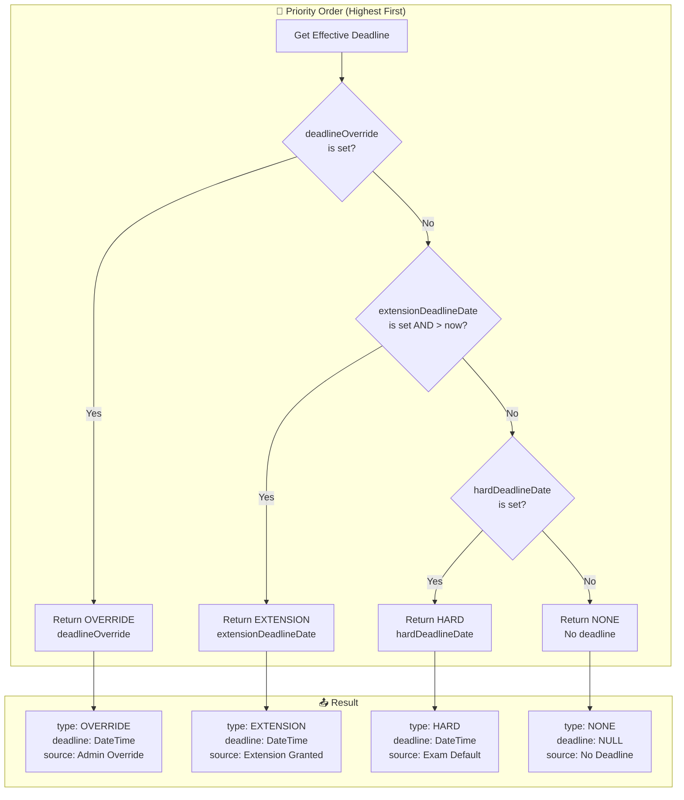
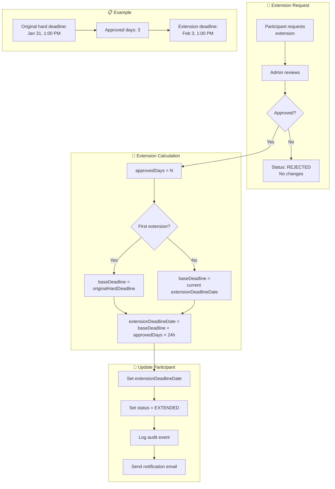
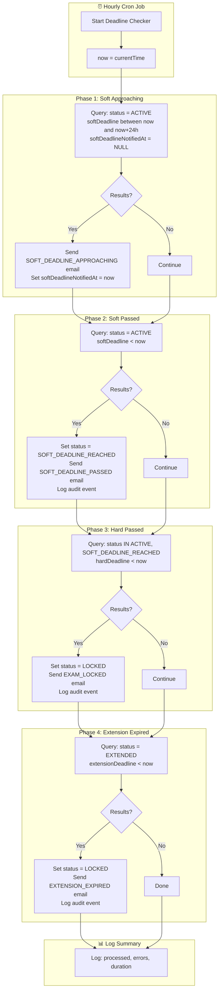
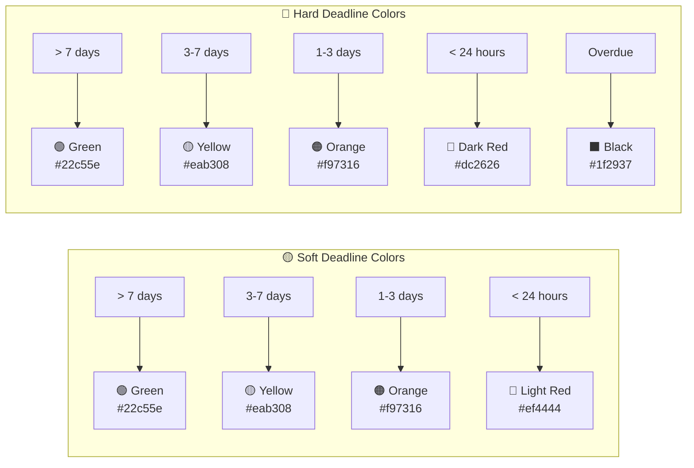
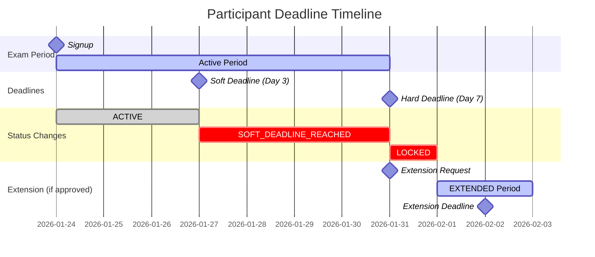
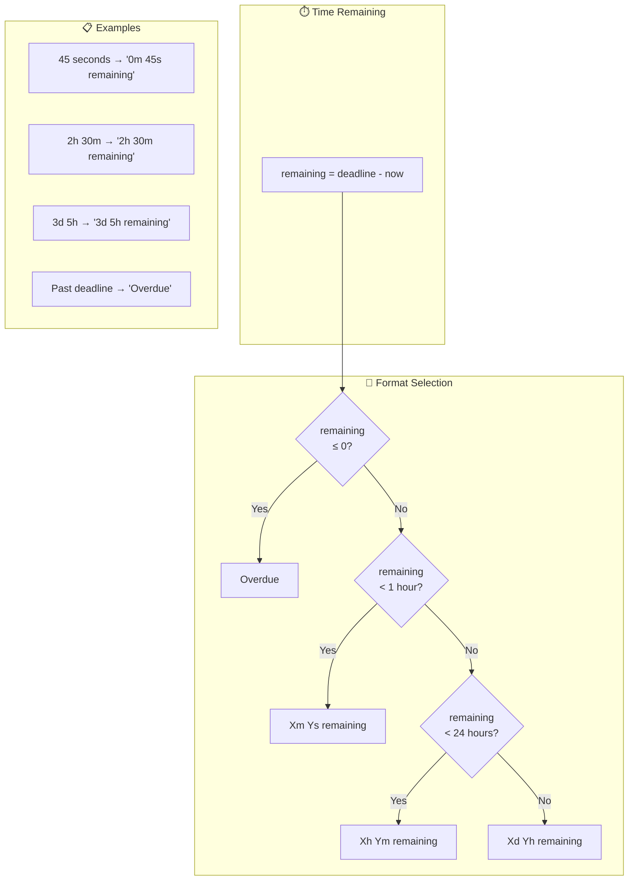
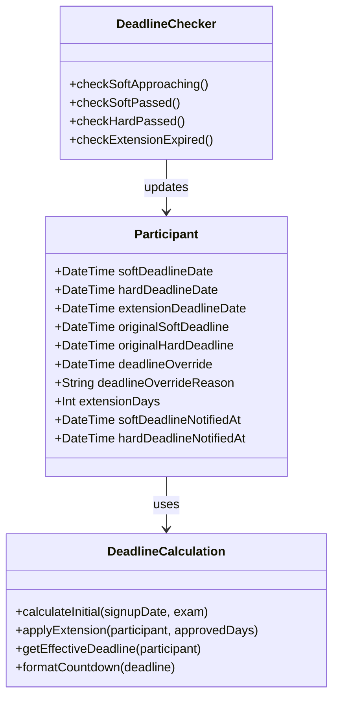

# Deadline Calculation Flow

## Overview
Flowcharts showing how deadlines are calculated, applied, and enforced throughout the participant lifecycle.

---

## Initial Deadline Calculation (at Signup)

```mermaid
flowchart TB
    subgraph Input["📥 Inputs"]
        A[Participant Signup]
        B[signupDate = now()]
        C[exam.softDeadlineDays]
        D[exam.hardDeadlineDays]
        E[exam.inheritDeadline]
        F[exam.parentId]
    end
    
    subgraph SoftCalc["🟡 Soft Deadline Calculation"]
        A --> G{exam.softDeadlineDays<br/>is set?}
        G -->|Yes| H[softDeadline =<br/>signupDate + softDeadlineDays]
        G -->|No| I{inheritDeadline<br/>= true?}
        I -->|Yes| J[Get parent exam]
        J --> K[softDeadline =<br/>signupDate + parent.softDeadlineDays]
        I -->|No| L[softDeadline = NULL]
    end
    
    subgraph HardCalc["🔴 Hard Deadline Calculation"]
        H --> M{exam.hardDeadlineDays<br/>is set?}
        K --> M
        L --> M
        M -->|Yes| N[hardDeadline =<br/>signupDate + hardDeadlineDays]
        M -->|No| O{inheritDeadline<br/>= true?}
        O -->|Yes| P[hardDeadline =<br/>signupDate + parent.hardDeadlineDays]
        O -->|No| Q[hardDeadline = NULL]
    end
    
    subgraph Validate["✅ Validation"]
        N --> R{softDeadline<br/>< hardDeadline?}
        P --> R
        Q --> R
        R -->|Yes| S[Valid ✓]
        R -->|No| T[Error: Invalid<br/>deadline configuration]
        R -->|Both NULL| U[No deadlines<br/>Valid ✓]
    end
    
    subgraph Store["💾 Store"]
        S --> V[Save to participant:<br/>softDeadlineDate<br/>hardDeadlineDate<br/>originalSoftDeadline<br/>originalHardDeadline]
        U --> W[Save to participant:<br/>all deadlines = NULL]
    end
```

---

## Effective Deadline Determination (Priority Order)



---

## Extension Calculation Flow



---

## Deadline Enforcement (Cron Job)



---

## Deadline Color Scheme



---

## Complete Timeline Example



---

## Countdown Display Format



---

## Database Fields Summary


