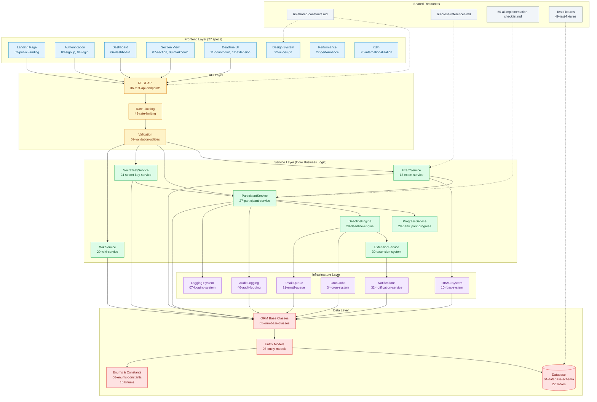
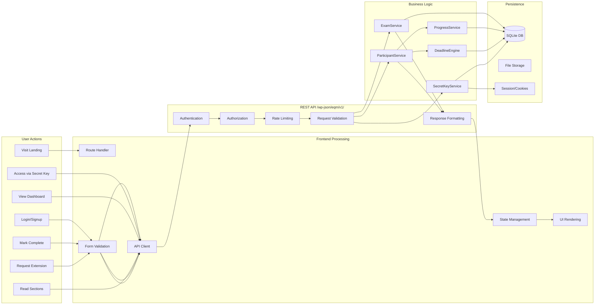
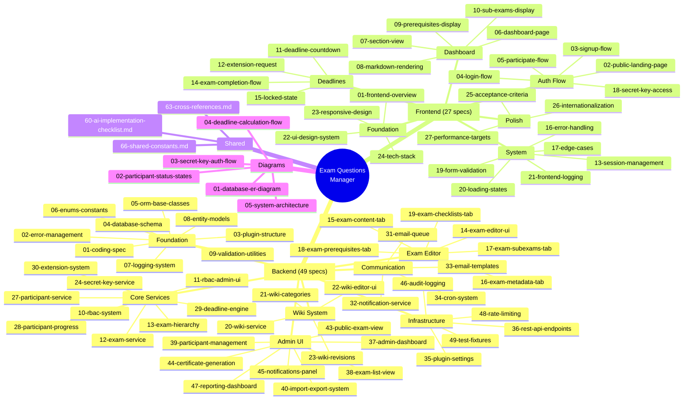
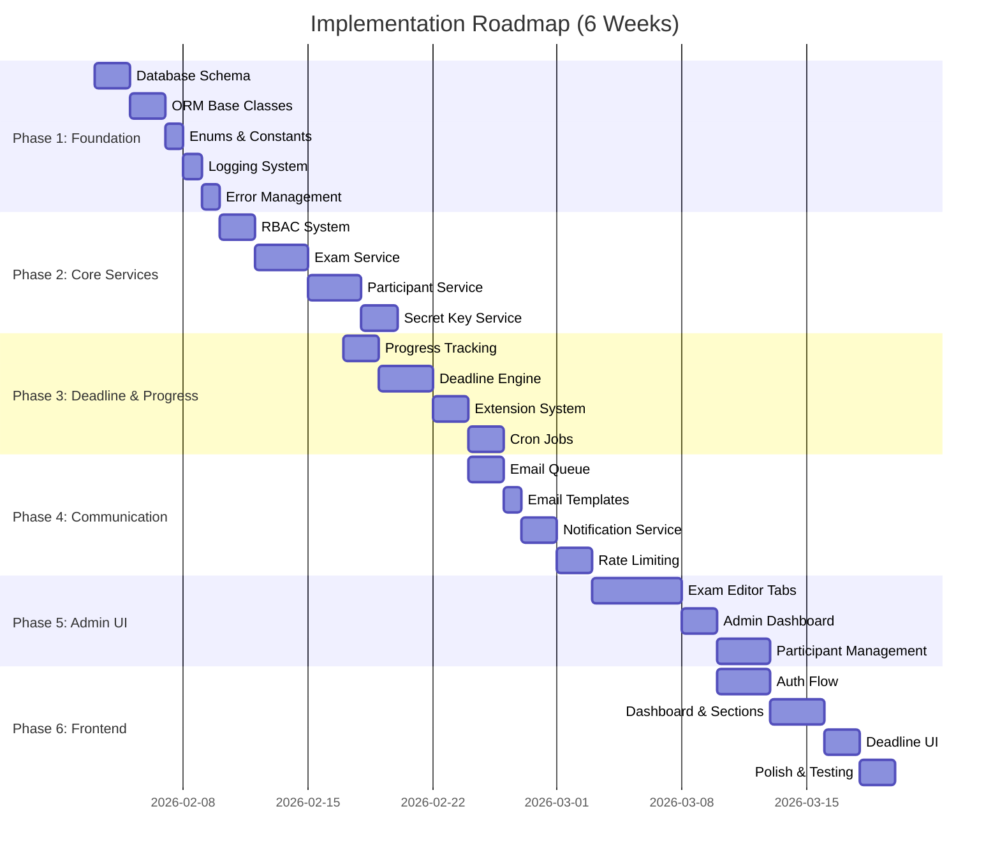

# 05. System Architecture Diagram

## Overview
High-level visual representation of how all specification components connect together.

---

## 5.1 Complete System Architecture

---

## 5.2 Data Flow Architecture

---

## 5.3 Service Dependency Graph

```mermaid
graph TD
    subgraph "Tier 1: Foundation"
        T1_DB[Database Schema]
        T1_ORM[ORM Base Classes]
        T1_ENUM[Enums & Constants]
        T1_LOG[Logging System]
        T1_ERR[Error Management]
    end

    subgraph "Tier 2: Core Services"
        T2_RBAC[RBAC System]
        T2_EXAM[Exam Service]
        T2_PART[Participant Service]
        T2_KEY[Secret Key Service]
        T2_WIKI[Wiki Service]
    end

    subgraph "Tier 3: Extended Services"
        T3_PROG[Progress Tracking]
        T3_DEAD[Deadline Engine]
        T3_EXT[Extension System]
        T3_HIER[Exam Hierarchy]
    end

    subgraph "Tier 4: Communication"
        T4_EMAIL[Email Queue]
        T4_NOTIF[Notification Service]
        T4_TEMPL[Email Templates]
        T4_CRON[Cron System]
    end

    subgraph "Tier 5: Integration"
        T5_REST[REST API]
        T5_RATE[Rate Limiting]
        T5_AUDIT[Audit Logging]
        T5_SETTINGS[Plugin Settings]
    end

    subgraph "Tier 6: Admin UI"
        T6_DASH[Admin Dashboard]
        T6_EDITOR[Exam Editor]
        T6_MGMT[Participant Mgmt]
        T6_REPORT[Reporting]
    end

    subgraph "Tier 7: Public UI"
        T7_LAND[Landing Page]
        T7_AUTH[Auth Pages]
        T7_EXAM[Exam View]
        T7_EXTN[Extension Form]
    end

    %% Tier 1 -> Tier 2
    T1_DB --> T2_EXAM
    T1_ORM --> T2_EXAM
    T1_ENUM --> T2_PART
    T1_LOG --> T2_RBAC

    %% Tier 2 -> Tier 3
    T2_EXAM --> T3_HIER
    T2_PART --> T3_PROG
    T2_PART --> T3_DEAD
    T3_DEAD --> T3_EXT

    %% Tier 3 -> Tier 4
    T3_DEAD --> T4_CRON
    T3_EXT --> T4_EMAIL
    T3_PROG --> T4_NOTIF
    T4_EMAIL --> T4_TEMPL

    %% Tier 4 -> Tier 5
    T2_EXAM --> T5_REST
    T2_PART --> T5_REST
    T2_KEY --> T5_REST
    T5_REST --> T5_RATE
    T5_REST --> T5_AUDIT
    T1_LOG --> T5_SETTINGS

    %% Tier 5 -> Tier 6
    T5_REST --> T6_DASH
    T5_REST --> T6_EDITOR
    T5_REST --> T6_MGMT
    T5_REST --> T6_REPORT

    %% Tier 5 -> Tier 7
    T5_REST --> T7_LAND
    T5_REST --> T7_AUTH
    T5_REST --> T7_EXAM
    T5_REST --> T7_EXTN

    classDef tier1 fill:#fef2f2,stroke:#dc2626
    classDef tier2 fill:#fef3c7,stroke:#d97706
    classDef tier3 fill:#dcfce7,stroke:#16a34a
    classDef tier4 fill:#e0f2fe,stroke:#0284c7
    classDef tier5 fill:#f3e8ff,stroke:#9333ea
    classDef tier6 fill:#fce7f3,stroke:#db2777
    classDef tier7 fill:#f0fdf4,stroke:#22c55e

    class T1_DB,T1_ORM,T1_ENUM,T1_LOG,T1_ERR tier1
    class T2_RBAC,T2_EXAM,T2_PART,T2_KEY,T2_WIKI tier2
    class T3_PROG,T3_DEAD,T3_EXT,T3_HIER tier3
    class T4_EMAIL,T4_NOTIF,T4_TEMPL,T4_CRON tier4
    class T5_REST,T5_RATE,T5_AUDIT,T5_SETTINGS tier5
    class T6_DASH,T6_EDITOR,T6_MGMT,T6_REPORT tier6
    class T7_LAND,T7_AUTH,T7_EXAM,T7_EXTN tier7
```

---

## 5.4 Specification File Map

---

## 5.5 Implementation Phase Timeline

---

## 5.6 Component Interaction Matrix

| Component | Depends On | Depended By | Spec Files |
|-----------|------------|-------------|------------|
| **Database** | - | All Services | 04, 05 |
| **Enums** | - | All Code | 06 |
| **ORM** | Database | All Services | 05, 08 |
| **RBAC** | ORM, Enums | All Admin Features | 10, 11 |
| **ExamService** | ORM, RBAC | Hierarchy, Editor, API | 12, 13 |
| **ParticipantService** | ORM, Exam | Progress, Deadline, API | 27 |
| **ProgressService** | Participant | Dashboard, Reports | 28 |
| **DeadlineEngine** | Participant | Extension, Cron, UI | 29 |
| **ExtensionSystem** | Deadline | Email, Notifications | 30 |
| **SecretKeyService** | ORM | Anonymous Access | 24, 25, 26 |
| **EmailQueue** | ORM | All Notifications | 31, 33 |
| **CronSystem** | Deadline, Email | Background Jobs | 34 |
| **REST API** | All Services | All Frontend | 36 |
| **RateLimiting** | Redis/DB | API Protection | 48 |
| **AuditLog** | ORM | Security, Reports | 46 |

---

## 5.7 Legend

| Color | Layer | Specs Count |
|-------|-------|-------------|
| 🔵 Blue | Frontend | 27 |
| 🟡 Yellow | API Layer | 3 |
| 🟢 Green | Service Layer | 10 |
| 🟣 Purple | Infrastructure | 8 |
| 🔴 Red | Data Layer | 5 |
| ⚫ Gray | Shared Resources | 4 |

---

## Related Specifications

| Diagram | File |
|---------|------|
| Database ERD | [01-database-er-diagram](01-database-er-diagram.md) |
| Participant States | [02-participant-status-states](02-participant-status-states.md) |
| Secret Key Auth | [03-secret-key-auth-flow](03-secret-key-auth-flow.md) |
| Deadline Flow | [04-deadline-calculation-flow](04-deadline-calculation-flow.md) |
| Cross-References | [CROSS-REFERENCES](../CROSS-REFERENCES.md) |

---

*This diagram provides the complete system overview for the Exam Questions Manager plugin.*
