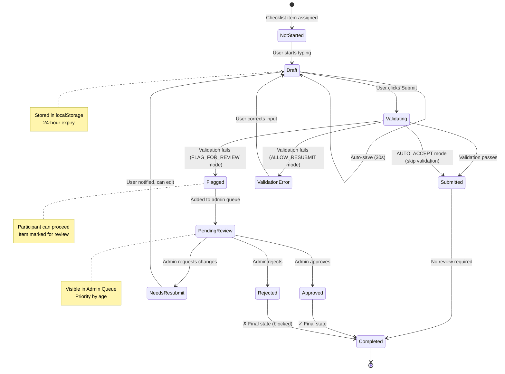
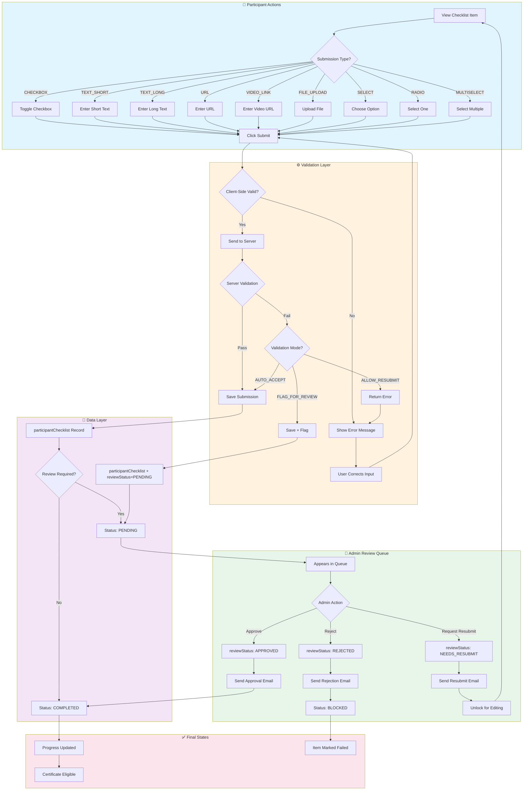
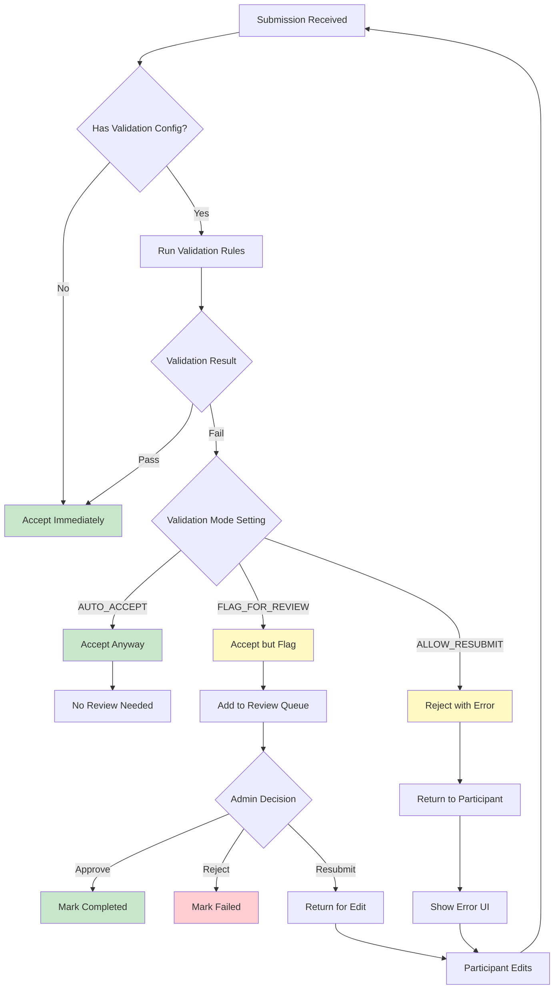
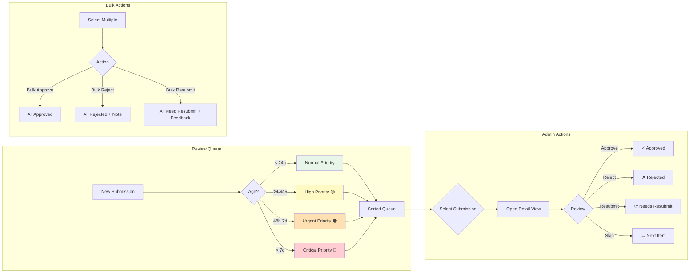
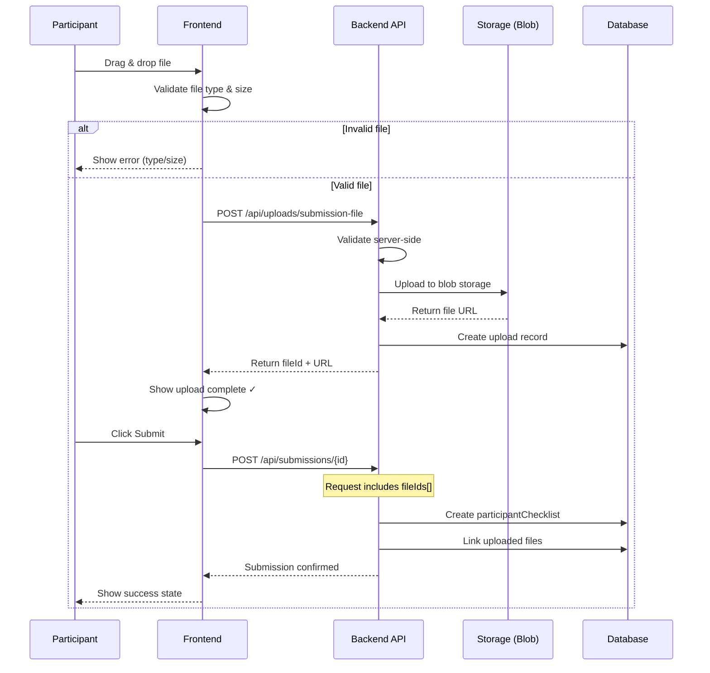
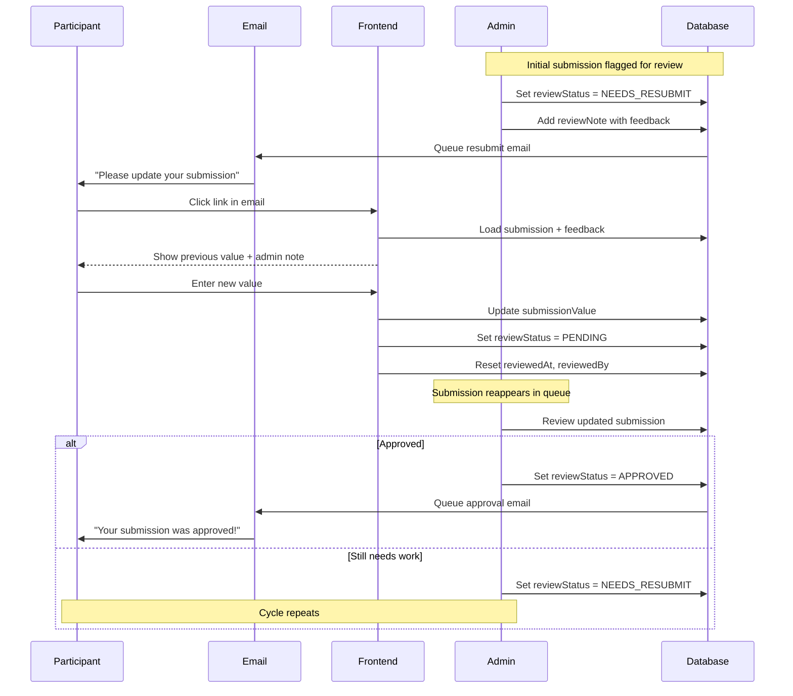
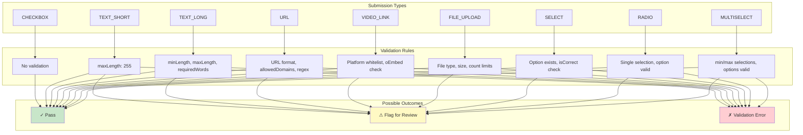
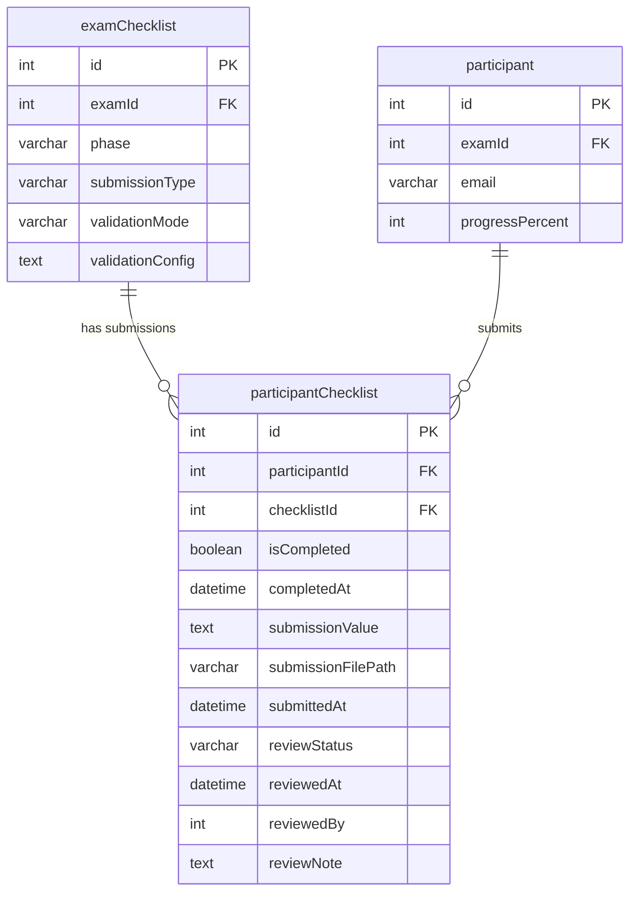
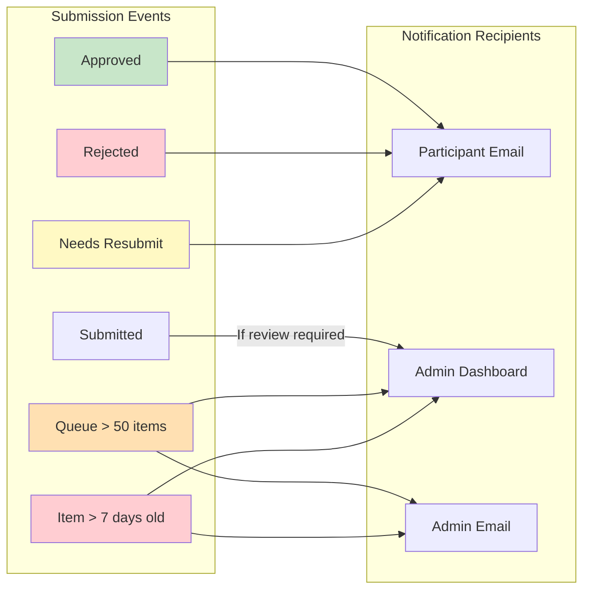

# 06 - Submission Lifecycle Diagram

## Overview

Complete flow diagram showing participant submissions from initial input through validation, admin review, and final resolution.

---

## 6.1 Submission Lifecycle State Machine

---

## 6.2 Complete Submission Flow

---

## 6.3 Validation Mode Decision Tree

---

## 6.4 Review Queue Priority Flow

---

## 6.5 File Upload Submission Flow

---

## 6.6 Resubmission Cycle

---

## 6.7 Submission Type Validation Matrix

---

## 6.8 Status Transitions Table

| From Status | To Status | Trigger | Actor |
|-------------|-----------|---------|-------|
| NOT_STARTED | DRAFT | User starts input | Participant |
| DRAFT | VALIDATING | Submit clicked | Participant |
| VALIDATING | SUBMITTED | Validation passes | System |
| VALIDATING | FLAGGED | Validation fails (FLAG mode) | System |
| VALIDATING | VALIDATION_ERROR | Validation fails (RESUBMIT mode) | System |
| VALIDATION_ERROR | DRAFT | User corrects | Participant |
| FLAGGED | PENDING_REVIEW | Added to queue | System |
| SUBMITTED | COMPLETED | No review needed | System |
| PENDING_REVIEW | APPROVED | Admin approves | Admin |
| PENDING_REVIEW | REJECTED | Admin rejects | Admin |
| PENDING_REVIEW | NEEDS_RESUBMIT | Admin requests changes | Admin |
| NEEDS_RESUBMIT | DRAFT | User reopens | Participant |
| APPROVED | COMPLETED | Final state | System |
| REJECTED | BLOCKED | Final state | System |

---

## 6.9 Database State Changes

---

## 6.10 Notification Triggers

---

## Related Specifications

| Topic | Spec |
|-------|------|
| Submission Types & Validation | [19-exam-checklists-tab](../01-admin-backend/split-spec/19-exam-checklists-tab.md) |
| Participant Submission UI | [29-participant-submission-ui](../02-frontend/split-spec/29-participant-submission-ui.md) |
| Admin Review Queue | [52-admin-review-queue](../01-admin-backend/split-spec/52-admin-review-queue.md) |
| Submission Enums | [06-enums-constants](../01-admin-backend/split-spec/06-enums-constants.md) |
| Email Templates | [33-email-templates](../01-admin-backend/split-spec/33-email-templates.md) |
| Database Schema | [04-database-schema](../01-admin-backend/split-spec/04-database-schema.md) |
