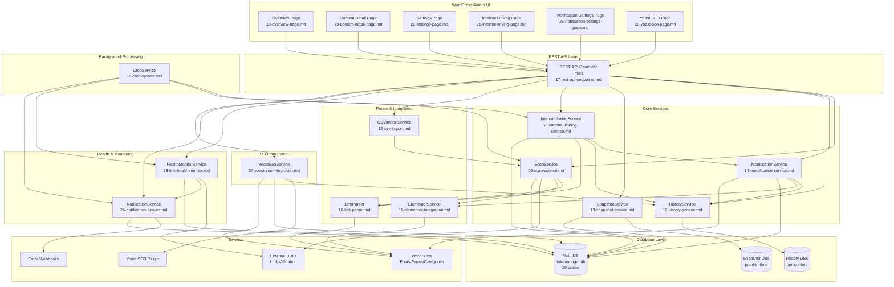
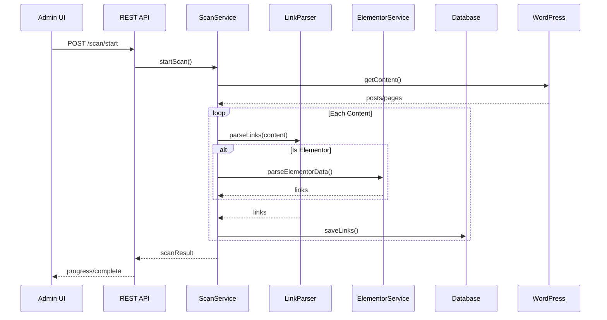
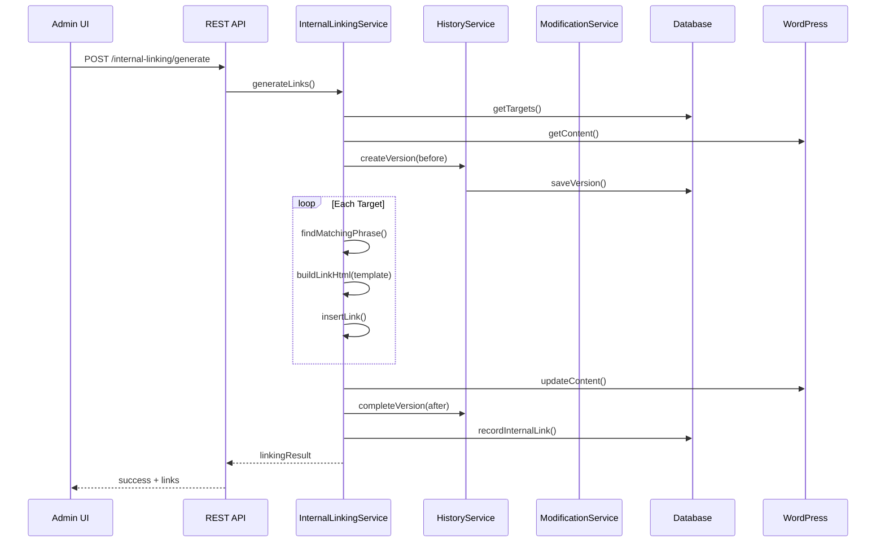
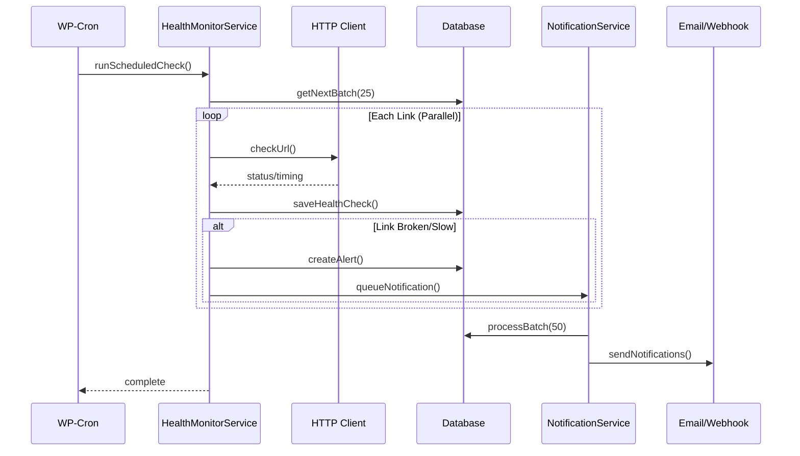
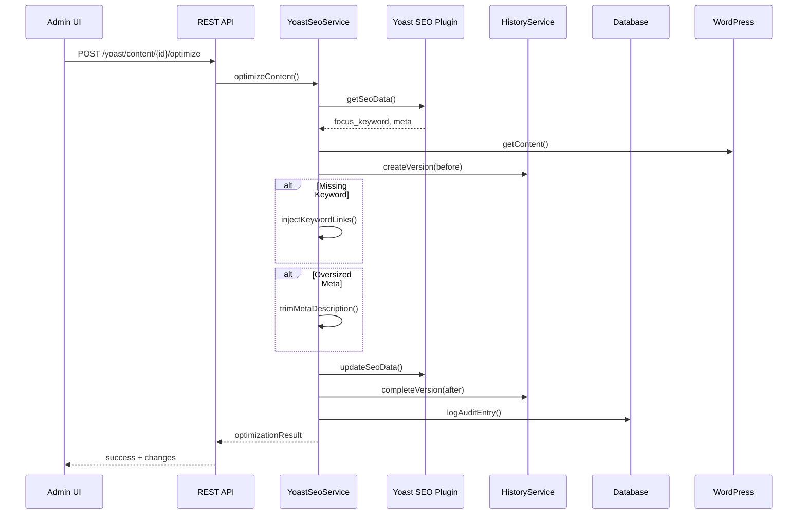
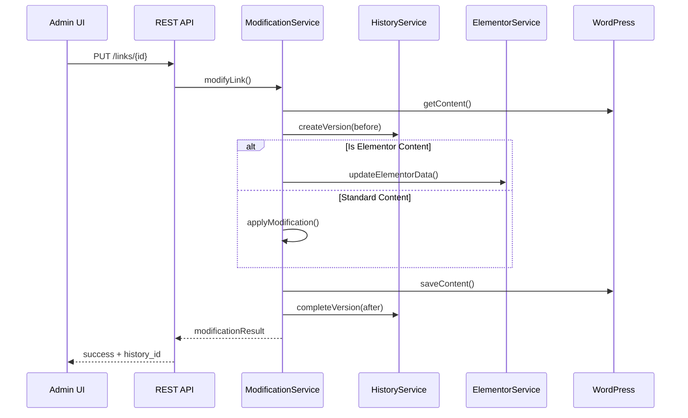
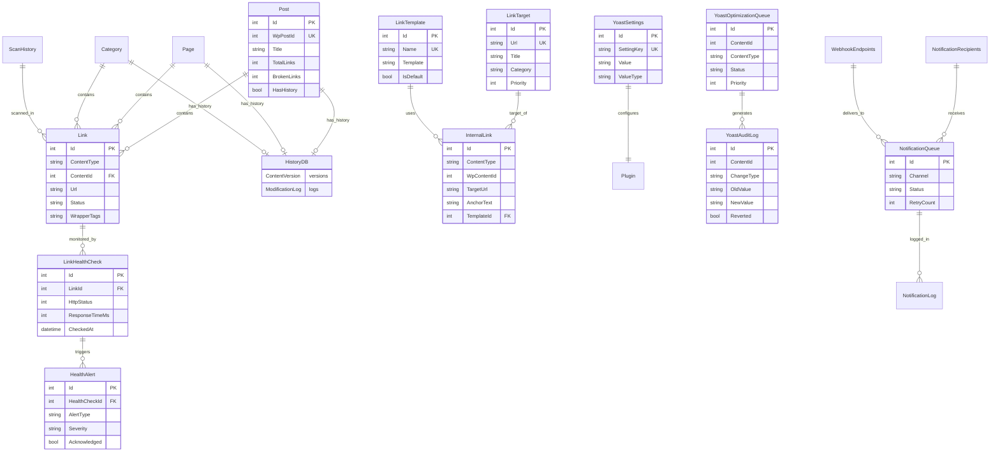

# Link Manager - Service Architecture Diagram

> **Version:** 2.0.0  
> **Updated:** 2026-01-31  
> **Purpose:** Visual reference for service interactions

---

## 📊 Architecture Summary

| Category | Count |
|----------|-------|
| **Spec Files** | 28 |
| **Database Tables** | 25 |
| **Entity Classes** | 30 |
| **REST Endpoints** | 90+ |
| **Core Services** | 12 |
| **UI Pages** | 6 |

---

## 🏗️ Complete Service Architecture

---

## 📊 Service Dependency Matrix

| Service | Depends On | Used By |
|---------|------------|---------|
| **ScanService** | LinkParser, ElementorService | API, CronService, CSVImport |
| **LinkParser** | WordPress | ScanService, InternalLinkingService |
| **ElementorService** | WordPress | ScanService, ModificationService |
| **ModificationService** | HistoryService, ElementorService | API, InternalLinkingService |
| **HistoryService** | WordPress | ModificationService, InternalLinkingService, YoastSeoService |
| **SnapshotService** | MainDB | API |
| **InternalLinkingService** | ModificationService, HistoryService, LinkParser | API, CronService |
| **CSVImportService** | ScanService | API |
| **CronService** | ScanService, InternalLinkingService, HealthMonitor, NotificationService | WP-Cron |
| **HealthMonitorService** | HTTP, NotificationService | API, CronService |
| **NotificationService** | Email, Webhooks | API, CronService, HealthMonitor |
| **YoastSeoService** | Yoast SEO Plugin, HistoryService | API |

---

## 🔄 Data Flow Diagrams

### Scan Flow

### Internal Linking Flow

### Health Monitor Flow

### Yoast SEO Optimization Flow

### Modification with History Flow

---

## 🗄️ Database Relationship Diagram

---

## 📋 Service Categories

### Core Link Management (5 services)
| Service | Spec | Tables | Endpoints |
|---------|------|--------|-----------|
| ScanService | 09 | 3 | 8 |
| LinkParser | 10 | - | - |
| ModificationService | 14 | 1 | 6 |
| HistoryService | 12 | 2 | 5 |
| SnapshotService | 13 | 1 | 4 |

### Content Integration (3 services)
| Service | Spec | Tables | Endpoints |
|---------|------|--------|-----------|
| ElementorService | 11 | - | - |
| CSVImportService | 15 | 1 | 3 |
| InternalLinkingService | 22 | 5 | 12 |

### Monitoring & Notifications (2 services)
| Service | Spec | Tables | Endpoints |
|---------|------|--------|-----------|
| HealthMonitorService | 23 | 4 | 25+ |
| NotificationService | 24 | 5 | 20+ |

### SEO Integration (1 service)
| Service | Spec | Tables | Endpoints |
|---------|------|--------|-----------|
| YoastSeoService | 27 | 3 | 16 |

### Background Processing (1 service)
| Service | Spec | Description |
|---------|------|-------------|
| CronService | 16 | WP-Cron scheduler for all async operations |

---

## 📝 Cross-References

- All service specs: `01-admin-backend/split-spec/`
- All UI specs: `02-admin-ui/split-spec/`
- Constants: `66-shared-constants.md`
- Entity models: `08-entity-models.md` (30 classes)
- Database schema: `04-database-schema.md` (25 tables)
- Memory files: `.lovable/memories/wp-plugins/`

---

*This diagram is the visual companion to the textual architecture in 00-overview.md*
